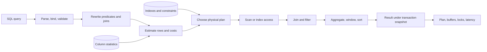
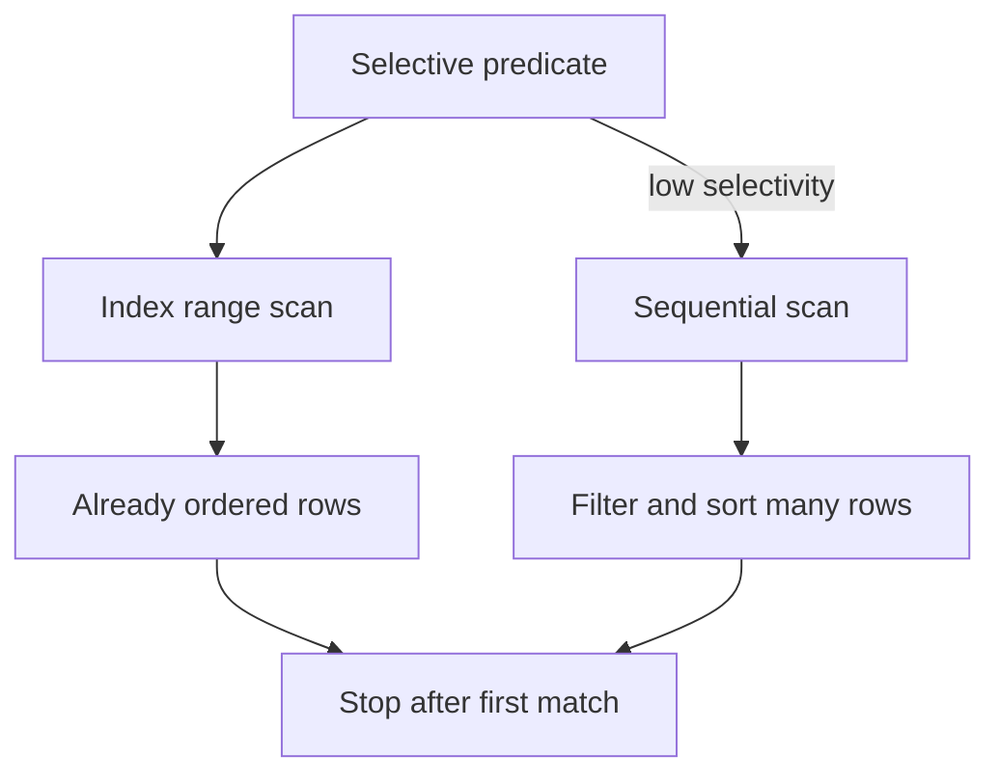

# SQL Deep Dive: Advanced Queries, Optimization, and Transactions

**Level:** L3–L5
**Status:** Reviewed (Terra PASS)
**Audience:** Engineers tuning relational workloads or preparing for an L3–L5 database interview
**Prerequisites:** joins, primary/foreign keys, basic transactions, and reading a table schema
**Sequence:** Batch 1, 1/8
**Terra gate:** approved

## Learning objectives

- Write deterministic window-function queries with explicit frames and tie-breakers.
- Diagnose a query from actual cardinality, access path, sort, and lock evidence.
- Choose indexes and isolation controls from a stated workload and invariant.
- Design safe retries for conditional writes and transaction failures.

## What it is

Advanced SQL is the discipline of expressing relational work precisely and
checking the database's physical execution. The language describes *what* rows
are wanted; the optimizer chooses *how* to find them from statistics, indexes,
constraints, memory, and the selected isolation level. A query can be logically
correct but operationally unsafe because it reads too many rows, multiplies
rows in a join, spills a sort to disk, or holds locks for too long.

SQL features are not identical across PostgreSQL, MySQL, SQL Server, and cloud
warehouses. Treat syntax and plan-node names as engine-specific examples. The
invariants—cardinality, ordering, null behavior, transaction boundaries, and
measurement—transfer well.

## Why it exists and why it matters

Applications need history, ranking, reconciliation, and concurrent state
changes without transferring an entire dataset to application code. Advanced
SQL helps you:

- preserve row-level detail while calculating aggregates with window functions;
- express multi-stage logic without losing null, duplicate, or ordering semantics;
- choose indexes from real predicates rather than from column popularity;
- connect a latency symptom to an execution plan and a workload assumption; and
- state exactly which anomalies a transaction may or may not observe.

In interviews, “add an index” is not a diagnosis. A strong answer identifies
the request shape, expected cardinality, current plan, write rate, and failure
behavior, then proposes a measured change.

## Mental model: relational algebra to physical work

The optimizer is a cost-based search over equivalent plans. It may push a
filter below a join, choose a nested-loop/hash/merge join, use an index or scan,
and add a sort or aggregate. Its estimates come from sampled or maintained
statistics, so estimated-versus-actual rows are a central debugging signal.



The final node is important: measure the executed plan, not only the SQL text.
The same query can have different plans after data growth, statistics changes,
parameter changes, or a database upgrade.

## Topic-specific visual



This visual explains the latest-payment example: an index is useful when it
narrowly filters and supplies the requested order. The optimizer may still pick
the sequential path when many rows match, so this is a decision model rather
than a latency promise.

## Query semantics that cause production bugs

### Nulls, duplicates, and three-valued logic

`NULL` means unknown, not an empty string or zero. `x = NULL` is neither true
nor false; use `x IS NULL`. `NOT IN` can produce no rows when its subquery
contains `NULL`; `NOT EXISTS` often states the intended anti-join more safely.
Every join should have a declared cardinality. If `customers` has one row and
`orders` has five, the join has five customer-order rows. Joining that result to
three payment rows can create fifteen rows unless each side is pre-aggregated.

### Window functions

Windows calculate over a partition while retaining each input row:

```sql
SELECT account_id, posted_at, entry_id, amount,
       SUM(amount) OVER (
           PARTITION BY account_id
           ORDER BY posted_at, entry_id
           ROWS BETWEEN UNBOUNDED PRECEDING AND CURRENT ROW
       ) AS running_balance,
       LAG(amount) OVER (
           PARTITION BY account_id ORDER BY posted_at, entry_id
       ) AS previous_amount
FROM ledger_entries;
```

`ROW_NUMBER()` produces unique positions. `RANK()` gives ties the same rank and
leaves gaps; `DENSE_RANK()` gives ties the same rank without gaps. Explicitly
specify a tie-breaker and a `ROWS`/`RANGE` frame when business meaning depends
on them. A “latest row” query without a deterministic tie-breaker is not fully
defined.

### CTEs and recursive queries

A common table expression names a relational stage and can make a reviewable
query. It is not automatically faster or materialized; behavior is engine and
version dependent. Recursive CTEs need a termination condition and cycle policy:

```sql
WITH RECURSIVE ancestors AS (
    SELECT employee_id, manager_id, 0 AS depth
    FROM employees WHERE employee_id = :employee_id
  UNION ALL
    SELECT e.employee_id, e.manager_id, a.depth + 1
    FROM employees e
    JOIN ancestors a ON e.employee_id = a.manager_id
    WHERE a.depth < 20
)
SELECT * FROM ancestors;
```

The depth cap is a safety boundary, not proof that the data is acyclic. Enforce
or validate organizational constraints separately.

### Sargable predicates and time

An index on `created_at` can usually support a half-open range:

```sql
WHERE created_at >= TIMESTAMP '2026-08-01 00:00:00 UTC'
  AND created_at <  TIMESTAMP '2026-09-01 00:00:00 UTC'
```

Applying `DATE(created_at)` can prevent a plain index from being useful; a
functional index may be appropriate if the engine supports it. Use a consistent
timezone and half-open intervals so adjacent reports do not overlap.

## Worked example: latest successful payment

### Assumptions

An account-support API serves 40 requests/s at peak. The `payments` table has
12 million rows, grows by 400,000/day, and usually has 0–3 successful payments
per account. The endpoint needs the latest successful payment, with a stable
answer when timestamps tie. These numbers describe a test workload; they do not
promise a particular latency on another engine or hardware.

### Query and access path

```sql
CREATE INDEX payments_account_status_paid
    ON payments (account_id, status, paid_at DESC, payment_id DESC);

SELECT payment_id, paid_at, amount, currency
FROM payments
WHERE account_id = :account_id
  AND status = 'succeeded'
ORDER BY paid_at DESC, payment_id DESC
FETCH FIRST 1 ROW ONLY;
```

The equality predicates use the leading prefix. The ordering columns allow the
engine to find the newest candidate without sorting every payment for the
account. `payment_id` makes the order total. Validate with an actual plan on a
staging copy containing the same account skew: compare estimated/actual rows,
buffer reads, sort spills, CPU, lock waits, and p95/p99 latency before and after.

### Why a covering index is not automatic

Including `amount` and `currency` may avoid a table lookup in some engines, but
it increases index size and write work. If the endpoint is infrequent, a table
lookup may be cheaper overall. Measure cache-cold and cache-warm behavior and
consider index build/replication impact.

## Execution plans and optimization workflow

1. Capture the exact parameterized query, schema, engine/version, and workload.
2. Run the engine's explain command; use the actual/analyze form carefully on a
   safe environment because it executes the query.
3. Look for cardinality errors, full scans, bad join order, repeated nested-loop
   work, large sorts, temp spills, buffer reads, and lock waits.
4. Form one hypothesis: statistics, predicate shape, missing/incorrect index,
   skew, query shape, or resource saturation.
5. Change one variable, benchmark representative cold/warm and concurrent cases,
   and retain the plan evidence with the change.
6. Roll out gradually and watch p95/p99, errors, deadlocks, replica lag, CPU,
   storage, and write latency.

Do not use optimizer hints as the first response. A hint can hide stale
statistics and become wrong as data distribution changes.

## Transactions and isolation

A transaction groups reads/writes under an atomicity boundary. Isolation is an
engine-specific contract about visibility and locking. `READ COMMITTED` usually
prevents dirty reads but can permit non-repeatable reads and phantoms. Snapshot
isolation can provide a stable read view while still having write conflicts.
Serializable execution gives the strongest invariant but may abort/retry more
often. State the invariant—such as “inventory cannot go below zero”—then choose
locking, constraints, conditional updates, and retries to enforce it.

```sql
BEGIN;
UPDATE inventory
SET available = available - :quantity
WHERE sku = :sku AND available >= :quantity;
-- Application must verify exactly one row changed.
INSERT INTO orders(order_id, sku, quantity) VALUES (:id, :sku, :quantity);
COMMIT;
```

The update predicate is part of correctness. A retry must be idempotent, and a
deadlock retry must not repeat an external side effect inside the transaction.

## Advantages and limitations

| Technique | Advantages | Limitations and trade-offs |
| --- | --- | --- |
| Window function | Keeps detail while computing rank, running totals, or deltas | Partition/order work can sort many rows; frame and tie semantics need tests |
| CTE | Names stages and makes complex logic reviewable | May be inlined or materialized depending on engine/version; not a speed switch |
| Composite B-tree | Efficient equality-prefix, range, and ordered access | Column order matters; every write maintains it and storage grows |
| Covering index | May avoid heap/table lookups for a narrow read | Larger pages, more write amplification, and possible cache pressure |
| Application aggregation | Flexible and can use a specialized cache/read model | More network/data movement and consistency logic outside constraints |

## Query strategy comparison

| Strategy | Best fit | Cost or correctness risk |
| --- | --- | --- |
| Normalize and join at read time | Shared facts and flexible reports | Join/cardinality work; requires good keys and plans |
| Pre-aggregate in SQL | Repeated reports with stable grain | Refresh/locking cost; must avoid cross-multiplication |
| Materialized/read projection | Hot, narrow endpoint with measured pressure | Staleness, rebuild, and duplicated ownership |
| Application-side fan-out | Independent bounded stores | Partial failure, extra network hops, consistency burden |

## Failure modes and operations

- **Join multiplication or missing rows:** test one-to-one, one-to-many, empty,
  and duplicate fixtures; compare counts before/after each join.
- **Plan regression:** retain plan fingerprints and actual-row ratios; refresh
  statistics after bulk changes and review plans after engine upgrades.
- **Lock contention/deadlocks:** keep transactions short, use stable row order,
  set bounded timeouts, retry only transient errors, and monitor wait graphs.
- **Long-running snapshots:** monitor transaction age and vacuum/cleanup impact;
  cancel safely according to the engine's operational policy.
- **Index rollout failure:** use online/concurrent build options where supported,
  monitor disk/replication, and keep a tested drop or rollback procedure.
- **Incorrect retries:** attach an idempotency key or unique constraint and
  separate database commit from non-transactional messages/emails.

## Worked example extension: inventory correctness

The payment example is a read-path problem. Inventory demonstrates why query
shape and transaction semantics must be reviewed together. Assume two checkout
requests race for the final unit of SKU `A-17`. A read in each transaction may
return one, but the invariant is enforced by the conditional update, not by the
application's observation:

```sql
BEGIN;
UPDATE inventory
SET available = available - 1,
    version = version + 1
WHERE sku = 'A-17' AND available >= 1;
-- Require row_count = 1. Row_count = 0 means sold out or a conflict.
INSERT INTO reservations(reservation_id, sku, order_id)
VALUES (:reservation, 'A-17', :order_id);
COMMIT;
```

The unique `reservation_id` makes a client retry safe. The service must not
send a “reserved” event until commit succeeds; an outbox row in the same
transaction is one solution. Under snapshot/serializable behavior, a conflict
may abort the transaction and require a bounded retry. Under weaker isolation,
the predicate and row lock behavior must still be verified for the engine.

## SQL review checklist

Use this checklist during a code review:

1. What is the result grain—one row per entity, event, or join combination?
2. How are `NULL`, duplicate keys, empty sets, and ties handled?
3. Which predicates are selective and sargable?
4. What is the worst-case result/cardinality, not just the average?
5. What plan and statistics does the target engine use?
6. Does the transaction protect a named invariant?
7. What happens on timeout, deadlock, cancellation, and retry?
8. Which metrics and representative fixtures prove the change?

## Terminology and accuracy notes

Complexity notation describes logical work under an abstract model; it does not
predict milliseconds. A B-tree's logarithmic navigation can still be slower than
a sequential scan when many rows match or pages are not cached. “ACID” does not
mean every external side effect is atomic. “Serializable” does not mean a
transaction will never abort. These qualifications belong in interview answers,
design documents, and operational runbooks.

## Practical exercises

### Exercise 1: one latest order per customer

Given `orders(order_id, customer_id, created_at, state)`, return each customer's
latest non-cancelled order. **Expected solution:** filter `state <> 'cancelled'`,
use `ROW_NUMBER() OVER (PARTITION BY customer_id ORDER BY created_at DESC,
order_id DESC)`, then keep row 1. Propose an index and explain whether a partial
index is supported and safe for the workload.

### Exercise 2: avoid cross-multiplication

Produce customer order count and payment total. **Solution:** aggregate orders
and payments separately by `customer_id`, then join the two one-row-per-customer
results. Test a customer with two orders and three payments; the answer must not
contain six payment contributions.

### Exercise 3: diagnose a function predicate

`WHERE lower(email) = :email` scans a 50-million-row table. **Expected approach:**
normalize email on write and index the normalized value, or create a supported
functional index after checking collation semantics. Verify with an actual plan;
do not assume a rewrite without measuring.

### Exercise 4: transaction retry boundary

Implement an inventory decrement where two clients race for one remaining unit.
**Expected solution:** use one conditional `UPDATE ... WHERE available >=
:quantity`, require the affected-row count, insert a unique reservation/outbox
record in the same local transaction, and retry only a serialization/deadlock
error with the same idempotency key. Do not send an external payment request
inside the retry loop.

## Interview Q&A

### Q1. Why can a query ignore an index?

**Answer:** The predicate may not use the indexed prefix, a function may hide
the column, selectivity may be poor, statistics may be stale, or a scan may be
cheaper. **Follow-up:** ask for actual and estimated rows, table size, and the
engine's plan before suggesting a hint.

### Q2. `RANK`, `DENSE_RANK`, or `ROW_NUMBER`?

**Answer:** `ROW_NUMBER` is unique; `RANK` shares ties and leaves gaps;
`DENSE_RANK` shares ties without gaps. **Follow-up:** define timestamp ties and
add a stable key when the product needs one row, not one rank.

### Q3. Does a CTE make SQL faster?

**Answer:** It improves structure, but materialization/inlining is engine and
version dependent. **Follow-up:** compare plans and ask whether an expensive
intermediate is reused enough to justify materialization.

### Q4. How do you choose composite-index order?

**Answer:** Start with the common equality prefix, then range/order columns, but
validate against all important queries and write cost. “Equality first” is a
useful heuristic, not a proof. **Follow-up:** ask how the index serves a query
that omits the first column.

### Q5. What does `READ COMMITTED` guarantee?

**Answer:** Usually no dirty reads, but repeatability and phantom behavior vary
by engine and statement snapshot rules. **Follow-up:** name the invariant and
choose constraints/locks/serializable retries accordingly.

### Q6. How do you review a slow join?

**Answer:** Validate cardinality and join keys, inspect actual plan nodes and
row estimates, check skew, access predicates, spills, buffers, and concurrency.
**Follow-up:** distinguish an OLTP point query from a warehouse aggregation.

### Q7. Why use half-open time ranges?

**Answer:** `>= start AND < end` avoids overlap between adjacent windows and
precision assumptions about the final instant. **Follow-up:** clarify timezone,
timestamp precision, and whether the index ordering matches the range.

### Q8. When is denormalization justified?

**Answer:** When measured read cost warrants a projection and the team can own
duplication, lag, repair, and backfill. **Follow-up:** identify the source of
truth and the reconciliation process before accepting dual writes.

## Related and next reading

- [NoSQL access-pattern contrast](02-nosql-advanced.md)
- [Database replication and failover](15-database-replication.md)
- [Indexing deep dive](18-indexing-deep-dive.md)
- [Query planning and optimization](17-query-planning.md)
