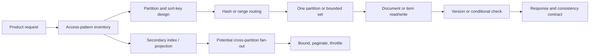
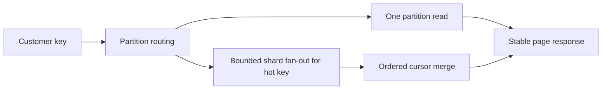

# NoSQL Deep Dive: Access Patterns, Documents, and Partitions

**Level:** L3–L5
**Status:** Reviewed (Terra PASS)
**Audience:** Engineers designing high-volume operational APIs or preparing for an L4–L5 data-systems interview
**Prerequisites:** primary keys, indexes, basic distributed-systems terminology
**Sequence:** Batch 1, 2/8
**Terra gate:** approved

## Learning objectives

- Model a bounded request from its access patterns and choose a partition key.
- Choose between embedding and references using update, size, and ownership constraints.
- State a consistency contract and implement an idempotent conditional write.
- Diagnose hot partitions and design a repairable denormalized projection.

## What it is

NoSQL is a family of non-relational storage designs, not a single database or
consistency model. Document stores, key-value stores, and wide-column stores
make different choices about schema enforcement, partitioning, indexes,
transactions, and replication. A useful design begins with requests the system
must serve, not with a favorite product.

## Why it exists and why it matters

A normalized relational model can require joins across partitions or coordination
that a very high-volume key lookup cannot afford. NoSQL systems can make a
partition-local read, conditional write, or append predictable and horizontally
scalable. The cost is real: the application often owns denormalization,
reconciliation, conflict resolution, and the consequences of an incomplete key.

## Mental model: key design is routing design



The happy path ends at one partition or a bounded set. A secondary index or
fan-out is sometimes right, but its write amplification, lag, throttling, and
partial-failure behavior must be explicit.

## Topic-specific visual



The normal key path ends at one partition. The shard path is an explicit escape
hatch for measured skew and spends read fan-in plus merge complexity to protect
the hot key; it is not a free horizontal-scaling switch.

## Model from access patterns

Write down each request as: key fields, result size, ordering, freshness,
authorization scope, and expected rate/skew. If a request cannot name a bounded
key, it may belong in a search or analytical system rather than the primary
operational store.

### Documents: embed or reference

Embed a child when it is read with its parent, bounded in size, and updated under
the same correctness boundary. Reference it when it is shared, independently
updated, unbounded, or independently hot. A document transaction feature does
not make an unbounded aggregate a good document.

```javascript
{
  "_id": "order-1842",
  "customer_id": "customer-7",
  "state": "paid",
  "lines": [
    {"sku": "book-1", "quantity": 2, "unit_price": 18.00}
  ],
  "created_at": "2026-08-31T17:00:00Z",
  "schema_version": 3
}
```

The line items are bounded for this order and read with it. A customer's entire
order history is not bounded; store orders as separate items keyed for the
history request.

### Key-value and single-table patterns

For “newest 20 orders for a user,” a partition key `USER#7` and a sort key such
as `ORDER#2026-08-31T17:00:00Z#1842` supports a prefix/range query. Add a direct
`ORDER#1842` item for lookup if the product needs both access patterns. Duplicate
attributes are projections: name the authoritative copy and publish a repairable
change when it changes.

### Consistency vocabulary

Do not say only “eventual consistency.” Specify whether a read can be stale,
whether read-your-write is required, what ordering is visible, and how conflicts
are resolved. A conditional write can enforce a state transition when the
condition and idempotency token are both part of the contract:

```python
store.update(
    key="ORDER#1842",
    set_values={"state": "paid", "payment_id": "pay-9"},
    condition="state = 'pending' AND payment_id IS NULL",
    idempotency_key="capture:pay-9",
)
```

On retry, “already paid by `pay-9`” should be a successful replay; a different
payment token should be a conflict, not a second charge.

## Worked example: order history at peak traffic

### Assumptions

Assume 10 million users, 2,000 order-history reads/s at peak, 200 writes/s,
20-item pages, and a small number of users responsible for 10% of traffic.
The requirement is newest-first history with no duplicate or skipped item when
the next page is read. The average per-user rate is not a safe capacity model
because traffic is skewed.

### Design and pagination

Use `customer_id` as the partition key and a timestamp-plus-unique-ID sort key.
Return an opaque continuation token containing the last evaluated key; do not
use an offset that forces the service to rescan preceding items. If a single
customer becomes hot, add a bounded shard suffix, then merge a small number of
ordered streams at read time. This spends read complexity to protect a hot key.

Measure p95/p99 latency, throttled requests, per-partition heat, item size,
read-unit consumption, continuation-token errors, and write-to-read freshness
on representative skew. These are workload observations, not universal NoSQL
latency numbers.

## Advantages and limitations

| Design | Advantages | Limitations / trade-offs |
| --- | --- | --- |
| Document store | Natural aggregate reads and flexible fields | Unbounded embedding, document contention, and cross-document queries need care |
| Key-value / wide-column | Predictable key access and horizontal scale | Query flexibility is intentionally narrow; key changes are migrations |
| Relational database | Joins, constraints, and mature multi-row transactions | Cross-region or very high-volume scale-out may require coordination |
| Secondary-index-heavy design | Convenient alternate lookups | Index write amplification, propagation lag, and hot index partitions |
| Denormalized projection | Fast purpose-built reads | Duplicate data needs ordering, repair, backfill, and freshness monitoring |

## Partition economics and consistency in more detail

### The request budget

For every endpoint, write a small budget before choosing a key:

| Dimension | Question to answer | Example |
| --- | --- | --- |
| Read set | How many partitions/items may one request touch? | One partition, at most 20 items |
| Write set | How many items change atomically? | Order plus idempotency record |
| Freshness | How old may a projection be? | Under two minutes |
| Skew | What is the largest tenant/key, not only the average? | One tenant emits 25% of writes |
| Recovery | How is a missing or corrupt projection rebuilt? | Replay versioned events |

This table exposes an important distinction: horizontal capacity helps only when
work can spread. A workload with 2,000 average requests/s can still fail if one
partition receives a burst that exceeds the per-partition limit.

### Range keys and time buckets

Time-ordered keys are useful for histories and queues, but putting all current
writes into one time bucket can create a hot range. Use a bucket such as day or
hour only when the query naturally bounds time. A bucket transition must handle
late writes and a query spanning two buckets. A cursor should encode the bucket,
sort key, and schema/version information; never expose an internal key format as
an unvalidated client contract.

### Conditional state transitions

A read-then-write sequence is not a safe invariant under concurrency:

```text
Unsafe: read available=1 -> two clients both decide -> write available=0
Safe:   conditional update WHERE available >= 1 -> exactly one succeeds
```

Use a version or condition in the write and inspect the result. If a workflow
needs several items atomically, first ask whether they share a partition and
whether the product can model a reservation/state machine instead. A distributed
transaction may be necessary, but adding one does not make an unbounded aggregate
safe or cheap.

### Multi-region writes

Active-active writes can reduce user-to-database distance but introduce conflicts.
Last-write-wins can discard a legitimate update when clocks or timestamps are
not trustworthy. Alternatives include per-field merge, a deterministic conflict
resolver, a single-writer home region, or an append-only event with a later
materialized view. Document the conflict policy and test concurrent updates,
region loss, delayed replication, and replay.

### Capacity and cost reasoning

Use a worksheet rather than a copied vendor number:

```text
peak request rate × average items/request × item bytes
  -> read/write units, network, storage, replication, and index overhead
```

Include retries, scans, secondary-index writes, tombstones, backups, and a
headroom target. Validate with a load test containing the top-key distribution.
Nominal provisioned capacity is not the same as sustainable capacity under
throttling, hot keys, or failover.

## Data lifecycle and operational runbook

### Ingest and schema versions

Readers should tolerate a newer field before writers require it. Add fields,
deploy readers, backfill, then remove old fields after an observation window.
Persist `schema_version` when payload interpretation changes. A replay from an
old event must use the event's schema, not today's parser without compatibility.

### Backfill procedure

1. Choose an authoritative source and record a high-water mark.
2. Scan bounded key ranges with a checkpoint and rate limit.
3. Upsert only if the incoming source version is newer than the projection.
4. Measure errors, throttles, lag, and source/projection counts.
5. Replay changes after the mark, validate samples, and cut over gradually.
6. Retain checkpoints and rollback/rebuild instructions.

### Incident questions

During a data incident, answer these in order: which keys/tenants are affected,
is the source authoritative, are writes still arriving, what version is visible,
can the projection be paused, and what user-visible behavior is safe? Prefer a
bounded degraded response over returning an aggregate that silently omitted
partitions. Keep an operator action idempotent and auditable.

## Design review worksheet

For a new collection/table, record the following before implementation:

```text
Entity and owner:      order / order service
Primary access:        newest 20 orders for one customer
Partition key:         CUSTOMER#<id>
Sort key:              ORDER#<timestamp>#<id>
Largest expected key:  100,000 orders; shard only if measured hot
Write invariant:       payment_id is unique; state transition is conditional
Freshness:             read-your-write for the order owner; bounded stale for admin
Delete policy:         tombstone then purge after projection retention
Rebuild source:        order ledger/change stream
```

Review this worksheet with product and operations. A key that is excellent for
the customer-history request may be unusable for “all overdue orders”; that is a
new access pattern requiring a queue, index, or analytical projection. Do not
promise arbitrary query flexibility from a key-value schema.

## Consistency test matrix

Test a read immediately after a write, after a retry, after a replica delay,
after a conditional conflict, and after a projection repair. Test two concurrent
writes to the same item and two writes to different denormalized copies. Record
which results are allowed, not only which result happened in one run. This turns
an informal “eventual” claim into a documented contract Terra can review.

## Failure modes and operations

### Hot partitions and skew

Watch per-partition throttles, p99 latency, storage distribution, and top-key
traffic—not only cluster averages. A hash of a low-cardinality or celebrity key
does not make that key less hot. Use bounded sharding, write spreading, a queue,
or a precomputed summary, and document read fan-in limits.

### Lost updates and duplicate writes

Use conditional writes, version checks, or compare-and-set. Distinguish a
condition failure from an idempotent replay. Store an idempotency record with a
retention period long enough to cover client retries and recovery.

### Projection drift and schema evolution

Include a schema version, keep the source of truth clear, and make backfills
resumable and rate-limited. Compare source and projection versions; never let a
late repair overwrite a newer write. Add fields compatibly before readers depend
on them, then retire old fields after an observation window.

### Fan-out and throttling

Bound concurrency, paginate, cache stable results, and use deadlines. A global
secondary index is not free capacity. On partial failure, return a declared
degraded response or retry from a durable queue rather than silently returning
an incomplete aggregate.

## Practical exercises

1. Model “list a user's 20 newest orders” and “get an order by ID.” **Expected
   approach:** a user partition with time-ordered keys plus a direct order item;
   explain duplication ownership, pagination, and repair.
2. Design likes for a celebrity post receiving 50,000 writes/s. **Solution
   outline:** shard the counter into bounded buckets, increment with an
   idempotency key when retries matter, merge on read, and periodically compact.
   State whether the displayed value is exact or approximate.
3. Find orders pending for 15 minutes without scanning every partition.
   **Expected approach:** maintain a time-bucketed pending index/queue, acquire a
   worker lease, and recheck state before acting. Include retry and poison-item
   handling.
4. Migrate a document field from `full_name` to `display_name`. **Expected
   approach:** dual-read old/new, backfill in chunks, dual-write during the
   window, measure missing versions, then remove the fallback after verification.

## Interview Q&A

### Q1. How do you choose a partition key?

**Answer:** Start with the highest-volume access patterns; seek even traffic and
storage distribution, bounded request work, and manageable tenant/time skew.
**Follow-up:** ask how a one-million-member tenant or celebrity user is isolated.

### Q2. Is NoSQL always eventually consistent?

**Answer:** No. Products expose different read, write, conditional, and
transaction guarantees; even one product can offer several read modes.
**Follow-up:** define read-your-write and revocation freshness for one endpoint.

### Q3. When should you embed a child?

**Answer:** When it is bounded, read with the parent, and shares its update
boundary. **Follow-up:** ask what happens when the list becomes unbounded or
independently hot.

### Q4. How do you implement uniqueness?

**Answer:** Reserve a unique-key item with a conditional write, or use a native
constraint where available. **Follow-up:** cover abandoned reservations,
retries, and cleanup without admitting a duplicate.

### Q5. What is a hot partition?

**Answer:** A partition receives disproportionate traffic/storage and throttles
while cluster averages appear healthy. **Follow-up:** propose the metric and a
migration plan for keys already in production.

### Q6. What if a new query was not in the access-pattern inventory?

**Answer:** Add a purposeful projection/index, maintain a search/analytics read
model, or accept an offline scan for truly rare work. **Follow-up:** compare
freshness, write cost, and index lag before choosing.

### Q7. How do you repair duplicated data?

**Answer:** Name the source of truth, replay or scan in resumable chunks, compare
versions, and measure convergence. **Follow-up:** show how a late repair avoids
overwriting a newer user write.

### Q8. Why is offset pagination risky at scale?

**Answer:** It may rescan and discard earlier items, and concurrent inserts can
shift page boundaries. **Follow-up:** design a stable cursor and state its
snapshot/freshness behavior.

## Related and next reading

- [SQL query and transaction foundations](01-sql-advanced.md)
- [Database replication and failover](15-database-replication.md)
- [Change data capture and repair](20-change-data-capture.md)
- [Database security and tenant isolation](28-database-security.md)
