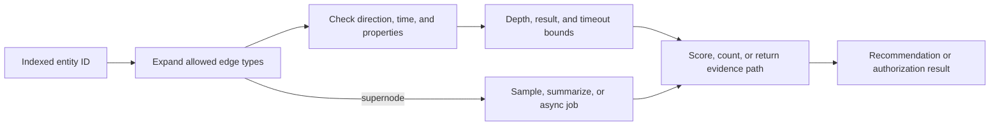

# Graph Databases: Modeling, Traversal, and Operational Boundaries

**Level:** L4–L5
**Status:** Reviewed (Terra PASS)
**Audience:** Engineers designing relationship-heavy systems or preparing for an L4–L5 graph/data interview
**Prerequisites:** graph terminology, indexes, joins, and basic authorization concepts
**Sequence:** Batch 1, 3/8
**Terra gate:** approved

## Learning objectives

- Choose a graph model for a relationship-heavy query and temporal edge.
- Bound traversal work using depth, degree, edge, and result constraints.
- Explain supernodes, stale authorization, and graph projection recovery.
- Design and test a safe operational path for authorization or recommendations.

## What it is

A property graph stores entities as nodes and relationships as first-class
edges, often with properties on both. A query expresses a pattern such as
`(user)-[:BOUGHT]->(product)` and follows adjacent records. Graph databases are
valuable when path shape, reachability, neighborhood, or relationship predicates
are central to the question. They do not make unbounded traversals free.

## Why it exists and why it matters

Repeated joins become difficult to operate when relationship depth and shape vary:
mutual friends, entitlement paths, fraud rings, and service dependencies are
natural graph questions. Explicit edges improve expression and path evidence.
The trade is that high-degree vertices, variable depth, cross-region writes, and
graph partitioning can dominate the design.

## Mental model: controlled expansion



The anchor and bounds are capacity controls. A shortest path is not a complete
specification until direction, allowed edge types, weights, maximum depth, and
tie behavior are defined.

## Topic-specific visual

```mermaid
flowchart TD
    User[User u7] -->|MEMBER_OF {valid_from, valid_until}| G9[Group g9]
    G9 -->|CAN_READ| R4[Resource r4]
    User -->|MEMBER_OF {expired validity}| G8[Group g8]
    G8 -->|CAN_READ| R3[Resource r3]
    R4 -->|candidate path: membership is valid| Check{Check path at $now}
    R3 -->|candidate path: membership is expired| Check
    Check -->|yes| Allow[Allow with evidence]
    Check -->|no| Deny[Deny expired path]
```

The two paths demonstrate that reachability is not authorization: the decision
must evaluate edge validity at request time and return the path that justified
an allow. An expired edge cannot become valid because a traversal found it.

## Modeling fundamentals

Use stable IDs and explicit relationship types. Put `role`, `since`, `amount`,
or `valid_until` on an edge because it describes the association. Use an
intermediate node when an association has its own lifecycle, many attributes,
or audit requirements. Store temporal validity explicitly; never infer that a
historical relationship is current.

```text
(User {id: u7}) -[:MEMBER_OF {valid_from, valid_until}]-> (Group {id: g9})
(Group {id: g9}) -[:CAN_READ]-> (Resource {id: r4})
```

Enforce identifier uniqueness and validate that writes do not create forbidden
cycles. Merging people solely from equal names can corrupt an entire neighborhood.

## Query patterns

### Bounded traversal

```cypher
MATCH path = (u:User {id: $user_id})
  -[:MEMBER_OF|HAS_ROLE*1..4]->(g:Group)
  -[:CAN_READ]->(r:Resource {id: $resource_id})
WHERE all(edge IN relationships(path)
          WHERE type(edge) = 'CAN_READ'
             OR (type(edge) IN ['MEMBER_OF', 'HAS_ROLE']
                 AND edge.valid_from <= $now
                 AND $now < edge.valid_until))
RETURN path
LIMIT 1;
```

`MEMBER_OF` and `HAS_ROLE` carry `valid_from`/`valid_until`; `CAN_READ` is an
explicit grant edge in this model and has no temporal fields. The predicate
therefore applies temporal validity only to the edge types that carry those
properties while allowing the `CAN_READ` hop through to the resource. For
production authorization, restrict edge types and direction, cap depth, return
evidence, and choose a consistency level that honors revocation. The `LIMIT`
protects response size; it does not alone cap all intermediate expansion in
every engine, so inspect the plan and engine-specific safeguards.

### Recommendations

```cypher
MATCH (u:User {id: $user_id})-[:BOUGHT]->(p:Product)
MATCH (other:User)-[:BOUGHT]->(p)
MATCH (other)-[:BOUGHT]->(candidate:Product)
WHERE NOT (u)-[:BOUGHT]->(candidate)
  AND candidate.category IN $allowed_categories
RETURN candidate.id, count(*) AS shared_buyers
ORDER BY shared_buyers DESC, candidate.id
LIMIT 20;
```

This is a transparent feature, not a universal recommender. Popular products
can create huge intermediate results; constrain time/category or materialize
features for high-volume users.

## Worked example: entitlement lookup

Assume 2 million users, 100,000 groups, and an authorization request requiring
at most four membership/role hops. The invariant is deny-by-default: an expired
edge must not grant access. Benchmark a representative graph plus a worst-case
group with 100,000 members. Record p95/p99 traversal time, intermediate
cardinality, DB CPU/cache misses, replica lag, authorization-cache hit rate, and
deny/allow correctness during revocation.

### Reproducible small graph and bounded cost

At `2026-08-31T12:00Z`, use this graph:

```text
u7 -[MEMBER_OF valid 09:00..18:00]-> g9 -[CAN_READ]-> r4
u7 -[MEMBER_OF expired 08:00..11:00]-> g8 -[CAN_READ]-> r3
```

`can_read(u7, r4)` is allowed through `u7-g9-r4`. `can_read(u7, r3)` is denied
because its only path contains the expired `u7-g8` edge. With maximum depth
`d=4` and worst-case branching factor `b=20`, naive expansion has at most
`20 + 20^2 + 20^3 + 20^4 = 168,420` edge visits before deduplication. This is
a conservative work bound, not a latency claim; filters reduce actual work,
while a larger real degree can increase it.

If relationships change far less often than they are read, a precomputed
reachability projection can make the request predictable. That projection adds
refresh lag, invalidation, rebuild, and “fail closed if stale” decisions.

## Advantages and limitations

| Approach | Advantages | Limitations / trade-offs |
| --- | --- | --- |
| Native graph traversal | Expressive variable-depth patterns and path evidence | Expansion can explode; sharding and multi-region writes are difficult |
| Relational joins | Mature constraints, transactions, and broad tools | Deep/variable paths need recursive queries or repeated joins |
| Precomputed adjacency | Predictable request cost and easy caching | Refresh lag, duplicated storage, and invalidation complexity |
| Search/index engine | Strong text/filter retrieval at scale | Relationship semantics and multi-hop correctness need extra modeling |

## Traversal depth, algorithms, and data shape

### Expansion cost

If the average branching factor is `b`, an unconstrained traversal can expose
roughly `b^d` paths at depth `d` before deduplication. This is a reasoning aid,
not a precise engine cost: indexes, repeated vertices, filters, and caching
change the result. It explains why a depth-five query over a high-degree social
graph needs an explicit budget even if the final answer contains ten rows.

Use these controls together:

| Control | What it protects | What it cannot guarantee alone |
| --- | --- | --- |
| Maximum depth | CPU and path length | Small work when degree is huge |
| Edge/type allowlist | Irrelevant expansions | Correctness if data is mis-modeled |
| Result limit | Response size | Bounded intermediate expansion in every engine |
| Degree cap/sample | Supernodes | Exactness of a recommendation |
| Timeout/deadline | Request isolation | Recovery of work already consuming the database |

### Path algorithms

Breadth-first search finds a shortest path in an unweighted graph when it is
bounded and the graph is traversable from the anchor. Dijkstra-like methods are
needed for non-negative weighted paths. A business “best path” often is not
shortest: an authorization path may prefer current, high-confidence edges; a
recommendation may penalize stale or repeated relationships. Put the scoring
policy in the model/query contract and test ties.

### Direction and identity

`FOLLOWS` and `FOLLOWED_BY` are not interchangeable. Store one canonical directed
edge or define a symmetric relation intentionally. For entity resolution, keep
source IDs and confidence/evidence; merging nodes should be reversible and should
rebuild affected indexes and derived features.

## Graph writes, consistency, and partitioning

### Atomic graph updates

Creating a user and its membership edge may need one local transaction. A graph
transaction does not necessarily cover an external identity provider, cache, or
search index. Use an outbox/change stream for downstream projections and include
edge version and effective time so consumers can reject stale updates.

### Partitioning trade-off

Partitioning by user keeps a user's neighborhood local but makes a giant group
or cross-community traversal expensive. Partitioning by group helps membership
queries but may scatter a user's access check. Hybrid adjacency storage,
replicated hot vertices, and precomputed reachability can help, at the cost of
duplication and invalidation. A graph database's local traversal advantage does
not imply cheap cross-shard traversal.

### Authorization as a separate contract

For a security decision, log policy version, edge versions, subject/resource IDs,
and evidence path. Cache only for a defined TTL/version; a cache hit is not a
reason to ignore a revocation event. When graph data is unavailable, fail closed
for protected actions and provide a safe retry path.

## Worked query review checklist

Before shipping a variable-depth query, answer:

1. What is the indexed anchor?
2. Which labels, relationship types, directions, and time predicates apply?
3. What is the maximum depth and worst-case degree?
4. Are duplicate paths deduplicated before scoring?
5. Is the result exact, sampled, cached, or eventually consistent?
6. What happens at deadline, replica lag, or partial graph failure?
7. What metrics expose intermediate expansion and stale decisions?

Run the query plan against average and adversarial fixtures. Include an empty
neighborhood, a cycle, a supernode, a revoked edge, duplicate edges, and a path
that is exactly at the maximum depth.

## Lifecycle and repair runbook

Keep a source event or authoritative relationship table so a derived graph can
be rebuilt. For a rebuild, freeze or version the projection, consume a consistent
snapshot, replay changes from a known position, compare node/edge counts and
sampled paths, then switch the reader. A rebuild that merely counts nodes can
miss direction, property, and authorization errors.

## A complete graph design walkthrough

Consider a collaboration product with users, teams, documents, and roles. The
request “can Alice read document D?” has a different shape from “recommend five
documents to Alice.” The first is a security decision with a fail-closed rule;
the second may accept a stale precomputed feature. Do not force both into one
unbounded query or one cache policy.

| Request | Anchor | Bound | Freshness | Safe degradation |
| --- | --- | --- | --- | --- |
| Can-read | user and resource | four role/membership hops | revocation-aware | deny and retry |
| Mutual friends | user | two `FOLLOWS` hops, degree cap | minutes | fewer recommendations |
| Fraud motif | account/device/payment | offline job window | hours | queue for review |

For every edge, define ownership and lifecycle. A membership revocation should
produce a versioned event; a recommendation edge can expire without blocking the
authorization path. If the graph is a projection, keep the authoritative record
and source position so a repair can explain why a path was temporarily absent.

## Testing graph behavior

The minimum fixture set includes a single edge, a path at the depth limit, a
cycle, duplicate input, an expired relationship, a revoked relationship, an
empty neighborhood, and a supernode. Assert path direction, distinctness,
evidence properties, timeout behavior, and fail-closed behavior. Benchmark
median and worst-case degree separately. A mean traversal time can hide an
authorization outage caused by one giant group.

## Security and privacy notes

Relationship data can reveal sensitive affiliations even when node labels look
innocuous. Apply tenant/subject authorization before returning paths, redact
unneeded properties from evidence, encrypt backups, and log access to sensitive
subgraphs. Deleting a user requires deleting or anonymizing incident edges and
derived projections, not only the user node.

## Failure modes and operations

- **Traversal explosion:** allowlist edge types, cap depth/time/results, apply
  deadlines, and alarm on intermediate cardinality and query cancellation.
- **Supernodes:** detect degree skew; use summaries, partitioned adjacency,
  bounded sampling, or an asynchronous path service.
- **Duplicate entities/edges:** enforce IDs and relationship uniqueness where
  possible; merge with an auditable process and revalidate affected paths.
- **Stale security decisions:** version cache entries, invalidate on membership
  changes, route critical revocations to the authoritative path, and fail closed
  when freshness cannot be proven.
- **Replica lag and partitions:** state whether recommendations may be stale;
  do not use an eventually consistent read for a security invariant without an
  explicit compensating control.

## Practical exercises

1. Find mutual friends. **Expected approach:** exactly two directed `FOLLOWS`
   hops, exclude the source/existing friends, count distinct paths, cap degree,
   and explain the supernode fallback.
2. Model reporting chains. **Solution outline:** typed `REPORTS_TO` edges with
   effective dates, bounded ancestor query, cycle detection on writes, and a
   repair report for invalid historical data.
3. Detect fraud rings. **Expected approach:** connect account/device/payment
   entities, run bounded motif/component jobs asynchronously, rank candidates,
   and send them to review. Do not perform broad graph analytics in payment
   authorization.
4. Migrate `FRIEND` to directed `FOLLOWS`. **Expected approach:** add the new
   edge type, dual-read/dual-write, backfill in bounded batches, compare counts,
   then retire the old type after a rollback window.

## Interview Q&A

### Q1. When is a graph database a poor choice?

**Answer:** For independent key lookups, large scans/aggregations, or a workload
that must cheaply shard across regions, another store may fit better. **Follow-up:**
ask whether the key query needs path semantics or only foreign-key filtering.

### Q2. How do you control traversal cost?

**Answer:** Anchor on indexed IDs, constrain types/direction, bound depth/time/
results, and guard high-degree nodes. **Follow-up:** require intermediate-size,
CPU, timeout, and cancellation metrics.

### Q3. What belongs on an edge?

**Answer:** Properties of the relationship, such as role, amount, and validity.
Use a node when the association has an independent lifecycle. **Follow-up:**
model an audited membership that can be approved, revoked, and appealed.

### Q4. How can an authorization replica be safe?

**Answer:** Define an allowed staleness budget; use a stronger/authoritative
path for revocation or fail closed when versions are stale. **Follow-up:** cover
cache invalidation failure and evidence logging.

### Q5. How do you handle a supernode?

**Answer:** Detect degree skew, cap synchronous expansion, partition/summarize
adjacency, and move broad analysis offline. **Follow-up:** discuss summary lag
and rebuild correctness.

### Q6. How do you define shortest path correctly?

**Answer:** Specify direction, edge types, weights, maximum depth, and ties; use
BFS for bounded unweighted paths and an appropriate weighted algorithm otherwise.
**Follow-up:** ask about changing or negative weights.

### Q7. How do you migrate a graph schema?

**Answer:** Add compatible labels/properties, dual-read/write, backfill in
bounded batches, validate counts/paths, then remove the old shape. **Follow-up:**
include duplicate-edge prevention and rollback.

### Q8. How would you test a graph authorization policy?

**Answer:** Use allow, deny, expired-edge, cycle, duplicate, revocation, lag,
and high-degree fixtures; assert both decision and evidence path. **Follow-up:**
add property-based tests for path bounds and fail-closed behavior.

## Appendix: graph design review record

For a production proposal, record the graph's authoritative source, projection
position, node/edge uniqueness constraints, allowed traversal templates, and
maximum synchronous work. List the largest observed degree and the expected
growth rate. A design review should be able to answer whether a result is exact,
sampled, cached, or precomputed without reading implementation code.

For each query template, capture:

```text
anchor and index:       User.id
edge allowlist:         MEMBER_OF, HAS_ROLE, CAN_READ
direction:              explicit; no undirected fallback
depth/result bound:     1..4 / one evidence path
freshness:              revocation-aware
timeout fallback:       deny and retry
observability:          policy, edge versions, expansion count, trace ID
```

This record prevents an apparently small query change from turning a bounded
authorization check into a global graph search. Terra should review the record
alongside the diagram and exercises.

## Related and next reading

- [NoSQL partition and consistency modeling](02-nosql-advanced.md)
- [Distributed transactions and invariants](12-distributed-transactions.md)
- [Database replication and stale-read handling](15-database-replication.md)
- [Database security and encryption](28-database-security.md)
