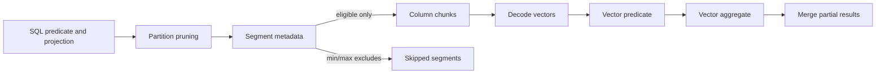
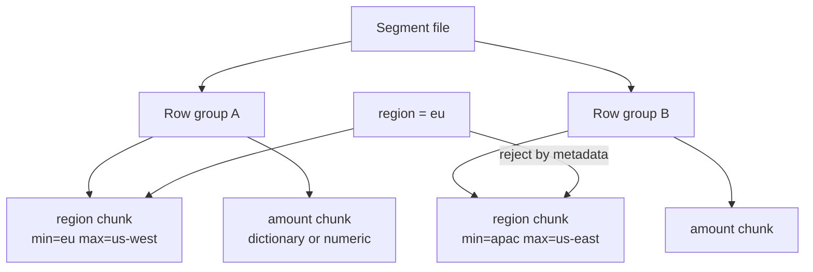
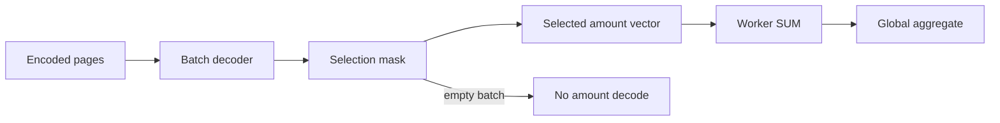

# Columnar Databases: Layout, Pruning, and Vectorized Analytics

**Level:** L4–L5
**Status:** reviewed
**Audience:** Engineers preparing an L4–L5 data-platform or analytics-system design interview.
**Prerequisites:** SQL aggregation and joins, filesystems, compression basics, and Batch 2A query planning.
**Sequence:** Batch 2B, 1/8
**Terra gate:** approved

## Learning objectives

- Draw a row layout and a column layout, then choose one for a stated access pattern.
- Calculate uncompressed scan bytes and estimate the effect of column pruning and segment statistics.
- Explain dictionary, run-length, delta, and bit-packing encodings and identify when each loses value.
- Trace a vectorized aggregation from filtered segments to batches of CPU-friendly values.
- Diagnose small files, skew, and mutation-heavy workloads with measurable evidence.

## What it is

A columnar database stores values for one logical column together, commonly in
column chunks inside immutable or append-oriented segments. A row store keeps
the fields of one record close together. Neither layout is universally faster;
the physical layout should match the dominant read and write shape.

Consider an `orders` relation with `order_id`, `customer_id`, `region`,
`created_at`, `status`, and `amount`. A row page might contain complete records:

```text
row page: [id, customer, region, time, status, amount]
           [id, customer, region, time, status, amount]
```

A column segment contains one stream per field:

```text
segment 17
  order_id:    [1041, 1042, 1043, ...]
  customer_id: [71, 18, 71, ...]
  region:      ["us-west", "eu", "us-west", ...]
  created_at:  [t0, t1, t2, ...]
  status:      ["paid", "paid", "cancelled", ...]
  amount:      [12.50, 8.25, 91.00, ...]
```

The segment is not necessarily a single operating-system file. In Parquet,
row groups contain column chunks and statistics; in an analytical service,
segments may be managed objects with dictionaries, min/max metadata, bloom
filters, delete vectors, or zone maps. The exact names and write behavior vary
by product and version.

Columnar storage is optimized for scans that touch a subset of columns and
perform the same operation over many values. It is a poor default for frequent
single-row point updates when those updates cause rewrite, delete-vector growth,
or compaction work.

## Why it matters

An analytical query often reads millions of rows but only a few fields. If a
query computes `SUM(amount)` for one day and one region, reading identifiers,
customer details, and status is avoidable I/O. Column pruning reduces bytes
requested; segment metadata can reduce the number of chunks requested; encoding
reduces bytes transferred and cache pressure; vectorization reduces per-row
interpreter overhead.

These benefits have a cost. A column load usually needs a batching boundary,
sorting or clustering may make writes less flexible, and a tiny independent
file can carry nearly the same metadata overhead as a large file. An update to
one logical row can touch several column streams or create a delete marker.

For an interview answer, name the workload before naming a format:

| Workload | Helpful physical property | Risk to call out |
| --- | --- | --- |
| Dashboard scan of 3 columns from 20 | Column pruning and vectorized batches | Bad clustering can leave every segment eligible |
| Point lookup by primary key | Row locality or a secondary index | Column stores may read many chunks |
| Bulk append of daily facts | Large immutable files and compression | Small frequent commits create file debt |
| Update each customer row | Mutable pages or a merge layer | Columnar rewrites and delete vectors grow |

## Mental model

Think of a columnar query as a pipeline of segment selection, column selection,
decoding, and vector operations. Each stage has a distinct observable:

1. **Partition pruning** chooses directories, tables, or shards using a partition
   predicate such as `event_date = DATE '2026-08-31'`.
2. **Segment pruning** compares a predicate with min/max, null counts, bloom
   filters, or a zone map. A segment with `region` min/max that cannot contain
   `eu` can be skipped, subject to the metadata's semantics.
3. **Column pruning** requests only projected columns and predicate columns.
   A column used by `WHERE` still has to be read even if it is not selected.
4. **Decode** turns encoded pages into vectors. Dictionary codes may be decoded
   lazily; a late materialization plan can delay wide text columns.
5. **Vectorized execution** applies a predicate or aggregate to a batch, for
   example 1,024–65,536 values. The batch size is an implementation choice, not
   a universal performance guarantee.
6. **Merge** combines partial aggregates from workers and returns a result.



The important invariant is that a skipped segment cannot contain a qualifying
row according to its trusted metadata. If metadata is stale, overly broad, or
built on the wrong sort order, correctness must still be preserved: the engine
should read the segment rather than silently omit it.

### Row groups, segments, and metadata

A row group is a horizontal set of rows whose individual columns are stored in
parallel chunks. It is a useful compromise: the engine can read only selected
columns while retaining a bounded batch of records. A segment can contain one
or more row groups, depending on the product.

Useful metadata includes:

| Metadata | Example | How it helps | Caveat |
| --- | --- | --- | --- |
| Min/max | `amount` 0.10–42.00 | Rejects ranges outside the interval | Weak when values are interleaved |
| Null count | 0 or 80% null | Skips null checks or selects sparse strategy | Does not identify values |
| Dictionary | 12 status values | Compares compact codes | High-cardinality text makes dictionary large |
| Bloom filter | customer IDs in chunk | Rejects probable absence | False positives still read; false negatives are unacceptable |
| Row count/size | 65,536 rows, 1.8 MiB | Plans batches and estimates work | Compressed size differs from decoded size |

Sort order and clustering determine whether metadata is selective. If all
regions are mixed evenly in every row group, `region = 'eu'` may match every
group. Sorting by date then region can improve one query family while harming a
different predicate. Clustering is a workload decision, not a free index.

### Encodings

Encoding compresses a column stream without changing its logical values. The
reader must know the encoding and page boundaries. Common choices are:

- **Dictionary encoding:** map repeated strings to integer codes. It is effective
  for status, country, or product category columns with a bounded dictionary.
- **Run-length encoding (RLE):** store `(value, run length)` for long repeated
  runs. It depends on adjacent rows being ordered by the repeated value.
- **Delta encoding:** store a first value and differences for monotonic numbers
  such as timestamps or IDs. Small deltas fit in fewer bits.
- **Bit packing:** use the minimum bits required for bounded integer codes, such
  as a status code in `[0, 7]` needing three bits before framing overhead.
- **Frame-of-reference:** store a block base and offsets when values in a block
  occupy a narrow range.

Compression ratio is not a property of “columnar” alone. It depends on data
distribution, sort order, nulls, page size, codec, and version. A dictionary
can spill or fall back to plain encoding; an RLE stream can expand when values
alternate. Always measure representative files.

### Vectorized execution

The engine does not call a full expression evaluator once per row. It decodes a
batch, creates a selection vector or bit mask, and applies operations to the
surviving values. For `SUM(amount) WHERE status = 'paid'`, the status dictionary
codes can be compared first, then only matching amount values need aggregation.

Late materialization is useful when a cheap, selective predicate eliminates
most rows before reading wide columns. It is less useful when the predicate is
not selective or when join semantics require the columns early.

## Worked example

Assume a fact table has 1,000,000,000 rows for 30 days. The query is:

```sql
SELECT SUM(amount)
FROM orders
WHERE order_date >= DATE '2026-08-01'
  AND order_date <  DATE '2026-08-02'
  AND region = 'eu';
```

Assume the table has six columns with fixed-width logical sizes of 8, 8, 8, 8,
1, and 8 bytes respectively: 41 bytes/row. This is an instructional estimate;
real strings, null bitmaps, page headers, compression, and alignment change it.

The daily row count is approximately `33,333,333 rows/day` (`1,000,000,000 / 30`).
A row-oriented scan reading complete records would inspect approximately:

```text
33,333,333 rows × 41 bytes = 1,366,666,653 bytes ≈ 1.37 GB decimal (rounded)
```

The columnar plan needs `amount` and `region`; it also reads `order_date` if
the date is not partition-pruned. If date partitions select one day, the
remaining logical bytes are approximately:

```text
33,333,333 × (8 amount + 8 region) = 533,333,328 bytes ≈ 533 MB decimal (rounded)
```

Suppose row groups are sorted by `(order_date, region)`, 90% of that day's row
groups have metadata that excludes `eu`, and the surviving two columns encode
to 2.5 bytes/row on the sample. The estimated object bytes read are:

```text
33,333,333 × 10% × 2.5 bytes ≈ 8,333,333 bytes ≈ 8.3 MB decimal (rounded)
```

The engine still decodes and checks qualifying rows, and worker overhead is not
included. This is a scan-bytes calculation, not a promise of query latency.
If the data is unsorted and every row group contains `eu`, the pruning factor
is near zero and the read approaches the encoded 83.3 MB (rounded) for both
columns.

The diagnostic sequence is therefore: inspect partition bytes, eligible row
groups, projected columns, compressed bytes, decoded rows, and CPU time. A
planner estimate that says “533 MB” should be compared with execution counters,
not accepted as a product-wide benchmark.

## Advantages and limitations

| Choice | Read advantage | Write/operation cost | Appropriate boundary |
| --- | --- | --- | --- |
| Row store | Complete record and point lookup locality | Reads unused fields for wide scans | OLTP and mutation-heavy tables |
| Columnar table | Pruning, compression, vectorized scans | Batch formation and rewrite/delete handling | Append-heavy OLAP |
| External Parquet files | Portable object storage and independent compute | File sizing, catalogs, compaction, metadata management | Lake and exchange boundary |
| Materialized aggregate | Small, predictable dashboard scans | Refresh lag and extra correctness path | Stable repeated aggregates |

Columnar systems often separate compute from object storage, but that separation
does not remove file-listing, metadata, network, or compaction costs. A cheap
stored byte can still be expensive to scan repeatedly. Conversely, keeping every
column in memory may reduce scan time while increasing eviction and cost.

### Write cost and mutation choices

Appending a large batch amortizes footer and dictionary work. A stream of 200
records per file creates metadata and object-request overhead. Updating a value
may require a new version of a column chunk, a delete vector, or a merge-on-read
operation. Read amplification grows until compaction rewrites the affected
range.

Do not infer that an analytical engine cannot update data. Instead ask whether
the product's current table format and version implement row-level deletion,
merge semantics, snapshots, and concurrent writers as needed. Provider-managed
services can expose similar SQL while differing in compaction schedules and
isolation guarantees.

### Comparison by access shape

| Access shape | Row layout | Column layout | Design response |
| --- | --- | --- | --- |
| `WHERE id = ?` returning all fields | Often one page | Several chunks or an index | Keep a serving index or row projection |
| `SUM(amount)` over 1 day | Reads complete rows | Reads one column and metadata | Prefer columnar and cluster by date |
| `GROUP BY region` over all rows | Repeatedly loads unused fields | Dictionary/vector aggregation | Prefer columnar if updates are batched |
| 5% rows updated hourly | In-place/page writes may be bounded | Delete/rewrite and compaction | Use a mutable serving layer or tune merge policy |

## Topic-specific visual



This visual shows pruning at the row-group boundary. The min/max example only
helps if its ordering semantics are valid; a range that spans `eu` must be read.
The amount chunks are not touched until the region decision leaves candidate
rows, illustrating late materialization.



The second visual is an execution trace rather than a storage layout. Its key
trade-off is CPU versus decoding work: a selective predicate can avoid wide
column materialization, while a non-selective predicate may make mask creation
overhead visible.

## Failure modes and operations

### Small files

Detect file-count growth, median file size, footer/listing time, and compaction
backlog. A reasonable file target is a declared operational policy, not a
universal number; for example, an S3-backed table team might target 256–1,024
MiB compressed files after measuring query and commit behavior. The target must
fit provider object limits, parallelism, and recovery time.

Mitigate with micro-batch coalescing, bounded commit frequency, and compaction.
Make compaction idempotent through snapshot/version checks. Do not compact a
partition while a writer can publish an uncoordinated replacement. Verify row
counts, checksums, and delete markers after a rewrite.

### Skew and poor pruning

One hot partition can make a worker process most rows while other workers idle.
Measure bytes and rows per partition, maximum-to-median ratio, and per-worker
scan time. Salt only when the query model can tolerate a second-stage merge;
otherwise choose a better partition key or clustering expression.

If min/max ranges overlap everywhere, recluster a bounded history, add a
selective secondary structure if supported, or accept the scan and budget it.
Do not partition on a high-cardinality ID merely to make directories unique:
it often creates small files and expensive listing.

### Mutation amplification

Track delete-vector density, obsolete bytes, compaction CPU, snapshot retention,
and the age of the oldest un-compacted update. A safe rollout uses a shadow
partition or canary table, validates counts and aggregates, then advances a
table-format snapshot. If a merge fails, retain the prior snapshot and retry
from immutable input rather than deleting the only source.

### Wrong metadata or stale statistics

Metadata may be stale after an external write or a failed commit. The engine
must fail open—read a candidate chunk—when it cannot trust statistics. Compare
planner estimates with actual bytes and rows, refresh catalog statistics, and
alert on sudden estimate error. Provider and format behavior is version-specific;
check the documentation for the deployed release before relying on a feature.

### Operational checklist

- Record logical rows, compressed bytes, decoded bytes, and CPU seconds per query.
- Alert on small-file count, compaction age, skew ratio, and failed commits.
- Test concurrent append, delete, compaction, snapshot retention, and restore.
- Keep schema and table-format versions with the data; do not silently upgrade readers.
- Compare binary and decimal units explicitly: `1 GiB = 2^30` bytes, while `1 GB = 10^9` bytes.
- Treat cost as `bytes scanned × price per scan unit + storage + compute`, with the provider's billing unit documented.

## Practical exercises

### Exercise 1: Calculate scan bytes

Given 240,000,000 daily rows, six logical columns totaling 48 bytes/row, and a
query reading a 12-byte timestamp plus a 4-byte measure after date partitioning,
calculate row-scan and column-scan logical bytes. Then apply 70% segment pruning.

**Expected approach:** Row scan is `240,000,000 × 48 = 11.52 GB decimal`.
Column scan is `240,000,000 × 16 = 3.84 GB`; after pruning it is approximately
`1.152 GB`, before compression and engine overhead. State that encoded bytes are
measured separately.

### Exercise 2: Select encodings

Choose encodings for a sorted timestamp, a status field with six values, and a
random 128-bit request ID. Explain what happens when status cardinality grows.

**Solution:** Use delta or delta-of-delta for timestamps, dictionary plus
bit-packed codes for status, and a plain/fixed-width or block-compressed ID
representation. A dictionary that approaches row count loses its benefit and
may require a fallback; verify the deployed format's threshold.

### Exercise 3: Explain skew

A query scans 4 TB from one partition while the other 31 partitions scan 100 GB
each. Propose evidence and one schema change without claiming a guaranteed
speedup.

**Expected approach:** Calculate the max/median skew, inspect key distribution
and worker timelines, then test a composite partition or salt plus final merge
on a sample. Preserve pruning predicates and define a rollback snapshot.

### Exercise 4: Handle update debt

A table receives 2% row updates per hour and delete-vector density reaches 18%.
Design a compaction and validation runbook.

**Expected approach:** Bound compaction concurrency, select a time window, write
a new snapshot, compare row counts/checksums and representative aggregates,
retain the prior snapshot through the rollback window, and monitor read/write
amplification. Include a mutation budget and an abort threshold.

## Interview Q&A

### Q1. Why can columnar storage accelerate an aggregate?

**Answer:** It reads only predicate and aggregate columns, compresses similar
values, and applies vector operations to batches. The gain depends on pruning,
selectivity, encoding, and CPU/I/O balance.

**Follow-up:** What counters would distinguish fewer bytes from faster execution?

### Q2. What is column pruning?

**Answer:** The planner requests only columns required by projection, filters,
joins, and grouping. A projected-column list alone is insufficient if a filter
requires another column.

**Follow-up:** Why might a late-materialization plan still read a wide column?

### Q3. How do min/max statistics prune data?

**Answer:** A segment is eligible only if its recorded range can contain the
predicate value. An overlapping range is a false-positive read, never a reason
to skip; trusted metadata must not create false negatives.

**Follow-up:** How does clustering affect pruning selectivity?

### Q4. When is dictionary encoding a bad choice?

**Answer:** It is weak for near-unique values or a dictionary too large to fit
within the page policy. The encoder may fall back, and dictionary lookup can
add work if the query is not selective.

**Follow-up:** Which metric shows a dictionary has stopped helping?

### Q5. Why are small files an operational problem?

**Answer:** Each file adds metadata, listing, open, and scheduling overhead;
parallel work can be too fine-grained. Compaction trades write I/O and CPU for
fewer files and healthier row groups.

**Follow-up:** What correctness checks belong after compaction?

### Q6. Are column stores unable to support mutations?

**Answer:** No. They may use rewritten chunks, delete vectors, merge-on-read,
or table-format snapshots. The relevant question is mutation amplification and
the provider/version's concurrency and recovery semantics.

**Follow-up:** How would you choose a serving path for frequent point updates?

### Q7. What does vectorized execution change?

**Answer:** It amortizes expression and function-call overhead over arrays and
can use SIMD-friendly operations. It does not remove decoding, memory bandwidth,
branching, or join costs.

**Follow-up:** When can scalar execution be competitive?

### Q8. How do you prevent a bad partition key?

**Answer:** Model key frequency, query predicates, file sizes, and worker skew
before committing. Test with a representative distribution and retain a
repartition or materialized-view escape hatch.

**Follow-up:** What changes if one customer becomes 40% of the rows?

## Related and next reading

- [Warehouse and lakehouse architecture](10-warehousing-lakehouses.md)
- [Advanced query planning](17-query-planning.md)
- [Time-series database fundamentals](05-timeseries-databases.md)
