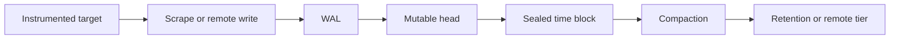
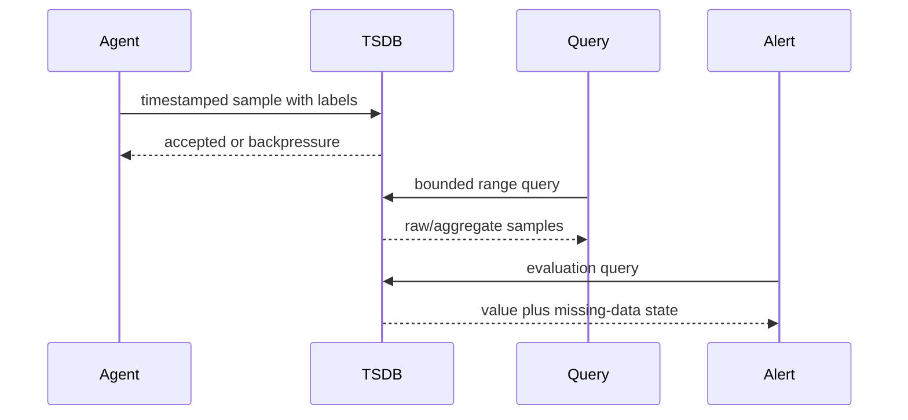

# Time-Series Databases — Metrics and Monitoring at Scale

**Level:** L4–L5
**Status:** reviewed
**Audience:** Engineers building metrics, monitoring, and sensor-data platforms.
**Prerequisites:** SQL, labels/tags, retention policies, and basic distributed systems.
**Sequence:** Batch 2B, 3/8
**Terra gate:** approved

Optimized for time-indexed data with fast aggregations and retention policies.

## Learning objectives

- Derive series cardinality, ingest rate, daily volume, and retention capacity from label and scrape assumptions.
- Explain samples, labels, the WAL, mutable head, immutable blocks, and compaction.
- Choose query, retention, and alert policies for a stated monitoring workload.
- Diagnose cardinality growth, clock skew, out-of-order writes, and backpressure with operational evidence.
- Convert between binary and decimal storage units without presenting estimates as provider guarantees.

---

## What it is

A time-series sample is one observation: a metric value paired with a
timestamp and a label set. For example, `cpu_usage{host="server-1",
region="us-west", environment="production"} = 75` at `2024-05-22
10:00:00` is one sample.

A series is the ordered stream of samples that share one metric name and one
exact set of label key/value pairs. The example above is one series; a later
observation for the same metric and labels belongs to that series, while a
different `host` or `region` creates a different series.

Labels are the dimensions attached to a sample, such as `host`, `region`, and
`environment`. They make selectors and groupings expressive, but every
distinct combination can create another indexed series.

Cardinality is the number of distinct series, not the number of samples. If
1,000 hosts and 5 regions can combine independently for one metric while the
other labels stay fixed, the upper bound is approximately 5,000 series for
that metric. Real occupancy may be lower, and adding another varying label
multiplies the possible combinations.

---

## Why it matters

Time-series storage matters when recent writes and time-window queries dominate.
The correct comparison is workload-specific: samples per second, label
cardinality, retention, out-of-order tolerance, query windows, and alert SLO.
An append-oriented TSDB is not automatically the right home for relational
updates or multi-row transactions.

---

## Mental model

### Bucketing (Time-Based Sharding)

```
Time Buckets (Tables/Partitions):
├─ 2024-05-22 (1 day) → active bucket (new inserts)
├─ 2024-05-21 → sealed (read-only)
├─ 2024-05-20 → sealed (can compress)
└─ 2024-05-01 → archived (low query frequency)

Benefits:
├─ New inserts only to active bucket
├─ Old buckets optimized for compression
├─ Easy TTL (drop old buckets)
├─ Parallelism (query multiple buckets)

Query: SELECT * WHERE time > '2024-05-20'
└─ Scans: 3 buckets (2024-05-22, 2024-05-21, 2024-05-20)
```

### Compression Techniques

Timestamp delta encoding stores the first timestamp and then the differences
between adjacent timestamps:

```
Original: [1000, 1001, 1002, 1003, 1004]
Delta:    [1000, 1, 1, 1, 1]
```

For numeric values, ordinary delta encoding stores the first value and the
differences between adjacent values:

```
Values: [98.5, 98.6, 98.7, 98.8]
Delta:  [98.5, 0.1, 0.1, 0.1]
```

Delta-of-delta means taking the difference between successive deltas (a
second-order difference). It is commonly useful for regular timestamp
intervals; it may also be applied to numeric values when successive deltas
change slowly, but it is not the same as ordinary value delta encoding:

```
Deltas:          [0.1, 0.1, 0.1]
Delta-of-delta:  [0, 0]
```

Dictionary encoding maps repeated label values to compact integer codes:

```
Tags:    ["us-west", "us-east", "us-west", "us-west"]
Dict:    {0: "us-west", 1: "us-east"}
Encoded: [0, 1, 0, 0]
```

These encodings reduce repeated information only when the data distribution
permits it. The physical ratio depends on timestamp regularity, value
distribution, label churn, index representation, chunk boundaries, codec, and
the deployed version. Measure a representative slice and report raw logical
bytes separately from encoded bytes; there is no portable compression
multiplier or fixed percentage reduction.

### Time Bucketing Strategy

```
Illustrative workload: 1,000,000 samples/sec:

Candidate Bucket Duration: 1 hour
├─ Logical points in one hour: 1,000,000 × 3,600 = 3.6 billion
├─ Shorter buckets: more metadata and more query fan-out
├─ Longer buckets: larger recovery/compaction units and less pruning
└─ Selection: benchmark query windows, write bursts, and recovery time

Sharding by Tag:
├─ Shard 0: region="us-west"
├─ Shard 1: region="us-east"
├─ Shard 2: region="eu"
└─ Do not assume equal load; measure the resulting series and byte skew
```

---

## Worked example

```sql
-- Recent metrics (hot data)
SELECT * FROM cpu_usage
WHERE time > now() - interval '1 hour'
AND host = 'server-1';

-- Aggregation by time window
SELECT 
  time_bucket('1 minute', time) as minute,
  host,
  AVG(value) as avg_cpu,
  MAX(value) as peak_cpu,
  MIN(value) as min_cpu
FROM cpu_usage
WHERE time > now() - interval '1 day'
AND host LIKE 'server-%'
GROUP BY minute, host
ORDER BY minute DESC;

-- Year-over-year comparison
SELECT 
  time_bucket('1 day', time) as day,
  AVG(value) as avg_cpu
FROM cpu_usage
WHERE time >= '2023-05-22' AND time < '2023-05-23'
UNION ALL
SELECT 
  time_bucket('1 day', time) + interval '1 year',
  AVG(value)
FROM cpu_usage
WHERE time >= '2024-05-22' AND time < '2024-05-23';
```

---

## Advantages and limitations

| Workload | Time-series store | Relational store | Decision signal |
| --- | --- | --- | --- |
| Recent range aggregate | Time buckets and compressed blocks | Index/table scan | Samples/sec and window size |
| High-cardinality labels | Specialized series index | Relational indexes | Series churn and memory budget |
| Cross-entity transaction | Limited transaction scope | Mature multi-row semantics | Correctness boundary |
| Long retention | Rollups and TTL | Durable historical rows | Fidelity and storage budget |

| Feature | Pull metrics system | Write-oriented TSDB | General SQL table |
| --- | --- | --- | --- |
| Ingest boundary | Scrape/remote write | Client write | Transaction commit |
| Query language | PromQL-like | Product-specific/SQL | SQL |
| Retention | Block/object policy | Bucket/partition policy | Partition/job policy |
| Main failure | Scrape/cardinality lag | Backpressure/late write | Lock/write contention |

The tables compare boundaries rather than universal throughput. A provider's
version and deployment topology determine actual capacity and feature behavior.

### Retention strategy

Use separate raw and derived horizons. For an illustrative workload of 100,000
active series sampled every 15 seconds, samples/day are
`100,000 × 86,400/15 = 576,000,000`. If a logical sample is 16 bytes, seven
days of raw data are `576,000,000 × 7 × 16 = 64,512,000,000 bytes`, or 64.512
GB decimal per replica before encoding, indexes, WAL, and temporary compaction
space. This is a capacity envelope, not a provider disk estimate.

An hourly rollup for the same series emits `100,000 × 24 = 2,400,000 rows/day`.
At an assumed 32 logical bytes per summary row, 365 days are
`2,400,000 × 365 × 32 = 28,032,000,000 bytes`, or 28.032 GB decimal per
replica before rollup encoding and indexes. The rollup's count, sum, extrema,
and quantile semantics must be documented; it cannot recover arbitrary raw
spikes. Multiply per-replica bytes by the configured data-replica count, then
add WAL, backup, and failover headroom according to measured behavior.

If raw data is retained for seven days and the rollup covers the remaining
history, state that the logical history is 7 days raw plus the chosen rollup
horizon. Deletion must wait for the late-data correction window, legal holds,
and a validated derived copy. Query latency and storage cost are SLO and
provider/version measurements, not fixed properties of a tier.

### Downsampling Pattern

```
Raw metrics → validated hourly aggregates → optional daily archive

Downsampling job (cadence is a policy, not a guarantee):
├─ Input: a closed raw interval after the lateness watermark
├─ Compute: AVG from sum/count, MAX, MIN, COUNT, and declared quantile sketch
├─ Store: versioned hourly representation
├─ Validate: counts, checksums, and sampled raw-versus-rollup queries
├─ Delete: raw only after correction, backup, and legal-hold checks
└─ Recover: replay the bounded interval idempotently when validation fails

Capacity model:
├─ Raw logical bytes/day = samples/day × logical bytes/sample
├─ Rollup logical bytes/day = series × buckets/day × summary bytes/row
└─ Physical bytes = measured encoding + indexes + WAL + temporary space
```

---

## Failure modes and operations

```
High Cardinality Problem:

Metric: request_latency
Tags: {user_id, endpoint, status_code}

Illustrative upper bound if these dimensions combine independently (not a
provider capacity limit):
├─ user_id: 10M users
├─ endpoint: 100 endpoints
├─ status_code: 5 values
├─ Cardinality: 10M × 100 × 5 = 5 billion!

Issues:
├─ Memory explosion (index can't fit)
├─ Performance degradation
├─ Slow queries on high cardinality

Solutions:
1. Don't tag on user_id (aggregate, lose detail)
2. Use a sample fraction selected from the error budget
3. Use a top-N dimension budget and send the tail to "other"
4. Separate systems (user metrics vs. system metrics)
5. Reduce tag combinations (don't combine all tags)

Budget and response:
├─ Set a per-tenant/per-metric series budget from measured memory and index capacity
├─ Monitor active series, churn, bytes, query fan-out, and rejected samples
├─ Drop or aggregate low-value dimensions before they become identifiers
├─ Use sampling or a trace/event store when request identity is required
└─ Re-evaluate the budget after provider/version or topology changes
```

---

## Topic-specific visual



The lifecycle separates acknowledged ingestion from later block compaction and
retention. A WAL can recover recent head state, but it is not automatically a
remote backup; the acknowledgment boundary must be documented.



The sequence makes alerts a bounded consumer rather than an unqualified copy of
an exploratory dashboard. Backpressure and missing-data policy are observable
at the ingestion and alert boundaries.

### Deployment profiles (illustrative, not benchmarks)

| Profile | Useful boundary | Measurements required before adoption |
| --- | --- | --- |
| Pull metrics | Targets expose a scrape endpoint and the collector owns sampling | Scrape duration, missed targets, series churn, and remote-write queue age |
| Write API | Agents or services batch timestamped samples directly | Accepted/rejected rate, batch size, out-of-order policy, and recovery point |
| Remote tier | A local writer sends blocks or samples to durable object/managed storage | Upload lag, query federation behavior, retention deletion, and restore time |

Prometheus TSDB, InfluxDB, VictoriaMetrics, TimescaleDB, and managed services
can implement these profiles differently. Their names do not establish a
shared throughput, compression, latency, or clustering guarantee. Check the
deployed provider and version documentation, then benchmark the target label
distribution, query mix, retention policy, and failure/recovery path.

---

## Practical exercises

### Exercise 1: Derive series volume

Estimate daily samples for 2,000 hosts, 80 metrics per host, 6 label values,
and a 15-second scrape interval. Explain whether labels multiply samples.

**Expected approach:** Series are unique label combinations; samples/day are
`2,000 × 80 × 86,400/15 = 921,600,000`. The six values only multiply series
when they are independent label dimensions in the emitted metric; state the
actual combinations rather than multiplying every label blindly.

### Exercise 2: Size retention

Assume 1,000,000 samples/second and 16 logical bytes/sample. Calculate seven-day
raw volume using decimal units, then identify compression and WAL overhead.

**Solution:** `1,000,000 × 86,400 × 7 × 16 = 9,676,800,000,000 bytes`, or
9.6768 TB decimal. Add an observed compression ratio, WAL/headroom, replicas,
and index metadata; the logical calculation is not disk capacity.

### Exercise 3: Diagnose out-of-order pressure

A sensor gateway sends samples up to 20 minutes late and the head block grows.
Propose a write policy.

**Expected approach:** Declare an accepted lateness window, route older samples
to a backfill lane or reject with a measurable error, monitor WAL age and
compaction debt, and reconcile late data with idempotent sample identity.

### Exercise 4: Alert query review

An alert groups by `request_id` and pages on every new series. Rewrite the
signal and name the operational evidence.

**Expected approach:** Remove request ID from metric labels, aggregate by stable
service/route labels, keep request identity in logs or traces, and alert on
series growth, query duration, evaluation lag, and alert cardinality.

## Interview Q&A

### Q1. What is a time-series sample?

**Answer:** A timestamped value associated with a metric name and a complete
label set. A series is one unique metric-plus-label combination; a sample is a
point within that series.

**Follow-up:** What changes when a label value changes?

### Q2. How do you derive cardinality?

**Answer:** Estimate the product of actually emitted values for each independent
label, then account for metric names, conditional combinations, churn, and
replicas. A `request_id` label can create one series per request.

**Follow-up:** Which label would you remove first and why?

### Q3. How do you size ingestion?

**Answer:** `samples/second = series × samples per series per second`; daily
logical volume is that rate times 86,400 times bytes/sample. Add encoding,
indexes, WAL, replicas, and headroom from measurements.

**Follow-up:** Why are binary and decimal volume answers different?

### Q4. What does the WAL protect?

**Answer:** A write-ahead log records recent writes so a process can recover the
head after a crash. It is not the same as a remote durable backup or a guarantee
that every accepted write survived disk failure.

**Follow-up:** Which acknowledgment boundary does the client receive?

### Q5. What are head, blocks, and compaction?

**Answer:** The head holds recent mutable samples; sealed blocks organize older
data; compaction rewrites blocks to reduce files and index overhead. The exact
layout varies by TSDB version.

**Follow-up:** What metric shows compaction is falling behind?

### Q6. How should retention work?

**Answer:** State separate raw and aggregate horizons, deletion cadence, replica
behavior, and recovery implications. Retention is a data-governance decision,
not only a disk cleanup job.

**Follow-up:** Where do legal holds override retention?

### Q7. What causes out-of-order failures?

**Answer:** Delayed networks, clock correction, retries, and backfills can arrive
after a block is sealed. Accept a bounded window, buffer, or route late data;
the choice trades freshness, write cost, and query reconciliation.

**Follow-up:** How do you make a late sample idempotent?

### Q8. Why is high cardinality dangerous?

**Answer:** Each series consumes index, head, memory, and query-planning state;
series churn also increases compaction and garbage collection work. Limits must
be tied to measured capacity and tenant budgets.

**Follow-up:** What is the safe fallback for per-request detail?

### Q9. How do alerts differ from dashboards?

**Answer:** Alerts need bounded evaluation cost, stable labels, a clear missing
data policy, and deduplication. A dashboard can tolerate a slower exploratory
query and should not be copied directly into a paging rule.

**Follow-up:** How do you test an alert during a clock jump?

### Query and alert policy checklist

Before publishing a dashboard or alert, record the series selector, time zone,
window, resolution, freshness requirement, and maximum result cardinality. A
bounded selector protects the query path from accidentally scanning every tenant
or every label combination. The query owner should also state whether missing
samples mean zero, unknown, or an ingestion failure.

For a long-range query, route closed intervals to a validated rollup only when
its summary fields answer the question. Use raw data for exact sample order,
short outages hidden by averages, and late-correction investigations. Return
the raw/rollup boundary, watermark, and representation version as query
metadata so a consumer can explain a changed result.

Alert rules need a separate budget from exploratory dashboards. Evaluate with
stable labels, deduplicate repeated evaluations, and define pending, firing,
missing-data, and recovery states. A rule that groups by an unbounded request or
user identifier can create alert churn even when the underlying service is
healthy; put that detail in logs or traces and link it to an aggregate signal.

An operational review should exercise a normal interval, a scrape gap, a clock
jump, a late sample, a compaction backlog, and a failed remote-tier copy. For
each case, capture accepted/rejected samples, WAL age, active-series count,
query bytes, evaluation lag, and the repair or rollback action. These observed
signals establish whether the selected retention and alert policy meets its
workload SLO on the deployed provider and version.
Keep the benchmark result beside its workload definition so a later comparison
does not turn an observation into a guarantee.

## Related and next reading

- [Time-series optimization](29-time-series-optimization.md)
- [Database monitoring](24-database-monitoring.md)
- [Message queues and streams](11-message-queues-streams.md)
