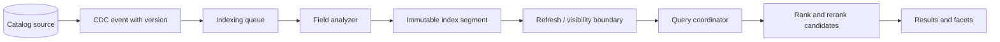
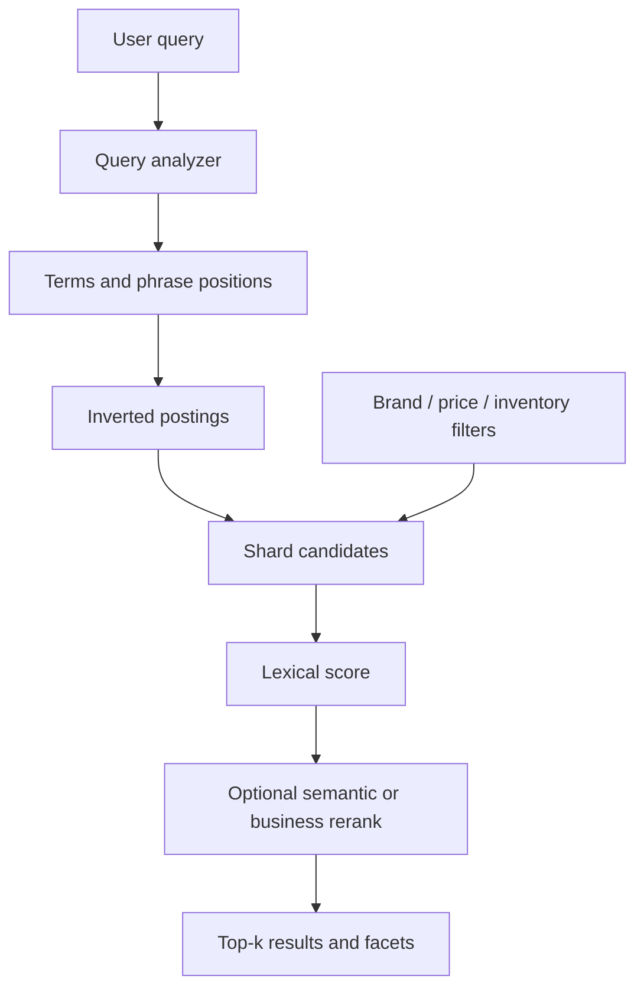
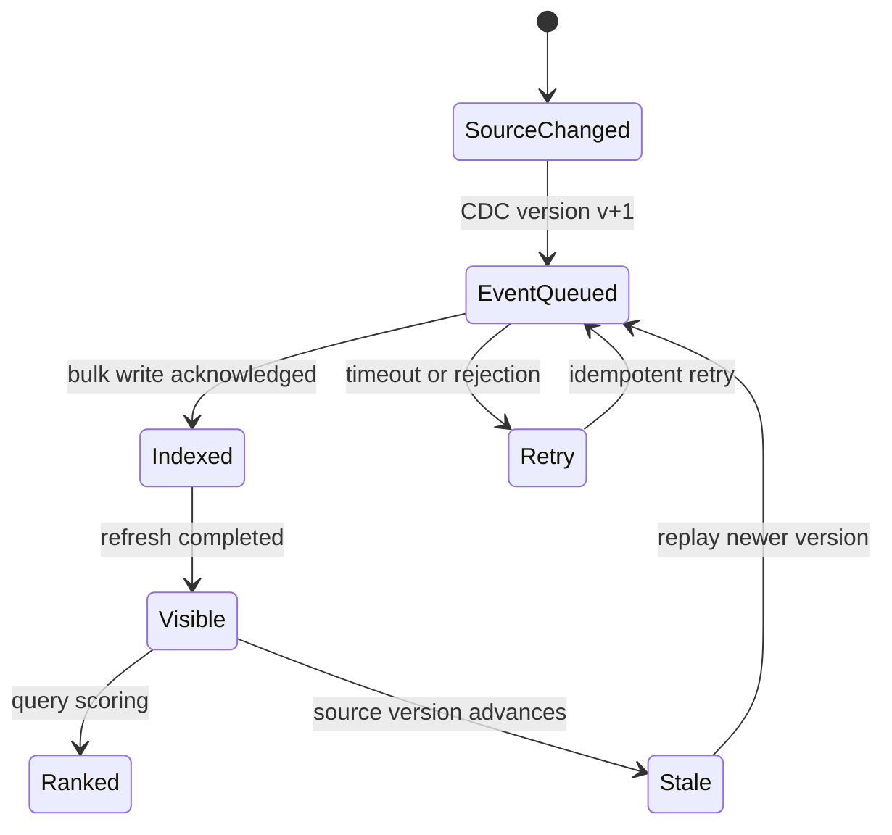

# Search Engines: Inverted Indexes, Ranking, and Freshness

**Level:** L4–L5
**Status:** reviewed
**Audience:** Engineers designing product-search and document-retrieval systems.
**Prerequisites:** tokenization, inverted indexes, distributed systems, CDC, and basic experimentation.
**Sequence:** Batch 2B, 5/8
**Terra gate:** approved

## Learning objectives

- Trace text through an analyzer into an inverted index and immutable segment.
- Separate lexical ranking, filters, facets, refresh visibility, and reranking.
- Design source-to-index CDC with replay, idempotency, mapping evolution, and reindexing.
- Evaluate product search with judged queries, recall, ranking quality, and business constraints.
- Diagnose mapping, shard, synonym, stale-index, and relevance failures.

## What it is

A search engine builds an index optimized for retrieval rather than treating the
source database as a scan target. For full text, the usual structure is an
inverted index: a term points to the documents and often positions containing
it. A forward source record remains authoritative; the index is a derived read
model unless a system explicitly chooses event sourcing for search documents.

For `"blue trail shoes"`, an analyzer may normalize case, tokenize, remove or
retain stop words, stem, and attach positions. The resulting postings could be:

```text
blue  -> doc 17 [position 2], doc 24 [position 1]
trail -> doc 17 [position 3]
shoe  -> doc 17 [position 4], doc 31 [position 2]
```

The exact analyzer, tokenizer, language rules, scoring formula, and segment
format vary by provider and deployed version. Elasticsearch/OpenSearch Lucene
releases, Solr, Vespa, and managed search services do not have identical
refresh, mapping, shard, or ranking behavior.

## Why it matters

Users ask for words, concepts, ranges, filters, and sort orders over collections
too large for a relational `LIKE '%term%'` scan. Search must find candidates,
rank them, expose facets, and do so while documents change. Product search adds
inventory, price, availability, policy, personalization, and merchandising
constraints; relevance alone is not enough if the result cannot be purchased.

Search also introduces three independent freshness dimensions:

| Dimension | Question | Example symptom |
| --- | --- | --- |
| Source freshness | Has the authoritative product changed? | Catalog database has new price |
| Index visibility | Has the change reached a refreshed searchable segment? | Search still returns old price |
| Ranking quality | Is the right visible document ordered first? | Fresh item is present but buried |

Treating all three as “latency” hides the repair. Measure source-to-CDC delay,
CDC-to-index delay, refresh visibility, and offline/online ranking quality
separately.

## Mental model

The indexer transforms documents into fields, terms, postings, stored values,
and segment metadata. A query is usually two phases: retrieve a bounded
candidate set from shards, then merge and possibly rerank it. Filters on exact
keywords or numeric ranges may use specialized structures and should not be
confused with analyzed text matching.



The source version travels with the event so a delayed update cannot overwrite
a newer document. Refresh makes committed index segments visible to readers;
it does not prove that the source is fresh or that the rank is good.

### Analysis and field types

Use an analyzed `text` field for matching natural language and a `keyword`
field for exact filtering, faceting, sorting, and IDs. A numeric field supports
ranges; a date field needs a declared timezone/format policy; a geo field uses a
provider-specific spatial index. Multi-fields can index one logical value in
several forms, but each form adds storage and update work.

An analyzer is a pipeline, not just lowercasing. Token boundaries, accents,
synonyms, stemming, stop-word behavior, and language all alter recall. Search
and index analyzers must be compatible. A synonym change can require reopening
or reindexing depending on where it is applied; do not promise an instant global
change without checking the provider/version.

### Segments and refresh

New documents first enter in-memory indexing buffers, then immutable segments.
Segments can be merged to reduce search overhead, but merging consumes I/O and
CPU. A refresh publishes a searchable view at a product-defined cadence. A
flush or durable commit is a different boundary: visibility, durability, and
replication acknowledgments must be named separately.

### Shards and replicas

The coordinator fans a query to primary or replica shard copies, each returns
top candidates, and the coordinator merges them. Distributed top-k ranking can
be approximate when a shard returns too few candidates. More shards increase
parallelism and metadata, while replicas increase read capacity and recovery
cost. A shard count chosen from current documents can be hard to change later;
use a tested split, rollover, or reindex plan.

| Component | Helps | Costs or failure boundary |
| --- | --- | --- |
| Inverted postings | Term retrieval and phrase candidates | Index size, analyzer coupling |
| Doc values / column values | Sorting, aggregations, exact fields | Disk and refresh/update work |
| Segment merge | Fewer searchable segments | Write amplification and I/O spikes |
| Replica | Read scale and failover | Extra storage and stale replica risk |
| Reranker | Semantic or business ordering | CPU, model versioning, candidate recall ceiling |

## Worked example

Assume 10,000,000 products, 1,000 searches/second at peak, 20 results shown,
and a catalog update stream of 200 events/second. Product documents contain
`name` and `description` as analyzed text, `brand` and `category` as keyword
fields, and `price`, `inventory`, and `updated_at` as numeric/date fields.

A request for “blue trail shoes” with brand and price filters can execute as:

1. Analyze the query with the same language policy used for the relevant fields.
2. Retrieve lexical candidates from postings for `blue`, `trail`, and `shoe`.
3. Apply exact brand and numeric price filters before expensive scoring where the
   engine supports filter caching or specialized range structures.
4. Score candidates with BM25-like text relevance plus explicit boosts; use a
   bounded candidate count for a semantic rerank model.
5. Merge shard top-k lists, compute facets over the intended document set, and
   return 20 visible products with a `source_version` or freshness diagnostic.

Suppose an indexer batches 200 events/second for 5 seconds: each batch contains
1,000 product changes. If a batch takes 1.5 seconds to analyze and publish, the
steady service requirement is less than 5 seconds per batch, leaving 3.5 seconds
of scheduling margin under these assumptions. This is queueing reasoning, not a
provider throughput claim. Measure payload bytes, analyzer CPU, merge CPU,
refresh time, and rejected/bulk-retried events.

For evaluation, make a judged set of 500 real queries. If 420 have at least one
relevant result in the top 20, recall@20 is `420/500 = 84%`. If the first result
is relevant for 350 queries, hit-rate@1 is 70%; it is not the same as recall.
Segment by query class, zero-result rate, out-of-stock rate, and language.

## Advantages and limitations

| Approach | Strength | Limitation | Good boundary |
| --- | --- | --- | --- |
| Search index | Fast term retrieval, facets, relevance scoring | Derived state and reindex operations | User-facing discovery |
| Database full-text index | Transactional proximity to source | Scale, analyzer, and ranking limits vary | Small or tightly coupled catalogs |
| Vector/semantic retrieval | Captures some lexical variation | Embedding/model drift and weak exact filters | Recall expansion and reranking |
| External API search | Managed operations and features | Provider cost, version, and portability | Teams without search operations |

Do not claim that replicas make an index current. They can serve an older
replica, and a newly indexed document may be invisible until refresh. Do not
claim BM25 is a universal relevance solution: synonyms, field boosts,
availability, and user intent require evaluation.

### Product-search evaluation

| Metric | Measures | Failure it catches | Caveat |
| --- | --- | --- | --- |
| Recall@k | Relevant items present in top k | Candidate/index omission | Needs judged relevance set |
| Precision@k | Fraction of top k relevant | Noisy result list | Relevance labels can be subjective |
| NDCG@k | Graded position quality | Relevant result buried | Requires graded judgments |
| Zero-result rate | Queries with no result | Analyzer/mapping gaps | Can be valid for unknown terms |
| Add-to-cart rate | Business outcome | Poor usable ranking | Confounded by price and inventory |

## Topic-specific visual



This diagram emphasizes that a reranker cannot recover a document absent from
the candidate set. Filtering and lexical recall therefore precede expensive
ranking; a product team should measure candidate recall before tuning scores.



The state machine separates source freshness, index visibility, and ranking
quality. A document can be visible and still rank poorly; a retry must not let
an older version move it backward.

## Failure modes and operations

### Mapping and analyzer failures

An accidental dynamic mapping can index a string as the wrong type, make a
field unavailable for facets, or create too many fields. Freeze mappings for
critical fields, reject incompatible documents, and run mapping tests in CI.
Treat analyzer and synonym files as versioned artifacts. A mapping change often
requires a new index and reindex; an alias switch should be atomic and reversible.

### Reindex and shard failures

Reindex into a new version, compare document counts and sampled field values,
replay changes after the snapshot boundary, then switch a read alias. Monitor
shard size, merge backlog, rejected bulk requests, replica lag, and recovery
time. A shard that is too large makes recovery and reindex slow; too many small
shards increase coordination overhead.

### Stale documents and duplicates

Carry source ID and monotonic version. Ignore an event if its version is older
than the indexed version, or use an atomic compare-and-set feature where
available. Deduplicate at the outbox/consumer boundary too; an index write that
is idempotent does not make downstream side effects idempotent.

### Synonym and relevance regressions

Evaluate synonym additions against a regression query set. A broad synonym can
increase recall while damaging precision, facets, or phrase behavior. Canary a
new analyzer/ranker, compare NDCG and zero-result rate by query segment, and
retain the old alias for rollback.

### Operations checklist

- Track source freshness, index visibility lag, ranking quality, and query p50/p95 separately.
- Record documents/sec, bytes/sec, bulk retries, refresh time, merge debt, and shard skew.
- Bound query fan-out and candidate counts so a pathological query cannot exhaust coordinators.
- Keep mapping, analyzer, synonym, and ranker versions with every index deployment.
- Test replica loss, partial bulk failure, CDC replay, alias rollback, and restore.
- Qualify provider/version behavior for refresh acknowledgments, routing, and reindex APIs.

## Practical exercises

### Exercise 1: Design a product mapping

Choose field types and analyzers for name, brand, SKU, category, price, and
description. Include exact filtering and search behavior.

**Expected approach:** Use analyzed text plus a keyword subfield for name, keyword
for SKU/brand/category, numeric for price, and a language-appropriate analyzer
for description. State whether synonyms are index-time or query-time and test
the deployed provider version.

### Exercise 2: Build CDC indexing

Design handling for an update `product-7 v9` arriving after `v10`, then a retry of
`v10` after a bulk timeout.

**Solution:** Persist source ID/version, compare before apply, make `v10` retry
idempotent, and route poison records to a repair queue. Verify alias/index
visibility separately from source freshness.

### Exercise 3: Evaluate ranking

Create a 100-query judged set with relevance grades and compare a title boost
against a reranker.

**Expected approach:** Compute recall@20 and NDCG@10 by query class, include
zero-result and out-of-stock slices, use a held-out set, and define a rollback
threshold. Do not rely only on click-through because position bias matters.

### Exercise 4: Diagnose a stale search result

A catalog price changed five minutes ago but search shows the old value. Trace
the path and choose evidence before changing refresh intervals.

**Expected approach:** Check source commit time, CDC position, consumer lag,
bulk response, indexed source version, replica/refresh visibility, and response
cache. Fix the failed boundary; more refresh work cannot repair a stuck CDC
consumer.

## Interview Q&A

### Q1. Why use an inverted index?

**Answer:** It maps terms to candidate documents, avoiding a full scan for common
text retrieval. Postings, positions, and field norms support phrase and scoring
features at the cost of index storage and update work.

**Follow-up:** What happens to a rare term versus a common term?

### Q2. What does an analyzer do?

**Answer:** It tokenizes and normalizes text, optionally applying stop words,
stemming, synonyms, and positions. The analysis contract affects recall, phrase
matching, and whether existing documents need reindexing.

**Follow-up:** Why keep an unanalyzed keyword field?

### Q3. How do filters differ from ranking clauses?

**Answer:** Filters decide eligibility, often using exact/range structures and
without contributing text relevance; ranking clauses order eligible candidates.
The provider may optimize them differently, so inspect the actual plan/profile.

**Follow-up:** Where should inventory filtering occur?

### Q4. What does refresh guarantee?

**Answer:** It makes committed index changes searchable according to the
provider's visibility semantics. It does not guarantee source freshness,
replica convergence, durability, or ranking quality.

**Follow-up:** Which lag would you alert on for a price update?

### Q5. How do shards affect search quality?

**Answer:** The coordinator merges per-shard candidates, so a low per-shard top-k
can omit globally relevant documents. Shards also affect fan-out, recovery, and
skew; test candidate size with real queries.

**Follow-up:** Why are replicas not a freshness fix?

### Q6. How do you reindex safely?

**Answer:** Build a versioned target, snapshot and replay CDC, validate counts and
fields, then atomically switch an alias. Retain the old index and define the
rollback window.

**Follow-up:** What prevents an older event from winning during replay?

### Q7. How should synonyms be operated?

**Answer:** Version them, test precision/recall and phrase behavior, canary the
change, and follow provider-specific reload/reindex rules. Broad synonyms can
improve recall while reducing ranking quality.

**Follow-up:** Query-time or index-time synonym: what is the trade-off?

### Q8. How do you separate stale from irrelevant results?

**Answer:** Compare source version and source-to-index visibility first. If the
document is current and visible, evaluate ranking quality with judged queries and
metrics such as NDCG; do not call a relevance defect a freshness incident.

**Follow-up:** What business constraints belong in evaluation?

## Search operations appendix

### Query-shape inventory

Before selecting shards, record the distribution of query terms, phrase queries,
filters, facets, sort fields, and result pages. A product search workload with
many exact SKU lookups has a different index shape from a document workload with
long natural-language queries. Measure candidate count, shard fan-out, bytes
read, analyzer CPU, rank CPU, and response-size bytes for each class.

A filter on `brand=Acme` should be represented as an exact keyword field, while
`name:"trail shoe"` needs analyzed tokens and positions. A numeric price range
should not be modeled as free text. If a field is both searched and faceted,
consider a multi-field representation and account for its extra index storage.

### Ranking boundaries

Lexical ranking is limited by candidate recall. If a relevant product is not in
the shard candidate set, a reranker cannot recover it. Increase candidate depth
only after measuring coordinator CPU, network bytes, and p95 query time. A
semantic reranker also has model-version, embedding-version, and fallback
behavior to document.

Business boosts need a bounded and auditable formula. One example is:

```text
score = 0.65 * lexical_score
      + 0.20 * normalized_popularity
      + 0.10 * inventory_signal
      + 0.05 * freshness_signal
```

The coefficients are an experiment assumption, not a universal ranking recipe.
Normalize inputs over a declared window, prevent inventory from overpowering
relevance, and evaluate by query class. A product that is unavailable should be
filtered or clearly labeled according to product policy rather than silently
boosted.

### Reindex runbook

1. Freeze the intended mapping, analyzer, synonym set, and ranker versions.
2. Create a new index name with an explicit schema version.
3. Snapshot the source or record a CDC starting position.
4. Bulk index source documents with bounded batches and retry classification.
5. Replay CDC events after the snapshot, using source ID and monotonic version.
6. Compare counts, required fields, source versions, and sampled rendered results.
7. Run offline relevance evaluation and a shadow online query comparison.
8. Switch the read alias atomically and monitor freshness and ranking quality.
9. Retain the old index until rollback and delayed-event windows expire.

An alias switch does not repair a bad source snapshot. A bulk request can partially
succeed; persist per-document errors and replay only those records. A malformed
document belongs in a repair queue with redaction and retention rules, not in an
infinite retry loop.

### Freshness instrumentation

Attach `source_updated_at`, `cdc_published_at`, `indexed_at`, and `visible_at`
where the privacy and payload contract permits. Then derive source freshness,
index visibility lag, and consumer lag independently. A result can be current in
the index and still be incorrectly ranked; a result can be well ranked but stale.

Track the age of the oldest unprocessed CDC event, bulk rejection rate, refresh
time, segment count, merge backlog, replica recovery time, and alias version.
Alert on a measured SLO such as “99% of catalog changes visible within five
minutes,” but document whether visibility means primary refresh or all replicas.

### Facets and filters

Facets should run over the same filtered candidate scope as results unless the
product deliberately defines a broader navigation count. High-cardinality facet
fields consume memory and aggregation CPU. Cap facet sizes, use approximate
counts only with an explicit UI contract, and test empty, missing, and malformed
values.

### Provider/version caveats

Lucene-based Elasticsearch and OpenSearch releases differ in APIs and defaults;
Solr, Vespa, and managed search providers differ further. Verify refresh
acknowledgment, index sorting, synonym reload, shard split, vector/rerank, and
alias behavior against the deployed provider version. The examples here are
architecture pseudocode, not a guarantee of any product's latency or cost.

### Review questions

- Can an operator identify the source version behind a visible result?
- Can an older CDC event be proven harmless after a retry?
- Can a mapping or synonym rollback occur without losing new catalog updates?
- Can a relevance regression be separated from index visibility lag?
- Can a partial bulk failure be replayed without duplicate business effects?
- Can shard recovery fit the stated recovery-time objective?
- Can a tenant or locale boundary be verified in the index key and query filter?
- Can the team reproduce the ranking result with the same analyzer and ranker versions?

### Debugging a relevance complaint

First capture the exact query, locale, filters, analyzer version, index alias,
and timestamp. Re-run it against the same index snapshot. Confirm whether the
expected product is absent, present below the requested page, filtered out, or
present but scored lower. Each state has a different repair.

If absent, inspect source freshness, CDC lag, mapping rejection, analyzer output,
and reindex coverage. If filtered, inspect keyword normalization, numeric units,
inventory policy, and missing-value behavior. If present but low-ranked, compare
term matches, field boosts, freshness/popularity features, and reranker input.
Record the result as a regression test before changing coefficients.

### Capacity review

Estimate index storage as source bytes plus postings, norms, doc values, stored
fields, replicas, and temporary merge space. Estimate query work from shard
fan-out, candidate depth, filter selectivity, facet cardinality, and reranker
cost. Use observed samples and state whether figures are compressed or decoded.

During a rollout, cap bulk concurrency and monitor merge debt so indexing does
not consume all query CPU. A replica rebuild is a recovery workload; include its
duration in shard-size decisions. If the index cannot recover within the
service's availability budget, reduce shard size or change the recovery plan.

### Search safety

Escape query syntax where the API accepts user text, cap wildcard/fuzzy breadth,
limit facet cardinality, and rate-limit expensive query classes. Do not expose
internal source fields that contain tenant data. Validate authorization filters
on both normal and fallback paths, and test a missing filter as a deny-safe
failure rather than an all-documents query.
Keep a query trace identifier with source and index versions.
Keep a relevance judgment owner and judgment date.
Keep a rollback alias until delayed CDC has drained.
Keep index snapshots long enough to reproduce a complaint.
Keep facet definitions versioned with the mapping.
Keep user-visible freshness text distinct from rank explanations.
Keep provider documentation links in the deployment record.
Keep result caches keyed by query scope and index version.
Keep semantic model upgrades behind a measurable canary.
Keep operational claims scoped to this workload.

## Related and next reading

- [Change-data capture](20-change-data-capture.md)
- [Caching stores](07-caching-stores.md)
- [Vector databases](08-vector-databases.md)
