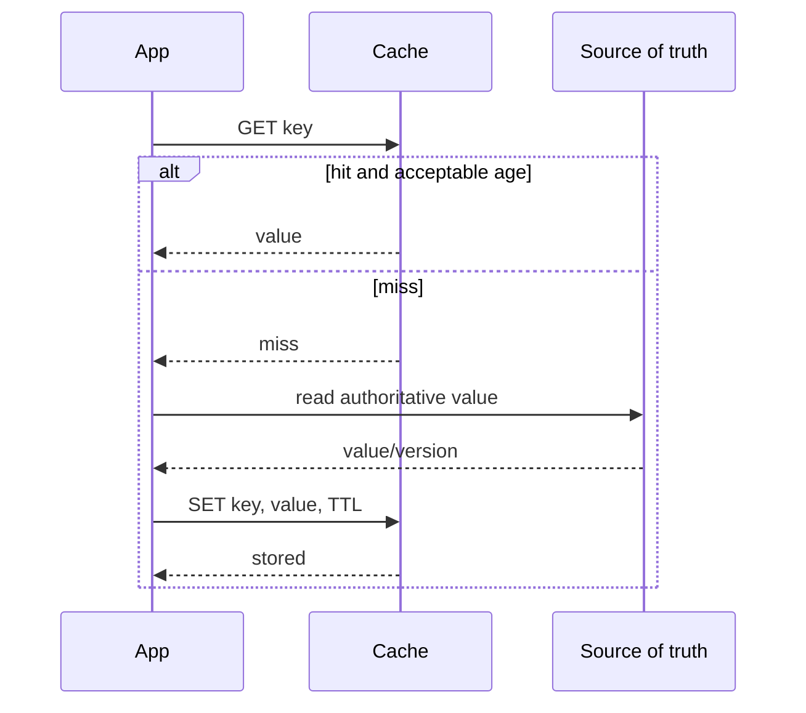
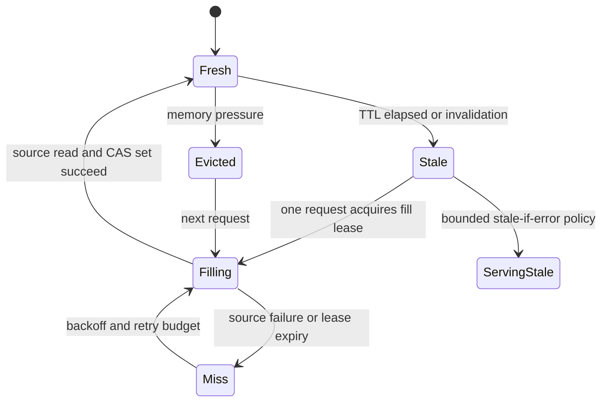
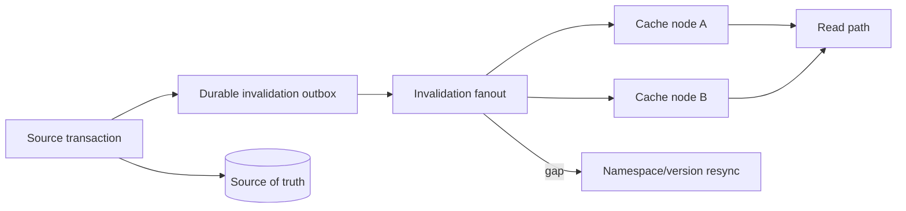
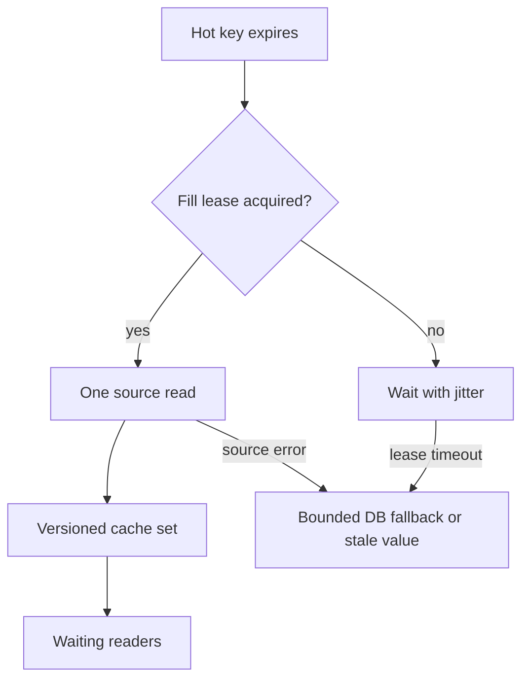

# Caching Stores: Correctness Boundaries, Eviction, and Failure

**Level:** L4–L5
**Status:** reviewed
**Audience:** Engineers designing read-heavy services and preparing for distributed-systems interviews.
**Prerequisites:** source-of-truth databases, transactions, TTLs, concurrency, and replication.
**Sequence:** Batch 2B, 6/8
**Terra gate:** approved

## Learning objectives

- Select cache-aside, write-through, write-behind, negative caching, or no cache for a stated consistency need.
- Calculate cache capacity, TTL load, miss rate, and database protection from explicit units.
- Explain concurrent fill, stampede, hot key, eviction, persistence, failover, and split-brain behavior.
- Design invalidation, degraded fallback, and tenant-safe keying without treating cache data as authoritative.
- Define measurements and recovery boundaries for a Redis-like or Memcached-like provider.

## What it is

A cache is a faster, usually less authoritative copy of data. The source of
truth remains a database, service, or durable log unless the design explicitly
assigns ownership to the cache. An in-memory store may also provide data
structures, locks, queues, or a durable log, but using those features does not
make every access pattern a cache.

The cache key is a contract: it encodes identity, representation, tenant scope,
locale, authorization-relevant dimensions, and sometimes a version. The value
needs an expiry or invalidation policy. A miss runs the fill path; a stale or
corrupt value must be detectable and safely replaced.

## Why it matters

If 10,000 requests/second each read the same product and the cache hit rate is
95%, the backing store sees approximately 500 requests/second before retries
and fills. That can protect a database, but it can also hide source lag, create
a thundering herd at expiry, or serve data under the wrong tenant key.

Cache correctness is multidimensional:

| Property | Question | Typical mechanism |
| --- | --- | --- |
| Freshness | How old may a value be? | TTL, version, invalidation |
| Durability | Can the value be lost? | Source of truth, persistence, replica |
| Visibility | Which readers see an update? | Invalidation order, replication |
| Admission | Which misses may fill? | Single-flight, rate limit, negative cache |
| Isolation | Can one scope see another? | Namespaced keys, authorization checks |

The cache reduces work only when its hit value exceeds lookup, serialization,
eviction, replication, and operational cost. A cache miss is expected; an
unbounded miss storm is a capacity incident.

## Mental model

The common cache-aside path is read, miss, load source, and set. The write path
must choose ordering and failure behavior. Cache-aside usually writes the source
then invalidates or updates the cache. Write-through writes through a cache
wrapper, but the source transaction and cache operation may still fail
separately; write-through is not automatically always consistent. Write-behind
acknowledges before the source write and therefore needs a durable queue,
replay, ordering, and lost-write recovery.



The source read is the authority on a miss. The set is an optimization and may
fail without losing the source value; the application must decide whether a
cache outage is a degraded read or a request failure.



The fill lease limits concurrent database reads. Serving stale data is a
declared availability trade-off; it should have an age bound and must not apply
to values whose authorization or safety semantics forbid staleness.

### Patterns and consistency

| Pattern | Source write order | Failure risk | Suitable example |
| --- | --- | --- | --- |
| Cache-aside | Source, then invalidate/set | Stale window, miss storm | Product profile read |
| Write-through | Cache wrapper coordinates source write | Partial cache/source failure | Session-like records with defined adapter semantics |
| Write-behind | Cache, then async source write | Lost/reordered writes | Buffered analytics counter with durable queue |
| Read-through | Cache owns source fetch adapter | Hidden retries and coupling | Stable object lookup |
| Negative cache | Cache “not found” briefly | Hides newly-created object | Failed username lookup with short TTL |

No pattern gives a universal consistency guarantee. Define a per-key invariant,
such as “after a successful update, the writer reads its new version,” and
choose fencing, version comparison, or bypass accordingly.

### Eviction and persistence

LRU approximations, LFU, random, volatile-TTL, and all-keys policies make
different choices under memory pressure. TTL does not mean an item is removed at
the exact deadline; lazy expiration, active sampling, and replication affect
observed behavior. Persistence options such as snapshots and append-only logs
change restart recovery but do not turn cached copies into the source of truth.

Replicas can improve read capacity and failover. Failover can lose writes that
were acknowledged before replication, depending on the provider and settings.
Document the acknowledgment and recovery point.

## Worked example

Assume an API receives 2,000 requests/second for a profile key. The database can
safely handle 300 profile reads/second reserved for this API. A cache hit rate of
90% leaves `2,000 × 10% = 200` misses/second, but a simultaneous expiry of 5,000
popular keys can temporarily exceed that rate.

Use a 10-minute TTL with uniform jitter of ±60 seconds. If a popular key has a
read rate of 100/second, its expected source load from expiry is approximately
one fill per 600 seconds, or 0.0017/second, when single-flight prevents duplicate
fills. Without a fill lease, 100 concurrent requests may all read the database
at the expiry boundary.

Suppose there are 5,000,000 cached objects. Each object has a 1,200-byte value,
a 200-byte key, and an assumed 80 bytes of per-copy metadata/allocator overhead.
Treat replication separately: the cache keeps three copies, so the replication
factor is `R = 3`. Per replica, the estimate is:

```text
per-replica bytes = 5,000,000 × (1,200 + 200 + 80)
                  = 7,400,000,000 bytes = 7.4 GB decimal
all replicas      = 7,400,000,000 × R
                  = 22,200,000,000 bytes = 22.2 GB decimal
```

The 25% failover headroom is applied once to the replicated total:
`22.2 / 0.75 = 29.6 GB decimal` provisioned capacity. This estimate still
needs measured fragmentation, protocol buffers, eviction policy, and provider/
version behavior; those factors must not be counted again as a hidden replica
factor.

If the source read service time is 20 ms and misses are 200/second, offered
concurrency is `200 × 0.020 = 4` concurrent source requests by Little's Law
under a stable approximation. A stampede can multiply that by the number of
fillers, so a bounded semaphore and backoff protect the database.

The cache key must include tenant and representation:

```text
profile:v3:tenant=acme:user=42:locale=en-US
```

Do not use a user-controlled raw key as a database identifier or let a missing
tenant field fall back to a shared namespace. A cache hit should still respect
authorization if the value includes scoped data.

## Advantages and limitations

| Store or mode | Strength | Limitation | Operational question |
| --- | --- | --- | --- |
| Redis-like store | Rich structures, TTL, atomic scripts | Memory pressure and failover semantics | Which commands are atomic in this version? |
| Memcached-like store | Simple volatile cache and horizontal distribution | No durable source, fewer structures | How are misses and node loss handled? |
| Local process cache | Lowest network overhead | Per-instance duplication and stale divergence | What invalidates every instance? |
| CDN/edge cache | Protects origin geographically | Varying purge and authorization semantics | Can private data ever be shared? |

Persistence is a recovery optimization for cache data, not a reason to skip the
database write. If the cache is the intentional durable queue or event store,
teach and operate it as that separate role with its own retention and replay
contract.

### Invalidation choices

| Invalidation | Freshness behavior | Failure mode | Recovery |
| --- | --- | --- | --- |
| TTL only | Bounded by TTL plus jitter | Stale until expiry | Shorten TTL or bypass key |
| Write then delete | Usually short stale window | Delete lost after source commit | Outbox/invalidation replay |
| Write then set version | Fast readers see new copy | Set races with older writer | Compare source version |
| Pub/sub invalidation | Fast fan-out | Subscriber gap or dropped message | Durable invalidation log and resync |
| Namespace version | O(1) logical invalidation | Old memory remains until expiry | Advance version, garbage collect |

## Topic-specific visual



The outbox makes invalidation replayable. A cache node that misses a fanout
message must resynchronize from a durable version or be taken out of service;
fire-and-forget pub/sub alone is not a correctness proof.



The stampede diagram shows the side-effect boundary: only the lease holder
reads and populates, while waiters use a bounded fallback. The lease itself
must expire so a crashed filler does not block all readers.

## Failure modes and operations

### Stampede and hot key

Measure miss rate, fills/sec, fill waiters, source QPS, key frequency, and
evictions. Use single-flight per process plus a distributed lease only when its
failure semantics are understood. Add TTL jitter, request coalescing, stale-if-
error, and a bounded fallback. For a hot key, replicate the value or shard a
counter only if reads and invalidation can preserve semantics.

### Stale or lost writes

Write source first, then invalidate through a durable outbox, or attach a source
version and reject an older cache set. A write-behind path needs a durable queue,
replay, conflict policy, and a reconciliation scan. Do not call asynchronous
write-behind “safe” merely because the cache acknowledged it.

### Split brain and failover

A partition can produce two writers or two cache primaries. Use provider fencing,
epochs, or a source-side compare-and-set for authoritative writes. After failover,
measure lost acknowledged writes, replica lag, resynchronization, and key churn.
If the cache is only a copy, flush or rebuild unsafe entries rather than merging
untrusted values.

### Poisoning and tenant leakage

Validate values before caching, cap serialized size, include schema/version and
tenant scope in keys, and never cache an authorization decision without its full
policy context. A cache hit must not bypass object authorization. Test malformed
payloads, key collisions, delimiter injection, and cross-tenant reads.

### Degraded fallback

When the cache is unavailable, use a circuit breaker, database concurrency limit,
short timeouts, and a clear error or bounded stale policy. Cache failures should
not turn into an unbounded origin flood. Record whether a response came from a
fresh hit, stale hit, source fallback, or negative cache.

### Operational checklist

- Track hit/miss by key class and tenant, not only a global ratio.
- Track memory used, eviction rate, TTL distribution, hot-key percentile, fill latency, and replication lag.
- Test node loss, failover, restart persistence, network partition, concurrent fill, and invalidation gap.
- Keep cache schema/version and serialization compatibility across deploys.
- Define source protection budgets and stop filling when the origin is unhealthy.
- Confirm provider/version semantics for eviction, scripts, replication acknowledgment, and failover.

## Practical exercises

### Exercise 1: Protect the database

For 4,000 requests/second, a 92% hit rate, and a source limit of 250 reads/second,
calculate expected misses and propose stampede protection.

**Expected approach:** Misses are `4,000 × 0.08 = 320/second`, already above the
source budget. Improve hit rate, admission, batching, or a bounded fallback;
add single-flight, TTL jitter, and an origin semaphore. Do not simply increase
the cache TTL without a freshness requirement.

### Exercise 2: Compare write policies

An inventory update must never make a confirmed purchase use an older quantity.
Choose among cache-aside, write-through, and write-behind.

**Solution:** Keep the source transaction authoritative, use versioned writes or
bypass/cache invalidation after commit, and reserve write-behind for a design
that can tolerate/reconcile delayed inventory. Explain why write-through still
needs a transaction/failure contract.

### Exercise 3: Repair an invalidation gap

A subscriber is disconnected for 30 seconds while 10,000 keys change. Design
resynchronization.

**Expected approach:** Record invalidations in an outbox/log with sequence, detect
the gap, replay from the last acknowledged sequence or advance a namespace
version, then sample source/cache versions before returning the node to service.

### Exercise 4: Test tenant safety

Two tenants request the same object ID with different authorization and locale.
Write a cache-key and test strategy.

**Expected approach:** Include tenant, representation, locale, and schema version
in an allowlisted key builder; test cross-tenant and policy changes, malformed
keys, stale values, eviction, and fallback. Authorization remains enforced on
the read path.

## Interview Q&A

### Q1. What is cache-aside?

**Answer:** The application reads the cache, loads the source on miss, and then
populates the cache. Source writes are usually followed by invalidation or a
versioned set.

**Follow-up:** How do you bound concurrent fills?

### Q2. Is write-through always consistent?

**Answer:** No. The cache wrapper can fail after the source commit, replicas can
lag, and transaction boundaries may not span both systems. Define the adapter's
ordering and recovery contract.

**Follow-up:** What source-side invariant must remain true?

### Q3. How does a TTL protect the database?

**Answer:** It lets repeated reads hit the cache, but expiry creates misses. Use
hit-rate measurement, TTL jitter, single-flight, admission, and an origin budget.

**Follow-up:** When is negative caching dangerous?

### Q4. What is a cache stampede?

**Answer:** Many requests refill an expired or evicted key concurrently, causing
an origin spike. A lease, request coalescing, jitter, stale-if-error, or bounded
fallback reduces the spike.

**Follow-up:** What happens if the lease holder crashes?

### Q5. How do you handle a hot key?

**Answer:** Measure its share, extend or jitter TTL within freshness policy,
replicate reads, coalesce fills, and isolate its origin budget. Sharding a value
can change semantics and is not a universal fix.

**Follow-up:** How would you shard a counter without losing increments?

### Q6. Does persistence make a cache durable?

**Answer:** It may improve restart recovery, but provider acknowledgment, replica
lag, snapshot loss, and failover can still lose data. A source of truth or durable
queue remains required for authoritative writes.

**Follow-up:** What recovery point is acceptable for this key class?

### Q7. What is split brain in a cache cluster?

**Answer:** Partitioned nodes accept conflicting writes or leadership. Fencing,
epochs, quorum/provider failover semantics, and source-side version checks prevent
an old writer from overwriting newer state.

**Follow-up:** What do you do with acknowledged writes after an uncertain failover?

### Q8. How can caches leak tenant data?

**Answer:** A key omits tenant or representation scope, authorization is checked
only on misses, or an invalidation crosses namespaces. Use an allowlisted key
builder and enforce authorization on hits and source fallback.

**Follow-up:** How is the leak test automated?

### Q9. What do you measure during a cache incident?

**Answer:** Hit/miss by class, fill rate, origin QPS, hot keys, evictions, memory,
TTL age, errors, replication lag, and stale/fallback responses. A global hit ratio
can hide one failing tenant or key family.

**Follow-up:** What is the rollback if origin load exceeds its budget?

## Cache design appendix

### Admission and key policy

Not every value deserves admission. A one-time object can evict a frequently
read object and increase misses. Sample request frequency, object size, source
load, and invalidation risk before enabling admission. A tiny negative-cache TTL
can protect a source from repeated not-found lookups, but it must be short enough
for newly-created objects to appear.

Keys should be generated by server-side code from typed fields. Include schema
version, tenant, locale, authorization scope, and representation where they
change the value. Avoid concatenating unescaped user input. A key collision is a
data-isolation failure, not merely a cache miss.

### Freshness and versioning

TTL is an upper-bound intention, not necessarily an exact deletion instant.
Active expiration, lazy reads, memory pressure, replication, and persistence
affect what operators observe. When a value carries source version `v42`, a
writer should not replace it with `v41`. Compare versions in the source or cache
operation, and bypass the cache when a read-your-write guarantee is required.

For invalidation, record an ordered event with key or namespace version. A
subscriber may reconnect after a gap, so provide replay or full namespace
resynchronization. A best-effort pub/sub signal is useful latency optimization;
it is not durable correctness by itself.

### Capacity, DB protection, and cost model

Database protection is an explicit budget: cap origin concurrency, reject or
serve safe stale data when the budget is exhausted, and alert on source QPS.
Estimate memory as `objects × (key bytes + value bytes + metadata overhead)` and
add fragmentation, replicas, failover, and headroom. Estimate origin work as
`request_rate × (1 - hit_rate)`, then add fill retries and stampede multiplier.
Report decimal bytes for billing and binary GiB for host capacity when those are
the units used by the provider.

An object of 900 bytes with 180 bytes of key/metadata across 8,000,000 objects
uses `8,000,000 × 1,080 = 8,640,000,000 bytes`, or 8.64 GB decimal before
allocator fragmentation. At a 70% usable-memory target, the dataset alone
needs 12.34 GB decimal. This is an estimate; measure the deployed allocator and
serialization format.

### Incident playbooks

During a miss storm, identify the key family and tenant, cap origin concurrency,
enable single-flight, and decide whether bounded stale values are safe. During a
hot-key incident, measure the top-key share before adding replicas or changing
TTL. During a memory incident, identify eviction policy and object size before
raising the limit; more memory does not fix a poison admission pattern.

During a failover, record the last acknowledged replication position and source
version. If the cache is only a copy, rebuild uncertain values from the source.
If it owns a write-behind queue, stop new acknowledgments until the queue's
durability, ordering, and replay state are known.

### Provider/version caveats

Redis-like commands, Lua/script atomicity, cluster slot routing, eviction, AOF,
RDB, replicas, and failover behavior vary by provider and version. Memcached has
different persistence and replication assumptions. Managed providers may add
proxy behavior or change failover acknowledgment. Verify the exact deployment
before citing command semantics, capacity, or availability.

### Review matrix

| Scenario | Required evidence | Safe first response |
| --- | --- | --- |
| Cache miss spike | Hit ratio by key class, origin QPS, fill waiters | Origin semaphore and single-flight |
| Stale value | Source/cache version and invalidation sequence | Bypass or versioned refresh |
| Memory pressure | Evictions, object sizes, policy, fragmentation | Stop bad admission and protect critical keys |
| Failover | Replication position, lost-ack policy, source health | Rebuild uncertain copies |
| Tenant report | Key namespace, auth scope, request trace | Deny, isolate, and preserve audit evidence |

The operator should be able to reproduce one key's read, fill, invalidation,
eviction, and fallback path from metrics and logs without logging sensitive
values. Redact values and use hashes or IDs with access-controlled traces.

The curriculum example remains educational: observed latency, hit ratio, cost,
and capacity depend on workload, serialization, provider, version, and failure
policy. Record those assumptions before comparing a cache design.

When a stale value is acceptable, declare its maximum age and affected key class.
When it is not acceptable, bypass or compare a source version.
When a write is retried, preserve an idempotency key across attempts.
When a fill fails, return a bounded error or safe stale value.
When a node restarts, rebuild from the authoritative source where possible.
When a tenant is offboarded, invalidate all scoped keys and verify replicas.
When a schema changes, support readers for both serialized versions.
When a policy changes, canary one key family and compare origin load.
When a cluster partitions, fence the old writer before accepting new writes.
When costs change, measure storage, network, compute, and origin savings together.
When a cache is used as a queue, apply queue retention and replay rules.
When a cache is used for authorization, include policy version in the contract.
These are explicit boundaries for the design review, not universal guarantees.
Review cache keys with a privacy owner.
Review failover with a data owner.
Review TTLs with a freshness owner.
Review quotas with a platform owner.
Review replay with an operations owner.
Review every provider upgrade with a regression test.
Keep the source write path observable without the cache.
Keep a kill switch for cache admission.
Keep a bypass path for critical reads.
Keep a bounded retry budget for fills.
Keep tenant names out of untrusted key syntax.
Keep stale responses labeled in internal telemetry.
Keep redacted evidence for incident reconstruction.
Keep the cache contract next to the API contract.
Keep no claim broader than its measured workload.
The cache remains an optimization unless the design explicitly assigns durable ownership.
Measure before and after each policy change.

## Related and next reading

- [Connection pooling](25-connection-pooling.md)
- [Database replication](15-database-replication.md)
- [Message queues and streams](11-message-queues-streams.md)
