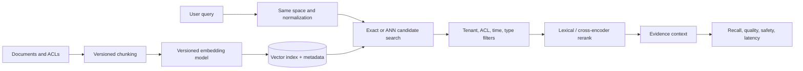
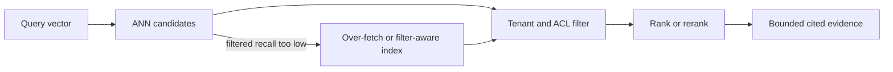

# Vector Databases: Embeddings, ANN Search, and Retrieval Quality

**Level:** L4–L5+
**Status:** Reviewed (Terra PASS)
**Audience:** ML/platform engineers building semantic retrieval or preparing for an L4–L5 ML-systems interview
**Prerequisites:** vectors, cosine similarity, indexing basics, and evaluation metrics
**Sequence:** Batch 1, 4/8
**Terra gate:** approved

## Learning objectives

- Separate embedding quality from ANN index quality with a labeled evaluation set.
- Choose an exact, ANN, or hybrid retrieval strategy and estimate storage.
- Preserve tenant/ACL isolation and measure filtered recall.
- Operate a model, chunking, deletion, or index migration with rollback.

## What it is

A vector database stores numeric representations of objects and retrieves nearby
vectors using exact or approximate nearest-neighbor (ANN) search. It commonly
adds metadata filters, persistence, updates, namespaces, and replication. The
embedding model supplies the geometry; the index supplies a search strategy.
Neither one proves that a retrieved document is true, relevant, or authorized.

## Why it exists and why it matters

Keyword search can miss paraphrases and vocabulary mismatch. Embeddings can put
“forgotten password” near “reset my passcode,” enabling semantic retrieval,
recommendation, deduplication, and RAG. ANN lowers candidate-search work as a
corpus grows, but trades recall, memory, tuning effort, or rebuild complexity.
Retrieval quality must be evaluated on the task, not inferred from distance.

## Mental model: a versioned retrieval contract



Model version, dimension, normalization, chunk policy, metric, metadata schema,
and delete semantics form one contract. Changing one without a migration or
evaluation can silently alter results.

## Topic-specific visual



The filter is part of retrieval correctness: a nearest disallowed vector is not
a valid result. If post-filtering removes too many candidates, change candidate
depth or the index and measure filtered recall instead of weakening ACLs.

## Similarity and index mechanics

For non-zero vectors `a` and `b`, cosine similarity is
`(a · b) / (||a|| ||b||)`. With unit-normalized vectors, cosine ranking and dot
product ranking are equivalent. Euclidean distance can be appropriate when
magnitude matters. Confirm the model's objective and normalize query and stored
vectors consistently; raw scores from different models are not comparable.

Exact search compares a query with every vector. HNSW navigates a graph with
search/build parameters that trade recall, memory, and insertion cost. IVF
selects clusters before searching them; product quantization reduces memory but
introduces approximation error. Names and tuning behavior differ by engine.

## Worked example: support retrieval

### Assumptions and storage

Assume 2 million chunks, 768 dimensions, float32 values, and 30 queries/s.
Vector payload alone is approximately `2,000,000 × 768 × 4 = 6.144 GB`.
Actual storage is larger because of IDs, metadata, index graph/cluster data,
replicas, tombstones, and allocator overhead. Use this as an order-of-magnitude
capacity input, then measure the chosen implementation.

### Evaluation and selection

Build 500 labeled support questions with relevant chunk IDs. Compare exact search
with HNSW/IVF candidates at 20, 50, and 100. Record Recall@20, MRR or nDCG,
filtered false positives, p95/p99 latency, memory, refresh lag, and cost. Pick
the smallest candidate set meeting the product target; “ANN is faster” is not a
portable guarantee.

```python
def cosine(a: list[float], b: list[float]) -> float:
    if len(a) != len(b):
        raise ValueError("dimension mismatch")
    dot = sum(x * y for x, y in zip(a, b))
    norm_a = sum(x * x for x in a) ** 0.5
    norm_b = sum(y * y for y in b) ** 0.5
    if not norm_a or not norm_b:
        raise ValueError("zero vector cannot be compared")
    return dot / (norm_a * norm_b)
```

### Filters and authorization

If the best unfiltered candidates are disallowed, post-filtering a small ANN
candidate set may return no good allowed result. Over-fetch candidates or use a
filter-aware index and measure *filtered* recall. Apply tenant/ACL constraints
within the retrieval contract or isolate namespaces; a missing ACL attribute
must fail closed.

## Advantages and limitations

| Choice | Advantages | Limitations / trade-offs |
| --- | --- | --- |
| Exact k-NN | Maximum recall for stored vectors and simple correctness baseline | Work grows with corpus; higher latency/cost at scale |
| HNSW | Strong practical recall/latency trade-off and incremental inserts | Memory-heavy graph, tuning complexity, delete/compaction work |
| IVF/PQ | Lower memory and efficient large-corpus search | Training/refresh, quantization error, cluster misses, rebuild planning |
| Hybrid lexical + vector | Exact codes/names plus semantic paraphrase | Two indexes and rank fusion; more operational/evaluation work |
| External reranker | Can improve task relevance using richer features | Extra latency/cost and a second model's drift/failure surface |

## Retrieval evaluation beyond nearest neighbors

### Separate the error budget

An end-to-end answer can fail at several layers:

| Layer | Diagnostic question | Useful measure |
| --- | --- | --- |
| Ingest | Were the right documents/chunks indexed? | Coverage, version, delete lag |
| Embedding | Does the vector preserve task meaning? | Labeled similarity/retrieval set |
| ANN | Did the index return the exact neighbor? | Recall@k against exact baseline |
| Filtering | Were allowed candidates retained? | Filtered recall and ACL tests |
| Ranking | Are useful results near the top? | MRR, nDCG, precision@k |
| Answering | Did the consumer use evidence correctly? | Citation/faithfulness/abstention review |

This decomposition prevents changing an ANN parameter when the real issue is
bad chunk boundaries or an ACL filter applied after an undersized candidate set.

### Chunking and metadata

Chunk on semantic boundaries where possible, preserve headings and source
offsets, and include tenant, ACL, document version, language, and timestamp
metadata. Overlap can preserve context but duplicates storage and may cause
duplicate evidence. Test short, long, tables, code, multilingual, and frequently
updated documents. A chunk is a retrieval unit; it need not be an answer unit.

### Query construction

The query embedding should use the same vector space as documents. Query
rewriting, multi-query retrieval, and lexical fallback can improve recall but add
latency and evaluation branches. Keep original query and rewritten forms for
debugging, and do not let an LLM rewrite remove security or tenant constraints.

## Index tuning and capacity planning

HNSW search breadth, graph degree, IVF cluster count/probe count, quantization,
replica count, and filter strategy interact. Tune one dimension at a time on a
fixed labeled set, then load test concurrent queries and updates. Report a curve,
not one “fast” point:

```text
candidate/efSearch -> filtered Recall@20, p95 latency, memory, update lag
```

Storage planning includes vector payload, metadata, graph/cluster structures,
replicas, tombstones, snapshots, and rebuild headroom. A 6.144 GB float32
payload for 2 million 768-dimensional vectors is only the payload estimate; it
is not a disk or memory quote.

## Model and index migration

1. Register model, dimension, normalization, chunker, and evaluation-set versions.
2. Embed a stratified sample in the new space and compare retrieval/latency.
3. Dual-write or build a parallel namespace without changing current reads.
4. Backfill with checkpoints and verify counts, ACL metadata, and deletions.
5. Shadow-read and compare ranked results; investigate material regressions.
6. Switch by tenant or traffic slice with rollback to the old namespace.
7. Retire old vectors only after the rollback and deletion-retention windows.

## Safety and operations detail

Treat a vector result as untrusted input to a generator. Apply prompt-injection
and sensitive-data controls, preserve source citations, and define abstention
when evidence is missing or contradictory. Rate-limit expensive reranking and
protect the index from one tenant's bulk import. During an incident, decide
whether stale retrieval, lexical fallback, or a safe “temporarily unavailable”
response is preferable; do not silently remove ACL filtering to restore latency.

## A reproducible retrieval study

Create a versioned dataset with query text, tenant, allowed document IDs,
relevance labels, and expected freshness. Split development and evaluation
queries by user/document when leakage would inflate scores. Establish an exact
search baseline before tuning ANN. For every candidate configuration record:

```text
model + chunker + metric + normalization
index parameters + corpus version + filter mode
Recall@k + MRR/nDCG + filtered false-positive rate
p50/p95/p99 latency + memory + ingest/delete lag + cost
```

Inspect misses manually. A low score can mean a missing document, bad label,
wrong tenant filter, poor chunk, or genuinely weak embedding. Keep a hard-case
set for names, numbers, negation, multilingual queries, ACL boundaries, and
recent updates. Do not tune only on easy paraphrase examples.

## Retrieval, reranking, and generation boundaries

Candidate retrieval should return stable IDs and source versions. Reranking can
use lexical overlap, freshness, permissions, or a cross-encoder, but each layer
must preserve the security filter. The generator should receive bounded evidence
with source metadata and an instruction to abstain when evidence is insufficient.
Log retrieved IDs and model versions for reproducibility while minimizing copied
personal data. Evaluate the final answer separately from retrieval so a good
retriever is not blamed for a generation formatting error.

## Privacy and deletion runbook

On deletion, stop new retrieval, remove/mark the source, propagate a tombstone,
verify every replica/namespace, invalidate caches, and record completion. If the
index is immutable until compaction, define the deletion SLO and ensure the
serving layer excludes tombstoned IDs immediately. Test a deleted document that
is the nearest neighbor; returning it from a stale replica is a security defect.

## Failure modes and operations

- **Embedding/model drift:** pin model/chunk versions, dual-embed a sample,
  evaluate, backfill with checkpoints, switch by slice, and retain rollback data.
- **ACL leakage:** test cross-tenant/adversarial queries, validate metadata on
  ingest, and fail closed if filtering cannot be applied.
- **Bad chunking:** measure document-level recall and citation coverage; retain
  source offsets and document versions for evidence.
- **Index degradation:** monitor sampled recall, index age, deleted/tombstone
  ratio, memory, p95/p99 latency, hot partitions, and query distributions.
- **RAG hallucination:** require evidence/citations, abstention behavior, and
  answer-quality tests. Similarity is retrieval evidence, not factual proof.
- **Delete lag:** propagate privacy/deletion events, verify absence at every
  serving replica, and record a bounded deletion SLO.

## Practical exercises

1. Implement exact top-k cosine search. **Expected approach:** validate
   dimensions/zero vectors, use a bounded heap, define tie order, and test empty
   input and duplicate vectors.
2. Migrate from 384 to 768 dimensions. **Solution outline:** version namespaces,
   dual-embed a sample, compare labeled metrics, backfill resumably, switch reads,
   and garbage-collect old vectors only after rollback expiry.
3. Evaluate ACL filtering. **Expected approach:** make the true nearest result
   disallowed, compare filter-aware and post-filter search, and report filtered
   Recall@k plus latency.
4. Diagnose declining answer quality. **Expected approach:** separate query
   embedding, candidate recall, metadata filtering, reranker, context length,
   and generation errors with an annotated evaluation set.

## Interview Q&A

### Q1. What does a similarity score mean?

**Answer:** A model- and metric-specific geometric relationship, not a relevance
probability or truth score. **Follow-up:** calibrate a threshold using labels and
check normalization.

### Q2. Why use ANN?

**Answer:** Exact work grows with vector count; ANN reduces candidate work while
accepting tunable recall/index costs. **Follow-up:** request a recall/latency
curve on the target corpus, not a generic benchmark.

### Q3. What changes when the model changes?

**Answer:** The vector space, score distribution, and nearest neighbors can all
change. Version, evaluate, backfill, and switch with rollback. **Follow-up:**
include storage, dual-read, and traffic-slice plans.

### Q4. Why can post-filtering be wrong?

**Answer:** Disallowed nearest candidates may consume the small candidate set, so
the best allowed item was never retrieved. **Follow-up:** compare over-fetching
with filter-aware indexing using filtered recall.

### Q5. When is hybrid retrieval better?

**Answer:** When exact identifiers/error codes matter alongside paraphrases.
**Follow-up:** explain score normalization or rank fusion and labeled evaluation.

### Q6. Which metrics belong in the SLO?

**Answer:** p95/p99 latency, availability, freshness, filtered recall/precision,
memory/cost, deletion lag, and tenant-isolation failures. **Follow-up:** explain
how online feedback avoids contaminating the evaluation set.

### Q7. Does a vector database replace a relational database?

**Answer:** Usually no; transactional ownership and constraints often remain in a
relational/source system while vectors serve retrieval. **Follow-up:** define
change propagation, delete ordering, and source-of-truth recovery.

### Q8. How do you choose chunk size?

**Answer:** Test task-level recall and context usefulness across sizes; balance
semantic completeness, metadata precision, index size, and context budget.
**Follow-up:** ask how headings, overlap, and document updates affect duplicates.

## Appendix: retrieval experiment notebook

Keep one small, reproducible experiment for every index change. Use the same
corpus snapshot and query set while changing only one parameter. A useful result
record looks like this:

| Run | Index/configuration | Filtered Recall@20 | p95 | Memory | Decision |
| --- | --- | ---: | ---: | ---: | --- |
| A | Exact baseline | 0.98 | measured | baseline | correctness reference |
| B | ANN, lower search breadth | measured | measured | lower | reject if recall target fails |
| C | ANN, higher breadth | measured | measured | same | candidate if SLO holds |
| D | Hybrid + rerank | measured | measured | higher | product-quality review |

The values must be filled from the target implementation; the table is a test
shape, not fabricated benchmark data. Keep false-positive examples and missed
relevant IDs with the run so a reviewer can inspect quality, not only averages.

### Multi-tenant isolation checklist

Validate tenant metadata at write time, reject a query without tenant context,
apply ACL filters before ranking where supported, and include tenant in cache
keys. Test an adversarial query whose nearest vector belongs to another tenant,
an ACL revocation while a result is cached, and a deleted document in a replica.
Log a safe result ID and policy version, not unnecessary sensitive source text.

### Cost and lifecycle checklist

Count embedding calls, vector payload bytes, index overhead, replicas, rebuild
headroom, reranker calls, and egress. Set retention and deletion SLOs. A lower
per-query price can be a regression if it increases model calls, misses evidence,
or requires frequent rebuilds. Review the total retrieval path at each migration.

## Related and next reading

- [Indexing structures and tuning](18-indexing-deep-dive.md)
- [NoSQL metadata and partition modeling](02-nosql-advanced.md)
- [Change data capture for projection refresh](20-change-data-capture.md)
- [AI/ML RAG systems](../04-ai-ml-llms/06-rag-systems.md)
