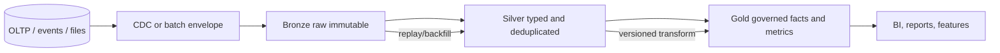
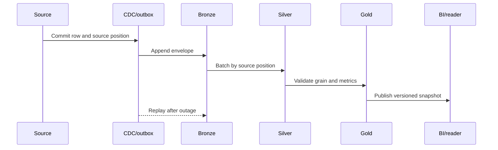
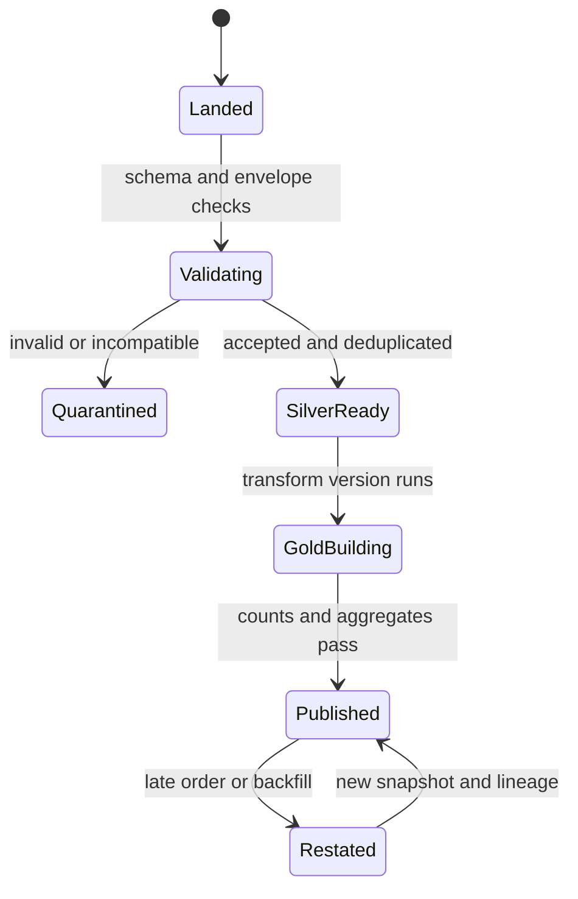

# Warehouses and Lakehouses: Governed Analytical Data

**Level:** L4–L5
**Status:** reviewed
**Audience:** Engineers designing analytics platforms and preparing for data-system interviews.
**Prerequisites:** SQL, object storage, batch/stream ingestion, CDC, and basic data modeling.
**Sequence:** Batch 2B, 2/8
**Terra gate:** approved

## Learning objectives

- Distinguish a warehouse, data lake, and lakehouse by storage, table format, compute, and governance capabilities.
- Trace CDC and batch records through Bronze, Silver, and Gold with replayable lineage.
- Calculate event volume, scan bytes, and retention using explicit decimal and binary units.
- Design late-order, duplicate, partial-load, and schema-change correction paths.
- Evaluate governance, freshness, and scan-cost failure modes with measurable evidence.

## What it is

A data warehouse is an analytical system with managed storage, schemas, compute,
catalogs, and query execution optimized for joins and aggregations. A data lake
is a storage-oriented collection of raw or lightly processed objects in systems
such as object storage; schema-on-read and file discovery are common boundaries.
A lakehouse adds table metadata, snapshots, transactions, schema evolution, and
query planning over lake storage. These labels overlap by provider, so the
capabilities and guarantees must be stated.

Storage is where bytes live: local disks, a warehouse-managed store, or object
storage. A table format is the metadata and commit protocol that turns files into
a table with partitions, snapshots, schema, and sometimes deletes. Parquet is a
columnar file format, not by itself a transaction log or a complete table
format. Delta Lake, Apache Iceberg, and Apache Hudi provide different table
format behaviors and version support.

The source of truth may be an OLTP database, an event log, or a source-owned
object. Analytical tables are derived unless the design explicitly declares
them authoritative. A warehouse can ingest CDC directly; a lakehouse often
stores raw CDC in Bronze before validating and publishing downstream tables.

## Why it matters

Analytical users need joins, historical questions, reproducible metrics, and
freshness that does not overload the operational database. A warehouse can make
governed queries easier, while a data lake preserves raw history and allows
multiple engines. A lakehouse tries to combine flexible storage with table-level
transactions and snapshots.

| System shape | Strength | Limitation | Best-fit question |
| --- | --- | --- | --- |
| Warehouse | Managed schema, SQL, governance, optimized joins | Compute/storage pricing and vendor coupling | Which governed metric should a BI user query? |
| Data lake | Cheap flexible storage and raw history | File sprawl, weak contracts, difficult discovery | Can we preserve source evidence for replay? |
| Lakehouse | Table snapshots and open-ish storage with governance | Catalog, compaction, and concurrency complexity | Can multiple engines share a consistent table? |
| OLTP source | Transactional correctness and current state | Poor fit for wide historical scans | What is the authoritative write? |

Freshness is not one number. Source commit time, CDC publication, Bronze arrival,
Silver completion, Gold publication, and dashboard cache visibility are separate
timestamps. A table can be current but wrong if duplicate events were counted;
it can be correct for its snapshot but stale relative to the source.

## Mental model

Model the pipeline as immutable evidence, validated records, and published
business views. Bronze keeps the source envelope and enough metadata to replay.
Silver applies types, keys, normalization, deduplication, and data-quality
rules. Gold defines a business grain and publishes facts, dimensions, and
aggregates for readers.



The arrows are promotion boundaries, not claims that every layer is instantly
available. Replay starts with durable Bronze evidence and a transform version;
Gold publication happens only after validation.

### Bronze

Bronze records should retain source system, source key, event ID, source version
or log position, ingestion timestamp, payload, schema version, and load batch.
It may retain malformed payloads for quarantine rather than dropping them. The
retention period must cover the longest expected outage, legal hold, and replay
window.

Bronze is not an excuse to expose raw PII broadly. Apply object access controls,
classification, encryption, retention, and audit. A raw table without ownership
and lineage becomes a data swamp even if its files are durable.

### Silver

Silver defines typed columns, null rules, units, source precedence, and a stable
grain. A deduplication key might be `(source_system, event_id)`; if a producer
reuses IDs, add source version and a deterministic conflict rule. A late record
may update a current entity or append a correction event depending on business
semantics.

### Gold

Gold tables should name their grain. `orders_fact` may have one row per order,
while `customer_daily_revenue` has one row per customer and UTC or named local
date. A metric definition includes filters, currency, timezone, correction
policy, and source version. A dashboard should not silently mix a finalized
Gold partition with an in-progress one.

### Storage and table format

Object storage provides durability and namespace, but a directory of Parquet
files does not automatically provide atomic commits, deletes, snapshot isolation,
or schema governance. A table format adds manifests/logs and commit semantics;
the deployed provider and version determine support for row-level deletes,
partition evolution, concurrent writers, and time travel.

| Layer | Typical data | Contract | Repair action |
| --- | --- | --- | --- |
| Bronze | Raw CDC/event envelope | Preserve evidence and source position | Replay bounded source range |
| Silver | Typed canonical records | Key, schema, quality, dedup rule | Rebuild affected partitions |
| Gold | Facts, dimensions, aggregates | Business grain and metric definition | Restate or append adjustment |

#### File and snapshot mechanics

The physical layout has several independently tunable levels. A table points to
files; a file contains row groups; a row group contains column chunks; and a
column chunk contains encoded pages. Writers choose a target file size and row
group size, while readers use column projection and statistics to avoid decoding
unneeded bytes. A predicate such as `order_date >= DATE '2026-08-01'` can prune a
partition, then min/max statistics can prune row groups inside a selected file.
Neither optimization is guaranteed: a function around the partition column,
missing statistics, or a skewed partition can force more reading.

Parquet dictionary encoding is useful when a column has repeated values such as
country or status. Run-length encoding compresses repeated sequences, while
delta or byte-stream encodings can suit ordered numbers and timestamps. Encoding
is a file-format choice, not a promise that every value compresses equally. A
wide payload column can dominate decoded CPU even when a query projects only a
few logical fields if the engine cannot apply a selective predicate early.

A table format records the schema, partition transforms, file references,
statistics, and commit history. A typical commit writes new immutable files,
builds a manifest or metadata entry, validates the expected current snapshot,
and atomically advances a table pointer. Concurrent writers that started from
the same snapshot must retry or be rejected according to the provider and
table-format version. Readers therefore see either the prior snapshot or the
new complete snapshot, not an unvalidated mixture of files. This is a logical
atomicity boundary; object-store durability and catalog availability remain
separate operational dependencies.

Deletes and updates may be represented by delete files, position deletes,
equality deletes, copy-on-write rewrites, or warehouse-native storage. These
choices affect read amplification, compaction frequency, and recovery time.
Before relying on time travel, row-level deletes, partition evolution, or
multi-table transactions, pin the engine, catalog, table-format, and connector
versions in the runbook. “Supports ACID” is too broad to be an acceptance test.

The CDC envelope should carry `source_system`, `source_key`, `event_id`,
operation, source log position, source commit timestamp, ingestion timestamp,
schema version, and payload. The log position orders changes within a source;
the event timestamp describes business time. Silver can then distinguish a
replayed old event from a genuinely late business event, and an operator can
resume from a checkpoint without guessing which files were complete.

Partitioning is a routing hint rather than a substitute for a data model. A
daily event-date partition may be appropriate for bounded reporting, but a
tenant with 80 percent of the events can create a hot partition. Avoid putting
high-cardinality identifiers directly in the partition path unless the engine
and file layout explicitly support it. Keep partition transforms stable during
an incremental migration, and record which transform produced every snapshot.

## Worked example

Assume an ecommerce source emits 1,000,000 events/day. Average serialized
payload is 1,500 bytes, and the Bronze envelope adds 300 bytes. Logical Bronze
volume is:

```text
1,000,000 × (1,500 + 300) = 1,800,000,000 bytes/day
                       = 1.8 GB decimal/day
90 days = 162 GB decimal before compression, replicas, and metadata
```

If compressed Parquet is measured at 0.42 of logical bytes, stored payload is
approximately 68.04 GB decimal. This is not the capacity plan: include table
format manifests, small-file overhead, snapshots, temporary compaction output,
replicas, and backup retention. A provider may quote GiB, GB, credits, or scan
bytes using different units.

Suppose CDC events arrive 15 minutes after source commit at p99 and the Gold
dashboard has a 30-minute freshness SLO. A pipeline budget could allocate 5
minutes to Bronze, 10 to Silver, and 5 to Gold publication, leaving 10 minutes
for scheduling and retry. These are design assumptions, not provider latency
claims. Measure the actual stage timestamps and alert on the oldest unprocessed
source position.

At 02:00 UTC, an order created on August 1 arrives on August 4. The Silver
record uses `order_id=71`, source version 9, and an event-time date of August 1.
Gold for August 1 has already been published. The correction process must:

1. retain the late order in Bronze with its original event time and arrival time;
2. upsert or append Silver under the source version rule;
3. identify the affected Gold partition and its metric definitions;
4. recompute or append an auditable adjustment for August 1;
5. validate counts, sums, and duplicate keys before publishing a new snapshot;
6. expose `gold_version=2` and correction time to downstream readers.

If the same event is delivered twice, the merge must be idempotent. If the
producer changes `amount` from integer cents to decimal dollars, do not silently
reinterpret old rows: add a schema version, explicit scale conversion, and
compatibility tests. If only half of a batch lands, readers should see the
previous committed snapshot rather than a partial table.

### Contracts, replay, and backfill

Treat each medallion boundary as a contract with an owner, grain, schema,
quality thresholds, freshness target, and replay procedure. Bronze promises
evidence and a source position; it does not promise clean business types.
Silver promises canonical types, stable keys, deduplication, units, and a
quarantine path. Gold promises a named business grain, metric definitions,
approved dimensions, and a publication snapshot. A contract also says what is
allowed to be null, which source wins a conflict, and whether a correction is an
upsert or an append-only adjustment.

For a replay, first select a source-position interval rather than a wall-clock
guess. Read the immutable Bronze envelopes, apply the same transform version,
and write a new Silver output location or snapshot. Compare input counts,
distinct event IDs, rejected rows, and key-level checksums with the previous
run. Only then rebuild affected Gold partitions. A replay job needs a durable
run ID, input interval, code version, output snapshot, and operator decision so
that a retry is observable and idempotent.

Backfill is broader than replay: it may use a corrected transformation against
already accepted records. Keep it isolated from the current incremental writer,
cap its source interval, and publish a canary partition before the full range.
If the backfill changes a metric definition, create a new Gold version or
adjustment table; silently replacing historical numbers destroys comparability.
Reconcile source totals, Silver totals, and Gold totals at the business grain
before switching readers to the new snapshot.

Late orders require both event time and arrival time. A normal lookback can
recompute recent partitions, while an older order enters an exception queue and
receives a targeted restatement. The runbook should name the maximum automatic
lookback, escalation owner, adjustment policy, and dashboard annotation. A
late order is not necessarily a duplicate: compare its source version and
business key before deciding whether to merge or correct.

Schema evolution should be tested at both file and contract boundaries. Adding
a nullable field can be compatible for readers, but changing units, renaming a
field, narrowing a type, or changing the meaning of a status is semantic
breakage even when the table format accepts the commit. Preserve old fields
during a dual-read migration, populate a versioned replacement, measure null
and conversion rates, then remove the old field only after consumer evidence.

| Change | File/table compatibility | Contract action | Safe rollout evidence |
| --- | --- | --- | --- |
| Add nullable column | Often readable by older readers | Document default and owner | Old and new readers agree on existing columns |
| Widen integer to decimal | Engine/version dependent | Define scale and rounding | Aggregate reconciliation on a sampled backfill |
| Rename column | May look like drop plus add | Alias or dual-publish | Consumer inventory has zero old-field reads |
| Change units or meaning | Technically writable but semantically unsafe | New version and migration note | Metric comparison signed by data owner |

### Quality and governance gates

Quality checks should make a publication decision, not merely produce a score.
Completeness checks required fields and expected source partitions. Validity
checks ranges, enum values, currency codes, and timestamp parsing. Uniqueness
checks the declared Silver key; referential checks dimension lookups and
unknown-member rates. Reconciliation compares source counts and monetary sums
with an explicitly documented tolerance. Freshness uses source commit and
ingestion timestamps separately from Gold visibility.

Governance metadata travels with the table: owner, steward, classification,
lineage, retention, legal hold, approved consumers, and deletion procedure.
Restrict Bronze payloads containing PII, mask derived Gold fields where needed,
and audit both grants and metric-definition changes. A failed classification
or expired retention exception should block publication or quarantine the
affected column, rather than being hidden in an operations dashboard.

## Advantages and limitations

| Choice | Read/compute advantage | Cost or limitation | Operational boundary |
| --- | --- | --- | --- |
| Managed warehouse | Integrated optimizer, SQL, access controls | Provider cost and proprietary features | Warehouse snapshot and query quotas |
| Raw data lake | Flexible storage and replay source | Weak transactions and file discovery | Object durability and catalog |
| Lakehouse table | ACID-like snapshots, schema, time travel | Commit logs, compaction, concurrency | Table-format version and catalog |
| Materialized Gold | Small predictable scans | Refresh lag and restatement work | Metric ownership and publication |

A lakehouse is not automatically cheaper or more open than a warehouse. Scan
cost includes bytes selected, compression, file count, metadata, compute, and
network. A warehouse result cache may change observed cost, while a cold object
scan may add retrieval and egress. Compare the same query and data snapshot.

### ETL and ELT

ETL transforms before loading the analytical store. ELT loads a controlled raw
representation, then transforms in governed compute. ETL can minimize sensitive
data before a destination, while ELT can speed iteration and preserve evidence.
Either path needs schemas, tests, ownership, lineage, and a rollback boundary.

| Decision | ETL before load | ELT after load |
| --- | --- | --- |
| Raw evidence | May be reduced | Bronze can preserve it |
| Iteration | Pipeline redeploy often required | SQL/model version can change |
| Privacy | Early minimization is possible | Requires raw-zone controls |
| Failure recovery | Re-run extractor/transformer | Replay Bronze into versioned models |
| Scan exposure | Destination receives selected fields | Raw scans need governance and budgets |

## Topic-specific visual



This visual shows source position and snapshot publication as separate controls.
An outbox or CDC stream reduces a source-to-lake dual-write gap, while a Gold
snapshot prevents partial visibility.



The state machine makes quarantine and restatement visible. A failed validation
does not overwrite the last published Gold version, and a backfill identifies
which transform version produced the replacement.

## Failure modes and operations

### Duplicate and partial loads

Track event IDs, source positions, input rows, output rows, and rejected rows.
Use an atomic manifest or table-format commit so a partial object set is not
presented as a complete partition. Deduplicate with a stable key and a declared
tie rule. A rerun should either produce the same snapshot or a versioned,
auditable correction.

### Late data and backfill

Choose a lookback window from observed lateness, but keep a manual backfill path
for older records. Use event time for business grouping and ingestion time for
freshness diagnostics. A backfill should run in an isolated output version,
compare affected aggregates, and publish atomically. Never assume a late order
belongs to its arrival date.

### Schema change

Classify additions, nullable changes, type widening, renames, and semantic unit
changes. Add a versioned field or compatibility reader for breaking changes.
Validate producer and consumer contracts in CI, quarantine incompatible rows,
and record a migration owner. Table format support for schema evolution is
provider/version-specific and does not define business compatibility.

### Governance and privacy

Catalog owners, classifications, lineage, grants, retention, and quality tests.
Restrict raw Bronze access, mask or tokenize PII, and audit Gold metric changes.
A table can be technically queryable yet unusable when nobody can explain its
grain or freshness. Governance should block publication for unclassified
sensitive fields or failed policy checks.

### Scan and file failures

Monitor file count, median file size, partition skew, row-group pruning, bytes
scanned, decoded bytes, and query stage time. Missing partition predicates,
small files, and unselective clustering cause scan regressions. Compaction
trades write CPU and temporary storage for fewer files; bound concurrency and
validate counts/checksums before replacing a snapshot.

### Recovery checklist

- Preserve source positions and transform versions for replay.
- Retain Bronze through outage, correction, and legal-hold windows.
- Publish only validated atomic snapshots; retain the previous version for rollback.
- Reconcile source counts, Silver keys, Gold grain, and business totals.
- Separate source freshness, table visibility, and metric correctness alerts.
- Test duplicate, partial, schema, governance, scan, and backfill failures.
- Document provider and table-format versions beside each operational setting.

### Incident runbook and capacity review

Use a timestamped incident record with source position, table snapshot, job run,
and transform version. At alert time, page the owner and freeze destructive
cleanup. During triage, determine whether the problem is source freshness,
Bronze arrival, Silver quality, Gold publication, or dashboard visibility. For
a partial load, stop the current writer and keep the last committed snapshot
serving. For bad data, quarantine the affected interval and preserve the input
objects before rerunning.

Containment should be reversible: pause promotion, route readers to the prior
Gold snapshot, and mark affected metrics as provisional. Recovery writes to an
isolated location, validates row counts, distinct keys, monetary sums, schema,
and policy checks, then commits one new snapshot. Validation should include a
small set of known orders and a comparison of unaffected partitions. Closeout
records the root cause, detection gap, data interval, customer impact, replay
run ID, and a prevention owner.

File sizing is an optimization with workload constraints. Suppose a Silver
table receives 2,400,000 rows/day and each compressed row averages 900 bytes.
The payload is `2,400,000 × 900 = 2,160,000,000 bytes`, or 2.16 GB decimal.
With a 256 MiB target (`256 × 2^20 = 268,435,456 bytes`), the rough target is
`2,160,000,000 / 268,435,456 = 8.05`, so plan for about nine files before
metadata and variance. If hourly writers create 24 tiny batches, compaction
should combine them without changing the logical snapshot. Measure actual
median and p95 file sizes; an average can hide a one-row tail file or a skewed
tenant.

An illustrative scan budget can be expressed as:

```text
scan_cost = selected_bytes / provider_billing_unit × published_rate
selected_bytes = files_after_partition_pruning × projected_column_bytes
```

For 18 selected files of 240 MiB each, selected bytes are `4,320 MiB`, or
`4,529,848,320 bytes` (about 4.53 GB decimal); keep both the binary input and
the decimal conversion in the report rather than hiding the unit. If a query only
needs two of eight columns, row-group pruning may reduce decoded work, but the
provider may bill compressed file bytes, logical bytes, or compute time. Record
the provider's billing unit and rate in the cost review; do not infer it from
wall-clock duration.

Partition skew can be tracked as `max_partition_rows / median_partition_rows`.
If the ratio is 12.0 and the largest partition saturates one writer, repartition
by a bounded transform or use clustering inside the date partition. Validate
that the new layout improves the target query without multiplying small files
for other workloads.

Interview trade-offs should name the invariant first. A warehouse may offer
stronger managed governance and a simpler SQL path, while a lake preserves raw
evidence and supports multiple engines. A lakehouse can add snapshots and
schema controls to object storage, but the team owns catalog, compaction,
connector, and concurrency details. ETL minimizes data before arrival; ELT
preserves more evidence but increases raw-zone governance obligations. The
right answer depends on retention, replay, engine diversity, compliance, and
operational skill—not on a universal cost or performance ranking.

## Practical exercises

### Exercise 1: Design a CDC replay

An outage leaves 6 hours of CDC unpublished while the source continues writing.
Design a replay that avoids duplicate Gold facts.

**Expected approach:** Record the source log position, land the missing events in
Bronze, deduplicate by event ID/version, rebuild affected Silver partitions in a
new snapshot, compare counts/checksums, and publish Gold only after validation.
The replay must be resumable and idempotent.

### Exercise 2: Correct a late order

An August 1 order arrives on August 4 after the daily revenue table was published.

**Solution:** Keep event and arrival timestamps, merge Silver by order/version,
recompute or append a dated Gold adjustment, validate the affected grain, publish
a new version, and expose correction lineage. Do not rewrite history invisibly.

### Exercise 3: Evolve a schema

A producer changes `amount` from integer cents to decimal dollars and one consumer
still expects cents.

**Expected approach:** Add schema version and a new typed field, define conversion
and rounding, dual-read or dual-write during migration, validate totals on a
sample, and remove the old field only after all consumers migrate.

### Exercise 4: Diagnose a scan regression

A 30-day report grows from 200 GB to 2 TB scanned after a partition change.

**Expected approach:** Compare query plan, partition predicate, file count,
partition skew, projection, row-group pruning, compression, and snapshot. Repair
the specific boundary, canary compaction or reclustering, and retain rollback.

## Interview Q&A

### Q1. Warehouse, lake, or lakehouse?

**Answer:** A warehouse emphasizes governed analytical tables and managed
compute; a lake emphasizes flexible objects; a lakehouse adds table metadata,
snapshots, transactions, and schema over lake storage. State required guarantees
instead of relying on the label.

**Follow-up:** What does Parquet provide that a table format does not?

### Q2. Why preserve Bronze?

**Answer:** Bronze preserves source evidence, source positions, and raw payloads
for replay, audit, and new transformations. It still needs access controls,
classification, retention, and PII handling.

**Follow-up:** When is raw retention intentionally shortened?

### Q3. How do you deduplicate CDC?

**Answer:** Use a stable event ID or source position and a deterministic source
version/tie rule. Make merges idempotent and measure rejected or conflicting IDs.

**Follow-up:** How do you detect a producer that reuses event IDs?

### Q4. How does a late order change Gold?

**Answer:** It triggers a bounded restatement or auditable adjustment for the
order's event-time partition. The correction must update lineage and freshness
without pretending the original snapshot contained it.

**Follow-up:** What if the late record is older than the normal lookback?

### Q5. ETL versus ELT?

**Answer:** ETL transforms before destination load and can minimize data early;
ELT loads controlled raw evidence then transforms in governed compute. Both need
quality contracts, ownership, and replay.

**Follow-up:** Where is sensitive data minimized in your design?

### Q6. How do you prevent partial visibility?

**Answer:** Write immutable files, validate them, and publish an atomic manifest
or table snapshot. Readers use the last committed version while a new version
builds.

**Follow-up:** How do you recover a failed commit?

### Q7. What creates a data swamp?

**Answer:** Unowned files, unclear schemas, missing lineage, weak quality tests,
uncontrolled PII, and no discoverable business grain. Durable storage alone does
not make data usable.

**Follow-up:** Which governance check blocks Gold publication?

### Q8. Why might a query scan too much?

**Answer:** It may miss partition pruning, read unused columns, encounter small
files or skew, or have overlapping row-group statistics. Inspect actual bytes and
the plan before adding compute.

**Follow-up:** Which unit is the provider billing: GB, GiB, or credits?

## Related and next reading

- [Columnar databases](04-columnar-databases.md)
- [Change-data capture](20-change-data-capture.md)
- [Migration strategies](26-migration-strategies.md)
