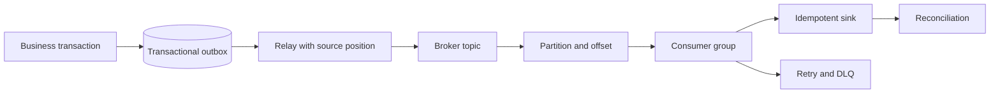
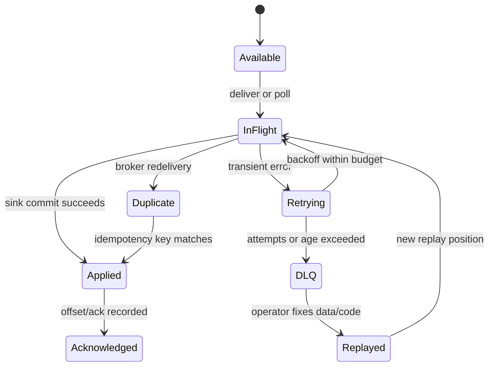
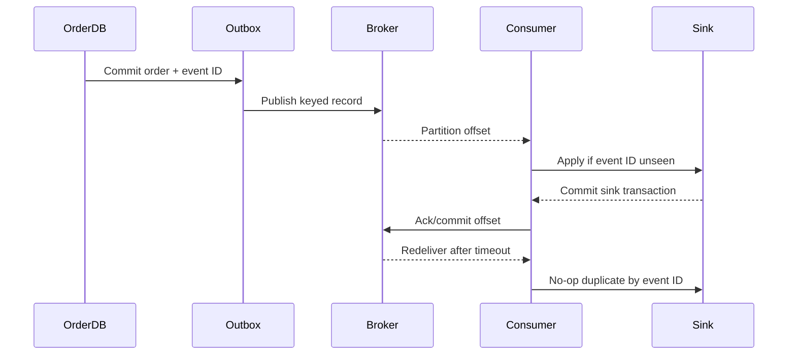
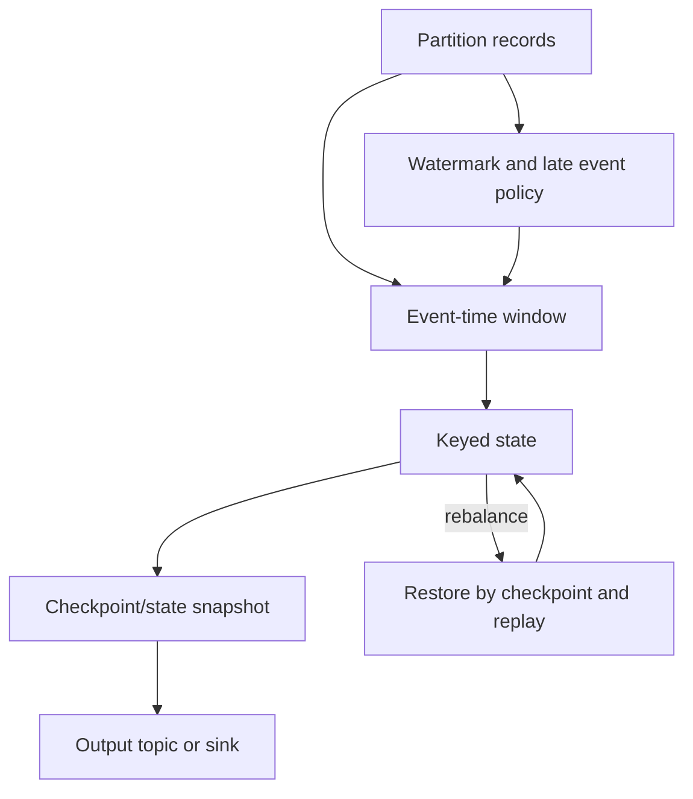

# Message Queues and Streams: Delivery, Replay, and Side Effects

**Level:** L4–L5
**Status:** reviewed
**Audience:** Engineers designing event-driven services and preparing for distributed-systems interviews.
**Prerequisites:** transactions, retries, partitioning, consumer concurrency, and basic CDC.
**Sequence:** Batch 2B, 7/8
**Terra gate:** approved

## Learning objectives

- Distinguish a work queue, pub/sub topic, durable log, event sourcing, and stream processing.
- Design an outbox-to-broker-to-consumer-group path with ordering and idempotent sinks.
- Explain at-least-once delivery, retry/DLQ boundaries, retention, replay, and rebalance behavior.
- Calculate a partition/consumer example with explicit event rates, payload units, and retention.
- Define reconciliation and side-effect controls without claiming offset management is end-to-end exactly-once.

## What it is

A message system moves records between producers and consumers, but similar
products expose different contracts. A **queue** assigns each work item to one
consumer in a competing-consumer group. **Pub/sub** fans a publication to
multiple subscriptions. A **durable log** retains ordered records for a policy
window so consumers track positions and replay. **Event sourcing** uses an
append-only event history as the authoritative state transition record. **Stream
processing** continuously computes joins, windows, aggregates, or alerts over
records; it is a processing model, not merely a broker feature.

RabbitMQ, Kafka, cloud queues, and managed streams differ in acknowledgment,
retention, ordering, partitioning, transactions, and version behavior. Name the
provider/version when making an operational claim.

## Why it matters

Asynchronous delivery absorbs bursts and decouples producer availability from
consumer service time. It also creates lag, duplicates, retry loops, poison
messages, schema evolution, and side-effect uncertainty. “The message was
processed” is ambiguous: received, persisted, applied to a database, charged a
card, or acknowledged to the broker are different boundaries.

| Abstraction | Consumer behavior | History | Ordering scope | Typical use |
| --- | --- | --- | --- | --- |
| Work queue | One competing consumer | Removed/hidden after ack | Queue or group policy | Send email, resize image |
| Pub/sub | Every subscription receives | Subscription policy | Topic/partition if present | Notifications, fan-out |
| Durable log | Consumers track offset | Retained by time/size | Partition | CDC, analytics, audit |
| Event sourcing | Events define state history | Business retention | Aggregate/stream key | Rebuildable domain state |
| Stream processing | Stateful continuous computation | Input retention + state | Key/window/partition | Joins, windows, alerts |

A durable log can implement pub/sub, but pub/sub semantics alone do not imply
replay. Event sourcing adds domain semantics and reconstruction rules; merely
storing queue messages does not make a system event-sourced.

## Mental model

Use an outbox transaction to record a business change and its event intent in the
same source transaction. A relay publishes the outbox record to a broker. The
broker assigns a partition position; a consumer group owns partitions and
advances an offset after its processing boundary. The sink applies an idempotent
operation, and a DLQ stores records that exceed a bounded retry policy.



The outbox closes the database-to-broker dual-write gap, but publishing can
duplicate after a relay crash. The sink therefore needs an event ID/version or
transactional deduplication. An offset commit records consumer progress; it does
not by itself atomically include an arbitrary external side effect.



The state machine makes duplicates a normal path. A DLQ is not deletion; it is
a retained operational queue whose replay and access policy must be explicit.

### Delivery and ordering

At-most-once acknowledges before processing and may lose records. At-least-once
acknowledges after the chosen processing boundary and may redeliver. Exactly-once
can describe a narrow broker transaction or stream state boundary, but offset
management alone does not make an external payment, email, or database update
end-to-end exactly-once.

Ordering normally applies only within a queue, partition, key, or aggregate.
Parallel partitions trade global order for throughput. If an order's events must
remain ordered, partition by order ID and prevent a consumer from applying a
later version before an earlier one, or design commutative/versioned updates.

### Ordering scope and consumer groups

Write the ordering invariant as a sentence before choosing a partition key:
“all transitions for one order are applied in source-version order.” That is a
per-order guarantee, not a global guarantee. A partition preserves append order
for its records, but a consumer that runs asynchronous handlers can still apply
them out of order unless it serializes a key or checks versions at the sink.
Cross-partition timestamps are useful for diagnosis, not proof of total order.

A consumer group normally assigns each partition to one active member at a
time. Adding members beyond the partition count does not add useful parallel
readers; adding partitions can change key placement and complicate ordering.
During a rebalance, ownership is revoked, assignments are exchanged, and work
may pause. A cooperative protocol can reduce disruption, but the provider and
client version determine the exact behavior. Handlers should stop polling or
finish a bounded unit on revoke, then commit only the positions whose sink
boundary is known.

A safe assignment record includes group ID, member ID, generation or epoch,
partition, start offset, end offset, and processing attempt. Fencing stale
members prevents an old process from committing after a new owner takes over.
If a long handler exceeds the broker's poll or visibility interval, it can be
redelivered even while the handler is still running; bound work or extend the
interval according to provider semantics. Rebalance duration belongs in the
capacity model and in the lag alert's explanation.

### Outbox relay and side-effect boundaries

The outbox row should have a stable event ID, aggregate key, event type, schema
version, payload, source transaction ID, created time, and publication status.
The relay claims rows with a lease or monotonic source position, publishes the
record, and records an attempt. The “published” marker is advisory unless the
broker and source share a transaction; a crash between those actions is why the
consumer must tolerate duplicate delivery.

Keep side effects in an explicit boundary. A database sink can insert an inbox
record and update domain state in one local transaction. An email, payment, or
remote HTTP call cannot generally share that transaction, so use the provider's
idempotency key, a durable intent/outcome table, reconciliation, and a
compensation policy. Acknowledging the message before an uncertain external
call risks loss; acknowledging after every call risks repeated calls unless the
remote operation is idempotent.

For a non-idempotent effect, separate “should happen” from “did happen.” Write
an effect intent keyed by event ID, let a worker claim it, store the provider
request key and confirmed outcome, and reconcile unknown outcomes before retry.
This narrows duplicate risk without pretending that an offset is a distributed
transaction across the broker and an external service.

## Worked example

Assume an order service commits 2,400 events/second at peak, average encoded
event size is 2 KiB (2,048 bytes), and the retention policy is seven days. Raw
broker payload volume is:

```text
2,400 events/s × 2,048 bytes × 86,400 s/day
= 424,673,280,000 bytes/day ≈ 424.7 GB decimal/day
7 days ≈ 2.973 TB decimal before replication, indexes, and overhead
```

If the broker has three replicas, payload storage alone is approximately 8.92 TB
before segment/index overhead. The provider's storage billing may use decimal
GB or binary GiB; record both. Compression changes physical size and CPU cost,
so measure representative events.

Choose 12 partitions, each receiving about 200 events/second. With six consumer
instances and one active consumer per assigned partition, each instance handles
two partitions or about 400 events/second. If average sink service time is 4 ms,
the offered work per instance is `400 × 0.004 = 1.6` concurrent operations under
a stable approximation. Reserve capacity for retries, rebalance, and skew; a
key distribution with one hot merchant can violate the average.

Trace an order:

1. The source transaction writes `order_id=71`, status `PAID`, event ID `e9`, and
   an outbox row in one local commit.
2. The relay publishes `e9` keyed by order 71 to partition 4 and records the
   source position. A crash after publish but before marking the outbox row
   sent causes a duplicate publish.
3. The payment consumer sees `e9`, inserts its event ID in a unique inbox table,
   applies the state transition, and commits both in one database transaction.
4. It acknowledges/commits the broker position after that sink transaction.
5. A timeout after step 3 can still cause redelivery; the unique inbox makes the
   second delivery a no-op. A payment-provider API needs its own idempotency key.

Now suppose a `SHIPPED` event is delivered before `PAID`. The consumer should
reject or park it based on aggregate version, not blindly retry forever. A
reconciliation job compares source order state, inbox IDs, sink state, and broker
positions and emits a repair task with an auditable reason.

### Retry, replay, and reconciliation design

Classify failures before retrying. A timeout, temporary database overload, or
leader election may be transient; an invalid enum, missing required field, or
incompatible schema is usually permanent until code or data changes. Apply
exponential backoff with jitter, a maximum attempt count, and an age limit.
Each attempt records event ID, error class, first-seen time, next retry time,
consumer version, and the partition position. This makes a retry storm visible
and stops one poison record from consuming all worker capacity.

A retry topic can preserve the original partition key, but delayed retries may
interleave with newer events. If ordering is mandatory, park the blocked key or
use a per-key sequence buffer rather than sending the later event through a
parallel retry lane. If ordering is not mandatory, state that choice and make
the sink commutative or version-aware. DLQ records should include the original
headers and a redacted error context, with access and retention controls.

Replay has a different operator intent from retry. Retry asks a live consumer to
finish a failed delivery; replay reads a bounded historical range or DLQ after
the code/data contract is repaired. Use a new consumer group or explicit replay
cursor, tag every replay run, and route output to a canary sink first. For
financial, inventory, or notification effects, replay a derived state or
compensating record unless the effect intent table proves it is safe.

Reconciliation is an independent comparison, not a count of successful acks.
Compare source event IDs and versions with broker records, inbox rows, sink
state, and business totals. Produce a discrepancy set with owner, reason,
source position, and repair status. A successful reconciliation can close a
replay only when the expected range, duplicate policy, rejected records, and
external side-effect outcomes are all accounted for.

| Operation | Cursor or input | Safe output | Completion evidence |
| --- | --- | --- | --- |
| Live retry | Failed delivery | Same sink, bounded attempt | Sink receipt or classified failure |
| DLQ replay | DLQ record IDs | Tagged replay group/canary | Every record accounted for |
| Historical replay | Offset/time interval | Derived rebuild or idempotent sink | Range checksum and reconciliation |
| Repair | Discrepancy set | Compensating event or correction | Business owner approval and audit |

## Advantages and limitations

| Choice | Strength | Limitation | Correctness boundary |
| --- | --- | --- | --- |
| Work queue | Simple competing work and ack | History may disappear | Ack/retry/DLQ |
| Durable log | Replay, multiple consumers, ordered partitions | Consumers manage lag and retention | Offset plus sink commit |
| Outbox | Avoids source/broker dual-write gap | Relay duplicates and backlog | Source transaction + publish |
| Direct publish in request | Lower component count | Lost event after source commit | No atomic dual write |
| Stream processor | Stateful windows and continuous output | State/rebalance/version complexity | Checkpoint/state/sink contract |

### Delivery choices

| Guarantee | Failure after sink before ack | Failure before sink | Design response |
| --- | --- | --- | --- |
| At-most-once | No duplicate, possible loss | Message may be gone | Only for disposable work |
| At-least-once | Redelivery expected | Retry/replay | Idempotent sink and DLQ |
| Broker transaction | Narrow atomic broker boundary | External sink still separate | State scope explicitly documented |
| Effectively-once business result | Dedup/version/outbox/reconcile | Repair path | Prove invariant per side effect |

Do not advertise provider throughput, latency, or “exactly once” as universal.
Partitions, payload size, compression, replication factor, acks, storage, and
consumer service time determine behavior. Provider/version docs define which
transactions, compaction, ordering, and retention settings are available.

## Topic-specific visual



This sequence labels the side-effect boundary. The redelivery is safe only when
the sink's deduplication and business operation share a transaction or an
equivalent durable idempotency record.



The stream-processing visual distinguishes event time from processing time.
Watermarks bound lateness but can close a window before a very late event; the
late-data policy must say whether to correct, side-output, or ignore it.

## Failure modes and operations

### Duplicate and retry storms

Store event ID plus source version in the sink, use an atomic uniqueness check,
and make external calls carry the same idempotency key where supported. Backoff
with jitter, cap attempts and age, and route poison records to a DLQ. Monitor
consumer lag, retry rate, oldest message age, DLQ growth, and sink conflicts.

### Ordering and hot partitions

Measure per-partition rate, lag, key frequency, and out-of-order versions.
Partition by the entity whose order matters, but guard against a hot key. A
global ordering requirement limits parallelism; state the cost instead of hiding
it behind more consumers.

### Replay and reconciliation

Use a new consumer group or explicit replay range, isolate replay side effects,
and preserve event IDs. For non-idempotent effects, rebuild a derived table or
write a compensating record instead of charging/sending again. Reconcile source
counts, broker offsets, sink versions, and business totals after replay.

### Retention and schema

Retention is a replay budget. If the source outbox is retained for 14 days but
the broker for 7, a consumer outage lasting 10 days needs a source replay or
backup. Evolve schemas with compatibility rules, versioned events, defaults, and
consumer rollout order. A schema registry does not validate business semantics.

### Rebalance and partial failure

A rebalance can pause consumption and duplicate records around ownership change.
Make handlers cancel-safe, commit only after the selected sink boundary, and
measure rebalance duration. A partial batch failure must identify successful and
failed records; retrying an entire batch requires idempotency.

### Schema evolution and retention contracts

Treat a topic schema as a consumer contract with an owner, compatibility mode,
retention period, partition-key rule, privacy classification, and deprecation
date. Backward-compatible additions are not automatically safe if a consumer
deserializes an exact record shape or if a new enum value breaks a switch. A
schema registry can check encoded shape, but it cannot determine whether a
currency changed from cents to dollars or whether an event still means the
same business transition.

Use staged rollout for a breaking semantic change: publish a versioned event,
teach consumers to read both versions, compare derived outcomes, migrate the
producer, and retain the old version until the longest replay and recovery
window has passed. Keep compatibility tests for old payloads, unknown fields,
default behavior, and nullability. Record the schema version in the outbox,
broker headers, DLQ, and sink audit row so a replay can select the right parser.

Retention is bounded recoverability. Define the minimum history needed for
consumer outage recovery, audit, backfill, and legal requirements, then compare
that with actual broker, outbox, DLQ, and backup retention. A seven-day broker
with a fourteen-day recovery objective is a design gap, not an alert threshold.
Compaction may retain only the latest value per key and therefore cannot replace
an immutable event history when every transition is required. Verify provider
and version behavior for delete markers, compaction, tiered storage, and replay
ordering before making retention a compliance claim.

### Operational checklist

- Track publish rate, partition skew, consumer lag, oldest age, retry/DLQ counts, and replay ranges.
- Define retention in days and bytes, replication/ack policy, and schema compatibility per topic.
- Test relay crash after publish, consumer crash after sink commit, poison data, rebalance, and broker failover.
- Keep offsets, event IDs, source versions, and sink receipts for reconciliation.
- Separate disposable notification retries from financial or inventory side effects.
- Confirm provider/version behavior for transactions, compaction, ordering, acks, and retention.

### Throughput, observability, and incident runbook

Use a capacity equation that names its units. If `R` is events/second, `S` is
average encoded bytes/event, and `D` is retention days, raw payload bytes are
`R × S × 86,400 × D`. Multiply by the replication factor for a first storage
estimate, then add compression, indexes, segment headers, and safety headroom.
For processing, if one consumer handles `c` events/second at the selected sink
SLO, a starting partition count is `ceil(peak_rate / c)` plus headroom for hot
keys and maintenance. Validate the estimate with a representative payload and
failure workload; average event size hides large records and retries.

For example, 3,200 events/second at 1,024 bytes for 5 days is
`3,200 × 1,024 × 432,000 = 1,415,577,600,000 bytes`, or about 1.416 TB
decimal, before replication and overhead. If a consumer's measured safe rate is
160 events/second, `ceil(3,200 / 160) = 20` active partitions is the arithmetic
minimum; choose more only when key distribution, broker limits, and future
scaling justify the operational cost.

Dashboards should show producer rate, publish errors, outbox age, per-partition
rate, consumer lag and oldest age, rebalance count/duration, retry attempts,
DLQ age, sink conflict rate, replay progress, and reconciliation discrepancies.
Alert on the condition that matters: oldest age against the recovery SLO may be
more meaningful than a raw offset difference. Separate source freshness, broker
visibility, consumer processing, sink commit, and external side-effect outcome.

Incident response starts by freezing automatic destructive cleanup and recording
the affected topic, consumer group, provider/version, time interval, and last
known good offset. Triage whether the source, relay, broker, assignment, sink,
or external dependency is failing. Contain by pausing promotion, reducing retry
concurrency, parking poison keys, or routing readers to a known-good derived
snapshot. Preserve records and headers before changing retention or schemas.

Recover with a canary partition or replay group, then compare counts, offsets,
event versions, sink receipts, and business totals. For an uncertain payment or
email, query the provider outcome by idempotency key before retrying. Close the
incident with the discrepancy set, customer impact, replay run ID, retention
decision, detection gap, and a named prevention task. A broker failover test is
incomplete if it checks only producer acknowledgment and not the sink outcome.

### Interview trade-offs

An interview answer should first identify the authoritative state and the
required failure invariant. A queue is attractive for one-owner work and
bounded retries; a durable log is attractive when multiple consumers need
independent replay. Pub/sub is the natural fan-out abstraction, but each
subscription still needs its own lag and retention budget. Event sourcing is a
domain choice that makes events authoritative; it adds versioning, migration,
reconstruction, and correction responsibilities. Stream processing adds
stateful time/window semantics and checkpoint recovery, not a magical delivery
guarantee.

More partitions can increase parallelism but make global ordering impossible and
increase metadata and rebalance work. A longer retention period improves replay
and audit but consumes storage and can preserve sensitive data longer. An
outbox adds write and relay operations yet gives a clear source transaction
boundary. Exactly-once broker features may simplify a narrow pipeline, while an
idempotent sink and reconciliation are still needed at an external boundary.
State which invariant is protected, what is sacrificed, and how it will be
measured instead of choosing a product by a universal throughput claim.

## Practical exercises

### Exercise 1: Choose the abstraction

Select queue, pub/sub, durable log, event sourcing, or stream processing for
order fulfillment, audit history, email fan-out, and hourly fraud windows.

**Expected approach:** Explain consumer multiplicity, replay need, authoritative
state, ordering scope, retention, and side effects for each; do not use “stream”
as a synonym for every asynchronous system.

### Exercise 2: Design an outbox flow

Trace a database commit, relay crash after publish, consumer crash after sink
commit, and eventual retry.

**Solution:** Use an outbox row in the source transaction, stable event ID,
partition key, idempotent sink/inbox transaction, ack after sink commit, and
reconciliation for uncertain external effects.

### Exercise 3: Calculate retention and partitions

For 5,000 events/second at 1,500 bytes and 3-day retention, calculate decimal
payload volume and choose a partition count for a 500-event/second target.

**Expected approach:** Compute `5,000 × 1,500 × 86,400 × 3 = 1.944 TB decimal`.
At 500 events/second need at least 10 partitions; add headroom for skew and
replication, then state whether the target is a planning assumption.

### Exercise 4: Reconcile an ordering defect

`SHIPPED v8` was applied before `PAID v7`. Define a repair without duplicating a
payment.

**Expected approach:** Compare aggregate versions, quarantine or compensate the
invalid transition, use payment idempotency records, replay the ordered range,
and reconcile source/sink state before releasing the aggregate.

## Interview Q&A

### Q1. Queue versus durable log?

**Answer:** A queue distributes work among competing consumers; a durable log
retains ordered records for consumers that manage offsets and replay. A product
can offer both behaviors through different APIs.

**Follow-up:** What retention and replay requirement changes your choice?

### Q2. What does at-least-once imply?

**Answer:** A record may be delivered more than once because a consumer can fail
after applying work but before acknowledgment. The sink needs idempotency,
deduplication, version checks, or compensation.

**Follow-up:** Where is the side-effect boundary in your design?

### Q3. Does committing an offset give end-to-end exactly-once?

**Answer:** No. It records broker progress; an external database, email provider,
or payment API can fail independently. Narrow transactional scopes and business
idempotency are required.

**Follow-up:** How do you handle a timeout after an external charge?

### Q4. How do you preserve ordering?

**Answer:** Define the entity whose events must be ordered, key it to one
partition or serialized lane, and apply versions at the sink. Global ordering
reduces parallelism and must be justified.

**Follow-up:** What if one key is hot?

### Q5. Why use an outbox?

**Answer:** It commits business state and event intent atomically in the source,
then a relay publishes asynchronously. The relay can duplicate after a crash, so
the event ID and sink remain idempotent.

**Follow-up:** How is an outbox backlog drained safely?

### Q6. When is a DLQ useful?

**Answer:** It isolates records that exceed a bounded retry policy or violate a
schema/validation contract. It needs ownership, alerting, retention, redaction,
and a tested replay path.

**Follow-up:** Which records must never be replayed automatically?

### Q7. How do replays affect side effects?

**Answer:** A replay may repeat writes or external calls. Use a new consumer
group, idempotency records, derived-table rebuilds, or compensating events, and
reconcile business totals afterward.

**Follow-up:** What evidence proves a replay is complete?

### Q8. What causes consumer lag?

**Answer:** Producer rate exceeds sink capacity, a hot partition, downstream
failure, retry/backoff, rebalance, or insufficient consumers/partitions. Inspect
per-partition lag and oldest age, not only an aggregate offset.

**Follow-up:** Which change can increase capacity without changing ordering?

### Q9. How do you evolve event schemas?

**Answer:** Use versioned contracts, compatibility checks, defaults, and staged
producer/consumer rollout. A registry catches shape incompatibility, not all
semantic changes.

**Follow-up:** How long must the old field remain readable?

## Related and next reading

- [Change-data capture](20-change-data-capture.md)
- [Stream processing](30-stream-processing.md)
- [Distributed transactions](12-distributed-transactions.md)
