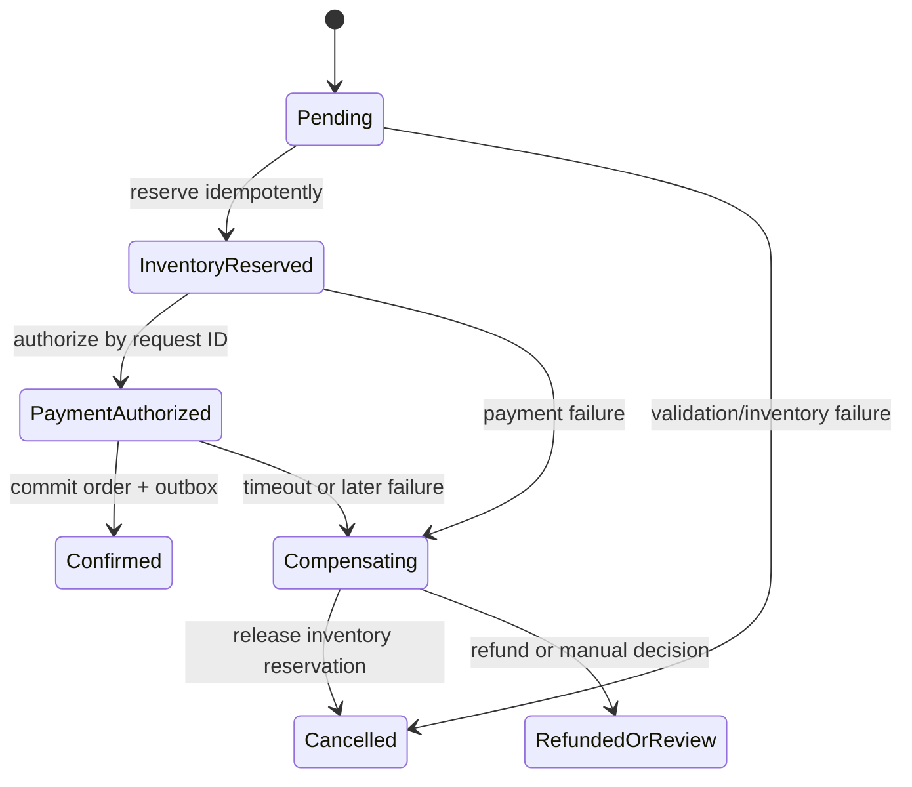

# Distributed Transactions: 2PC, Sagas, and Invariants

**Level:** L4–L5
**Status:** Reviewed (Terra PASS)
**Audience:** Engineers designing multi-service workflows or preparing for an L4–L5 distributed-systems interview
**Prerequisites:** local ACID transactions, message delivery, retries, and idempotency
**Sequence:** Batch 1, 5/8
**Terra gate:** approved

## Learning objectives

- Identify a cross-service invariant and classify each participant's boundary.
- Compare 2PC with orchestrated and choreographed Sagas.
- Design durable state transitions, idempotency keys, and compensations.
- Explain recovery after a crash, timeout, duplicate, or lost response.

## What it is

A distributed transaction coordinates state changes owned by more than one
resource manager or service. “Atomic” can mean all participants commit one
decision (two-phase commit), or that a business workflow reaches a valid outcome
through local commits and compensations (Saga). A message broker, database, and
payment provider rarely share one ACID transaction boundary by default.

## Why it exists and why it matters

An order may need an inventory reservation, payment authorization, and shipment
request. Independent local commits can temporarily disagree; a global lock can
block during network failure. The design must choose which invariants are strict,
which are eventually repaired, how users observe intermediate states, and how a
recovery worker proves progress.

## Mental model: decision versus workflow

```mermaid
sequenceDiagram
    participant O as Order service
    participant C as Coordinator
    participant P as Payment
    participant I as Inventory
    participant Outbox as Durable outbox
    O->>C: Start order workflow
    C->>I: Reserve stock command
    I-->>C: Stock reserved
    C->>P: Authorize $120 payment command
    alt Payment authorized
        P-->>C: Payment authorized
        C->>Outbox: Commit Confirmed state + event locally
        Outbox-->>O: OrderConfirmed
    else Payment fails
        P-->>C: Payment failed
        C->>I: Release inventory reservation
        I-->>C: Reservation released
        C->>Outbox: Commit Cancelled state + event locally
        Outbox-->>O: OrderCancelled
    end
    Note over C,I: Retry with the same request IDs; compensate after a definitive payment failure
```

The durable outbox prevents “database commit succeeded but event publish was
lost.” A Saga coordinator records state so a restart can resume or compensate;
it must not infer progress only from in-memory callbacks.

## Topic-specific visual



The workflow state is durable and forward-only after a terminal decision;
compensation is a new state transition, not an invisible database rollback.

## Two-phase commit (2PC)

The coordinator sends `PREPARE`; each participant validates and durably records
its vote while holding resources. If all vote yes, the coordinator sends
`COMMIT`; otherwise it sends `ABORT`. A participant that voted yes may be unable
to decide after losing the coordinator, so prepared transactions can block and
consume locks/storage. Timeouts must not blindly abort a transaction if another
participant could commit; recovery uses durable coordinator logs or a supported
termination protocol.

```text
Coordinator: PREPARE -> A, B
A: YES (durable prepared state)
B: YES (durable prepared state)
Coordinator: COMMIT -> A, B
A/B: apply commit, release resources
```

2PC provides a single commit decision when all resource managers support the
protocol. It does not make arbitrary external side effects transactional, and it
does not remove network partitions or coordinator recovery work.

## Saga design

A Saga is a sequence of local transactions. Each forward action has a defined
compensation where one exists:

```text
Create order -> reserve inventory -> authorize payment -> create shipment
       |             |                    |                    |
Cancel order <- release inventory <- void/refund payment <- cancel shipment
```

Compensation is a new business action, not a database rollback. A payment refund
may take time; a shipment already handed to a carrier may require a return, not
an undo. Prefer orchestration when a central state machine makes order,
timeouts, and recovery visible. Choreography can reduce coordinator coupling but
can create implicit cycles and difficult debugging.

## Worked example: checkout with a $120 order

Assume 100 checkout requests/s at peak, an inventory service, a payment provider,
and a 30-second user-facing deadline. The invariant is “never confirm an order
without an inventory reservation and a successful payment authorization.” A
temporary state such as `PAYMENT_PENDING` is allowed; an unbounded pending order
is not.

1. The order service transaction writes `PENDING` and an outbox command with a
   unique `order_id`.
2. Inventory conditionally reserves the requested quantity with a lease and an
   idempotency key. A duplicate command returns the existing reservation, and
   the workflow moves to `INVENTORY_RESERVED`.
3. Payment authorizes the $120 exactly once using the provider idempotency key.
4. On authorization, the coordinator writes `CONFIRMED` only after both
   acknowledgements.
5. On a definitive payment failure, the coordinator records `COMPENSATING`,
   releases the inventory lease, and records `CANCELLED` only after the release
   acknowledgement. If release fails, retry from a durable task and alert on
   lease age; do not mark the order cancelled while the reservation is unknown.

The exact timeout, retry count, and throughput must come from provider SLOs and
load tests. A retry after the 30-second UI deadline may still complete safely;
the API should expose status rather than charging twice.

## Advantages and limitations

| Pattern | Advantages | Limitations / trade-offs |
| --- | --- | --- |
| 2PC | One coordinated commit decision and strong cross-participant atomicity | Blocking prepared state, coordinator recovery, latency, and limited participation |
| Orchestrated Saga | Explicit state, retries, timeouts, and compensations | Eventual consistency and a coordinator to operate |
| Choreographed Saga | Loose coupling and local ownership | Hidden workflow, event cycles, difficult global visibility |
| Outbox + local transaction | Makes state/event publication recoverable | Consumers still need idempotency; relay lag and duplicates remain |
| Reservation/lease model | Turns scarce resources into explicit, expiring state | Lease expiry races, reconciliation, and user-visible pending states |

## Correctness design before protocol choice

Write the business invariant in a form that can be checked. Examples include:

- an order is confirmed only if one valid inventory reservation and one payment
  authorization exist;
- a ledger never creates or destroys money across a transfer; and
- a shipment is not created twice for one order.

Then classify each participant: transactional database, message broker, or
external API. Ask which effects can be made idempotent, which can be compensated,
and which require an operator or legal process. Protocol choice follows this
analysis; “use 2PC for consistency” is not enough.

### State machine and durable history

```text
PENDING
  -> INVENTORY_RESERVED -> PAYMENT_AUTHORIZED -> CONFIRMED
  -> INVENTORY_FAILED -> CANCELLED
INVENTORY_RESERVED -> COMPENSATING -> CANCELLED (release inventory reservation)
PAYMENT_AUTHORIZED -> COMPENSATING -> REFUNDED_OR_MANUAL_REVIEW
```

Persist workflow ID, step ID, attempt, participant request ID, response/status,
deadline, and state-transition timestamp. Define legal transitions and reject a
late event that would move a terminal state backward. Store enough history to
answer “did this provider charge?” without relying on logs that may have expired.

### Retry matrix

| Result | Safe action | Reason |
| --- | --- | --- |
| Explicit validation failure | Mark failed or compensate | Repeating will not change the input |
| Timeout with unknown result | Query by idempotency key | A remote side may have committed |
| Transient transport failure before request | Retry same key | No confirmed effect, same identity |
| Duplicate command | Return recorded result | Prevent double side effect |
| Compensation failure | Durable retry/manual queue | Business state is not yet repaired |

The matrix belongs in the runbook and tests. A client-facing timeout only says
the caller stopped waiting; it does not say the transaction rolled back.

## 2PC recovery and limits

Participants must durably record a prepared vote before responding yes. The
coordinator must durably record the decision before sending it. On recovery,
participants consult the coordinator log or a supported termination protocol.
Prepared-state age, lock wait, in-doubt count, and coordinator availability are
operational metrics. A timeout should trigger recovery logic, not an arbitrary
local commit/abort that can split the decision.

2PC is a protocol among compatible resource managers. A payment provider or
email service cannot participate merely because the application has a client
library. Put those effects behind idempotency and reconciliation or use a Saga.

## Saga orchestration versus choreography

An orchestrator centralizes the state machine, timeout policy, and compensations;
it can become a bottleneck or ownership boundary. Choreography lets services
react to events, but event chains can form cycles, hide progress, and make global
timeouts difficult. Whichever style is chosen, include correlation IDs, durable
state, versioned events, dead-letter handling, and a replay strategy.

## Reconciliation and user experience

Build a periodic reconciler that compares participant status to workflow state.
It should be rate-limited, idempotent, and safe to run concurrently with normal
processing. Show `pending`, `confirmed`, `cancelled`, or `manual_review` rather
than claiming failure after a client timeout. Operators need a read-only status
view and narrowly scoped repair commands with audit records.

## A protocol-selection walkthrough

For each participant, fill in this table before proposing 2PC or a Saga:

| Participant | Local commit | Idempotency key | Compensation | Unknown result query |
| --- | --- | --- | --- | --- |
| Inventory | reservation lease | order + SKU | release lease | reservation status |
| Payment | provider authorization | payment request ID | void/refund | provider lookup |
| Shipping | shipment request | order ID | cancel/return | shipment status |
| Order DB | state + outbox | order ID/version | state transition | local row |

If a participant has no status API, no idempotency key, and no compensation,
the workflow cannot promise automatic recovery for that effect. Escalate it to
manual review or put it behind a durable adapter that adds those properties.

## Invariant-based testing

Inject a crash after every state transition and between every remote request and
response. Deliver each command zero, one, and many times; reorder independent
events; delay a compensation; and restart the coordinator with an in-flight
workflow. Assert that no order is confirmed without both prerequisites, that a
payment is not charged twice, and that every unresolved case is visible to a
reconciler. These tests are stronger than checking only the happy-path sequence.

## Capacity and backpressure

Pending workflows consume database rows, timers, queues, provider quotas, and
operator attention. Track pending count/age by step, retry rate, compensation
rate, provider latency, outbox depth, and reconciliation discrepancy. Bound
parallel reservations and payment calls; otherwise a retry storm can overload a
healthy participant and turn a local outage into a global one.

## Failure modes and operations

- **Coordinator crash:** recover from a durable state log; distinguish unknown,
  prepared, committed, compensated, and terminal states.
- **Duplicate delivery:** use command/event IDs, idempotency records, and unique
  constraints. “Exactly once” is not a safe assumption across a network.
- **Lost response:** query participant status using the idempotency key before
  retrying a charge or reservation.
- **Compensation failure:** enqueue a durable retry, expose an operator-visible
  state, and never mark the business workflow complete prematurely.
- **Poison message:** quarantine after bounded attempts with a replay procedure;
  retain the original payload and schema version.
- **Clock/deadline errors:** use server-side time and lease conditions; a client
  timeout is not proof that the operation did not commit.
- **Observability:** trace workflow ID, step ID, idempotency key, state transition,
  age of pending work, compensation rate, and reconciliation discrepancies.

## Practical exercises

1. Implement an order Saga. **Expected approach:** durable step state, idempotent
   commands, inventory lease, payment provider key, reverse-order compensation,
   and restart recovery tests.
2. A process crashes after payment authorization but before order confirmation.
   **Solution:** query payment by idempotency key, reconcile inventory/order,
   then confirm or refund according to a recorded policy; do not issue a second
   authorization blindly.
3. Compare a 2PC design with a Saga for money transfer. **Expected approach:**
   identify whether both accounts share a resource manager, define the no-money-
   lost invariant, and explain reconciliation, pending state, and regulatory
   audit requirements before choosing.
4. Design an outbox relay. **Expected approach:** commit row and outbox together,
   claim rows safely, publish at least once, mark sent, and make consumers
   idempotent; include crash points between each operation.

## Interview Q&A

### Q1. What problem does 2PC solve?

**Answer:** It coordinates a commit/abort decision across participating resource
managers that support the protocol. **Follow-up:** ask what happens when the
coordinator dies after participants vote yes.

### Q2. Why is 2PC blocking?

**Answer:** A prepared participant may hold resources while it waits for the
coordinator's durable decision. **Follow-up:** discuss recovery logs, timeouts,
and why a timeout is not automatically a safe abort.

### Q3. Is a Saga eventually consistent?

**Answer:** Usually: local commits make intermediate states visible until the
workflow completes or compensates. **Follow-up:** define user-visible states and
which invariant must hold at every step.

### Q4. Is a compensation a rollback?

**Answer:** No. It is a new business operation whose success and semantics may
not perfectly undo the original action. **Follow-up:** compensate a shipped
package or a captured payment.

### Q5. How do you prevent a double charge?

**Answer:** Use a stable provider idempotency key, persist the command/status,
and query operation status after lost responses. **Follow-up:** cover retention
of the key and provider timeout behavior.

### Q6. Orchestration or choreography?

**Answer:** Orchestration improves visibility and centralized recovery; choreography
reduces a central dependency but hides the workflow and can form event cycles.
**Follow-up:** choose using team ownership, number of steps, and audit needs.

### Q7. What is the outbox pattern for?

**Answer:** It atomically records a state change and the intent to publish, then
relays it asynchronously. **Follow-up:** identify duplicate publication and the
consumer idempotency contract.

### Q8. How do you recover an unknown step result?

**Answer:** Query the participant by idempotency key or reconcile from its durable
ledger, then continue or compensate based on a recorded policy. **Follow-up:**
ask what evidence is retained for an operator and audit.

## Appendix: crash-point catalogue

Test these boundaries explicitly:

| Crash point | Required recovery behavior |
| --- | --- |
| Before local commit | Nothing visible; safe retry |
| After local commit, before outbox publish | Relay publishes from durable outbox |
| After remote request, before response | Query status using same key |
| After remote success, before local state | Reconcile then advance, never duplicate effect |
| During compensation | Durable retry or manual review; remain non-terminal |
| After terminal state, duplicate event | No state regression or duplicate side effect |

Use a fake participant that can return success, failure, timeout, and “committed
but response lost.” Assert the invariant after every injected crash. This is the
minimum evidence for an interview-level claim that a Saga is resilient.

## Review questions for protocol selection

Ask whether a participant can durably prepare, whether it shares a transaction
manager, what locks a prepare holds, and how recovery learns the final decision.
For a Saga, ask which compensation is semantically valid, how a user sees
pending state, and how reconciliation proves no money or inventory is stranded.
Record answers in the design; do not hide an external side effect behind the
word “transaction.”

## Related and next reading

- [Advanced SQL transaction boundaries](01-sql-advanced.md)
- [Database replication and recovery](15-database-replication.md)
- [Change data capture and outbox delivery](20-change-data-capture.md)
- [Eventual consistency patterns](21-eventual-consistency.md)
