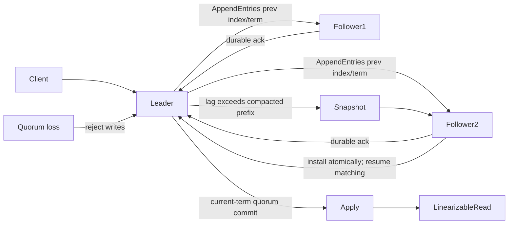

# Consensus Algorithms: Raft, Paxos, and Byzantine Fault Tolerance

**Level:** L5
**Status:** draft
**Audience:** Engineers designing replicated databases or preparing for an L5 distributed-systems interview
**Prerequisites:** replication, RPC timeouts, state machines, durable storage, and basic probability
**Sequence:** Batch 2C, 1/3
**Terra gate:** open

Consensus is a protocol for making a replicated group behave like one ordered
state machine even when messages are delayed and some members fail. This guide
uses “server” for a voting member and “client” for the application using the
state machine. Concrete timeout and throughput figures are illustrative; a
production design must measure its network, disk, and implementation version.
The maintained lab is a small quorum exercise, not a Raft implementation.

## Learning objectives

- Calculate crash and Byzantine quorum sizes for a stated cluster size and fault budget.
- Trace a Raft term from election through log matching, commit, linearizable read, and failover.
- Explain why safety and liveness are different claims, and identify the assumptions each protocol needs.
- Compare Raft, Paxos, and BFT for a database with explicit latency, membership, and trust constraints.
- Diagnose quorum loss, stale leaders, uncommitted current-term entries, and unsafe recovery decisions.

## What it is

Consensus has three related jobs: choose an authority for the next operation,
agree on an order, and make that order durable enough that a later authority
cannot contradict it. A replicated state machine applies the same deterministic
commands in the same sequence on every honest member. A database may use that
state machine for metadata, a write-ahead log, a lock service, or a shard's
primary history.

The word “consensus” does not mean every node is always available or that every
read is globally fresh. It means that decisions which the protocol declares
committed obey a single-history property. A client can still time out after a
commit, a follower can be behind, and a cluster can stop accepting writes when
it cannot form a safe quorum.

### The three properties

**Safety** says that two correct observers never decide incompatible values for
the same position. In a log, two committed entries at index 42 cannot differ.
Safety must hold during partitions, retries, delayed packets, and process
restarts. A protocol that returns “unavailable” is safe if it never invents a
decision.

**Liveness** says that a decision eventually happens under stated timing and
failure assumptions. Typical assumptions are eventual message delivery, a
reachable quorum, bounded-enough disk latency, and a leader-election timeout
that is longer than normal heartbeat delay. Liveness is intentionally lost when
the group cannot distinguish a safe quorum from a dangerous split brain.

**Durability** is an implementation obligation behind both properties. A vote,
term, log entry, commit marker, membership change, and snapshot metadata must be
persisted at the protocol's required boundary before an acknowledgement. “It
was in RAM on three replicas” is not a durability argument after a power loss.

### Crash failures and Byzantine failures

A crash-stop or crash-recovery member stops responding, loses volatile state,
or restarts with the durable state it successfully flushed. It does not send a
different lie to each peer. Raft and classic Paxos normally model crash faults;
authentication and checksums may protect messages, but they do not turn a
malicious participant into a crash fault.

A Byzantine member can equivocate, forge or omit messages, propose conflicting
values, corrupt an application payload, or coordinate with other bad members.
Byzantine fault tolerance therefore needs authenticated identities, quorum
intersection with honest overlap, and protocol rules for rejecting conflicting
evidence. A crash quorum of 2f+1 is not enough for arbitrary Byzantine behavior.

### Quorum arithmetic

For crash fault tolerance with at most `f` failed members, a majority cluster
has `N = 2f + 1` members and needs `f + 1` votes. Any two majorities intersect
in at least one member, and a correct member cannot vote twice in one term or
ballot. For example, a five-member Raft cluster tolerates two crashes and needs
three votes for an election or commit acknowledgement.

For classic authenticated BFT designs with at most `f` Byzantine members, the
usual deployment is `N = 3f + 1` and a decision certificate has `2f + 1` votes.
Two certificates overlap in at least `f + 1` members, so at least one overlap is
honest. The exact protocol may require prepare and commit certificates and
additional view-change messages; the arithmetic is a safety floor, not a full
implementation.

| Fault model | Typical members | Decision quorum | Why the intersection helps | What it does not solve |
| --- | ---: | ---: | --- | --- |
| Crash, `f` failures | `2f + 1` | `f + 1` | A correct voter cannot support two conflicting ballots | Malicious equivocation, forged identities |
| Byzantine, `f` failures | `3f + 1` | `2f + 1` | Two certificates overlap in more than `f` members | Authentication, view change, client verification |
| Read-only witness | Depends on protocol | Usually not a commit vote | Can provide observability or tie-breaking | A witness cannot replace durable voting replicas |

Do not substitute “two replicas” for “a quorum.” In a three-member cluster,
two acknowledgements can establish a majority; in a four-member cluster, two
are only half and do not establish quorum. A membership configuration must
define the voters, learners, witnesses, and joint-transition rules explicitly.

## Why it matters

Without a single ordered history, a database can acknowledge two incompatible
leaders during a network partition. Both leaders may accept a payment, allocate
the same identifier, or advance a schema version. Repairing bytes later cannot
always repair an irreversible side effect.

Consensus is most valuable at a narrow correctness boundary: the metadata
needed to select a primary, serialize writes, publish a fencing token, or
commit a configuration. It is expensive to use for every bulk object when an
immutable object store or eventual replica is sufficient. The design question
is not “Can this be distributed?” but “Which decisions must have one history?”

### Safety versus availability during a partition

Consider a five-node cluster split 3/2. The side with three can elect a leader
and commit entries. The side with two cannot safely commit because it cannot
prove that the other side is absent. If both sides wrote, their histories could
later conflict. This is a deliberate availability trade-off: a majority quorum
protects safety by refusing minority writes.

If all five nodes are alive but a slow disk prevents a third acknowledgement,
the cluster has the same protocol outcome as quorum loss. Operators should
measure the cause separately—network partition, process crash, disk stall, or
misconfigured membership—but should not “temporarily lower quorum” casually.

### Where consensus ends

Consensus can order “charge order 99 once,” but it cannot make an external card
network transactional. A database should combine the ordered decision with an
idempotency key, an outbox, and reconciliation. Likewise, a Raft commit does
not mean every follower has applied the command to its SQL indexes at the same
instant; it means the log position is safe to apply in order.

## Mental model

### A replicated log and state machine

Each log record has an index and the leader's term. A follower accepts an
`AppendEntries` only when the preceding index and term match its own log. On a
match, it can delete a conflicting uncommitted suffix and append the leader's
entries. The leader tracks a `next_index` and `match_index` for each follower.

The commit index is the highest index known to be replicated on a quorum and
safe under the protocol's commitment rule. The apply index advances only after
earlier entries are committed. Applying index 18 before index 17 would make the
state machine diverge even if the log eventually becomes identical.

### Raft roles, terms, and votes

Raft has followers, candidates, and one leader per term in a healthy majority.
An election timeout moves a follower to candidate; it increments its term,
votes for itself, and requests votes. A voter grants at most one vote per term
and only to a candidate whose log is at least as up to date, commonly comparing
last-log term first and index second.

A valid leader sends heartbeats containing its current term. Any node seeing a
higher term updates its durable term, steps down, and rejects stale leadership.
Randomized election timeouts reduce repeated ties, but they do not guarantee
liveness when a majority is unreachable.

### Persistence and restart

Before replying success, a Raft implementation must persist the current term,
the candidate it voted for, and newly appended log entries at the required
durability boundary. On restart it restores them before participating. If a
node forgets `voted_for`, it might grant two votes in one term; if it forgets a
term, it might accept stale entries as current.

The storage boundary is implementation-specific. A database may use `fsync`, a
replicated block device, or a storage service with its own durability contract.
The guide's invariant is logical: an acknowledgement must survive the failure
model being claimed. Filesystem write success alone is not proof of power-loss
durability.

### Log matching and current-term commit

The log-matching property says: if two logs contain an entry with the same
index and term, all preceding entries are identical. Leaders enforce it with
the previous-index/previous-term check and retry with an earlier `next_index`
when a follower rejects.

A leader should advance `commit_index` using a current-term entry replicated
on a majority. An old-term entry may become committed indirectly when a later
current-term entry is committed, but counting only an old-term match directly
can expose a subtle safety error after a leader change. This rule is one reason
“three copies exist” is not a sufficient Raft explanation.

### Linearizable reads

A local follower read can be stale. A leader read can also be unsafe if the
leader has been partitioned away and does not know it is obsolete. For a
linearizable read, a common Raft approach is a ReadIndex round: the leader
confirms authority with a quorum heartbeat in its term, remembers the commit
index, and waits until its local state machine has applied through that index.
Another approach is a no-op entry in the current term, followed by the same
apply wait. Lease reads can reduce round trips only when clock bounds and lease
transfer assumptions are explicit; an unbounded local clock is not a lease.

### Membership changes

Changing three voters directly to five can create overlapping quorums that do
not share a safe authority during the transition. Raft commonly uses joint
consensus: an entry is committed only when both the old and new configurations
have their required majorities. After it commits, a final new-configuration
entry retires the old set.

Membership changes need stable node identity, a catch-up plan for a new learner,
an operator-visible quorum calculation, and a rollback boundary. Never remove
the only node holding the latest committed suffix. A learner can receive the
snapshot and log before becoming a voter.

### Snapshots and compaction

An ever-growing log raises replay time and storage cost. A snapshot records a
state-machine image plus the last included index and term. The leader can send a
snapshot to a lagging follower whose missing prefix has already been compacted.
The follower installs it atomically, discards covered log entries, and resumes
matching from the snapshot boundary.

Snapshot correctness requires a consistent application image, durable metadata,
checksums, and a temporary file followed by an atomic rename or equivalent.
Compacting a prefix before its snapshot is durable creates a recovery hole.
Snapshot transfer is also traffic: a 40 GiB snapshot over a sustained 200 MiB/s
link takes at least 204.8 seconds before protocol overhead, so operators should
avoid scheduling it during a latency-sensitive failover.

### Paxos and BFT in one model

Paxos separates proposal numbers, prepare promises, and accepted values. Multi-
Paxos amortizes leader selection by keeping a stable proposer for many slots.
The safety argument is elegant but the operational state machine—recovery,
membership, snapshots, and client reads—still must be designed.

Raft packages the same crash-consensus family into a leader, term, log, and
explicit membership story. Its understandability is an engineering advantage,
not a weaker safety theorem when implemented correctly. Paxos variants may be a
better fit where an existing library or protocol lineage is decisive.

BFT protocols add authenticated messages, prepared/committed certificates,
sequence windows, and view changes. They tolerate arbitrary behavior from up to
`f` members at the cost of `3f+1` replicas, more messages, certificate storage,
and careful client verification. Permissioned ledgers and cross-organization
control planes may justify that cost; a private database with crash-only
failures usually starts with Raft or Multi-Paxos.

| Protocol family | Normal decision path | Failure model | Strength | Main cost or risk |
| --- | --- | --- | --- | --- |
| Raft | Leader append, quorum replicate, apply | Crash/restart | Clear log, elections, membership, snapshots | Majority unavailable means no writes; leader bottleneck |
| Multi-Paxos | Stable proposer, accept quorum per slot | Crash/restart | Flexible lineage and mature variants | More hidden operational rules; membership is not automatic |
| BFT | Authenticated proposal and certificates | Byzantine, up to `f` | Tolerates equivocation and malicious voters | `3f+1` members, cryptographic and network overhead |

The right comparison includes operational trust, not only benchmark throughput.
A BFT protocol cannot compensate for a compromised client credential, an unsafe
external side effect, or a database application that applies commands
nondeterministically.

## Worked example

### Five-node Raft election and write

Assume voters A–E, quorum 3, stable heartbeat interval 100 ms, and randomized
election timeouts between 300 and 500 ms. The values are teaching assumptions,
not universal defaults. A and B are in an availability zone that becomes
isolated; C, D, and E can still communicate.

1. A's heartbeats stop reaching C–E. C's 337 ms timeout fires first.
2. C increments term 8, persists `current_term=8` and `voted_for=C`, then asks
   for votes. D and E compare C's last-log term/index and vote if it is current.
3. C has three votes including itself and becomes leader. A eventually sees a
   higher term or loses its client connection; it must step down when it learns
   term 8.
4. Client request `put(k, v)` reaches C. C appends `(index=91, term=8)` and
   flushes it, then sends replication to both D and E. A follower acknowledgement
   counts only after that follower has durably persisted the entry.
5. D acknowledges first, but C+D is only 2/5, so C must not advance
   `commit_index`, apply index 91, or reply success. C waits for E's durable
   acknowledgement; only when C+D+E=3/5 does the current-term entry satisfy the
   commit quorum. C then advances `commit_index` to 91, applies it in order, and
   replies to the client.
6. If C crashes after D's acknowledgement but before E's durable acknowledgement,
   index 91 is not committed and no success was replied. The client retries with
   an idempotency key after a new leader is elected; the new leader may retain or
   overwrite the uncommitted suffix through normal log matching. If C crashes
   after C+D+E=3/5 but before the response, index 91 is committed even though the
   client retries, so the application must deduplicate the retry.

### The current-term trap

Suppose a previous leader wrote `(index=90, term=7)` to two nodes but did not
commit it. A new term-8 leader may replicate that old entry to a majority. It
must not announce index 90 committed merely because a majority now stores it;
the safe rule is to commit a current-term entry, after which prior entries in
the prefix are committed by implication. This distinction is an interview
signal: it shows that the candidate understands Raft's proof rather than only
the phrase “majority means committed.”

### Quorum loss and recovery decision

If only A and B can communicate after C–E fail, A and B must reject writes in
the five-voter configuration. An operator may restore C, D, or E, or perform a
documented membership change through a surviving quorum. Force-starting A as a
single-node cluster is a new configuration with a serious split-brain risk; it
is not an ordinary failover. Recovery procedures must fence old storage and
preserve evidence before any override.

### Capacity note

With 2,000 writes/second and an average encoded log record of 1.5 KiB, the
leader's logical log ingress is `2,000 × 1.5 KiB = 3,000 KiB/s`, about 2.93
MiB/s. A three-voter quorum writes at least two follower copies plus the leader,
so raw replica bytes are roughly 8.79 MiB/s before indexes, WAL headers,
checksums, snapshots, and compaction. This is not a throughput guarantee: fsync
latency, RPC batching, follower skew, and application serialization can be the
limiting resource.

## Advantages and limitations

Raft's leader-centered log makes the common path easy to explain and instrument.
The leader can serialize client commands, followers can be passive, and
snapshots provide a clear recovery boundary. Paxos can be a strong foundation
when a tested implementation already exists and the team understands its
roles. BFT extends the trust boundary when participants may lie.

| Decision | Advantage | Limitation | Choose it when |
| --- | --- | --- | --- |
| Leader-based replication | Low conflict on the common write path | Leader CPU/network and failover pause | One administrative domain, crash failures |
| Quorum reads/writes | Clear linearizability boundary | Extra round trips and reduced partition availability | Correctness beats local latency |
| Snapshots | Bounded restart and catch-up work | Image consistency and transfer bandwidth | Logs would otherwise grow without bound |
| BFT certificates | Detect conflicting or malicious votes | More replicas, signatures, and view-change states | Membership is not fully trusted |

Consensus does not provide automatic global transactions, fast reads from every
region, exactly-once external effects, or immunity from bad application code.
Those require separate mechanisms and explicit contracts.

## Topic-specific visual

### Leader election and failover

```mermaid
sequenceDiagram
    participant F as Followers A/B/D/E
    participant C as Candidate C
    participant L as Leader C
    participant Client
    F->>C: election timeout; increment term 8
    C->>F: RequestVote(term 8, lastLog)
    F-->>C: votes from C,D,E (3/5)
    C->>L: become leader; persist term
    L->>F: heartbeat / AppendEntries(term 8)
    Client->>L: write command
    L->>D: replicate entry (term 8)
    L->>E: replicate entry (term 8)
    D-->>L: durable acknowledgement
    E-->>L: durable acknowledgement
    L->>L: C+D+E = 3/5; advance commit_index and apply
    L-->>Client: success response
```

The important edge is not merely “candidate becomes leader.” The candidate wins
only with a quorum and a sufficiently current log; the new leader then proves
authority with heartbeats and waits for durable acknowledgements from both D and
E. In this trace C+D+E=3/5 is the point where `commit_index` may advance, the
state machine may apply, and the client may receive success. A two-node minority
cannot take the same safe path in a five-voter configuration.

### Replication, commit, read, and snapshot failover



The `prev index/term` check is the log-matching guard; a durable quorum
acknowledgement is the commit evidence. A linearizable read waits for a
quorum-confirmed leader and local application through the read index. A
snapshot replaces only a compacted prefix and must itself be durable before the
old prefix is discarded.

## Failure modes and operations

### Election storms and false failure detection

If election timeouts are shorter than normal heartbeat plus scheduling jitter,
healthy nodes start competing elections. Monitor term rate, leader changes,
heartbeat round-trip latency, election timeout expirations, and vote rejection
reasons. Fix the timing or resource contention; do not mask the symptom with a
larger arbitrary retry loop.

### Stale or isolated leaders

A partitioned leader can still serve unsafe local reads or perform external
effects unless the path performs a quorum check or lease proof. Fencing tokens
should be monotonically increasing and checked by the resource being protected.
An old leader's token must be rejected even if its process is still running.

### Lost persistence

Symptoms include a restarted voter forgetting a vote, acknowledging an entry
before flush, or installing a snapshot with missing metadata. Test abrupt power
loss at each acknowledgement boundary. Validate term, vote, log checksum,
snapshot index/term, and state-machine restore before rejoining the quorum.

### Divergent suffix and bad repair

Followers may have uncommitted suffixes from a former leader. The new leader
must repair those entries through the protocol. Copying files from an arbitrary
node or editing a log to “make indexes line up” can overwrite committed data.
Use checksums and a replay comparison against a known committed prefix.

### Quorum loss

Classify the missing votes: dead process, partition, overloaded disk, expired
certificate, or membership mismatch. Keep the configured quorum unchanged,
page the owner, and expose the last committed index and last applied index.
Read-only degraded service may be safe if it states its staleness boundary;
write service is not safe without the configured quorum.

### Snapshot and membership hazards

Reject a snapshot with a bad checksum, stale cluster identity, or impossible
last-included term. During joint consensus, display both old and new voter
sets. Do not let an automated cleanup remove the last copy of a committed
configuration or a snapshot needed for restart.

### Operational checklist

- Record the fault model, voter set, quorum formula, and durability boundary.
- Alert on leader churn, term jumps, commit/apply lag, rejected appends, and disk flush latency.
- Test minority behavior: it should stop writes without serving falsely fresh linearizable reads.
- Test restart after vote, log append, commit, and snapshot installation.
- Use idempotency keys for retried client commands and reconcile external effects.
- Document the membership and rollback procedure before a capacity-driven change.

## Practical exercises

### Exercise 1: Quorum worksheet

For `N=7`, calculate the maximum crash failures, election quorum, and BFT
replica count needed to tolerate `f=2` Byzantine members. Explain whether four
votes are enough for each model.

**Solution / expected approach:** Crash tolerance is `f=floor((N-1)/2)=3`,
with quorum `floor(N/2)+1=4`. For BFT `f=2`, the deployment needs `3f+1=7`
members and a certificate of `2f+1=5`; four votes are a crash majority but not
a BFT certificate. State the fault model before doing the arithmetic.

### Exercise 2: Current-term commit trace

A term-4 leader stores entry X at index 10 on two of five nodes and crashes.
The term-5 leader stores X on four nodes, then stores a new term-5 entry Y at
index 11 on three nodes. Which entries may the leader mark committed, and when?

**Solution / expected approach:** The term-5 leader must not use the replicated
old-term X alone as the direct commitment test. Once Y, a current-term entry,
is on a majority, index 11 is committed; X at index 10 is then committed as a
prefix entry. The answer should mention the log-matching check and ordered
application.

### Exercise 3: Linearizable read design

Design a read path for a client that cannot observe a value older than a prior
successful write, even if the original leader is partitioned. Include the
leader, quorum, and apply-index checks.

**Solution / expected approach:** The leader performs a ReadIndex quorum round
or appends a current-term no-op, records the resulting commit index, and waits
until its state machine has applied through that index before reading. A
follower must not answer unless it participates in an equivalent authority and
freshness protocol. Mention that a lease requires a proven clock bound.

### Exercise 4: Safe membership and snapshot plan

A three-voter cluster has a 12 GiB log and wants to add two voters while one
new machine is still catching up. Sketch the order of operations and identify
the unsafe shortcut.

**Solution / expected approach:** Install and checksum a snapshot on the new
learner, stream the remaining log, verify its applied index, then use a joint
old/new configuration and commit it with both majorities before finalizing the
new set. Keep the old quorum available throughout. Do not add an empty node as
a voter or compact the old prefix before the snapshot is durable.

## Interview Q&A

### Q1. What is the difference between safety and liveness?

**Answer:** Safety forbids conflicting decisions, even during a partition;
liveness says a decision eventually occurs when the protocol's timing and
quorum assumptions hold. A cluster that rejects all minority writes can be
safe but not live for that minority.

**Follow-up:** Which timeout or membership assumption would you change to
restore liveness, and what safety evidence would you require first?

### Q2. Why are crash and Byzantine quorum formulas different?

**Answer:** A crashed node is silent, while a Byzantine node can vote for
conflicting values. Crash quorums use `2f+1` members and `f+1` votes; the usual
authenticated BFT model uses `3f+1` and `2f+1` votes so certificates overlap in
an honest member.

**Follow-up:** What additional mechanisms besides arithmetic does BFT need?

### Q3. Why must Raft persist `current_term` and `voted_for`?

**Answer:** On restart the node must not regress its term or grant a second
vote in the same term. The persistence boundary is part of the safety proof,
not merely a performance setting.

**Follow-up:** What crash test would expose an acknowledgement-before-flush bug?

### Q4. How does Raft repair a follower's divergent log?

**Answer:** The leader sends the preceding index and term. If they do not match,
the leader backs up `next_index`; after a match, the follower deletes only its
conflicting uncommitted suffix and appends the leader's entries.

**Follow-up:** Why is it unsafe to overwrite a committed prefix during repair?

### Q5. Why is a current-term entry important for commit?

**Answer:** A leader does not directly commit an old-term entry solely because
it appears on a majority. A replicated current-term entry establishes the
leader's commitment point; earlier entries become committed as its prefix.

**Follow-up:** What should a client retry after a response timeout contain?

### Q6. How can a Raft read be linearizable?

**Answer:** Use ReadIndex or a current-term no-op to confirm leadership with a
quorum, then wait for local apply through the confirmed commit index. A local
follower read without a freshness protocol may be stale.

**Follow-up:** Under what clock assumptions could a lease read be safe?

### Q7. When would you choose BFT over Raft?

**Answer:** Choose BFT when independent participants may behave maliciously or
equivocate and the system can pay for `3f+1` replicas, authentication, and
certificate/view-change complexity. A trusted crash-only database usually has
no reason to pay that cost.

**Follow-up:** Which client-side evidence prevents accepting two certificates?

### Q8. What happens when a Raft cluster loses quorum?

**Answer:** It should stop committing writes and should not lower quorum or
force-start a minority as normal failover. Restore a voter, use a documented
membership recovery, and fence any old leader before an exceptional override.

**Follow-up:** Which metrics distinguish network partition from disk stall?

### Q9. Why are snapshots part of consensus correctness?

**Answer:** A snapshot defines the compacted log boundary. It must include a
consistent state image, last included index/term, durable metadata, and checksum
before the covered prefix is discarded; otherwise restart can lose history.

**Follow-up:** How would you throttle a 40 GiB snapshot during failover?

## Related and next reading

- [Database replication and failover](15-database-replication.md) — lag, promotion, and RPO/RTO context.
- [Distributed transactions](12-distributed-transactions.md) — the boundary between ordered decisions and external effects.
- [Distributed-systems labs](../03-system-design/04-distributed-systems/README.md) — quorum and consistency exercises.
- [Quorum register implementation](../../python/distributed_systems/quorum_register.py) and its [focused tests](../../tests/distributed_systems/test_quorum_register.py) — a small in-memory quorum model, not a Raft implementation.

This is an interview and design guide, not a production consensus library.
Verify protocol behavior against the implementation and version documentation
before changing a database cluster.
