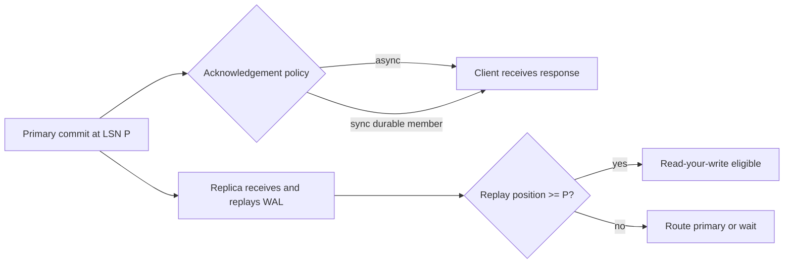

# Database Replication and Failover: Lag, Quorums, and Recovery

**Level:** L4–L5
**Status:** Reviewed (Terra PASS)
**Audience:** Engineers operating stateful services or preparing for an L4–L5 reliability/data interview
**Prerequisites:** WAL/logs, transactions, consistency, monitoring, and backups
**Sequence:** Batch 1, 6/8
**Terra gate:** approved

## Learning objectives

- Distinguish physical and logical replication and their schema boundaries.
- Select an acknowledgement policy from RPO, RTO, freshness, and latency needs.
- Reason about log lag, read routing, fencing, and stale-read behavior.
- Operate a failover without split brain or unreported acknowledged-write loss.

## What it is

Replication copies committed database state or its change log to another
instance. Physical replication replays storage-level records such as WAL; logical
replication emits row/table changes. A replica can serve reads, provide a failover
candidate, feed analytics, or support migration. Replication is not a backup:
corruption or an accidental delete can be copied, so independent backups remain
necessary.

## Why it exists and why it matters

One database instance has a failure domain and finite read capacity. Replicas can
improve read locality and reduce recovery time, but asynchronous copies can lag,
and synchronous acknowledgement can add cross-zone or cross-region latency.
Failover is a correctness protocol: identify the last safe log position, fence
the old primary, promote one candidate, and repair clients and replicas.

## Mental model: log position and commit acknowledgment

```mermaid
sequenceDiagram
    participant Client
    participant Primary
    participant ReplicaA
    participant ReplicaB
    Client->>Primary: Write transaction
    Primary->>Primary: Append WAL at LSN 105
    Primary-->>ReplicaA: Stream WAL through 105
    Primary-->>ReplicaB: Stream WAL through 105
    ReplicaA-->>Primary: Flush/ack 105
    Primary-->>Client: Commit after configured policy
    Note over ReplicaB: May be behind; read routing must honor freshness
```

The key variables are write/flush/replay positions, not a vague “replica is
healthy.” An async primary may acknowledge before any replica has durable bytes;
a sync policy may wait for one or more durable acknowledgements.

## Topic-specific visual



The diagram separates client acknowledgement from replica replay. An async
replica can be healthy yet stale, and a read-your-write request needs a primary
route or an explicit commit-position wait.

## Replication modes and read semantics

Physical streaming is efficient for same-engine failover but usually couples
versions/storage format and often serves read-only replicas. Logical replication
can filter tables or feed another schema/engine, but DDL, ordering, sequences,
and conflicts need explicit handling. Multi-primary replication permits local
writes but requires conflict detection/resolution and a split-brain policy.

Read-after-write requires routing a user's read to the primary, waiting for a
replica to reach a commit position, or carrying a token such as a log sequence
number. A load balancer that randomly sends reads to replicas does not provide
read-your-write semantics.

## Worked example: regional service with RPO/RTO

Assume a primary in `us-east`, a synchronous replica in another availability
zone, and an asynchronous cross-region replica in `us-west`. The product target
is RTO under five minutes and RPO under one minute for a regional outage. These
are objectives to validate with drills, not reliability guarantees inferred from
the topology.

At failover time, check the last acknowledged LSN, replica flush/replay LSN,
backup/PITR availability, and fencing status. If the cross-region replica is 40
seconds behind, promoting it can lose up to that observed window; report that
RPO rather than claiming zero loss. If a synchronous replica is unavailable,
the chosen policy may block writes, degrade to an explicitly different mode, or
accept risk—document the decision.

## Failover protocol

1. Detect failure using health, lease, and database evidence; avoid a single
   network probe deciding promotion.
2. Fence the old primary (network, lease/epoch, or storage fencing) so it cannot
   accept writes after promotion.
3. Select one candidate by durable log position and recovery state.
4. Promote, assign a new epoch/endpoint, and make clients refresh connections.
5. Repoint or rebuild other replicas; reconcile writes that existed only on the
   old primary if fencing was imperfect.
6. Verify reads, writes, constraints, replication, backups, and application
   idempotency before declaring recovery complete.

## Advantages and limitations

| Strategy | Advantages | Limitations / trade-offs |
| --- | --- | --- |
| Async single-primary | Low write latency and simple conflict model | Replica lag and possible acknowledged-write loss on primary loss |
| Sync same-region | Smaller RPO for zone failure | Commit latency and availability depend on the synchronous member |
| Logical replication | Filtering, migrations, and heterogeneous consumers | DDL/order/conflict handling and more application/schema responsibility |
| Multi-primary | Local writes and regional availability | Conflict resolution, global ordering, and split-brain complexity |
| Read replicas | Scale read traffic and isolate workloads | Stale reads, lag, replica overload, and failover capacity cost |

## Replication positions and acknowledgement policy

Track at least four positions: primary append/flush, replica receive/flush, and
replica replay. “Replica is connected” says little if replay is hours behind.
For a transaction at commit position `P`, a client needing read-your-write can
route to the primary or wait for a replica whose replay position is at least `P`.
Carry that token through the request when the database/application supports it.

### RPO/RTO worksheet

| Requirement | Design question | Evidence to collect |
| --- | --- | --- |
| RPO | How much acknowledged data may be absent after failure? | Last safe flushed position and recovery drill |
| RTO | How quickly must writes resume? | Detection, fencing, promotion, DNS/pool timings |
| Freshness | How stale may a read be? | Replay age and endpoint consistency token |
| Availability | May writes block when sync member is down? | Explicit degraded-mode decision |
| Recovery | Can the old node safely return? | Epoch/fence, rebuild, and reconciliation test |

Do not infer a numeric availability target from the number of replicas. Failure
dependencies include storage, networking, DNS, connection pools, operators,
backups, and the application retry policy.

## Read routing and application behavior

Label endpoints as primary/strong, bounded-stale, or best-effort. A read pool
must remove lagging or overloaded replicas and avoid sending a write retry to an
old primary. Connection pools need endpoint/epoch refresh after promotion; stale
connections can keep sending traffic to the fenced node. Retries need idempotency
keys because a response may be lost after commit.

## Failover drill and rollback

Exercise at least: process crash, storage failure, network partition, replica
lag, and a coordinator/monitor failure. For each, verify who can promote, how the
old primary is fenced, what happens to in-flight writes, and the observed RPO/RTO.
After promotion, rebuild or re-seed replicas from a known consistent position.
Do not “fail back” by pointing traffic at the old node until it has been rebuilt
or reconciled; otherwise old writes can reappear.

## Backups, corruption, and logical replication detail

Keep independent full/base backups, incremental/WAL archives, retention, and
restore tests. Test point-in-time recovery to a timestamp before an accidental
delete; replicas alone cannot provide that isolation. Logical replication needs
DDL coordination, key/sequence handling, conflict policy, and a decision about
whether triggers/defaults run on the subscriber. Record source positions and
schema versions for migration rollback.

## A failover runbook in detail

### Before the incident

Record the primary endpoint/epoch, member roles, synchronous policy, last backup,
log-retention headroom, and client retry/idempotency behavior. Automate fencing
and promotion but require an evidence-based decision when the monitor sees a
partition. Keep a tested, independent restore path.

### During promotion

1. Confirm the failure is not only monitor-to-primary network loss.
2. Fence the old primary and record the fence/epoch.
3. Compare candidates by durable flush/replay position and recovery health.
4. Promote exactly one candidate and publish the new endpoint/epoch.
5. Drain stale pools and reject writes carrying an old epoch.
6. Measure writes resumed, observed data loss, stale reads, and client errors.

### After promotion

Re-seed old members from a consistent position, verify backups, and inspect
in-flight operations. Reconcile client retries by idempotency key. Do not fail
back to the old node until it is rebuilt; “old primary is reachable” is not
evidence that its state is current.

## Capacity and topology notes

Separate synchronous members across failure domains, but account for the latency
of the acknowledgement path. Read replicas used for analytics need isolation so
large scans do not starve replay. Cascading replication saves source bandwidth
but accumulates lag across hops; monitor each edge. Multi-primary designs need a
conflict policy, deterministic IDs, and a repair path before they are called
active-active.

## Accuracy checklist

When a guide or design says “strong consistency,” identify the exact read/write
operation and failure domain. When it says “zero data loss,” identify which
acknowledgements, logs, and failure modes are covered. When it says “automatic
failover,” identify fencing, split-brain prevention, and the observed drill
result. These phrases are incomplete without their boundary.

## Failure modes and operations

- **Replication lag:** monitor byte/LSN/transaction lag, replay rate, oldest
  transaction, disk throughput, and user-visible stale-read rate.
- **WAL/log retention exhaustion:** alert before the replica can no longer catch
  up; provision storage and rebuild from a base backup when necessary.
- **Split brain:** use fencing and epochs/leases; never promote solely because
  a node cannot see the primary.
- **Stale reads:** route by consistency token or primary, label eventual reads,
  and test read-after-write behavior in the application.
- **Cascading failure:** cap replica fan-out, isolate analytics consumers, and
  preserve primary I/O for recovery-critical streams.
- **Bad failover:** drill promotion, DNS/endpoint refresh, connection pools,
  in-flight retries, duplicate writes, and rollback. A backup restore drill is
  required because replication copies logical mistakes.

## Practical exercises

1. Design a failover drill for the assumptions above. **Expected approach:**
   inject primary loss and network partition separately, verify fencing, measure
   observed RPO/RTO, and restore the old node without dual-primary writes.
2. A user writes then reads stale data from a replica. **Solution:** use primary
   routing or a commit-position token and wait until the replica reaches it;
   state timeout/degraded behavior.
3. A replica is 20 minutes behind. **Expected approach:** inspect network/I/O,
   long transactions, replay errors, disk/CPU, and log retention; throttle or
   isolate consumers, catch up or rebuild, and quantify data freshness.
4. Compare sync and async cross-region replication for payments. **Expected
   approach:** define acceptable lost-write/RTO risk, latency budget, provider
   failure mode, and independent backup/PITR plan before selecting.

## Interview Q&A

### Q1. Is replication a backup?

**Answer:** No. Deletes, corruption, and bad migrations may replicate; backups
and point-in-time recovery provide a separate recovery path. **Follow-up:** ask
for restore tests and retention, not only backup existence.

### Q2. What causes replica lag?

**Answer:** Network, disk, CPU, replay contention, long transactions, lock waits,
or a consumer that cannot keep up. **Follow-up:** distinguish transport lag from
replay lag using log positions.

### Q3. When does synchronous replication hurt availability?

**Answer:** If the required acknowledgement member is unavailable or partitioned,
writes may block or fail. **Follow-up:** define the explicit degraded-mode policy.

### Q4. How do you prevent split brain?

**Answer:** Fence the old primary and use a single authority/epoch for promotion;
health checks alone are insufficient. **Follow-up:** handle an old primary that
returns after a network partition.

### Q5. How can reads be read-your-write consistent?

**Answer:** Route to the primary, wait for a replica commit position, or carry a
   freshness token. **Follow-up:** define timeout and failover behavior.

### Q6. Physical versus logical replication?

**Answer:** Physical replays storage-level changes and is often efficient for
same-engine failover; logical emits selected changes and is flexible for feeds
or migrations but needs schema/order handling. **Follow-up:** discuss DDL and
sequence conflicts.

### Q7. What should a promotion candidate metric include?

**Answer:** Durable log position, replay health, backup status, version/config
compatibility, and failure-domain diversity. **Follow-up:** explain how to pick
between a fresher same-zone and older cross-region candidate.

### Q8. Why can a “successful” failover still lose data?

**Answer:** Async replicas may not contain acknowledged writes, clients may have
retries in flight, or fencing may fail. **Follow-up:** reconcile by idempotency
keys and report observed RPO honestly.

## Appendix: replication readiness worksheet

Before calling a topology highly available, fill in the evidence rather than
the aspiration:

| Question | Evidence required |
| --- | --- |
| Who may promote? | Single authority, lease/epoch, and fencing mechanism |
| Which writes are safe? | Acknowledgement policy and last durable positions |
| What is stale? | Endpoint consistency labels and read-after-write test |
| What is recoverable? | Independent backup/PITR restore and retention |
| How do clients move? | Endpoint refresh, pool drain, old-epoch rejection |
| How is success measured? | Drill RPO/RTO, errors, lag, and reconciliation |

### Failure-domain example

Three members in one availability zone are not equivalent to three independent
failure domains. A zone outage can remove all of them; a region outage can also
remove the synchronous quorum. Place members according to the failure you need
to survive, then state the degraded write policy when the quorum is unavailable.
If cross-region latency makes synchronous commits unacceptable, the design must
say what RPO is accepted rather than silently labeling the system strongly
consistent.

### Failover evidence example

If the last client-acknowledged position is `P=1050` and the candidate has
durably replayed only `P=1030`, the observed exposure is the changes between
those positions—not necessarily a precise number of seconds. Count and
reconcile those records before declaring recovery. The example demonstrates how
to report an observed RPO without pretending that LSN distance maps universally
to time or business loss.

### Observability detail

Dashboard append/flush/replay positions, replay age, WAL retention, disk/CPU/
network saturation, transaction conflicts, connection-pool errors, promotion
events, and stale-read samples. Alert on trend and headroom before a replica
falls outside recovery retention. Trace a write from client ID through commit
position and subsequent read to validate read routing during failover.

### Restore is a separate path

Run a restore to an isolated environment, replay logs to a chosen timestamp,
validate constraints and sample business invariants, and measure elapsed time.
A replica that is perfectly caught up cannot recover a mistakenly committed
delete from yesterday; only an independent recovery point can do that.

### Terra review prompt

Verify that each consistency or availability claim names its acknowledgement,
failure-domain, fencing, and restore boundary. Reject “zero RPO” or “automatic
failover” language without drill evidence and an explicit degraded-mode policy.

## Related and next reading

- [SQL transaction and isolation foundations](01-sql-advanced.md)
- [Distributed transaction recovery](12-distributed-transactions.md)
- [Change data capture from WAL/logs](20-change-data-capture.md)
- [Backup and point-in-time recovery](16-backup-recovery.md)
