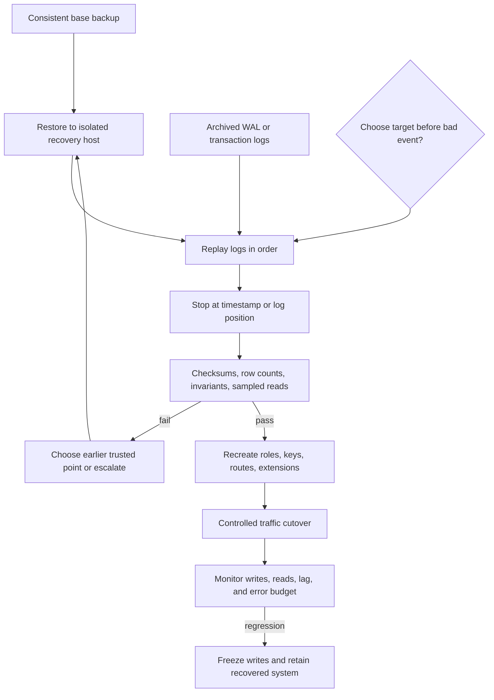
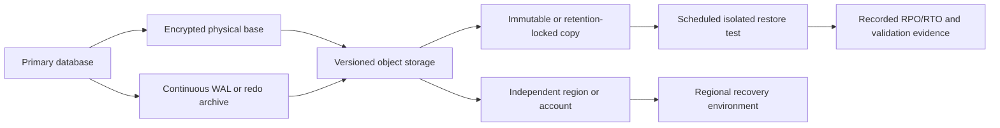

# Database Backup and Recovery

**Level:** L4-L5
**Status:** Reviewed (Terra PASS)
**Audience:** Engineers designing recoverable database services and practicing production incident and disaster-recovery interviews
**Prerequisites:** transactions, WAL or redo logs, object storage, encryption keys, replication, and SLO terminology
**Sequence:** Batch 2A, 4/8
**Terra gate:** approved

## Learning objectives

- Translate RPO and RTO into backup cadence, log retention, restore throughput, and recovery capacity.
- Distinguish snapshots, logical backups, physical backups, and continuous transaction logs by recovery semantics.
- Design PITR and a recovery runbook for corruption, operator error, ransomware, and regional failure.
- Test restore integrity, preserve immutable copies and encryption-key history, and define a rollback or promotion boundary.
- Explain why successful backup creation is not evidence of a tested recovery objective.

## What it is

A backup is a durable copy or reconstruction input from which database state can be recovered.

Recovery is the controlled process of selecting a trusted base, applying logs or changes, validating state, and returning service.

Point-in-time recovery (PITR) restores a base backup and replays transaction logs until a chosen timestamp or log position.

A replica can improve availability but is not automatically an independent backup; corruption or deletion can replicate.

This guide uses PostgreSQL terms such as base backup, WAL, and PITR, while the reasoning applies to other engines with different tools.

Provider snapshots, retention, KMS behavior, cross-region copies, and restore APIs vary by service and version.

## Why it matters

Recovery objectives are promises about lost work and service interruption, not about whether a backup job reported success.

RPO limits how far back the recovered state may be.

RTO limits how long restoration and validation may take before service returns.

A regional outage tests network, identity, DNS, secrets, keys, schema, and application dependencies in addition to bytes.

Ransomware and silent corruption require a clean recovery point, not simply the newest copy.

The recovery design must make the trust boundary and irreversible actions explicit.

## Mental model

Think of recovery as a timeline: trusted base `B`, ordered change stream `L`, target point `T`, validation `V`, and traffic switch `S`.

The recovered state is `state(B) + changes(L where position <= T)`.

The base must be consistent according to the engine's backup contract.

The log stream must be complete, ordered, durable, and decryptable for the interval.

The target must precede the known corruption or deletion point when recovering from bad writes.

Validation must be independent enough to detect corruption before traffic writes to the recovered system.

The switch is a business and operational decision; restoring files is not the same as declaring recovery complete.

## Topic-specific visual

### PITR and recovery-runbook visual

Read the diagram as a gated sequence: no traffic switch follows a failed validation, and an earlier recovery point is an explicit alternative.

### Backup lifecycle visual

Independence matters: a copy that shares the same credentials, region, key, or deletion control may share the same failure.

## Worked example

### 2 TB, 5-minute RPO, 4-hour RTO

Assume a 2 TB logical database, peak write rate 80 MB/s, average write rate 30 MB/s, and a 5-minute RPO.

Assume a full physical base backup can be produced without exceeding the primary's write SLO, but its duration must be measured.

The 5-minute RPO means an unrecoverable event may lose no more than five minutes of committed changes under the stated failure model.

If logs are archived continuously and the worst measured archive delay is 90 seconds, the log transport margin is `300 - 90 = 210 seconds`.

That margin can be consumed by detection, object-store availability, or a final unarchived segment; monitor it rather than assuming it.

At the peak write rate, five minutes produces `80 MB/s × 300 s = 24,000 MB`, or about 24 GB of logical WAL before compression and overhead.

At the average rate, the same interval produces `30 × 300 = 9,000 MB`, or about 9 GB.

These are workload estimates, not storage promises; WAL volume depends on page writes, full-page images, indexes, compression, and engine settings.

For a 4-hour RTO, the recovery budget includes detection, selecting the base, downloading, replaying, validation, provisioning dependencies, DNS/route change, and application warm-up.

If 45 minutes are reserved for detection and coordination, 30 minutes for provisioning and credentials, and 30 minutes for validation and cutover, only `240 - 45 - 30 - 30 = 135` minutes remain for base restore and log replay.

Assume the base is 2 TB and measured restore throughput is 500 MB/s from the selected storage path.

The ideal byte-transfer time is `2,000,000 MB / 500 MB/s = 4,000 s`, or 66.7 minutes.

Real recovery is slower or faster depending on parallelism, decompression, checksum work, random I/O, index rebuilds, and provider throttling.

If replay throughput is 150 MB/s and 120 GB of logs must be applied, replay time is approximately `120,000 / 150 = 800 s`, or 13.3 minutes.

The estimated 80 minutes for base transfer plus replay fits 135 minutes, but only with 55 minutes of margin for variance.

Measure the p95 restore time, not only the best run.

Retention must cover the longest investigation and restore-test interval plus the RPO log chain.

## Advantages and limitations

Snapshots simplify managed recovery and can restore broad state quickly, while physical bases plus continuous logs provide finer PITR control.

Logical backups support selective restore and portability but may be slower and less complete for engine metadata.

Immutable copies reduce deletion and ransomware blast radius but do not guarantee a clean point, retained keys, available quota, or tested RTO.

If weekly bases are retained for 35 days and logs for 35 days, a corruption discovered after 36 days is outside this design even if yesterday's backup succeeded.

For a regional failure, the independent region must contain both the base and logs and have enough compute, network, identity, key access, and quota to meet the same RTO.

Do not claim that cross-region copying is independent until account, credentials, keys, control plane, and deletion paths are reviewed.

### Recovery objective table

| Input | Worked value | What it controls | Evidence required |
| --- | ---: | --- | --- |
| Database size | 2 TB | Base transfer and storage capacity | Restore throughput by source and target |
| Peak write rate | 80 MB/s | Worst five-minute log volume | WAL/redo rate samples and archive lag |
| RPO | 5 minutes | Maximum accepted committed-data loss | Last durable log position and alert margin |
| RTO | 4 hours | Total recovery budget | Timed restore, replay, validation, and cutover |
| Restore throughput | 500 MB/s assumed | Base restore duration | Repeated isolated restore tests |
| Replay throughput | 150 MB/s assumed | Log application duration | Representative WAL replay measurement |

The assumptions must be replaced by observed distributions before production approval.

## Backup types and recovery semantics

### Snapshots

A storage or provider snapshot captures a volume or managed database at a point in time according to provider semantics.

Snapshots can be fast to create because copy-on-write defers physical copying, but restore speed and dependency behavior still require measurement.

A snapshot may depend on the same account, region, encryption key, or control plane as the source.

Retention locks, versioning, and separate credentials reduce deletion risk but do not make a corrupted snapshot clean.

### Logical backups

Logical backups export tables, schema, or rows into an engine-independent or engine-specific representation.

They support selective restore and migrations but can take longer to create and restore at multi-terabyte scale.

Logical exports may miss engine metadata, privileges, extensions, sequences, large objects, or replication configuration unless explicitly included.

Validate ordering, foreign keys, generated columns, collations, and application compatibility on restore.

### Physical backups

Physical backups copy engine storage files in a consistent backup format.

They are often the foundation for fast full-instance recovery and PITR within the same engine family.

They are less convenient for table-level extraction and may be tied to major version, platform, architecture, or provider tooling.

### Continuous logs

WAL or redo logs encode changes needed to replay committed state after a base backup.

Archive them with checksums, encryption, sequence/position monitoring, retry, and gap detection.

A log archive that reports “uploaded” but has a gap is not a usable continuous recovery stream.

### Comparison: backup approaches

| Approach | Restore scope | Strength | Limitation |
| --- | --- | --- | --- |
| Snapshot | Volume or managed instance | Fast creation and simple operational integration | Provider/account/region coupling; restore speed and clean-point assumptions vary |
| Logical dump | Schema, table, or rows | Selective restore and portability | Multi-terabyte restore can be slow; metadata and ordering need explicit checks |
| Physical base | Whole engine instance | Efficient foundation for PITR | Engine/version/platform coupling; less selective |
| Continuous logs | Changes after a base | Fine recovery point and low data-loss window | Requires complete durable chain, replay capacity, and key retention |

Use more than one representation when recovery scenarios differ.

## Immutability, encryption, and key retention

Encrypt backups in transit and at rest, and restrict restore credentials separately from delete credentials.

Envelope encryption commonly encrypts data with a data-encryption key and wraps that key with a key-encryption key in a KMS.

Rotating a KMS wrapping key does not necessarily re-encrypt every historical backup byte; provider semantics determine whether and when data keys are rewrapped.

Retain old key versions for as long as backups and logs that use them may need restoration.

Test restoration with the historical key versions and revoked-current-key scenario before deleting a key.

Immutable or retention-locked copies protect against ordinary deletion and ransomware credentials, but they do not correct application corruption already copied into them.

Use write-once retention, separate administrative accounts, access logging, and restore authorization.

### Comparison: recovery threats

| Threat | What may be damaged | Required control | Recovery caveat |
| --- | --- | --- | --- |
| Operator deletion | Live data and newest backups | Approval, soft delete, immutable copies | Select a prior known-good point and verify dependencies |
| Ransomware | Live data and reachable backup credentials | Isolated credentials, retention lock, separate account/region | A copied encrypted payload may still be malicious or corrupted |
| Silent corruption | Rows or indexes over time | Checksums, invariants, delayed detection, history | Newest backup may include bad state; need an earlier trusted point |
| Regional failure | Compute, storage, network, keys, control plane | Independent region/account and tested DR | Copy presence is not sufficient without quota and restore timing |

No control eliminates the need for restore tests.

## Restore testing

A restore test creates evidence about the actual RPO and RTO.

Use an isolated account or network and synthetic or approved data handling.

Verify backup manifests, checksums, log continuity, engine startup, roles, extensions, sequences, constraints, row counts, and business invariants.

Measure base download, restore, replay, validation, DNS, application warm-up, and cutover separately.

Test a recent point, an older retention point, and a regional path when the objective requires them.

Restore tests must not write to production or accidentally send email, charge cards, or publish recovered events.

Scrub or protect sensitive data in non-production environments according to policy.

Record version, provider, source, target, base ID, final log position, key versions, duration, failures, and follow-up actions.

## Failure modes and operations

### Recovery-point selection discipline

Use the earliest timestamp at which the business invariant is known to be valid, then confirm the corresponding log position.

Wall-clock timestamps can be ambiguous across application, database, and archive clocks; log positions provide an engine-specific ordering anchor.

Keep a catalog of base-backup manifests, archive ranges, checksums, key versions, and restore-test evidence.

Do not garbage-collect a base while a retained PITR interval still depends on its log chain.

When retention policies overlap, calculate the dependency closure from every base to the last log needed for its promised points.

Document whether the RPO is measured at commit, archive, object-store durability, or recovery-target availability.

### Recovery-target isolation

Use a separate network and identity for recovery tests so a mistaken application boot cannot write to production.

Disable external side effects, rotate test credentials, and fence recovered replicas until validation finishes.

Treat recovered data as sensitive even when it is copied into a test environment.

If the target is promoted, record its timeline/term and prevent the old writer from accepting traffic.

An isolated restore that cannot obtain its required key or extension is an actionable failed test, not a test-environment excuse.

### Missing or delayed logs

Alert on archive age, position gaps, upload failures, object-store permissions, compression errors, and key access failures.

RPO is measured from last durable recoverable position, not from the time a transaction committed on the primary.

### Corruption discovered late

Stop overwriting clean retention candidates, identify the earliest suspected bad point, and recover to an earlier target in isolation.

Compare checksums, row counts, business invariants, and audit events before accepting the point.

### Replica mistaken for backup

Replicated deletes, bad schema changes, and ransomware can reach the replica quickly.

Keep an independent historical copy and test its restore path.

### Restore dependency failure

Missing KMS access, extension packages, roles, DNS, secrets, network routes, or provider quota can dominate RTO.

Include dependencies in the runbook and exercise them during tests.

### Cutover ambiguity

Fence the old primary or prevent split-brain writes before switching traffic.

Record the final accepted log position and application write policy.

After cutover, monitor errors, write rate, replication, background jobs, and duplicate side effects.

### Operational checklist

1. Declare incident scope and freeze destructive retention changes.
2. Identify last known-good point, base backup, log chain, and encryption key versions.
3. Provision an isolated recovery target with tested quotas and network access.
4. Restore, replay, validate, and record elapsed time and positions.
5. Fence the old writer and switch traffic under an approved procedure.
6. Verify SLO, data invariants, downstream effects, and backup continuity.
7. Preserve evidence and revise objectives from measured gaps.

## Practical exercises

### Exercise 1: RPO log volume

A database writes 40 MB/s at peak and has a 15-minute RPO. Estimate peak logical log volume in the window and list two reasons actual archive size differs.

**Expected approach:** `40 MB/s × 900 s = 36,000 MB`, approximately 36 GB before compression and overhead. Mention full-page images, index/page churn, compression, and engine log format; do not present 36 GB as a billing or exact storage number.

### Exercise 2: RTO budget

A 2 TB base restores at 400 MB/s, 180 GB of logs replays at 120 MB/s, and validation/cutover needs 50 minutes. Does this fit a 4-hour RTO before other tasks?

**Solution:** Base transfer is `2,000,000 / 400 = 5,000 s = 83.3 min`; replay is `180,000 / 120 = 1,500 s = 25 min`. Together with 50 minutes, the modeled total is 158.3 minutes, leaving about 81.7 minutes for detection, provisioning, variance, and dependencies. Measure p95 and preserve margin.

### Exercise 3: Select a PITR target

A bad deployment began at 14:10, was detected at 14:37, and logs are complete. The last known-good business invariant is at 14:08. Explain the target and validation.

**Expected approach:** Restore to a point before the first bad write, such as 14:08 or a transaction/log position confirmed safe, not merely the latest timestamp. Validate checksums, counts, invariants, audit records, roles, and downstream side-effect policy in isolation before cutover.

### Exercise 4: Ransomware and key loss

A backup is immutable in another region, but its KMS key was deleted in the source account. Write the recovery decision tree.

**Solution:** Check whether the provider retains recoverable key versions or a separate-account key copy, stop further deletion, preserve evidence, and verify access from the recovery account. If the copy cannot be decrypted, it is not a usable backup; select an older independently keyed copy and record the RPO/RTO breach.

## Interview Q&A

### Q1. What is RPO?

**Answer:** Recovery point objective is the maximum accepted amount of committed data loss measured in time or an equivalent log position under a stated failure model.

**Follow-up:** What evidence proves a five-minute RPO?

### Q2. What is RTO?

**Answer:** Recovery time objective is the allowed time to restore a usable service, including detection, provisioning, replay, validation, dependencies, and cutover.

**Follow-up:** Why is base restore time alone insufficient?

### Q3. Is a replica a backup?

**Answer:** Not by itself. It may improve availability, but deletes, corruption, and ransomware can replicate, and it may lack historical recovery points or independent failure domains.

**Follow-up:** Which independent copy would you add?

### Q4. How does PITR work?

**Answer:** Restore a consistent base and replay ordered transaction logs until a selected timestamp or position before the bad event, then validate before traffic cutover.

**Follow-up:** What makes the target untrustworthy?

### Q5. Why preserve old encryption keys?

**Answer:** Historical backups and logs may contain data keys wrapped by older KMS key versions. Rotation changes future wrapping behavior but does not make old ciphertext decryptable without retained key material and provider support.

**Follow-up:** How do you test key-retention assumptions?

### Q6. What makes a backup immutable?

**Answer:** A retention or write-once control prevents authorized paths from deleting or overwriting it during its retention period, usually with separate permissions and audit logging.

**Follow-up:** What threat does immutability not solve?

### Q7. How do you validate a restore?

**Answer:** Check manifests, checksums, log continuity, startup, roles, extensions, constraints, row counts, business invariants, application behavior, and measured RPO/RTO.

**Follow-up:** Why use an isolated environment?

### Q8. What changes during a regional failure?

**Answer:** Compute, storage, network, identity, keys, quotas, DNS, extensions, and downstream dependencies must be available in the recovery region; copied bytes alone do not meet RTO.

**Follow-up:** What must be fenced before cutover?

### Q9. How do you recover from silent corruption?

**Answer:** Identify the earliest suspected bad point, retain candidates, restore to an earlier trusted base/log target, and validate data and business invariants before accepting it.

**Follow-up:** Why might the newest backup be unusable?

### Q10. What is the most common recovery mistake?

**Answer:** Treating a successful backup job or replica as proof of recoverability without a timed restore, key test, dependency test, and validation runbook.

**Follow-up:** Which evidence should be recorded after every test?

## Related and next reading

- [Database replication](15-database-replication.md) for failover, lag, and fencing.
- [Database monitoring](24-database-monitoring.md) for archive lag and RPO/RTO telemetry.
- [Migration strategies](26-migration-strategies.md) for rollback boundaries and schema compatibility.
- [Database security](28-database-security.md) for backup encryption, keys, and access controls.
