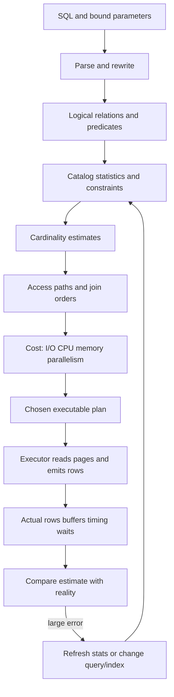
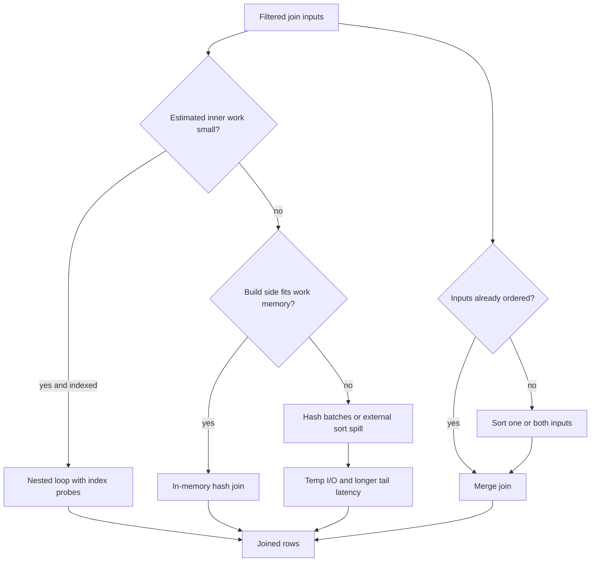

# Query Planning and Optimization

**Level:** L4-L5
**Status:** Reviewed (Terra PASS)
**Audience:** Engineers debugging PostgreSQL-style OLTP query regressions and preparing for an L4-L5 database interview
**Prerequisites:** SQL joins and predicates, B-tree indexes, transactions, and basic database statistics
**Sequence:** Batch 2A, 1/8
**Terra gate:** approved

## Learning objectives

- Reproduce a plan regression with controlled schema, row counts, skew, statistics, and `EXPLAIN` settings.
- Compare estimated rows with actual rows and buffers, then identify whether the error is data, cost, or contention related.
- Choose between scan and join strategies without treating an index or join algorithm as universally faster.
- Explain index-only visibility, parameter sensitivity, stale statistics, lock waits, and safe index rollout.
- Write an operational diagnosis with a plan fingerprint, workload slice, mitigation, and rollback condition.

## What it is

Query planning turns declarative SQL into an executable plan.

The planner chooses access paths, join order, join algorithms, aggregation, sorting, and parallelism from the SQL tree and catalog statistics.

The executor runs that plan against a particular database state.

Planning is not execution, and estimated cost is not elapsed time.

An estimate is a model used to compare alternatives on the same server configuration.

An actual plan records one parameter set, cache state, concurrency level, and data snapshot.

PostgreSQL examples use syntax available across supported modern releases, but settings and plan details vary by version, extensions, storage, and managed provider.

MySQL, SQL Server, and distributed SQL systems expose analogous evidence with different statistics tables and explain formats.

## Why it matters

A query can be logically correct while violating its latency SLO because the planner chose a poor path.

The useful optimization question is “which assumption made this plan look cheap, and what evidence proves it wrong?”

Wrong cardinality estimates multiply downstream work.

An underestimated outer relation can make a nested loop perform millions of inner probes.

An overestimated relation can cause a hash table or sort to reserve too much memory or reject an index.

A plan good for a common tenant may be poor for a small tenant, so parameter distributions matter.

Contention can make a fast plan wait behind a lock; changing the plan will not remove that wait.

## Mental model

Start with a logical tree: filter, join, group, order, and project.

The planner enumerates physically executable alternatives subject to join-order, feature, and configuration limits.

For each relation it estimates selectivity from histograms, most-common values, null fractions, correlation, extended statistics, and constraints.

It combines row estimates with CPU, I/O, memory, parallel, and network cost parameters.

The cheapest estimated alternative wins within the planner's search space.

The executor consumes tuples from child nodes and propagates actual rows upward.

The parent node's cost depends on how much work its children produce, not only on the predicate written at that node.

The invariant is that every plan decision is conditional on assumptions.

Record those assumptions before changing configuration.

## Topic-specific visual

### Optimizer path visual



Read the loop left to right for execution and from `Evidence` back to `Stats` during diagnosis.

The loop is not automatic optimization: a human or controlled process decides whether evidence is representative.

### Join decision and spill visual



The branches are hypotheses, not instructions to force a join type.

A hash spill is evidence about build size, `work_mem` scope, row width, and concurrency.

Increasing memory globally can create a different failure because `work_mem` applies per operation and may multiply by workers.

## Worked example

### Reproduce a plan regression

The example uses PostgreSQL 15 or later syntax; exact output varies with minor version, hardware, and provider instrumentation.

The objective is to reproduce a report query instead of optimizing a one-row synthetic table.

### Fixture and assumptions

Assume one primary with 8 vCPUs, 32 GiB RAM, SSD storage, and `max_connections = 200`.

Assume 2,000 tenants and 12,000,000 orders retained for 180 days.

Assume 95% of tenants have 1,000–20,000 orders and one marketplace tenant has 4,000,000 orders.

Assume the endpoint requests paid orders for one tenant over 24 hours, newest first, limited to 100 rows.

Assume the endpoint p95 target is 250 ms while one parameter bucket reaches 2.4 s.

The tenant distribution is deliberately skewed; averaging all tenants hides the incident.

```sql
CREATE TABLE orders (
    order_id bigint PRIMARY KEY,
    tenant_id bigint NOT NULL,
    state text NOT NULL,
    created_at timestamptz NOT NULL,
    customer_id bigint NOT NULL,
    total_cents integer NOT NULL,
    shipping_country text NOT NULL,
    payload jsonb NOT NULL DEFAULT '{}'
);

INSERT INTO orders
SELECT g,
       CASE WHEN g <= 4000000 THEN 42 ELSE 1000 + (g % 1999) END,
       CASE WHEN g % 10 < 7 THEN 'paid' ELSE 'pending' END,
       now() - ((g % 180) * interval '1 day') - ((g % 86400) * interval '1 second'),
       g % 900000,
       500 + (g % 20000),
       CASE WHEN g % 5 = 0 THEN 'US' ELSE 'CA' END,
       jsonb_build_object('source', CASE WHEN g % 3 = 0 THEN 'web' ELSE 'mobile' END)
FROM generate_series(1, 12000000) AS s(g);
```

The fixture is not a benchmark for production hardware.

It supplies enough rows and skew to exercise statistics rather than demonstrate a universal timing.

Create the query shape without hiding parameters in application code.

```sql
SELECT order_id, created_at, total_cents
FROM orders
WHERE tenant_id = $1
  AND state = $2
  AND created_at >= $3
  AND created_at < $4
ORDER BY created_at DESC, order_id DESC
LIMIT 100;
```

Record PostgreSQL version, table size, `ANALYZE` timestamp, planner settings, and parameter values with every capture.

### First evidence capture

Use `EXPLAIN (ANALYZE, BUFFERS, SETTINGS, WAL, VERBOSE, FORMAT JSON)` only in a safe environment or for a bounded read.

`ANALYZE` executes the statement, so parameters must be read-only and timeout controlled.

```sql
BEGIN READ ONLY;
SET LOCAL statement_timeout = '5s';
EXPLAIN (ANALYZE, BUFFERS, SETTINGS, VERBOSE)
SELECT order_id, created_at, total_cents
FROM orders
WHERE tenant_id = 42
  AND state = 'paid'
  AND created_at >= now() - interval '1 day'
  AND created_at < now()
ORDER BY created_at DESC, order_id DESC
LIMIT 100;
ROLLBACK;
```

Suppose the plan estimates 120 rows at the scan but returns 980,000 rows before the limit.

Suppose it reports `shared hit=18000 read=42000`, while tenant 1777 estimates 150 and returns 142 rows with 210 shared hits.

This is a parameter distribution problem, not proof that the index is always wrong.

Capture planning time, execution time, rows removed by filter, loops, and temporary read/write counts.

The estimate ratio is `actual_rows / greatest(estimated_rows, 1)`.

For 980,000 actual rows against 120 estimated rows, the ratio is about 8,167.

Large ratios at multiple nodes identify a cardinality problem; a ratio only at the top can also reflect join duplication or filtering.

### Diagnose statistics

Run `ANALYZE orders` in a staging copy and compare plans before deciding production statistics are stale.

```sql
SELECT reltuples::bigint AS estimated_table_rows,
       n_live_tup, last_analyze, last_autoanalyze, n_mod_since_analyze
FROM pg_class
JOIN pg_stat_all_tables ON pg_stat_all_tables.relid = pg_class.oid
WHERE relname = 'orders';

SELECT attname, n_distinct, most_common_vals, histogram_bounds,
       correlation, avg_width
FROM pg_stats
WHERE tablename = 'orders'
  AND attname IN ('tenant_id', 'state', 'created_at');
```

Autovacuum thresholds and analyze scale factors determine refresh timing; they are not a freshness guarantee.

Heavy inserts into a newly dominant tenant can leave a sample unrepresentative until an analyze runs.

Raise a statistics target for a skewed column only after measuring estimate error and analyze cost.

```sql
ALTER TABLE orders ALTER COLUMN tenant_id SET STATISTICS 500;
ANALYZE orders (tenant_id, state, created_at);
```

The setting increases sampling work and catalog size; it does not guarantee a perfect estimate.

Extended statistics can capture dependency or joint distribution that independent column statistics miss.

```sql
CREATE STATISTICS orders_tenant_state_stats
    (dependencies, mcv, ndistinct)
    ON tenant_id, state FROM orders;
ANALYZE orders (tenant_id, state);
```

Check the provider's supported PostgreSQL version before using a statistic kind or monitoring view.

### Estimated rows, actual rows, and buffers

An `EXPLAIN` node reports `rows` as an estimate; `actual rows` is observed by `EXPLAIN ANALYZE` for one execution.

When `loops > 1`, multiply actual rows and timing by loops before comparing total work with the estimate.

`shared hit` means a block was served from the database shared buffer cache.

`shared read` means the backend read the block into that cache; it does not prove physical disk latency because the OS or storage service may cache it.

`temp read` and `temp written` indicate temporary-file activity, commonly from sort, hash, or materialize nodes.

Buffers explain page work, not all CPU, network, lock, or client time.

If execution time is high but buffers are low, inspect waits, CPU, row width, serialization, and client fetch behavior.

If buffers are high with a good estimate, the query may simply be too broad for the SLO or need a different projection or partitioning strategy.

### Index-only visibility

An index-only scan can avoid heap access only when the index covers needed columns and the visibility map marks each heap page all-visible.

A covering index is necessary but not sufficient.

Recently inserted or updated pages may not be all-visible, and vacuum must establish visibility after transaction horizons allow it.

Inspect `Heap Fetches` in `EXPLAIN (ANALYZE, BUFFERS)`.

Many heap fetches mean the path behaves more like an index scan even though the node is called index-only.

Autovacuum, update churn, long-running transactions, and table bloat can reduce the benefit.

Do not run `VACUUM FULL` reflexively during an incident: it rewrites the table and takes stronger locks.

Prefer ordinary vacuum, transaction cleanup, and a planned maintenance window after confirming the cause.

### Parameter sensitivity

A custom plan can use current parameter values, while a generic prepared-statement plan trades per-execution planning for reuse.

The best mode depends on planning cost, parameter skew, execution frequency, and the version's plan-selection behavior.

Compare a small tenant, the hot tenant, and a middle bucket.

```sql
BEGIN READ ONLY;
SET LOCAL plan_cache_mode = force_custom_plan;
PREPARE recent_orders(bigint, text, timestamptz, timestamptz) AS
SELECT order_id, created_at, total_cents FROM orders
WHERE tenant_id = $1 AND state = $2
  AND created_at >= $3 AND created_at < $4
ORDER BY created_at DESC, order_id DESC
LIMIT 100;

EXPLAIN (ANALYZE, BUFFERS, SETTINGS) EXECUTE recent_orders(42, 'paid', TIMESTAMPTZ '2026-08-31 00:00:00+00', TIMESTAMPTZ '2026-09-01 00:00:00+00');
SET LOCAL plan_cache_mode = force_generic_plan;
EXPLAIN (ANALYZE, BUFFERS, SETTINGS) EXECUTE recent_orders(42, 'paid', TIMESTAMPTZ '2026-08-31 00:00:00+00', TIMESTAMPTZ '2026-09-01 00:00:00+00');
SET LOCAL plan_cache_mode = force_custom_plan;
EXPLAIN (ANALYZE, BUFFERS, SETTINGS) EXECUTE recent_orders(1777, 'paid', TIMESTAMPTZ '2026-08-31 00:00:00+00', TIMESTAMPTZ '2026-09-01 00:00:00+00');
SET LOCAL plan_cache_mode = force_generic_plan;
EXPLAIN (ANALYZE, BUFFERS, SETTINGS) EXECUTE recent_orders(1777, 'paid', TIMESTAMPTZ '2026-08-31 00:00:00+00', TIMESTAMPTZ '2026-09-01 00:00:00+00');
ROLLBACK;
```

The first pair holds the hot tenant (`42`) constant and the second holds a small tenant (`1777`) constant, so each pair isolates custom versus generic planning. The typed `PREPARE` definition matches the parameterized report query above; the `TIMESTAMPTZ` literals make each example executable without relying on application variables.
For the fixture, expect the hot-tenant custom plan to favor the broad-result path and the small-tenant custom plan to favor the selective index path. The generic plan may choose one compromise path for both distributions; record the actual node, estimated rows, planning time, execution time, and buffers rather than assuming those outcomes.

Possible mitigations include a rewrite, separate shapes for hot tenants, a bounded tenant-specific index, or custom plans for this statement.
Each mitigation has planning CPU, code-path, storage, and invalidation costs.
Avoid forcing a plan globally before measuring the parameter distribution.

### Join planning

Suppose the report joins `orders` to `customers` and `customer_preferences` after filtering by tenant.

The planner can reorder inner joins when semantics permit, while outer joins, volatile expressions, and lateral dependencies constrain reordering.

Nested loops fit a small outer relation and a selective parameterized inner index path.

Hash joins fit larger unsorted inputs when the build side fits memory.

Merge joins fit already ordered inputs when sorting is affordable.

A hash node that spills creates batches and temporary I/O; it is not automatically incorrect.

Inspect batches, memory usage, temp buffers, and concurrent query count before changing `work_mem`.

Filter early when semantically safe, but do not change null or outer-join semantics.

### Comparison: access paths

| Access path | Strong fit | Material cost or limitation |
| --- | --- | --- |
| Sequential scan | Broad result, small table, cold cache, or low selectivity | Reads many pages and competes for I/O; not inherently slow |
| B-tree index scan | Selective equality/range/order with manageable heap fetches | Random heap access, index maintenance, and poor broad-result benefit |
| Bitmap heap scan | Many matches with page locality and combined predicates | Loses ordering, consumes memory, and still visits heap pages |
| Index-only scan | Covered narrow projection and high all-visible coverage | Heap fetches return when visibility bits are unset; wider index costs writes |
| Partition pruning | Predicate aligns with partition key | More partitions, planning overhead, and cross-partition work without a key |

No row promises a latency number; measure with representative cache state and concurrency.

### Comparison: join strategies

| Join strategy | Useful assumptions | Failure or trade-off |
| --- | --- | --- |
| Nested loop | Small outer side and cheap indexed inner lookup | Wrong estimate can turn probes into millions of random operations |
| Hash join | Equality join and build side fits memory or tolerable batches | Spill creates temp I/O; memory multiplies by operations and workers |
| Merge join | Inputs ordered or sort cost is justified | Sorts can spill and non-equality predicates need other strategies |
| Parallel join | Work divides and workers are available | Startup, coordination, skew, and provider CPU limits reduce benefit |

“Force hash join” is a diagnostic experiment, not a durable design principle.

### Safe index rollout

First measure index size, build time, write amplification, replication impact, and predicate stability.

Use a partial index only if its predicate is stable and the planner can prove the query implies it.

On PostgreSQL, `CREATE INDEX CONCURRENTLY` avoids the strongest write-blocking phase during most of the build but has operational caveats.

It can leave an invalid index after failure and cannot run inside a transaction block.

Use a migration step with lock timeout, statement timeout where supported, progress monitoring, and cleanup.

```sql
SET lock_timeout = '2s';
CREATE INDEX CONCURRENTLY orders_recent_paid_lookup
    ON orders (tenant_id, created_at DESC, order_id DESC)
    WHERE state = 'paid';
```

The command can still consume I/O and WAL, wait on transactions, affect replicas, and compete with DML.

Validate the plan for every important parameter bucket after the index becomes valid.

Keep the old index until usage and write-impact evidence justify removal.

Drop unused indexes separately with the same rollout discipline.

## Advantages and limitations

Cost-based planning adapts to data and hardware, and an actual plan provides evidence for targeted changes.

The limitations are statistics error, plan-cache sensitivity, configuration drift, bounded search space, and operational overhead in capturing `ANALYZE` plans.

An index can improve reads while increasing insert, update, storage, replication, and vacuum work.

A plan hint can stabilize one case while becoming stale after a data-shape change.

## Failure modes and operations

### Stale or misleading statistics

Detect repeated estimate-to-actual ratios grouped by query fingerprint and parameter bucket.

Check analyze timestamps, modification counts, partition-level statistics, skew, and recent bulk loads.

Mitigate with targeted `ANALYZE`, statistics targets, extended statistics, or a query shape that exposes selectivity.

Schedule analyze from observed drift rather than a copied interval.

### Lock waits mistaken for plan regressions

`EXPLAIN` does not explain time waiting to acquire a lock before execution.

Inspect `pg_stat_activity`, `pg_locks`, wait events, transaction age, and the blocking PID where the provider exposes them.

```sql
SELECT pid, usename, state, wait_event_type, wait_event,
       query_start, xact_start, query
FROM pg_stat_activity
WHERE datname = current_database();
```

Terminate a blocker only under an approved incident procedure after identifying ownership and rollback consequences.

Idle-in-transaction sessions can prevent cleanup and visibility advancement.

### Regression after deploy

Compare normalized text, plan fingerprint, estimated rows, actual rows, buffers, timing, and parameters.

Separate a plan change from data change, cache warm-up, pool queueing, and lock waits.

Use a canary or read-only shadow workload when provider features support it.

Record rollback triggers, such as p95 above the SLO for two windows or replica lag above its budget.

### Operational checklist

1. Capture exact query, parameters, version, settings, and time window.
2. Reproduce with `EXPLAIN (ANALYZE, BUFFERS)` only under an approved read-only limit.
3. Compare estimates, actual rows per loop, buffers, temp work, and waits.
4. Check skew, statistics freshness, visibility-map coverage, and blockers.
5. Test one change on representative data and compare before/after evidence.
6. Roll out with an owner, timeout, monitoring, and rollback boundary.

Do not claim that an index, `ANALYZE`, or a join hint fixes all parameter values.

## Practical exercises

### Exercise 1: Estimate error worksheet

Given a node estimate of 500 rows, `actual rows=40,000`, `loops=3`, and `shared read=9,000`, calculate total observed rows and the estimate ratio.

**Expected approach:** Multiply actual rows by loops to get 120,000 observed rows. State whether the plan reports the estimate per loop or total before choosing a fix. The ratio is 80 against the per-loop estimate, so label the denominator.

### Exercise 2: Diagnose an index-only scan

An index-only scan returns 100 rows but reports 85,000 heap fetches after a bulk update. Propose an investigation and safe mitigation.

**Solution:** Verify projection coverage, inspect vacuum/analyze timestamps and long transactions, and compare visibility-map coverage. Schedule ordinary vacuum or fix autovacuum/transaction retention after confirming the cause. Re-run with buffers and heap-fetch evidence; do not add a wider index or run `VACUUM FULL` without measuring.

### Exercise 3: Parameter-sensitive prepared statement

A generic plan uses a sequential scan for a hot tenant while an index plan is fast for 99% of small tenants. Design a controlled test.

**Expected approach:** Capture custom and generic plans for hot, middle, and small tenants with equal windows and cache notes. Compare planning time, execution p95, buffers, and frequency. Consider custom plans or separate shapes only if planning CPU and invalidation cost fit the budget.

### Exercise 4: Safe index rollout

Design a rollout for a partial paid-orders index on a high-write table with a streaming replica.

**Solution:** Estimate size and build/WAL impact, test predicate implication and plan coverage, run `CREATE INDEX CONCURRENTLY` with lock timeout and progress monitoring, watch write latency and replica lag, validate parameter buckets, and retain a drop boundary. If the build fails, check for an invalid index before retrying.

## Interview Q&A

### Q1. What is the difference between estimated and actual rows?

**Answer:** Estimated rows come from statistics and the selectivity model; actual rows are observed by `EXPLAIN ANALYZE` for one execution. A mismatch can change joins, access paths, memory, and downstream work.

**Follow-up:** How do you account for `loops`?

### Q2. When can a sequential scan be correct?

**Answer:** When a table is small, a predicate is broad, data is cached, or fetching many heap rows through an index costs more than reading pages sequentially.

**Follow-up:** Which measurements distinguish a good scan from a bad estimate?

### Q3. Why does an index-only scan do heap fetches?

**Answer:** The index covers the columns, but the visibility map does not mark referenced heap pages all-visible, often due to recent updates, vacuum delay, or long transactions.

**Follow-up:** Which `EXPLAIN` field is most direct evidence?

### Q4. What makes a hash join spill?

**Answer:** The build relation's actual memory need exceeds applicable work memory, so the executor batches or writes temporary data. Width, estimates, workers, and concurrency matter.

**Follow-up:** Why can global `work_mem` increase be unsafe?

### Q5. How do you diagnose stale statistics?

**Answer:** Compare repeated estimate-to-actual errors with analyze timestamps, modification counts, skew, and recent loads; test targeted analyze or higher statistics before making a plan change permanent.

**Follow-up:** When are extended statistics useful?

### Q6. How can one prepared statement need two plans?

**Answer:** Parameter distributions can make a generic plan suitable on average but poor for an extreme value. Custom planning or separate shapes can recognize the bucket at the cost of planning CPU and complexity.

**Follow-up:** What evidence justifies that trade-off?

### Q7. Why can a query be slow with an efficient plan?

**Answer:** It may wait on a lock, connection pool, I/O queue, CPU, or client fetch. Plan nodes describe execution work, not every surrounding delay.

**Follow-up:** Which views and wait fields would you correlate?

### Q8. Is `CREATE INDEX CONCURRENTLY` risk-free?

**Answer:** No. It reduces the strongest write block but can consume I/O and WAL, affect replicas, wait on transactions, fail with an invalid index, and cannot run in a transaction block.

**Follow-up:** What is your rollback boundary?

### Q9. Should an engineer force a join algorithm?

**Answer:** A forced plan can be a diagnostic comparison, but it freezes assumptions and can fail for another parameter or data state. Fix evidence-backed statistics, query shape, indexes, or capacity.

**Follow-up:** How do you test an alternative without changing all queries?

## Related and next reading

- [Indexing deep dive](18-indexing-deep-dive.md) for access paths, selectivity, and write cost.
- [Database monitoring](24-database-monitoring.md) for SLO evidence and plan-regression telemetry.
- [Connection pooling](25-connection-pooling.md) for queueing and concurrency around execution.
- [Migration strategies](26-migration-strategies.md) for safe index and schema rollout boundaries.
