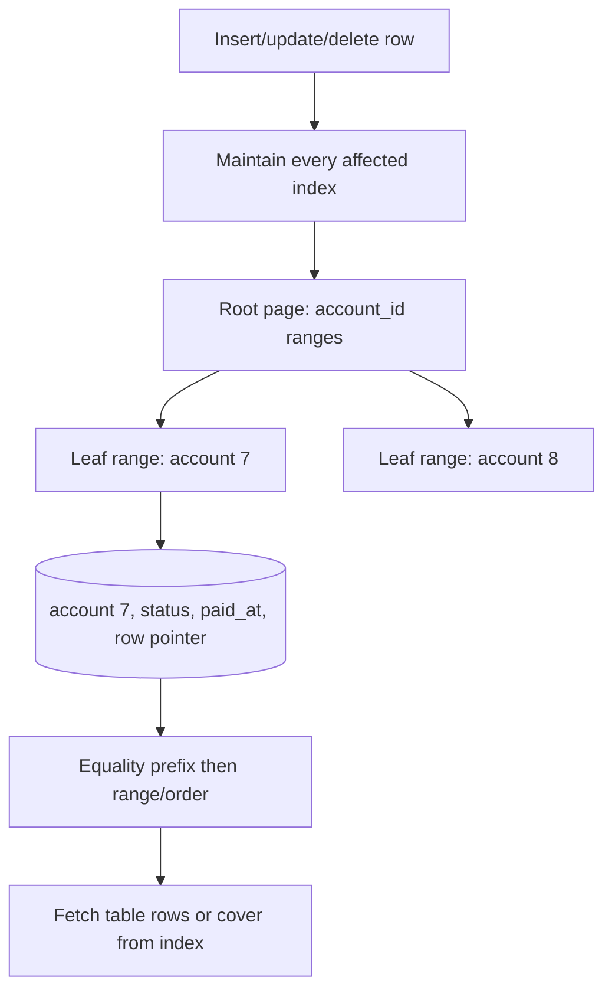
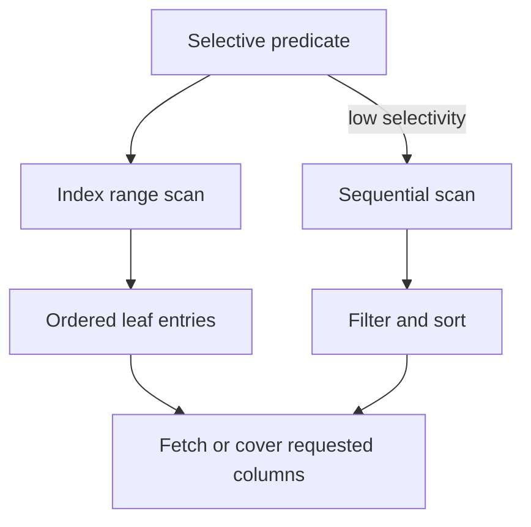
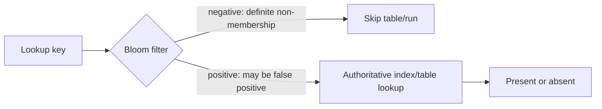

# Indexing Deep Dive: Access Paths, Selectivity, and Write Cost

**Level:** L4–L5
**Status:** Reviewed (Terra PASS)
**Audience:** Engineers tuning OLTP/analytics workloads or preparing for an L4–L5 database interview
**Prerequisites:** B-trees, hashing, SQL predicates, and execution plans
**Sequence:** Batch 1, 7/8
**Terra gate:** approved

## Learning objectives

- Choose an index from predicates, ordering, projection, skew, and write rate.
- Explain composite-key prefix behavior and selectivity.
- Compare B-tree, hash, LSM, bitmap, and inverted structures.
- Diagnose plan regression and quantify read benefit against write/storage cost.

## What it is

An index is an auxiliary access structure that maps search keys to rows or
records. It reduces work for some predicates at the cost of storage, maintenance,
cache pressure, build time, and sometimes write latency. “Indexed” does not mean
“fast”: the optimizer can choose a scan when a predicate matches too many rows or
the table is small.

## Why it exists and why it matters

Without an access path, a point lookup may inspect every row. With an appropriate
index, a database can locate a narrow key range and then fetch matching rows.
Poor indexes increase write amplification and still leave important queries
scanning. Index design is therefore workload design: list predicates, ordering,
result width, update frequency, skew, and retention before choosing a structure.

## Mental model: a B-tree path and a composite prefix



For `(account_id, status, paid_at)`, a query that constrains `account_id` can
use the leading range. A query that only constrains `status` usually cannot use
the same B-tree efficiently because entries are not grouped by status first.
An index may still be used for a scan or bitmap operation; inspect the actual
plan rather than applying a slogan mechanically.

## Topic-specific visual



The index path wins only when its navigation and row-fetch work are cheaper than
the scan path. Selectivity, cache state, result width, and concurrency determine
the choice; the visual is a plan hypothesis, not a universal timing claim.

## Index structures

### B-tree

B-trees keep sorted keys in pages designed to reduce random I/O and support
point, prefix, range, and ordered access. Typical asymptotic lookup is `O(log n)`
page levels, but real latency depends on cache, page size, selectivity, table
fetches, concurrency, and storage. A range result of `k` rows does not cost only
`log n`; it also must visit and return those `k` entries/rows.

### Hash indexes

Hashing is appropriate for equality lookup when the engine supports the needed
durability/concurrency semantics. It does not naturally provide ordering or
range scans. A hash table's average constant-time claim assumes a healthy load
factor and is not a universal disk-latency claim.

### LSM trees

LSM systems write sorted runs and compact them in the background. They can turn
random writes into sequential work, but reads may consult multiple structures,
and compaction consumes I/O/CPU and can create write amplification. Bloom filters
are probabilistic membership filters checked before an authoritative lookup:

| Filter result | Meaning | Action |
| --- | --- | --- |
| Negative | The key is definitely not in the set represented by the current, correct filter | Skip that table/run lookup |
| Positive | The key may be present; this can be a false positive | Check the authoritative index/table |

Under normal operation a current, correct Bloom filter has no false negatives. A
negative result therefore proves non-membership for that filter's set; a positive
result never proves membership. The authoritative lookup remains necessary after
every positive result.



### Bitmap and inverted indexes

Bitmaps are effective for low-cardinality analytical predicates and combine sets
with bit operations, but frequent high-cardinality updates can be expensive.
Inverted indexes map terms to documents and support search ranking; they are not
a replacement for relational uniqueness or transactional constraints.

## Worked example: orders by tenant and time

Assume 80 million orders, 5,000 tenants, 300 inserts/s peak, and a dashboard
request for one tenant's paid orders from the last 24 hours ordered newest first.
The query is selective for most tenants but one tenant contributes 25% of rows.

```sql
CREATE INDEX orders_tenant_state_time
    ON orders (tenant_id, state, created_at DESC, order_id DESC);

SELECT order_id, created_at, total
FROM orders
WHERE tenant_id = :tenant
  AND state = 'paid'
  AND created_at >= :start
  AND created_at < :end
ORDER BY created_at DESC, order_id DESC
FETCH FIRST 100 ROWS ONLY;
```

The equality prefix narrows the tenant/state region; time is a range and order;
`order_id` makes ties stable. If the dashboard needs only these columns, a
covering/include option might avoid table lookups, but the wider index costs
space and maintenance. Benchmark with tenant skew, cache-cold reads, concurrent
writes, and retention growth. Record plan, rows, buffers, p95/p99, write
latency, index size, and build/replication impact.

## Composite, partial, and covering indexes

“Equality before range” is a useful starting heuristic when the query has a
stable equality prefix. Column order must be tested across the query portfolio;
an index that helps one endpoint may be useless for another. A partial/filtered
index can shrink an index for a stable predicate such as `state = 'open'`, but
the predicate must match engine rules and data lifecycle. A covering index can
avoid base-table fetches for a narrow projection; it cannot make a low-selective
predicate cheap by magic.

## Advantages and limitations

| Index | Advantages | Limitations / trade-offs |
| --- | --- | --- |
| B-tree | Point, prefix, range, and ordered access; mature tooling | Page maintenance, storage, and poor benefit for low selectivity |
| Hash | Equality-oriented lookup and compact conceptual model | No natural range/order; collisions/load and engine support matter |
| LSM | Write-friendly sequential runs and scale-out patterns | Read amplification, compaction I/O, and write amplification |
| Bitmap | Compact set operations for low-cardinality analytics | Update-heavy workloads and high cardinality can be expensive |
| Inverted | Term lookup, ranking, and document retrieval | Eventual indexing/refresh and no general transactional constraint semantics |

## Selectivity, cardinality, and the cost model

Selectivity is the fraction of rows that satisfy a predicate; cardinality is the
number of resulting rows. An index is most useful when it avoids enough table
work to offset traversal and random fetches. A low-cardinality `status` index
may be useful when combined with tenant/time or as a bitmap in analytics, but a
standalone index on a value present in nearly every row may lose to a scan.

The optimizer estimates these values from statistics. Correlated columns (for
example, `country` and `timezone`) can fool independent-column estimates. Data
skew and parameter-sensitive queries can make one cached plan good for one tenant
and bad for another. Compare plans across representative parameter buckets.

### Query-to-index worksheet

| Query property | Design question |
| --- | --- |
| Equality | Which columns are usually exact filters? |
| Range/order | Which column is ranged or sorted, and where does the range stop prefix use? |
| Projection | Can an include/covering choice avoid many base-row fetches? |
| Write rate | Which indexes are touched by insert/update/delete? |
| Skew | Does one tenant/key dominate rows or requests? |
| Lifecycle | Does a partial index predicate remain stable during retention/archival? |

This worksheet prevents selecting an index from column names alone.

## Physical behavior and write amplification

B-tree page splits, random writes, WAL, and cache eviction can increase write
latency. LSM compaction can temporarily compete with foreground reads/writes and
leave tombstones until a later merge. A covering index can reduce table reads but
make every update to an included column touch more bytes. Measure p95/p99 write
latency and storage/I/O, not only a single read benchmark.

### Safe index lifecycle

1. Establish query and write baselines, including plans and index usage.
2. Build a candidate online/concurrently if the engine supports it; reserve disk
   and monitor locks, replication, and cancellation behavior.
3. Compare representative reads and writes under concurrency.
4. Observe use over a complete workload/retention window, not a quiet hour.
5. Remove redundant/unused indexes with a rollback plan and post-change alerts.

An index usage counter that says zero may miss a rare but critical job; check
scheduled workloads, migrations, and failover nodes before dropping it.

## Partitioning and indexes

Partition pruning can remove entire table partitions before local indexes are
used. A local index on `(tenant_id, created_at)` may be appropriate inside time
partitions, while a global index can complicate movement and failover. Keep
partition key, retention, query pruning, and index rebuild policy in one design;
an index does not compensate for an unbounded historical scan.

## Worked plan review: a multi-tenant orders table

Start with a query portfolio, not one endpoint:

```text
Q1: one tenant + paid + last day + newest 100
Q2: one order by ID
Q3: nightly count by state for all tenants
Q4: insert/update at peak, with 90-day retention
```

`(tenant_id, state, created_at DESC, order_id)` is a candidate for Q1. A direct
primary-key index handles Q2. Q3 may need partition pruning or an analytical
projection rather than forcing the OLTP index to serve a full scan. Q4 measures
the maintenance cost of every candidate. A single composite index should not be
credited with solving all four access patterns.

### Plan evidence table

| Observation | Likely hypothesis | Verification |
| --- | --- | --- |
| Estimated rows far below actual | stale/correlated statistics | refresh stats; compare histogram/plan |
| Index scan fetches most table pages | low selectivity | compare buffers with sequential scan |
| Reads improve, writes regress | index maintenance/page splits | measure WAL, write p99, index pages |
| Plan differs by tenant | skew/parameter sensitivity | run representative parameter buckets |
| Compaction backlog rises | LSM write/read amplification | inspect run count, tombstones, compaction I/O |

## Testing and rollback

Use correctness tests for `NULL`, duplicate, range-boundary, collation, and
concurrent update behavior. Use performance tests for cold/warm cache, realistic
skew, retention growth, build, failover, and drop. Keep the old plan baseline and
an index rollback command. A benchmark that runs once on an empty cache cannot
justify a production index or a universal latency claim.

## Failure modes and operations

- **Wrong index order:** compare the full query workload, not one query; use
  plan evidence and remove redundant indexes after an observation period.
- **Low selectivity:** a status value covering most rows may make a scan cheaper;
  combine with tenant/time or use a partial/partition strategy where justified.
- **Stale statistics:** refresh/analyze after bulk changes and monitor estimated
  versus actual rows and plan fingerprints.
- **Write regression:** measure insert/update latency, lock/page contention, WAL,
  replication, and index size after every new index.
- **Build pressure:** use online/concurrent facilities where supported, throttle
  or schedule builds, check disk headroom, and test cancellation/recovery.
- **Index corruption or drift:** use engine checks, rebuild procedures, and
  compare index-backed results with a trusted scan in a controlled sample.

## Practical exercises

1. Choose indexes for three queries over `users(tenant_id, email, state,
   created_at)`. **Expected approach:** list predicate/order/result patterns,
   propose candidates, explain leftmost-prefix use, and reject redundant indexes.
2. An index consumes 500 GB. **Solution outline:** inspect usage and duplicate
   prefixes, find safely unused candidates over a representative window, consider
   partial/covering alternatives, and estimate rebuild/drop rollback impact.
3. Writes became slower after adding an index. **Expected approach:** compare
   write latency/WAL/page splits and query benefit; use a concurrent shadow build
   or remove the index only after confirming no critical consumer depends on it.
4. A plan changed after a bulk load. **Expected approach:** compare statistics,
   data skew, parameters, estimates, and cache; refresh statistics, benchmark,
   and roll out a targeted fix with monitoring.

## Interview Q&A

### Q1. Why can an index be ignored?

**Answer:** Missing leading columns, non-sargable expressions, low selectivity,
stale statistics, table size, or a cheaper alternative. **Follow-up:** ask for
the actual plan and estimated/actual rows, not a hint first.

### Q2. How do composite indexes use the leftmost prefix?

**Answer:** Entries are ordered by the first key, then the second within that
key, so constraints on the leading prefix enable narrow navigation. **Follow-up:**
ask about a query constraining only the second column and possible alternatives.

### Q3. Are B-tree lookups O(log n)?

**Answer:** Page-level navigation is often logarithmic, but total work includes
cache misses, matching rows, table fetches, and concurrency. **Follow-up:**
explain why a 40% selective predicate may favor a scan.

### Q4. Why can an index slow writes?

**Answer:** Each affected index needs page/log maintenance, and random updates
can cause splits, WAL, cache eviction, or compaction. **Follow-up:** measure
write amplification and read benefit under the real write mix.

### Q5. When does a covering index help?

**Answer:** When a narrow query can return all needed columns from the index and
avoid many base-row fetches. **Follow-up:** compare its size and update cost with
the frequency and selectivity of the read.

### Q6. B-tree or hash?

**Answer:** B-tree for general equality/range/order use; hash for supported pure
equality workloads where ordering is irrelevant. **Follow-up:** discuss collision,
durability, and engine-specific implementation details.

### Q7. Why do LSM compactions matter?

**Answer:** They merge sorted runs, improving read organization but consuming
background I/O/CPU and creating write amplification. **Follow-up:** identify
read amplification, tombstones, and compaction backlog metrics.

### Q8. How do you safely remove an index?

**Answer:** verify usage over an adequate window, check plans for critical
queries, build alternatives if needed, remove with a reversible/online method,
and monitor after. **Follow-up:** cover an unexpected workload that appears
after the observation window.

## Appendix: index review worksheet

For each proposed index, attach the query fingerprint, predicate/order shape,
estimated selectivity, result width, write columns affected, existing similar
indexes, storage estimate, build method, and rollback. Review both the query that
motivated the index and queries that could regress because of a changed plan.

```text
Candidate: (tenant_id, state, created_at DESC, order_id)
Primary query: tenant + state + last-day ordered page
Expected result: <=100 rows, but test worst tenant skew
Benefit evidence: actual plan and buffers before/after
Costs: insert/update p99, index bytes, build I/O, replica lag
Rollback: drop candidate after usage/plan review; retain baseline
```

### Correctness versus speed

An index must preserve collation, `NULL` ordering, uniqueness, and visibility
semantics. A faster plan that returns rows in a different collation or violates
a partial-index predicate is not an optimization. Test range endpoints, `NULL`,
duplicate keys, concurrent updates, and a transaction that cannot yet see an
uncommitted row.

### Capacity guardrails

Reserve disk for index build plus rollback/rebuild headroom. Watch page splits,
cache hit rate, WAL/compaction bytes, lock waits, and replica catch-up while a
new index is built. If read improvement is small but write amplification is
large, prefer query shape changes, partition pruning, a projection, or an
analytical store rather than accumulating indexes.

## Related and next reading

- [Advanced SQL query plans](01-sql-advanced.md)
- [NoSQL partition-key access patterns](02-nosql-advanced.md)
- [Database replication and failover](15-database-replication.md)
- [Change data capture and index refresh](20-change-data-capture.md)
