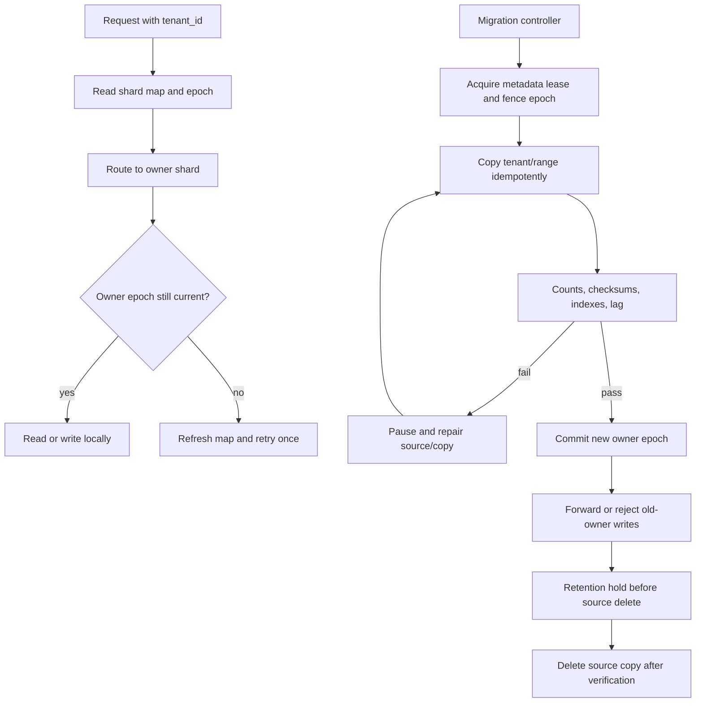
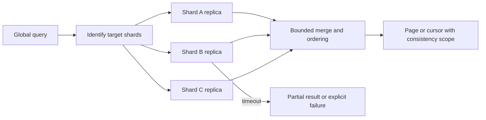

# Advanced Sharding

**Level:** L5
**Status:** Reviewed (Terra PASS)
**Audience:** Engineers designing multi-tenant database capacity, routing, rebalancing, and online shard migrations
**Prerequisites:** partitioning, replication, transactions, consistent hashing, queues, and capacity modeling
**Sequence:** Batch 2A, 6/8
**Terra gate:** approved

## Learning objectives

- Model tenant and order workload with skew, headroom, replica capacity, cross-shard rate, and migration bandwidth.
- Select a routing scheme while stating the assumptions behind consistent hashing and directory routing.
- Design a rebalance flow with metadata availability, fencing, idempotent copy/delete, validation, and cutover.
- Explain why sharding does not guarantee perfect distribution, linear scale, or cheap cross-shard operations.
- Define operational signals and interview trade-offs for global indexes, transactions, and hot tenants.

## What it is

Sharding partitions a logical dataset across independent storage or compute units called shards.

A shard key maps each record or tenant to an ownership location.

Routing may be computed from a hash, range, directory, or a hybrid of those methods.

The shard map is metadata that must itself be available, versioned, and protected from split-brain updates.

Replication within a shard improves availability or read capacity but does not remove the shard's write bottleneck.

Sharding is a workload placement strategy; it does not make every query, transaction, index, or migration local.

Examples use tenant and order data, but the chosen key and topology must follow real access patterns.

## Why it matters

A single database can become constrained by write throughput, storage size, connection count, maintenance windows, or failure blast radius.

Sharding can distribute those constraints, but it adds routing, metadata, operational, and cross-shard complexity.

A perfectly even row count can still be a bad distribution if one tenant generates most writes or queries.

An apparently independent shard may share network, storage, control-plane, or replica capacity with its neighbors.

The goal is bounded risk and useful isolation, not a mathematical claim that all work scales linearly.

## Mental model

A request carries a routing key, the router reads a map version, and the chosen shard enforces ownership.

The map has epochs or versions so a request can detect that ownership changed during a migration.

A migration copies a source range or tenant, validates it, fences writes or forwards them, then commits a new owner.

Deletes occur only after a durable cutover and retention hold.

Cross-shard queries fan out and merge results, increasing latency and partial-failure surface.

Cross-shard transactions require coordination, reservations, or a business workflow; a shard key cannot make an arbitrary global invariant local.

## Topic-specific visual

### Routing and rebalance visual

The epoch is the invariant that prevents a stale router or old owner from accepting writes after cutover.

### Cross-shard query visual

Fan-out degree, timeout policy, result ordering, and partial-result semantics must be part of the API contract.

## Worked example

### Tenant/order workload

Assume 10,000 tenants, 1.2 billion orders, 18,000 order writes per second at peak, and 120,000 order reads per second.

Assume tenant 7 contributes 18% of writes and 12% of reads, while the median tenant contributes less than 0.01%.

Assume 12 primary shards, each with one synchronous or near-synchronous replica, and a target of 65% average write capacity before headroom.

Assume measured sustainable write capacity is 2,500 writes/s per shard for this schema and index set.

Nominal total write capacity is `12 × 2,500 = 30,000 writes/s`, but a 65% operating target gives `30,000 × 0.65 = 19,500 writes/s`.

The 18,000 peak fits with only 1,500 writes/s modeled margin before skew and maintenance.

If tenant 7 remains on one shard, its 18% share is `18,000 × 0.18 = 3,240 writes/s`, above the measured 2,500 writes/s shard capacity.

This is a hot-tenant problem even though aggregate capacity looks adequate.

Possible responses are tenant isolation, sub-sharding a tenant by order ID/time, write serialization, or a domain redesign.

Sub-sharding can make tenant-local queries fan out and can complicate uniqueness and ordering.

Assume 15% of read requests are global search or admin queries that touch multiple shards.

Cross-shard request rate is `120,000 × 0.15 = 18,000 requests/s`.

If a query fans out to 12 shards, it creates up to `18,000 × 12 = 216,000 shard calls/s` before retries.

Bound fan-out and use a search/index service or precomputed aggregate when the product can tolerate its consistency model.

Assume a migration moves 2 TB over a 10 Gbit/s link.

The raw link ceiling is `10 Gbit/s / 8 = 1.25 GB/s`.

At an assumed 35% usable fraction after protocol, replication, foreground traffic, and throttling, copy throughput is about `1.25 × 0.35 = 0.4375 GB/s`.

The ideal transfer time is `2,000 GB / 0.4375 GB/s ≈ 4,571 s`, or 76 minutes.

Real copy time includes reads, serialization, checksum, index handling, change capture, retries, and catch-up.

Reserve migration bandwidth so the source remains inside its write and replication budgets.

## Advantages and limitations

Sharding can isolate tenant growth, distribute storage, and reduce one database's failure blast radius when routing and ownership are sound.

It adds metadata dependencies, cross-shard fan-out, global-index maintenance, migration protocols, and more complicated incident recovery.

Replication can improve read availability but adds storage and bandwidth and does not make a hot primary key or global invariant local.

If a 20% migration headroom rule is selected for this exercise, usable migration throughput is at most `0.35 × normal link budget`; the actual guardrail must come from observed impact.

### Capacity and skew table

| Dimension | Worked value | What it reveals | Caveat |
| --- | ---: | --- | --- |
| Peak writes | 18,000/s | Aggregate demand | Retries and maintenance can increase it |
| Shards | 12 | Placement count | Shared infrastructure can correlate failures |
| Measured shard capacity | 2,500 writes/s | Engine/schema limit | Version, indexes, hardware, and workload specific |
| Target utilization | 65% | Headroom before saturation | Policy choice, not a universal safe percentage |
| Hot tenant share | 18% | 3,240 writes/s on one shard | Needs isolation or a different key |
| Cross-shard reads | 18,000/s | Up to 216,000 shard calls/s | Fan-out, retries, and partial results matter |

The right shard count changes when schema, indexes, replicas, query mix, and hardware change.

## Shard-key design

A good key makes common transactions and queries local, has enough cardinality, and avoids predictable concentration.

Tenant ID is strong for tenant-local isolation but can hot-spot a large tenant.

Hashing tenant ID spreads tenants but does not split one tenant.

Hashing order ID spreads writes but makes tenant order history fan out.

Time ranges simplify retention and locality but can make the newest range hot.

Composite routing can isolate large tenants and hash smaller ones, but the directory logic must be explicit.

Do not select a key from row-count uniformity alone; include write rate, read rate, transaction boundary, size, growth, and failure impact.

### Consistent hashing assumptions

Consistent hashing reduces remapping when the ring membership changes under specific hashing and virtual-node assumptions.

It does not guarantee equal load, because key popularity and tenant size are not uniform.

The ring needs a stable hash function, deterministic member identity, a versioned membership set, and a routing agreement across clients.

Virtual nodes improve placement granularity but add metadata and movement work.

Large tenants still require explicit isolation or a split strategy.

Changing hash function, seed, normalization, or virtual-node count can move many keys; treat it as a migration.

### Directory routing

A directory maps tenant or range to an owner shard and epoch.

It supports exceptions and hot-tenant placement more directly than a pure hash ring.

The directory is a highly available control-plane dependency; stale or unavailable metadata can block correct writes.

Cache directory entries with an epoch and bounded TTL, but reject or refresh on an epoch mismatch.

Use a durable consensus or transactional metadata store appropriate to the failure model; do not keep the only map in one process.

## Comparison: placement strategies

| Strategy | Locality | Strength | Limitation |
| --- | --- | --- | --- |
| Hash key | Even key-space under assumptions | Simple routing and low range hotspots | Poor locality for range/tenant queries; one hot key remains hot |
| Range key | Ordered/time locality | Efficient range scans and retention | Moving hot newest ranges and uneven distributions |
| Consistent hash ring | Bounded remap under membership changes | Incremental membership movement | Popularity skew, ring metadata, and split assumptions remain |
| Directory | Explicit ownership exceptions | Hot-tenant isolation and controlled migration | Metadata availability, cache invalidation, and control-plane complexity |

None provides perfect distribution or linear scale without workload assumptions.

## Comparison: cross-shard designs

| Design | Consistency and latency | Operational cost | Fit |
| --- | --- | --- | --- |
| Shard-local transaction | Strong within one shard; low coordination | Requires local key and schema discipline | Tenant-local order update |
| Coordinator/two-phase commit | Atomic across participants when coordinator recovers correctly | Blocking/recovery complexity and participant availability | Small, rare critical multi-shard invariant |
| Saga/workflow | Local commits with compensating actions | Intermediate states and compensation design | Business process with reversible steps |
| Global index/aggregate | Fast global lookup after update | Index maintenance, lag, and rebuild path | Search/reporting that can state freshness |
| Fan-out query | Fresh participant reads if available | Tail latency, partial failures, and network cost | Small bounded shard count and admin reads |

Choose by invariant and failure semantics, not by a blanket “distributed transactions are bad” rule.

## Metadata availability and fencing

The router needs a consistent enough map to decide ownership.

Store map entries with shard ID, epoch, state, migration source/target, and an expiration or lease policy.

During migration, the controller advances an epoch only after copy and validation complete.

Old owners must reject writes with a stale epoch or forward them under a defined protocol.

Fencing tokens prevent a paused old worker from deleting or writing after a new owner takes over.

The metadata service needs backups, quorum behavior, monitoring, and a manual recovery procedure.

If metadata is unavailable, reads may use a bounded cache only for operations whose staleness is safe; writes should fail closed when ownership is uncertain.

## Rebalancing and migration

Copy data in resumable chunks keyed by tenant/range and source position.

Make each chunk idempotent with a deterministic key and an observed source version.

Capture changes after the copy snapshot through an outbox, CDC stream, or source-side change log.

Validate counts, checksums, sampled business invariants, indexes, constraints, and replica lag.

Use a retention hold after cutover; source deletion is not part of the first success transition.

If catch-up cannot keep pace, pause, throttle, or split the migration rather than claiming a zero-downtime guarantee.

Test retry, duplicate copy, missed change, worker crash, metadata failover, and old-owner fencing.

Global indexes need their own build, lookup consistency, repair, and deletion policy.

### Migration states

`planned` records assumptions, owner, target, capacity reservation, and rollback boundary.

`copying` tracks snapshot and chunk checkpoints.

`catching_up` applies changes and measures lag.

`validated` records evidence but does not yet change ownership.

`cutover` fences the old owner and commits the new epoch.

`hold` preserves the source for a defined recovery window.

`deleted` is irreversible for the source copy and requires a separate approval.

## Failure modes and operations

### Capacity by bytes and work

Track logical bytes, index bytes, write amplification, compaction/vacuum work, query CPU, storage latency, and network traffic per shard.

A shard with fewer rows can be the most expensive if rows are wide or indexed heavily.

Reserve capacity for replica catch-up, schema changes, backups, and migration copy traffic.

Use p95 or p99 workload slices for hot tenants instead of planning from average shard utilization.

### Tenant isolation choices

Small tenants can share a shard, while large tenants can receive dedicated placement or a bucketed sub-shard scheme.

Dedicated placement reduces noisy-neighbor risk but increases map entries, idle capacity, and operational objects.

Sub-sharding by order bucket can spread writes but changes transaction locality and may require a per-tenant fan-out merge.

Choose the boundary from business invariants such as tenant uniqueness, order sequencing, and billing totals.

### Global indexes and deletes

A global index entry must carry shard owner, map epoch, record version, and deletion/tombstone status.

Update the index transactionally with local state where possible or publish an idempotent event and expose index lag.

Do not route a destructive delete from an unverified stale global index.

Retain tombstones until all consumers and old owners have passed the replay horizon.

### Migration bandwidth controls

Reserve separate read, write, and replication budgets for data movement; a raw network link is not available migration capacity.

Throttle by bytes, rows, and destination apply lag, whichever guardrail is reached first.

A migration worker must checkpoint the source position and map epoch so it can resume after a controller or shard restart.

Run a canary tenant first and compare source/target latency, checksums, and foreground error rate.

### Metadata recovery

Back up the shard map with epochs and migration state, and test restoring it without allowing stale owners to write.

Use a quorum or transactional metadata system with an explicit unavailable behavior.

If map recovery is uncertain, serve only safe cached reads and fail writes closed.

### Hot shards

Measure per-shard CPU, writes, reads, lock waits, queue depth, storage, largest tenants, and tail latency.

Mitigate with tenant isolation, salted or bucketed subkeys, read replicas, write batching, or schema redesign.

Salting can require fan-out on reads and complicate ordering; record that trade-off.

### Cross-shard partial failure

Define whether the API fails closed, returns partial data with an explicit marker, or uses a stale aggregate.

Never silently turn a global authorization or money total into a partial result.

### Metadata outage

Cache only safe reads, preserve epochs, fail writes closed when ownership is uncertain, and restore metadata from its tested recovery path.

### Migration divergence

Stop cutover, retain source, compare checkpoint/change positions, and repair idempotently.

Do not delete the source to hide a mismatch.

### Replica or region failure

Apply the shard's replication and RPO/RTO policy; shard count does not create independence if replicas share a failure domain.

### Operational checklist

1. Name shard key, workload dimensions, capacity, headroom, and failure domains.
2. Capture map epoch and route every operation through an ownership check.
3. Bound fan-out and define partial-result semantics.
4. Reserve migration bandwidth and monitor source/target impact.
5. Copy, catch up, validate, fence, cut over, and hold the source.
6. Delete only after retention, audit, and recovery approvals.

## Practical exercises

### Exercise 1: Identify a hot tenant

Twelve shards each sustain 2,500 writes/s, peak demand is 18,000 writes/s, and one tenant produces 3,240 writes/s. Diagnose the design.

**Expected approach:** Aggregate target capacity with headroom is `12 × 2,500 × 0.65 = 19,500 writes/s`, but the hot tenant exceeds one shard's 2,500 writes/s. Propose isolation or sub-sharding and explain query/transaction fan-out consequences.

### Exercise 2: Compare hash and directory routing

A service has 9,000 small tenants and 10 very large tenants with tenant-local transactions. Choose a routing strategy.

**Solution:** A directory or hybrid route can hash small tenants and explicitly place large tenants. Pure consistent hashing still leaves each large tenant concentrated and does not guarantee balanced work. Version the map, cache epochs, and test metadata failure.

### Exercise 3: Design a rebalance protocol

A 500 GB tenant must move while writes continue. Specify states, checkpoints, validation, fencing, and deletion hold.

**Expected approach:** Plan, snapshot/copy idempotent chunks, capture and apply changes, measure catch-up, validate counts/checksums/invariants, fence old epoch, commit new owner, retain source, and delete only after an explicit hold. Define retry and failure behavior at every state.

### Exercise 4: Cross-shard order total

An admin endpoint fans out to 20 shards and one shard times out. Decide whether to return a total.

**Solution:** A financial total cannot be silently partial; fail closed or return an explicit incomplete result with freshness and missing-shard metadata. Consider a maintained global aggregate with a stated lag contract for a usable alternative.

## Interview Q&A

### Q1. Does sharding provide linear scaling?

**Answer:** Not as a universal claim. Local work may distribute, but hot keys, cross-shard fan-out, coordination, shared infrastructure, metadata, and migrations can dominate.

**Follow-up:** Which workload measurement disproves linear scaling?

### Q2. What makes a good shard key?

**Answer:** It aligns common transaction/query locality, has enough cardinality, and spreads actual bytes and work while respecting tenant isolation and growth.

**Follow-up:** Why can tenant ID still be hot?

### Q3. What does consistent hashing assume?

**Answer:** Stable deterministic hashing, shared member/virtual-node configuration, versioned membership, and a workload whose popularity is not dominated by one key. It bounds remapping under membership changes; it does not equalize load automatically.

**Follow-up:** What happens when the hash seed changes?

### Q4. Why is metadata a critical dependency?

**Answer:** A stale map can route reads or writes to the wrong owner. It needs durability, availability, epochs, fencing, monitoring, backup, and a tested recovery path.

**Follow-up:** Should a cached map accept writes during metadata outage?

### Q5. How do you migrate a live shard?

**Answer:** Copy a snapshot in resumable idempotent chunks, apply changes, validate, fence the old owner with an epoch, cut over, retain the source, and delete only after a hold.

**Follow-up:** What if catch-up falls behind?

### Q6. How do global indexes work?

**Answer:** They maintain a separate mapping or service from global key to shard/record. They add update lag, rebuild, consistency, and deletion failure modes.

**Follow-up:** Can the index be authoritative for a critical invariant?

### Q7. What is a cross-shard transaction trade-off?

**Answer:** Coordination can provide atomicity but adds participant availability and recovery complexity; sagas preserve local commits but expose intermediate state and require compensation.

**Follow-up:** Which business effects should remain local?

### Q8. How do replicas change shard capacity?

**Answer:** Replicas can serve some reads or improve failover, but they add replication bandwidth/storage and do not remove a primary's write or hot-key limit.

**Follow-up:** What consistency contract applies to replica reads?

### Q9. How do you detect skew?

**Answer:** Measure per-shard bytes, writes, reads, latency, locks, largest tenants, and fan-out, not just row counts or average utilization.

**Follow-up:** What mitigation could increase read cost?

### Q10. What should happen on stale-owner writes?

**Answer:** The old owner must reject or safely forward using the current epoch; fencing prevents a paused worker from writing after cutover.

**Follow-up:** Why is deleting the old source immediately unsafe?

## Related and next reading

- [Database replication](15-database-replication.md) for shard replica and failover behavior.
- [Eventual consistency](21-eventual-consistency.md) for asynchronous routing and stale reads.
- [Migration strategies](26-migration-strategies.md) for expand-contract and resumable movement.
- [Distributed transactions](12-distributed-transactions.md) for cross-shard coordination and sagas.
