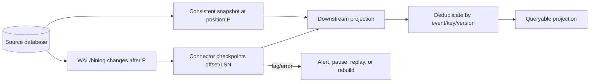
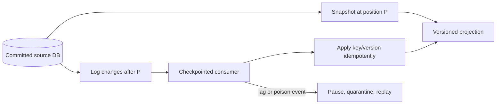

# Change Data Capture: Logs, Snapshots, Ordering, and Recovery

**Level:** L4–L5
**Status:** Reviewed (Terra PASS)
**Audience:** Data/platform engineers building replayable integrations or preparing for an L4–L5 distributed-data interview
**Prerequisites:** transactions, WAL/binlogs, message delivery, schemas, and offsets
**Sequence:** Batch 1, 8/8
**Terra gate:** approved

## Learning objectives

- Choose log-, query-, or trigger-based CDC for a stated freshness/load budget.
- Explain the snapshot-to-stream boundary and per-key/transaction ordering.
- Design replayable consumers with offsets, versions, and idempotency.
- Operate lag, schema evolution, deletes, quarantine, and connector recovery.

## What it is

Change data capture turns committed database changes into a downstream stream or
change log. Log-based CDC reads a database's WAL/binlog; query-based CDC polls a
marker such as `updated_at`; trigger-based CDC writes an explicit change row
during the source transaction. CDC is a delivery mechanism and ordering contract,
not automatically a domain-event model.

## Why it exists and why it matters

Analytics stores, search indexes, caches, audit consumers, and integrations need
updates without repeatedly scanning the primary database. A reliable pipeline
must answer: which commit is represented, which rows are visible, how deletes
are captured, what order is guaranteed, how duplicates are handled, and how a
new consumer gets an initial consistent view.

## Mental model: snapshot then ordered log



The snapshot and log must meet at a known position `P`; otherwise changes can
be skipped or applied twice across the handoff. A consumer offset is a recovery
cursor, not proof that the business effect was committed—store effect state and
offset atomically when the sink permits, or make effects idempotent.

## Topic-specific visual



The snapshot and log meet at `P`; that boundary prevents a missing change during
bootstrap. The consumer checkpoint supports recovery, while idempotent key/version
application makes a crash after the sink write safe to replay.

## Capture methods

### Log-based

The connector reads committed log records without adding a query per table row.
It can capture updates and deletes, but needs log retention, permissions,
connector compatibility, schema decoding, and a policy for transactions. A
transaction's events may be grouped or exposed in commit order depending on the
connector; never assume global row order without checking its contract.

### Query-based

Polling `updated_at > checkpoint` is simple but can miss deletes, rows sharing a
timestamp, clock-skewed writes, and updates made without changing the marker.
Use a monotonic `(updated_at, primary_key)` cursor, overlap/reconciliation, and a
delete/tombstone strategy if polling is unavoidable. It adds read load to the
source and has poll-interval latency.

### Trigger-based

Triggers can write an outbox/change row in the source transaction and capture
deletes, but add synchronous write work and couple application progress to the
change-log schema. They are useful when a reliable database log is unavailable;
keep payload size, retry, and retention bounded.

## Worked example: orders to search and warehouse

### Assumptions

Assume 5,000 order writes/s at peak, a search projection target of under two
minutes freshness, and a warehouse that tolerates longer batching. The source
database retains seven days of log, while a consumer may be offline for ten.
The seven-day retention is insufficient for guaranteed catch-up; the design needs
an archive/sink or a rebuild procedure.

### Bootstrap and steady state

1. Record a source position `P` and start a consistent snapshot.
2. Load snapshot rows into a versioned projection.
3. Start log consumption at `P`, applying inserts/updates/deletes with source
   transaction/version metadata.
4. Verify counts, checksums/sample keys, delete behavior, and lag before serving
   the projection.
5. Persist a source position and projection version for every applied batch.

For an update event, carry primary key, operation, changed/before/after fields
as permitted, commit timestamp/position, schema version, and transaction ID.
Consumers should upsert only if the event version is newer than the stored
version; delete events should be tombstones with an explicit retention policy.

## Ordering, duplicates, and exactly-once language

At-least-once delivery is common: a crash after the sink effect but before the
offset commit causes a replay. Make the effect idempotent using `(source,
primary_key, version)` or a durable event ID. Ordering is usually guaranteed per
partition/key, not globally. If a search document receives version 8 before
version 7, reject the stale update or buffer according to a bounded policy.

“Exactly once” may describe a transactional boundary inside one platform; it is
not a safe end-to-end assumption across a database, connector, broker, and
external API.

## Advantages and limitations

| Method | Advantages | Limitations / trade-offs |
| --- | --- | --- |
| Log-based | Low source query load, captures deletes, near-commit stream | Log retention/decoding/version coupling and connector operations |
| Query-based | Simple, works without log access, easy to prototype | Poll latency, source read load, missed deletes/ties/marker bugs |
| Trigger/outbox | Atomic source-row plus change intent and explicit payload | Synchronous write overhead and schema/retention coupling |
| Full event sourcing | Domain events are an intentional source of truth and replayable | Requires event-first modeling; not every row update has a useful domain event |
| Periodic batch export | Simple bulk recovery and warehouse loading | High freshness delay and repeated data movement |

## Event envelope and consumer contract

A useful envelope separates transport metadata from the row payload:

```json
{
  "event_id": "mysql:orders:binlog-8842:row-17",
  "source": "orders-db",
  "table": "orders",
  "key": {"order_id": "1842"},
  "op": "update",
  "before": {"state": "paid"},
  "after": {"state": "shipped"},
  "source_position": "binlog-8842",
  "transaction_id": "tx-77",
  "schema_version": 4,
  "committed_at": "2026-08-31T17:03:00Z"
}
```

Whether `before` is available depends on the source configuration. Consumers
must not infer a delete from a missing `after` unless the envelope says `op`
is delete. Keep source positions opaque to consumers but stable for replay.

### Delivery contract

Document these properties for every topic/table:

| Property | Required decision |
| --- | --- |
| Delivery | At-least-once, transactional within a platform, or another bounded contract |
| Ordering | Per key, per partition, per transaction, or none |
| Retention | Long enough for consumer outage plus rebuild margin |
| Replay | How to start, reset, and avoid contaminating production side effects |
| Deletes | Tombstone payload, retention, and privacy verification |
| Schema | Compatibility policy, versioning, and quarantine behavior |
| Backpressure | Pause, spill, scale, or shed low-priority consumers |

Do not make an external API call directly from a replayable consumer without a
deduplication key and a replay policy. A rebuild should be able to update a
projection without sending old welcome emails or charging a customer.

## Transaction boundaries and ordering

If two rows change in one source transaction, downstream consumers may need the
transaction boundary to avoid observing an impossible intermediate state. A
connector may emit a transaction marker, group records, or only expose commit
positions. Verify the actual contract. If a search index can apply rows
independently, use record versions; if a ledger projection needs atomicity, use a
transaction-aware sink or stage/commit a batch.

Partitioning by primary key preserves per-entity order but can hotspot a popular
key. Partitioning by table or random event ID spreads traffic but loses entity
order. Choose with the consumer invariant and source skew in mind.

## Snapshot correctness and rebuilds

For a full rebuild, write into a new projection version rather than deleting the
live projection first. Record snapshot position `P`, load bounded chunks, and
consume changes after `P`. If the sink receives an event twice, its version
check must make the operation harmless. Validate:

- row/key counts by partition and time bucket;
- checksums or sampled field comparisons against the source;
- delete/tombstone completion and privacy erasure;
- newest applied source position and observed source-to-sink age; and
- behavior for a late, duplicate, malformed, or unknown-version event.

Switch readers atomically or by tenant after validation. Retain the old version
long enough to roll back, and keep the exact source position used for the cutover.

## Connector deployment and incident playbook

Before changing a connector, record current position, schema history, source log
retention headroom, and sink capacity. Deploy configuration changes to a shadow
consumer where possible. During a lag incident, first determine whether the
source, connector, broker, or sink is the bottleneck; blindly adding consumers
can break ordering or overload the sink. Pause low-priority projections to
preserve the primary freshness SLO.

For a poison event, retain payload, source position, schema version, and error;
quarantine it with an owner and replay command. Advancing past it may be correct
only if a documented data-loss/degraded policy says so and a compensating repair
is scheduled.

## Failure modes and operations

- **Connector crash/restart:** checkpoint offsets durably, replay from an overlap,
  and make sink effects idempotent. Test crash points around sink and offset.
- **Consumer lag:** monitor source-to-sink age, offset distance, throughput,
  retries, poison events, and log-retention headroom; scale partitions/consumers
  only when ordering and sink capacity allow it.
- **Snapshot handoff gap:** record and audit position `P`; compare source/sink
  counts and checksums. Rebuild if the boundary cannot be proven.
- **Schema evolution:** include schema version, add fields compatibly, route
  unknown versions to quarantine, and coordinate breaking changes with consumers.
- **Deletes and privacy:** capture tombstones, propagate deletion to every
  projection, verify absence, and retain only the minimum lawful audit data.
- **Out-of-order/stale updates:** use source versions/LSNs, reject stale events,
  or run a bounded reorder buffer; do not use wall-clock timestamps alone.
- **Poison data:** quarantine with payload, offset, error, and replay tooling;
  never advance the cursor past an unexamined event without an explicit policy.

## Practical exercises

1. Design snapshot plus binlog bootstrap. **Expected approach:** record position,
   consistent snapshot, consume from that position, deduplicate overlap, verify
   counts/checksums, then cut over.
2. Fix polling CDC with equal timestamps. **Solution:** use a lexicographic
   `(updated_at, id)` cursor plus overlap and a delete log/tombstone; explain
   clock precision and late updates.
3. A sink crashes after upsert but before offset commit. **Expected approach:**
   replay safely by event ID/source version, then commit the offset; test stale
   and duplicate events.
4. A consumer is offline longer than log retention. **Expected approach:** stop
   serving stale data, rebuild from a fresh snapshot plus retained post-snapshot
   log, validate, and record the recovery gap.

## Interview Q&A

### Q1. Why is log-based CDC usually preferred for high-volume updates?

**Answer:** It reads committed change records and can capture updates/deletes
without repeatedly querying the table, subject to log/connector behavior.
**Follow-up:** ask about retention, transaction ordering, and connector lag.

### Q2. What can query-based CDC miss?

**Answer:** Deletes, equal-marker rows, clock-skewed updates, and writes that do
not update the marker. **Follow-up:** design a compound cursor, overlap, and
reconciliation strategy.

### Q3. Why is snapshot coordination difficult?

**Answer:** The snapshot and change stream must meet at a known source position;
otherwise the consumer skips or duplicates changes. **Follow-up:** describe the
position handoff and verification.

### Q4. How do you handle duplicate events?

**Answer:** Persist an event ID/source key plus version and make the sink upsert
or effect idempotently. **Follow-up:** cover a crash between effect and offset.

### Q5. Is CDC globally ordered?

**Answer:** Usually no; ordering is commonly per partition/key or transaction,
depending on the connector. **Follow-up:** define the ordering required by the
consumer and what it does with version 8 before 7.

### Q6. How do you propagate deletes?

**Answer:** Capture delete records/tombstones, retain them long enough for all
consumers, apply them idempotently, and verify privacy deletion. **Follow-up:**
distinguish a tombstone from an absent row in a snapshot.

### Q7. How do you evolve the CDC schema?

**Answer:** Version envelopes, add compatibly, validate consumers, quarantine
unknown/bad versions, and coordinate breaking changes. **Follow-up:** include
replay of historical events after a schema upgrade.

### Q8. What metrics show a healthy CDC pipeline?

**Answer:** Source-to-sink age, offset/log distance, throughput, error/retry and
quarantine counts, log-retention headroom, snapshot progress, and projection
correctness samples. **Follow-up:** define the rebuild and alert thresholds.

## Appendix: CDC acceptance worksheet

Before onboarding a consumer, record:

| Field | Example decision |
| --- | --- |
| Source of truth | `orders` database; search is a projection |
| Bootstrap | snapshot at source position `P`, then stream after `P` |
| Delivery | at least once; sink upsert is idempotent |
| Ordering | per `order_id`; no global order promised |
| Delete | tombstone retained through consumer outage window |
| Schema | additive versions accepted; unknown versions quarantined |
| Replay | new projection version; no external side effects |
| Freshness | search under two minutes, measured source-to-sink age |

The consumer owner signs this contract before production. A consumer that needs
cross-row atomicity must use transaction markers or a staging/commit protocol;
it cannot infer atomicity from event arrival order.

### Reconciliation queries

Reconcile by partition and time window, not only total count. Compare source keys
with projection keys, source versions with applied versions, and expected deletes
with tombstone completion. Sample fields that affect search, billing, or access
control. Record false positives and false negatives separately because a count
match can hide one missing order and one extra order.

### Security and privacy

Minimize payload fields, encrypt transport and retained topics, restrict replay
permissions, and classify before/after values. A replay operator should not be
able to trigger a payment or expose a deleted personal field accidentally. Use a
projection-specific handler for side effects and require an explicit, audited
backfill mode.

### Terra review prompt

Verify the snapshot position handoff, delivery boundary, delete behavior,
schema-version policy, and crash-after-sink-before-offset test. Reject “exactly
once” unless its platform boundary is named and replay cannot repeat side effects.

## Related and next reading

- [Database replication and log positions](15-database-replication.md)
- [Distributed transactions and outbox boundaries](12-distributed-transactions.md)
- [NoSQL projections and repair](02-nosql-advanced.md)
- [Vector retrieval refresh and deletion](08-vector-databases.md)
