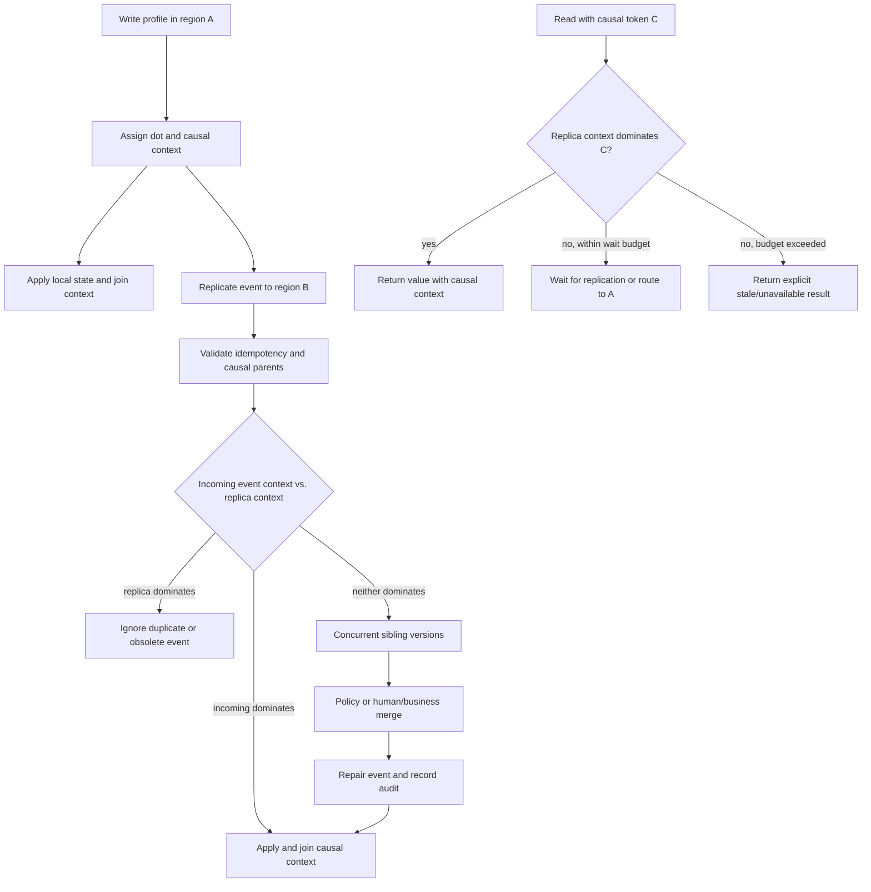

# Eventual Consistency Patterns

**Level:** L5
**Status:** Reviewed (Terra PASS)
**Audience:** Engineers designing multi-region data paths and candidates explaining consistency, conflicts, and repair at scale
**Prerequisites:** replication, transactions, failure detectors, clocks, idempotency, and basic distributed-systems terminology
**Sequence:** Batch 2A, 5/8
**Terra gate:** approved

## Learning objectives

- State exactly which reads and writes may be stale and which session guarantees the product requires.
- Explain CAP using partitions and attainable guarantees rather than a “pick two” slogan.
- Design causal version tokens, stale-read detection, repair, and reconciliation for a multi-region profile workload.
- Compare conflict-resolution policies while accounting for clock skew, idempotency, and irreversible side effects.
- Measure convergence and define an operational response for lag, divergence, and repair failure.

## What it is

Eventual consistency means that replicas may return different values temporarily, with convergence expected when updates and repairs complete under stated assumptions.

It says nothing by itself about the maximum staleness, ordering, conflict policy, durability, or read-your-write behavior.

A replicated system can offer eventual consistency for one key and stronger guarantees for another path.

Consistency is a contract between an operation and an observation, not a single product adjective.

This guide uses a profile service with asynchronous regional replication; the exact guarantees depend on the database, transport, quorum settings, and provider version.

## Why it matters

Multi-region writes can keep a service responsive when a cross-region link is delayed or partitioned.

The cost is that a read may observe an older version, a session may move to a lagging region, and concurrent writes may conflict.

Product behavior must distinguish harmless temporary staleness from an unsafe irreversible action.

A profile display may tolerate seconds of staleness; authorization, payment capture, or uniqueness decisions may not.

The system needs an explicit place to detect, reject, repair, or compensate for divergence.

## Mental model

Model each record as value plus causal version metadata, not just a value.

For this guide, correctness uses a version vector `V` per user. Its keys are writer regions and its values are the highest contiguous event counters observed from those regions. An event has a dot such as `(us-east, 104)` and carries the vector that was visible when the event was created.

Each replica stores the record value together with its causal context. It may also store a durable replication stream position for recovery, but that scalar cursor is not freshness evidence: two regions can have different events at the same or higher positions.

A session token is this required causal context. A later read is fresh only when the serving replica's observed context dominates the token: for every region `r`, `observed[r] >= required[r]`. This is containment of causal history, not a comparison of one scalar revision.

Sticky routing can improve read-your-write behavior by keeping a user near the write region, but it is a routing mechanism, not proof of global consistency.

If a request presents token `V_required`, a replica whose causal context does not dominate `V_required` must wait, route elsewhere, or return a defined stale/unavailable result.

Convergence requires delivery, deterministic or adjudicated conflict resolution, and successful repair.

## Topic-specific visual

### Stale-read detection and repair visual



The token edge makes staleness observable to the caller; repair is an audited state transition, not a silent overwrite.

## CAP language and guarantees

During a network partition, a distributed system cannot simultaneously guarantee a single current value for every read and accept every conflicting operation without coordination or rejection.

CAP's consistency means a linearizable-style single-copy view for the modeled operation, not every useful notion of consistency.

Availability means every request to a non-failing node returns a response, not necessarily the newest value or a successful write.

Partition tolerance means the design continues to operate despite a communication partition; in a multi-node network, partitions are a failure to plan for rather than an optional feature.

Therefore, during a partition, a system may prefer stronger reads with rejected or delayed writes, or available writes with later convergence and conflict handling.

Calling a database “AP” or “CP” without naming operation, failure model, and configuration is incomplete.

Quorum reads/writes, leader routing, conditional writes, and session tokens create more nuanced points in the design space.

### Consistency guarantee comparison

| Guarantee | What a client can rely on | Cost or limitation |
| --- | --- | --- |
| Eventual | Replicas converge if delivery and repair assumptions hold | Temporary stale reads and conflicts are possible |
| Read-your-writes | A session sees its acknowledged writes on later reads | Needs token propagation, routing, waiting, or rejection |
| Monotonic reads | One session does not move backward in observed causal context | Requires session state across replica changes |
| Causal | Effects observe their causal predecessors | Metadata, propagation, and dependency handling add complexity |
| Linearizable | Each operation appears to take effect at one global point | Coordination or rejection can increase latency and reduce partition availability |

These are contracts to test, not labels to infer from a product name.

## Worked example

### Regional profile versions

Assume users can update a display name in `us-east` or `eu-west`.

Each accepted write receives a writer-qualified dot and emits an outbox event in the same local transaction.

The event contains user ID, dot, writer region, payload delta, idempotency key, and causal parent context. The parent context is the event's causal history; it is not a single integer.

Suppose user 17 has two concurrent writes. The `us-east` write has display revision 104, dot `(us-east, 104)`, and parent context `P_A = {us-east: 103, eu-west: 101}`. The `eu-west` write has display revision 105, dot `(eu-west, 105)`, and parent context `P_B = {us-east: 101, eu-west: 104}`. The writer-qualified dots and contexts show that neither write saw the other, so the revisions are concurrent even though 105 is numerically larger.

The `us-east` response returns causal session token `C_A = {us-east: 104, eu-west: 101}`.

The client then reads from `eu-west`, whose current context is `C_B = {us-east: 101, eu-west: 105}`. A scalar check would incorrectly treat 105 as newer than 104. The correct dominance check fails because `C_B[us-east]` is only 101, so the router must wait up to the request's 150 ms remaining budget, route to a replica that dominates `C_A`, or return `stale_read`/`unavailable` with a retry instruction.

It must not silently claim the data is current. Once `eu-west` has received the `us-east` event, its context can become `{us-east: 104, eu-west: 105}`. That context dominates `C_A`, but the value may still contain two unresolved siblings; causal freshness does not authorize silently choosing a winner.

A merge or adjudication event can record the resolution and join both histories, for example with resulting context `{us-east: 104, eu-west: 106}`. The system records both source versions and the resolution decision for audit and replay.

A last-write-wins policy using wall-clock timestamps might select one value, but clock skew can select the older user action.

A field-level merge may combine display name and locale, while a single-valued security preference may require a conditional write or human resolution.

## Advantages and limitations

Asynchronous regional writes can reduce coordination latency and remain responsive during some partitions, but they expose stale reads, conflicts, and repair work.

Strong or authority-routed reads simplify invariants but may wait, reject operations, or lose availability across a partition.

Session tokens and sticky routing improve a defined user experience without proving global freshness or eliminating cross-region failure.

### Staleness model

Let `t_read` be the read time and `t_applied` the source event's application time at the serving replica.

Observed age is `staleness = t_read - t_applied`, but a timestamp alone can be misleading when clocks differ.

Prefer a causal token for correctness and use source commit sequences and time age for operational reporting.

Assume p99 inter-region replication delay is 2 seconds during normal load and the product permits profile display staleness of 5 seconds.

That is a measured hypothesis, not a universal provider guarantee.

Alert on the fraction of reads exceeding five seconds and on token misses, not merely average lag.

For password reset eligibility or payment method changes, route to an authority or require a stronger conditional read regardless of the profile display budget.

### Causal-token pseudocode

```python
def dominates(observed, required):
    return all(observed.get(region, 0) >= counter
               for region, counter in required.items())


def read_profile(user_id, required_context, deadline):
    replica = choose_region(user_id)
    if not dominates(replica.causal_context(user_id), required_context):
        replica = wait_or_route(replica, user_id, required_context, deadline)
    value, observed_context = replica.read(user_id)
    if not dominates(observed_context, required_context):
        raise StaleRead("required causal history not observed")
    return value, CausalToken(user_id, observed_context)
```

The token returned by a read is the observed vector, or a componentwise join of it with the required vector. This is teaching pseudocode: a real system needs authenticated tokens, cancellation, bounded waits, failure handling, and a database conditional-read primitive.

## Conflict resolution

### Last-write-wins

LWW chooses the value with the greatest ordering key, but the record still retains a causal context containing every event considered by the resolution.

Using wall-clock time as the ordering key is unsafe without a clock-skew bound and a tie-breaker.

Even with a monotonic timestamp, LWW can discard a legitimate concurrent update.

Use it only when loss is acceptable and the policy is documented.

### Version or compare-and-set

A write succeeds only if the client's expected causal context matches the authority's current context, or the authority explicitly merges the intervening history.

This prevents silent overwrite and asks the caller to merge or retry.

It may reject writes during conflicts and requires the client to understand a conflict response. Comparing one scalar current revision with one expected revision is insufficient when writes can be concurrent.

When applying an event, form its full event context by adding its dot to its parent context, then compare that context with the replica's current context. If the replica context dominates the full event context (or already contains the dot), treat it as a duplicate or obsolete event. If the full event context dominates the current context, apply it as causally newer. If neither context dominates the other, retain concurrent siblings and invoke the merge or business-resolution policy. The resulting context joins every retained or resolved history.

### Mergeable values

Some data types support associative, commutative, and idempotent merges, such as certain counters or sets.

A mergeable data type still needs tombstone retention and a policy for remove-versus-add.

Do not call a general JSON object conflict-free merely because fields can be compared.

### Business resolution

Orders, permissions, inventory, and legal records often need an invariant-aware service rather than a generic timestamp policy.

The resolver may reject a transition, reserve an item through one authority, or create a review queue.

Irreversible effects should occur after a durable decision, not once in each region during uncertainty.

### Comparison: resolution policies

| Policy | Advantages | Limitations and operational consequence |
| --- | --- | --- |
| LWW with deterministic tie-breaker | Simple replay and bounded metadata | Can lose intent; clock and timestamp policy must be tested |
| Compare-and-set | Preserves explicit concurrency detection | More rejected writes and client merge/retry logic |
| Field or type merge | Retains independent non-conflicting edits | Domain rules, tombstones, and non-commutative fields remain hard |
| Authority or review queue | Protects business invariants and irreversible effects | Lower availability during partition and human/queue operational cost |

## Idempotency, reconciliation, and effects

Replicated events can be delayed, duplicated, reordered, or retried.

Consumers store an idempotency key or source position and make application conditional on it.

The dedupe record must have retention long enough for replay and recovery, or the same event may be applied twice after expiry.

Use outbox records to couple local state and event publication in one transaction.

Reconciliation compares replicas by causal context and source dots, checksum, invariant, or sampled record set.

It must distinguish an expected temporary lag from divergence that cannot converge.

Repairs are themselves events with an operator, reason, source dots/contexts, destination, and audit record.

Do not repair by deleting evidence or directly editing one replica without fencing normal replication behavior.

For irreversible effects, use a single authority, a durable idempotency key, or a workflow that can compensate.

Sending two emails may be annoying; charging two payments is a correctness incident.

Clock synchronization reduces uncertainty but does not turn wall-clock order into causality.

Use logical or hybrid clocks for ordering metadata and define behavior when a clock exceeds its allowed skew.

## Product and provider caveats

“Sticky sessions” can provide a best-effort locality or session affinity, but load balancer failover can move a client to a lagging region.

“Session consistency” may mean a provider-specific token, a client setting, or only one API path; read the versioned documentation and test failover.

A database advertised as globally distributed may offer strong consistency for a transaction, eventual indexes, or asynchronous analytics separately.

Provider quorum defaults, conflict policies, read concern, write concern, and regional failure behavior must be named in the design.

Do not claim zero stale reads, bounded convergence, or no conflicts without an explicit measured and contractual assumption.

## Failure modes and operations

### Guarantee matrix by operation

Write down the guarantee for profile display, profile edit, password reset, authorization, and payment-related operations separately.

For each operation record the authority, token requirement, maximum wait, stale response, conflict policy, and retry behavior.

This prevents a strong requirement on one path from being inferred for the entire database.

### Convergence measurement

Measure event age, causal-context gaps (missing dots), token-miss rate, conflict rate, repair backlog, and time to convergence.

Sample values by region and tenant class; a global average can hide one disconnected region.

Use synthetic writes with known causal contexts to test routing and read-your-write behavior after failover.

Alert when convergence exceeds the product budget or when a repair queue grows without progress.

Record clock offset and uncertainty with time-based staleness metrics.

### API semantics

Return the causal context/token and a freshness marker with data that callers may cache or pass to a later request.

Make stale, conflict, unavailable, and rejected-write outcomes distinct error classes.

Document whether a retry is safe and whether it can cause an irreversible effect.

Client libraries must preserve tokens through redirects, retries, and region changes.

### Replication lag

Track source commit position, destination causal context, event age, token misses, and reads routed away from the preferred region.

Alert from the product's staleness budget and traffic impact.

Mitigate by reducing optional writes, routing sensitive reads to authority, increasing apply capacity, or returning explicit unavailable results.

### Divergence

Compare causal histories, source dots, and invariant checks; stop automated repair if the conflict policy is not safe for the data type.

Preserve both versions and involve the owning team for domain resolution.

### Network partition

Decide per operation whether to reject, wait, serve potentially stale data, or accept a conflict-bearing write.

The decision belongs in the API contract, not only in a retry loop.

### Duplicate or reordered events

Use idempotency keys, source dots, causal-parent checks, and conditional application; retain tombstones long enough to prevent resurrection.

### Session movement

Propagate the session token through retries and region changes.

If the required causal context cannot be observed within the deadline, expose the failure class to the caller.

### Operational checklist

1. Name the operation's consistency contract and staleness budget.
2. Capture region, source dot, destination causal context, token, and event age.
3. Decide whether to wait, route, reject, or repair from an authority.
4. Check idempotency and irreversible side effects before retrying.
5. Reconcile with causal-context/invariant evidence and preserve an audit trail.
6. Measure convergence after mitigation and update the incident record.

## Practical exercises

### Exercise 1: Token-aware read

Region A returns causal token `{us-east: 50}`. Region B's causal context is `{us-east: 47}`, and the request has 80 ms remaining. Design the read response.

**Expected approach:** Wait or route only if it can observe a context that dominates `{us-east: 50}` within 80 ms; otherwise return an explicit stale/unavailable result. Never silently return a context containing only `{us-east: 47}` while claiming the session guarantee.

### Exercise 2: Concurrent profile edits

Two regions edit independent fields from parent context `{us-east: 10, eu-west: 10}`, producing dots `(us-east, 11)` and `(eu-west, 11)`. Choose a resolution and list metadata to retain.

**Solution:** A field-level merge may retain both intended edits if domain rules allow it. Keep both source dots, causal parent contexts, writer regions, event IDs, timestamps, merge rule/version, and a repair audit record. Route non-mergeable fields to compare-and-set or authority review.

### Exercise 3: CAP scenario

During a partition, a user changes a notification preference in one region while another region reads the old value. Explain what availability and consistency choices exist.

**Expected approach:** Strong/linearizable behavior can wait or reject until coordination is restored; an available local write/read can return or accept stale/conflicting state and converge later. State operation-specific guarantees rather than labeling the whole product CP or AP.

### Exercise 4: Idempotent reconciliation

A replicated event is delivered three times and then a repair job replays the original position. Define the consumer check.

**Solution:** Store an event ID/source position and the record's causal context transactionally with the state update. Ignore an event whose full context is already dominated by the current context, apply one whose full context dominates the current context, and retain events whose contexts are incomparable as concurrent siblings for explicit resolution rather than rejecting them as merely “older.” Make repair IDs distinct and auditable. Test tombstones and replay after dedupe retention.

## Interview Q&A

### Q1. What does eventual consistency guarantee?

**Answer:** Under stated delivery and repair assumptions, replicas converge eventually; it does not specify how stale reads may be, ordering, conflict loss, or session guarantees.

**Follow-up:** What metric makes “eventually” operational?

### Q2. How should CAP be explained?

**Answer:** In a partition, a system cannot guarantee a single current view and accept all operations without coordination or rejection. Availability and consistency must be defined for an operation and failure model.

**Follow-up:** Why is “pick two” incomplete?

### Q3. What are read-your-writes guarantees?

**Answer:** Later reads in a session observe a causal context that dominates the context of the session's acknowledged write, using token propagation, routing, waiting, or explicit failure.

**Follow-up:** Why are sticky sessions insufficient?

### Q4. Why are wall clocks risky for LWW?

**Answer:** Clock skew and adjustment can make a later user action appear older. A deterministic tie-breaker helps convergence but does not preserve intent.

**Follow-up:** Which data should not use generic LWW?

### Q5. How do you handle duplicate events?

**Answer:** Apply with an idempotency key or source dot recorded transactionally with state, and retain dedupe/tombstone information for the replay horizon.

**Follow-up:** What happens when a repair reuses a source position?

### Q6. When is a conflict merge unsafe?

**Answer:** When fields encode an invariant or irreversible effect that cannot be combined independently, such as inventory, permissions, or payment capture.

**Follow-up:** What authority or workflow would you use?

### Q7. What should a stale-read API return?

**Answer:** A defined stale/unavailable result or a value marked with causal context and age, according to the product contract; it must not imply freshness it cannot prove.

**Follow-up:** Which token or age evidence accompanies it?

### Q8. How do you detect divergence?

**Answer:** Compare causal contexts, source dots, checksums, invariants, and event histories, distinguishing normal lag from missing or conflicting history.

**Follow-up:** Why must repair be audited?

### Q9. What is an outbox's role?

**Answer:** It records a local state change and its publishable event in one transaction, reducing the gap where state commits but the replication/event message is lost.

**Follow-up:** Does an outbox remove duplicate delivery?

### Q10. What changes for irreversible side effects?

**Answer:** Use an authority, durable idempotency, or a compensating workflow so a partition does not cause each region to perform the effect independently.

**Follow-up:** Give a side effect that cannot be blindly retried.

## Related and next reading

- [Database replication](15-database-replication.md) for physical/logical lag and failover.
- [Distributed transactions](12-distributed-transactions.md) for coordination and compensation boundaries.
- [Sharding advanced](19-sharding-advanced.md) for routing and cross-shard consistency.
- [Database monitoring](24-database-monitoring.md) for staleness and convergence telemetry.
