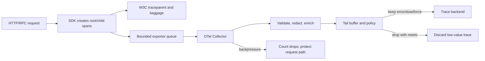

# Distributed Tracing: Context, Sampling, and Operations

**Level:** L4–L5
**Status:** reviewed
**Audience:** Engineers instrumenting distributed services and preparing for an L4–L5 observability interview
**Prerequisites:** HTTP/RPC middleware, asynchronous messaging, basic metrics, and cardinality
**Sequence:** Batch 2C, 2/3
**Terra gate:** approved

Distributed tracing records the path of one logical operation across processes,
threads, queues, and databases. A trace is evidence about a request, not a
complete event log: sampling can omit work, clocks can disagree, and exporters
can fail. The durable design must state what is guaranteed, what is sampled, and
how the team investigates gaps.

## Learning objectives

- Decode W3C Trace Context and propagate a safe context across synchronous and asynchronous boundaries.
- Choose head, tail, adaptive, and force sampling policies using coverage, cost, and latency requirements.
- Distinguish parent/child structure from span links and correlate traces with logs, metrics, and business IDs.
- Calculate a stated span volume and storage budget, including retention, replication, and sampling.
- Diagnose high cardinality, PII leakage, clock skew, exporter backpressure, and dropped context.

## What it is

A span is a timed operation with a trace ID, span ID, optional parent span ID,
attributes, events, status, and resource identity. A trace is a collection of
spans describing one operation. A root span is created at an ingress boundary;
child spans represent work performed beneath it. A collector or backend indexes
the records so an engineer can inspect a waterfall, service graph, critical
path, errors, and exemplars.

Tracing is related to but different from logging and metrics. A metric is a
cheap aggregate suitable for an SLO. A log is a discrete narrative or audit
record. A span adds duration and causal context. The same request ID may appear
in logs, but a request ID alone does not define a trace tree or a valid W3C
context.

### Trace identity

The W3C `traceparent` header carries a version, 32-hex-character trace ID,
16-hex-character parent ID, and flags, for example:

```text
traceparent: 00-4bf92f3577b34da6a3ce929d0e0e4736-00f067aa0ba902b7-01
tracestate: vendor1=value1,vendor2=value2
```

The receiver validates size, hexadecimal shape, non-zero IDs, and supported
version before accepting remote context. It creates a new span ID; it never
reuses the caller's parent ID as its own. `tracestate` carries vendor-specific
state and must be bounded and treated as untrusted input.

W3C context is propagation metadata, not authorization. Do not use a trace ID
as a password, tenant authorization proof, or payment idempotency key. An
untrusted caller can supply a syntactically valid context, so the service may
start a new trace or record the remote parent while applying normal auth.

### Resources, attributes, events, and status

Resource attributes identify the emitting service, deployment, region, runtime,
and version. Span attributes describe the operation, such as an HTTP route
template, RPC method, database system, or messaging destination. Events record
point-in-time facts like a retry or exception. Status communicates success,
error, or unset; it should not be inferred from a missing end timestamp.

Prefer stable route templates (`/users/{user_id}`) over raw URLs containing
IDs. Keep attribute names consistent across services. A span name should describe
the operation, not include a user ID or an unbounded search string.

### Baggage and privacy

W3C baggage carries arbitrary key/value context across service boundaries. It
can be useful for tenant class, experiment cohort, or routing hints, but every
hop receives and may forward it. Baggage increases request bytes, can become a
privacy leak, and is not automatically sampled or encrypted separately from
transport security.

Allow-list baggage keys, cap total size, redact secrets, and avoid raw email,
phone, authorization tokens, payment data, and free-form user content. A
correlation ID can be safe to expose if it is random and non-sensitive. A
business order ID may still be personal data under the organization's policy;
hashing does not automatically remove that obligation.

## Why it matters

In a synchronous request, latency is the sum of local work and waits along a
critical path. In an asynchronous system, the user-visible operation may cross
multiple queues and workers with idle time between spans. Tracing makes the
causal path inspectable so an engineer can separate service time, queue delay,
retries, and downstream timeouts.

Tracing is particularly valuable when averages hide tail behavior. A p99
checkout may include a rare cache miss, database lock wait, or retry storm. A
trace can show which branch was slow, but only if that trace is retained and
its context survived every boundary.

### Correlation across signals

Inject `trace_id` and `span_id` into structured logs at emission time, not by
parsing log text later. Metrics can attach a bounded trace exemplar to a sample
of requests; they should not label every time series with a trace ID. A business
correlation ID can group retries or a saga across traces, while a trace ID
normally represents one attempt or one propagated operation.

The correlation policy must define whether a retry creates a child span, a new
trace, or a new trace with a link to the original attempt. This matters for
deduplication and for interpreting total latency. Never make an unbounded
business ID a metric label merely because it is present in a span.

### Observability is not audit

Sampled traces are not a reliable audit trail. A compliance record needs a
separate retention, access-control, immutability, and deletion policy. Likewise,
tracing a database statement should not mean copying full SQL values or result
rows into a backend. Record statement shape, table category, duration, and safe
error class where possible.

## Mental model

### Parent/child trees

A child span has one parent span and normally represents work initiated by that
parent. A server span may be a child of the incoming remote span. A client span
for an outbound request becomes the parent of the downstream server span when
the context is propagated correctly. This creates a tree for one causal chain.

Parent/child does not imply that the child started immediately or that all
children are on the critical path. A child may be queued, retried, or run in a
different thread. Use explicit timestamps and events to reason about overlap.

### Span links for fan-in and asynchronous work

A span link relates a span to one or more causally relevant spans without making
them its single parent. Use links when a batch consumes many messages, a worker
joins requests, a retry is detached, or a scheduled job is triggered by an
earlier trace. The consumer span can have its own parent under the worker trace
and links to each input message's producer span.

Making every input a parent would create an invalid tree with multiple parents
and distort the critical path. A link is not a proof that the linked operation
completed; it is a searchable relationship. Carry a stable message identity so
replays can be correlated without making the trace ID the message key.

### Context propagation boundaries

Synchronous HTTP and RPC use inject/extract middleware. For one message in one
end-to-end trace, the consumer extracts the producer's `traceparent` and uses
that remote producer span as the consumer span's parent. A new root plus a span
link is intentional detachment, appropriate for batch/fan-in, scheduled or
replay work, or another policy that must not extend the producer's tree. Thread
pool and async tasks copy context explicitly; a global mutable “current span”
causes cross-request contamination.

Propagate only valid context. If extraction fails, create a new root and record
a bounded `context.invalid` event or metric. Do not echo arbitrary incoming
headers into logs. Clear context when a worker returns to a pool.

### Collector pipeline

The SDK should create spans cheaply, batch them, and export asynchronously. A
collector can receive OTLP, enrich resource fields, redact attributes, make a
tail-sampling decision, batch, retry, and export to a backend. A queue between
the application and collector limits transient collector failure, but every
queue has a capacity and a loss policy.

The application must remain available when tracing is degraded. Bound exporter
queues and CPU, drop low-priority spans first, count drops, and never block a
request indefinitely waiting for telemetry. For an audit or incident mode,
force sampling should be explicit, time limited, access controlled, and
capacity-checked.

### Clock model

Each host timestamps spans with its local clock. NTP or another time service can
keep wall clocks close, but it does not prove exact ordering. A child span may
appear to start before its parent ends because of clock skew or buffering. Use
parent/child relationships, monotonic duration measurement within a process,
and collector clock-skew correction cautiously. Never infer a causal order from
wall-clock timestamps alone.

| Relationship | Shape | Use | Common mistake |
| --- | --- | --- | --- |
| Parent/child | One parent, many descendants | Direct request or task causality | Treating all parallel children as serialized |
| Span link | Many-to-many reference | Batch fan-in, retry, scheduled or async relation | Inventing multiple parents or changing the tree |
| Correlation ID | Search key across traces/logs | Business workflow or retry family | Using it as auth, uniqueness, or a metric label |
| Metric exemplar | Metric point references a trace | Jump from SLO signal to sample evidence | Adding trace ID as an unbounded metric dimension |

## Worked example

### Order request with a queue

An API receives `POST /orders`, validates auth, writes an order and outbox row,
and publishes `order.created`. A worker consumes that message, reserves stock,
and calls a payment service. The API and worker are different latency domains.
The worker extracts the producer `traceparent` as the consumer's remote parent,
so this one message remains in the end-to-end trace. It creates a consumer span
under that remote parent and carries the message ID as an attribute. A new root
plus span link would be reserved for intentional detachment, batch/fan-in,
scheduled, or replay processing. If payment retries, each attempt is a child of
the payment operation and carries an attempt number.

The trace view should expose: API service time, database duration, time waiting
for the broker, worker processing, stock lock wait, payment attempts, and final
status. The log line for every component includes trace ID and span ID; the
order ID remains a separately protected business identifier.

### Stated cost calculation

Assume 12,000 requests/second, 6 emitted spans per request, 100% capture at
ingress, and an average encoded span of 1.2 KiB including attributes but before
backend indexing. Raw volume is `12,000 × 6 × 1.2 KiB = 86,400 KiB/s`, exactly
84.375 MiB/s. Using binary conversion (`1 MiB = 1,024 KiB`, `1 GiB = 1,024
MiB`, `1 TiB = 1,024 GiB`), that is about 6.95 TiB/day. Add 2x storage
replication: about 13.90 TiB/day before index overhead, compaction, and backups.

If head sampling keeps 5%, retained raw volume is about 0.348 TiB/day before
replication. If tail sampling keeps 5% of complete traces, the collector still
receives and buffers all 84.375 MiB/s until a decision; backend storage falls,
but collector memory and network do not fall in the same way. With a 30-second
tail buffer, the encoded buffer floor is `84.375 MiB/s × 30 = 2,531.25 MiB`,
about 2.47 GiB, before object overhead and safety headroom. A design should
reserve more than this floor for bursts, uneven traces, and queue duplication.

This calculation is deliberately explicit about the request rate, binary KiB,
MiB, GiB, and TiB conversion, 100% ingress capture, pre-index encoded size,
replication, and the distinction between head and tail sampling. Real encodings,
compression, retries, index fanout, retention, and vendor pricing must be
measured for the selected backend.

### Sampling decision for the order path

Use head sampling at 5% for normal traffic, but always keep errors, traces over
2 seconds, and a bounded sample of selected payment failure classes. Tail
sampling can make that keep decision after observing the worker and payment
spans. A force-sampled trace may be requested by an authorized incident tool
using a short-lived token and a per-service budget.

## Advantages and limitations

OpenTelemetry offers common APIs, SDKs, semantic conventions, and OTLP export;
it does not provide a storage backend or guarantee instrumentation quality. A
managed APM can reduce operational burden and improve search, while a self-hosted
backend can offer data locality and cost control. Sampling reduces storage but
can hide ordinary context or make rare failures statistically uncertain.

| Strategy | Decision time | Captures | Resource cost | Limitation |
| --- | --- | --- | --- | --- |
| Head sampling | At root/start | Random or policy-known requests | Low memory and fast | Cannot know later error or tail latency |
| Tail sampling | After trace window | Errors, slow traces, rules on completed spans | Buffer, collector CPU, queue pressure | Incomplete traces, late spans, operational complexity |
| Adaptive sampling | Continuously adjusts rate | Targeted coverage under changing load | Controller and policy complexity | Can oscillate or under-sample novel incidents |
| Force sampling | Explicit request or debug flag | One selected workflow | Highest per-trace cost; bounded if controlled | Must prevent abuse and PII escalation |

The distinction is not “head is bad, tail is good.” Head sampling protects the
application and collector under load; tail sampling improves problem capture if
the buffer and decision window are sized. Adaptive policies require a stable
feedback signal such as error rate or service budget, not an opaque magic rate.

| Deployment choice | Advantage | Limitation | Review question |
| --- | --- | --- | --- |
| SDK direct to backend | Fewer moving parts | Tight coupling and less central redaction | Can each service absorb backend outage? |
| SDK to collector | Central processing, batching, routing, and policy | Collector fleet becomes operational infrastructure | Are queue, retry, and drop metrics visible? |
| Managed backend | Search, retention, and scaling managed | Vendor cost, data residency, and query lock-in | What is the egress and retention bill? |
| Self-hosted backend | Control of locality and schema | Capacity, upgrades, and incident ownership | Who operates index and object-store growth? |

## Topic-specific visual

### Trace pipeline and sampling



The pipeline separates request execution from export, but it does not make
telemetry free. The bounded queue and tail buffer are deliberate loss and
backpressure boundaries. Redaction must happen before broad export, and a drop
counter is needed to distinguish “no trace exists” from “trace was sampled out.”

### Asynchronous parent, link, and correlation path

```mermaid
sequenceDiagram
    participant API as API span
    participant DB as Database span
    participant Broker
    participant Worker as Worker consumer span
    participant Pay as Payment attempt
    API->>DB: child: insert order + outbox
    API->>Broker: producer span; inject traceparent
    Broker-->>Worker: one message; traceparent + message_id
    Worker->>Worker: consumer span; parent = remote producer
    Worker->>Pay: child attempt 1
    Pay-->>Worker: timeout
    Worker->>Pay: child attempt 2; same business correlation
    Worker->>Worker: intentional detachment: new root + span links (replay/fan-in/batch)
    Worker-->>API: async status via separate correlation
```

For one message, the consumer extracts the producer's `traceparent` and creates
its consumer span with the remote producer span as parent. Do not add a span
link or new root to this ordinary single-message path. Reserve intentional
detachment—a new root plus span links—for replay, fan-in, batch, scheduled, or
another policy that must not extend the producer's tree. Each payment attempt
is visible, while a business correlation ID can find the whole workflow. The
timeout also illustrates why a tail policy should retain a trace whose error
appears only after the API returned.

## Failure modes and operations

### Missing or malformed context

Symptoms include a new trace at every service, orphan spans, or unrelated
requests sharing one trace. Check middleware order, header casing and proxy
allow-lists, RPC metadata limits, async context copying, and worker cleanup.
Track extraction failures and propagation coverage by service and protocol.

### Baggage and PII leakage

Do not copy all inbound headers into baggage or span attributes. Scan payload
and exception instrumentation for tokens, cookies, email, phone, SQL values,
authorization headers, and raw message bodies. Apply an allow-list, redaction,
retention, encryption, and role-based access policy. A trace backend often has
more readers than the source database, so least privilege matters.

### Cardinality explosion

User IDs, request IDs, URLs, stack traces, and exception text create many unique
attribute values and can make indexes expensive. Put high-cardinality values in
span events or unindexed fields only when the backend supports that distinction;
otherwise omit or hash according to policy. Keep service, route template,
status class, and region bounded. Review cardinality before adding a label.

### Clock skew and negative durations

A trace viewer can show a child before its parent or a negative apparent gap.
Compare monotonic duration in the SDK with wall-clock timestamps, inspect NTP
offset, and use collector correction only within a documented bound. Clock
correction should not rewrite business event time or hide a host with a broken
clock.

### Exporter failure and backpressure

An exporter that retries forever can consume memory and block application
threads. Bound batches, queue bytes, retry duration, and concurrency. Expose
queue depth, oldest item age, send latency, retry count, rejected spans, and
drop reason. Choose an explicit policy: drop debug spans first, sample more
aggressively, spill to durable local storage, or fail a diagnostic operation.
Never silently turn telemetry loss into request failure without an SLO decision.

### Incomplete asynchronous traces

Queue retention may exceed a tracing context's lifetime; a worker may batch
multiple messages; a retry may carry stale headers. Include message ID, attempt,
partition/shard, and enqueue/dequeue timestamps as safe fields. Use links for
fan-in and replays. If the producer span is sampled out, preserve a bounded
correlation ID or sampling decision rather than pretending the tree is complete.

### Sampling blind spots

Head sampling may miss a rare error. Tail sampling may miss a trace whose spans
arrive after the decision window or whose collector drops data under pressure.
Measure kept traces by outcome, late-span rate, and buffer eviction. Adaptive
policies should have a minimum error quota and a way to force one trace under
authorization. Document that “100% errors retained” is true only for errors
visible before the sampling decision and within capacity.

### Operational checklist

- Validate W3C `traceparent` and bounded baggage at every ingress and async boundary.
- Keep route and operation names bounded; review new attributes for cardinality and PII.
- Monitor trace coverage, exporter queue age, drops, tail-buffer evictions, and clock offset.
- Correlate logs with trace/span IDs and metrics with bounded exemplars, not unbounded labels.
- Test context across retries, thread pools, batch fan-in, worker rebalances, and dead letters.
- Recalculate storage when spans/request, encoded size, sampling, replication, or retention changes.

## Practical exercises

### Exercise 1: W3C propagation review

Given a valid `traceparent`, implement or describe middleware that extracts it,
creates a new server span, injects a child context into an outbound request,
and rejects an oversized or malformed baggage header.

**Solution / expected approach:** Parse version, trace ID, parent ID, and flags;
reject zero or malformed IDs; retain the remote parent as parent metadata but
generate a fresh local span ID. Allow-list baggage keys and enforce a byte cap.
Create the outbound client span as a child and inject its context. If
extraction fails, start a new root and increment a bounded invalid-context
metric; do not log the full header.

### Exercise 2: Parent versus span link

A worker consumes 100 messages in one batch. Each message has a producer span.
Design the trace relationships and explain how a replay should appear.

**Solution / expected approach:** Create one batch/consumer parent span and add
up to a bounded number of links to producer spans, with stable message IDs and
partition/offset attributes. Do not assign 100 parents. A replay creates a new
consumer attempt span with a link to the original message or producer and an
attempt number; idempotency belongs to the message/sink contract, not the trace.

### Exercise 3: Sampling and buffer sizing

A service emits 8,000 spans/second at 1 KiB each. Errors are 0.4% and the team
wants tail decisions within 20 seconds. Calculate the encoded buffer floor and
name two operational headroom factors.

**Solution / expected approach:** The floor is `8,000 × 1 KiB × 20 = 160,000
KiB`, about 156.25 MiB using 1 MiB = 1,024 KiB. Reserve additional memory for
burst rate, span metadata, multiple traces, late spans, queue copies, and
collector overhead. Keep errors and slow traces in the policy, and measure
evictions so “keep errors” is not an untested claim.

### Exercise 4: Correlation incident

P99 checkout latency rose, but only 1% of traces are stored. Logs contain a
request ID and a user ID label has made the metrics backend expensive. Propose
a safe investigation change.

**Solution / expected approach:** Use a bounded adaptive or tail policy that
keeps errors and slow traces, plus a time-limited authorized force-sample for a
single synthetic or test correlation. Link logs using trace/span IDs and keep a
bounded metric exemplar rather than user ID labels. Remove or redact PII and
measure exporter/backpressure headroom before increasing capture globally.

## Interview Q&A

### Q1. What does W3C Trace Context provide?

**Answer:** `traceparent` carries version, trace ID, parent span ID, and flags;
`tracestate` carries bounded vendor state. The receiver validates it and creates
a fresh local span ID. It does not provide authentication or authorization.

**Follow-up:** How would you handle a valid-looking context from an untrusted client?

### Q2. When is baggage dangerous?

**Answer:** Baggage is forwarded across service boundaries, so secrets, PII,
large values, or unbounded keys multiply privacy and cost exposure. Allow-list,
cap, redact, and treat it as untrusted context.

**Follow-up:** Where would you store a sensitive business identifier instead?

### Q3. Parent/child versus span link?

**Answer:** Parent/child models one causal tree edge. A span link relates a span
to one or many related spans without claiming multiple parents; it fits batch
fan-in, retries, and scheduled work.

**Follow-up:** How would a batch consumer represent 100 input messages?

### Q4. Head versus tail sampling?

**Answer:** Head sampling decides at trace start with low memory and immediate
cost control. Tail sampling buffers spans until outcome and latency are known,
so it captures slow/error traces better but needs memory, late-span handling,
and backpressure controls.

**Follow-up:** What does tail sampling not save at the collector?

### Q5. What is adaptive or force sampling?

**Answer:** Adaptive sampling changes rates from a measured signal such as load
or errors. Force sampling explicitly captures a selected workflow. Both need
bounded budgets; force sampling needs authorization and PII controls.

**Follow-up:** Which metric would keep an adaptive policy from starving rare errors?

### Q6. How do you diagnose clock skew?

**Answer:** Compare monotonic local durations, wall-clock timestamps, host clock
offset, and parent/child relationships. Correct only within a documented bound;
do not infer causality from wall-clock order alone.

**Follow-up:** Why can a child appear to start before its parent ends?

### Q7. What is the exporter backpressure policy?

**Answer:** Bound queue bytes, batches, retries, and concurrency; expose queue age
and drops; shed low-value spans or increase sampling when full. An exporter
should not block user requests indefinitely or retry without a memory limit.

**Follow-up:** Which spans would you drop first during an incident?

### Q8. How do traces correlate with logs and metrics?

**Answer:** Put trace and span IDs in structured logs and use bounded metric
exemplars to jump from an SLO point to sample evidence. Do not use trace IDs or
user IDs as unbounded metric labels; a business correlation ID can group retries
but is not an authorization credential.

**Follow-up:** How would you investigate a p99 spike if 99% of traces are sampled out?

### Q9. What does a tracing cost estimate need?

**Answer:** Requests/second, spans/request, encoded bytes/span, sampling,
retention, compression, index overhead, replication, backups, and tail-buffer
memory. For example, 12,000 × 6 × 1.2 KiB is about 84.375 MiB/s before storage
overhead, so 5% backend sampling does not remove the collector ingest cost.

**Follow-up:** Which assumption would you measure first before buying capacity?

## Related and next reading

- [Database monitoring](24-database-monitoring.md) — SLOs, telemetry pipelines, and failure correlation.
- [Message queues and streams](11-message-queues-streams.md) — durable delivery, retries, and consumer boundaries.
- [Distributed tracing in the system-design catalog](../03-system-design/04-distributed-systems/29_distributed_tracing.md) — an adjacent interview overview.
- [Repository validation](../PROJECT_SPEC.md) — the maintained documentation and testing contract.

OpenTelemetry APIs and semantic conventions evolve by language and release.
Check the selected SDK, collector, exporter, and backend versions before treating
an attribute or sampling processor as portable production behavior.
