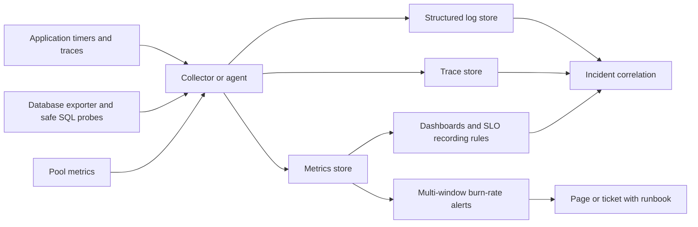
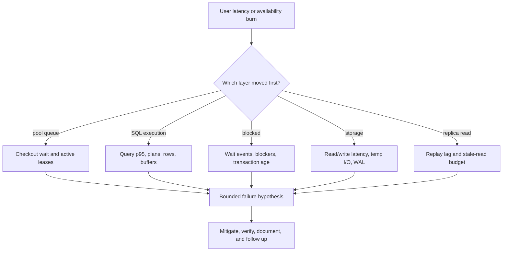

# Database Monitoring and Alerting

**Level:** L4-L5
**Status:** Reviewed (Terra PASS)
**Audience:** Engineers building database SLOs, dashboards, alerts, and incident runbooks for production services
**Prerequisites:** SQL, time-series metrics, percentiles, error budgets, PostgreSQL statistics, and basic incident response
**Sequence:** Batch 2A, 3/8
**Terra gate:** approved

## Learning objectives

- Define a database SLO from user-visible availability and latency rather than isolated infrastructure thresholds.
- Build a telemetry pipeline that preserves labels, exemplars, sampling scope, and retention boundaries.
- Interpret PostgreSQL counters, especially the database-scoped `blks_hit` and `blks_read` values in `pg_stat_database`.
- Correlate query, lock, pool, replication, storage, and application signals into a failure hypothesis.
- Use baselines, multi-window burn rates, and actionable runbooks without alerting on arbitrary universal numbers.

## What it is

Database monitoring is the collection, aggregation, visualization, alerting, and operational interpretation of database behavior.

Metrics are numeric time series such as query latency, transaction rate, buffer activity, lock waits, connections, and replication lag.

Logs carry discrete events and detailed error context.

Traces connect a user request to a pool checkout, SQL span, remote call, and response.

Profiles and plan samples explain CPU or query-shape cost when metrics alone are not enough.

Monitoring is not the same as observability: dashboards show known signals, while observability preserves enough context to explain an unknown failure.

PostgreSQL examples are version and provider sensitive; hosted services may redact views, rename metrics, or aggregate at a different scope.

## Why it matters

A database can be “healthy” by CPU while a connection pool queues requests, a lock blocks writes, or a replica serves stale data.

Infrastructure thresholds without an SLO create noisy pages and miss user-visible failures.

An SLO supplies a target, an error budget, and a policy for when to investigate, slow releases, or page.

Good monitoring shortens the path from symptom to safe action.

It also makes capacity and design trade-offs measurable instead of rhetorical.

## Mental model

Observe four related layers: user request, database workload, database internals, and infrastructure.

The user layer asks whether requests meet availability and latency objectives.

The workload layer groups queries by normalized shape, operation, tenant, endpoint, and outcome.

The database layer exposes active sessions, locks, cache behavior, vacuum, WAL, replication, and temporary work.

The infrastructure layer exposes CPU, memory, storage latency, IOPS, network, and host events.

Labels must have bounded cardinality; raw SQL text, user IDs, and unbounded error strings do not belong in every metric label.

Keep high-cardinality identifiers in logs or traces with access controls.

## Topic-specific visual

### Telemetry pipeline visual



The collector is a transport boundary, not a guarantee of correctness.

Record scrape interval, aggregation, missing-data behavior, clock source, and retention with each signal.

### Failure-correlation visual



Correlate by timestamp and request/operation class before declaring causation.

## Worked example

### An SLO and error budget

Assume an orders API defines a monthly availability SLO of 99.9% for requests that require a database.

Assume the service counts a request as bad when it returns a server error, a database timeout, or exceeds 800 ms.

For a 30-day month, total minutes are `30 × 24 × 60 = 43,200` minutes.

The allowed bad-request fraction is `1 - 0.999 = 0.001`, or 0.1%.

If the service handles 50,000 database-backed requests per minute, the monthly request budget is `43,200 × 50,000 × 0.001 = 2,160,000` bad requests.

That is a planning example; actual SLO windows should use the service's request counter and exclusion policy.

Suppose a 5-minute window has 250,000 requests and 1,000 bad responses.

The observed bad fraction is `1,000 / 250,000 = 0.004`, or 0.4%.

The one-window error rate is four times the allowed monthly fraction, but a page policy should use burn rate over a window, not this comparison alone.

For an SLO target `S`, the error budget is `E = 1 - S`.

Burn rate is `observed_error_rate / E` over a defined window.

The example's five-minute burn rate is `0.004 / 0.001 = 4`.

If the same rate persisted for the month, it would consume the budget four times over, but short windows are noisy.

Use a fast window to catch outages and a slow window to confirm persistence.

One policy might page when both a 5-minute and 1-hour burn-rate threshold are exceeded, with thresholds chosen from the team's desired time-to-exhaust budget.

The exact thresholds are policy choices, not universal database constants.

### Diagnostic evidence

At 10:02, API bad rate rises, pool checkout p99 rises, and database active sessions remain below the application cap.

At 10:03, query execution p99 rises for one normalized query, `rows removed by filter` increases, and shared reads rise.

At 10:04, CPU is stable but a deployment changed a prepared statement parameter distribution.

The hypothesis is a plan regression rather than a CPU shortage.

If lock waits had risen before query execution time, the hypothesis would shift to blocking.

If replica replay lag moved first, route-sensitive stale reads or read failover would be investigated.

The runbook must ask for this evidence instead of saying “increase the database size.”

## Advantages and limitations

SLO-based monitoring connects alerts to user impact, while infrastructure metrics explain mechanisms and help forecast capacity.

Metrics are inexpensive for trends but lose detail through aggregation; logs and traces preserve context at higher storage, privacy, and cardinality cost.

No dashboard proves causation by itself, so alerts must link evidence to a bounded runbook and an owner.

## Metrics and scope

### PostgreSQL database counters

In PostgreSQL, `pg_stat_database` has one row per database, and its `blks_hit` and `blks_read` counters describe blocks hit or read for that database's activity since the statistics snapshot/reset scope.

They are not automatically cluster-wide totals, not a per-table ratio, and not a complete operating-system cache measurement.

For one database, a simple database-scoped hit ratio is `blks_hit / (blks_hit + blks_read)` when the denominator is nonzero.

Use deltas over a time interval for rate or interval comparisons, and state whether the exporter reports cumulative counters or already-derived rates.

The ratio can be distorted by a small sample, maintenance activity, catalog access, temporary objects, or a reset.

It does not prove every query is served from memory and does not identify which table caused reads.

Use `pg_statio_*` views, query-level buffers, and storage metrics for more specific diagnosis.

```sql
SELECT datname, blks_hit, blks_read,
       CASE WHEN blks_hit + blks_read = 0 THEN NULL
            ELSE blks_hit::numeric / (blks_hit + blks_read) END AS db_hit_ratio,
       stats_reset
FROM pg_stat_database
WHERE datname = current_database();
```

Read the scope and reset timestamp before adding a ratio to a dashboard.

### Workload metrics

Track request rate, transaction commits/rollbacks, statement count, normalized query latency, rows returned, rows affected, and error codes.

Break down latency into pool wait, server execution, network transfer, and application processing.

Record p50, p95, and p99 when traffic volume supports them; percentiles from aggregated averages lose tail information.

Use exemplars to link a latency sample to a trace without putting trace IDs into every time series label.

Track plan fingerprint changes and estimate-to-actual row ratios for a sampled query set.

### Saturation metrics

Measure active and idle connections, pool queue depth, transaction age, lock wait time, temporary bytes, WAL rate, vacuum lag, table/index growth, and storage latency.

CPU utilization alone cannot reveal lock or pool saturation.

Memory pressure must distinguish database cache, process memory, temporary work, operating-system cache, and provider accounting.

Replica lag needs a defined unit and origin: write LSN distance, replay time, or application-observed staleness are different measures.

## Comparison: alerting strategies

| Strategy | Useful signal | Strength | Limitation and operational cost |
| --- | --- | --- | --- |
| Static threshold | Known resource limit or hard failure | Simple and cheap to explain | Ignores traffic shape and creates noise near normal variance |
| Baseline/anomaly | Deviation from a comparable historical window | Finds seasonal or workload-specific changes | Needs clean history, careful seasonality, and tuning |
| SLO burn rate | User-visible bad-request budget | Connects pages to impact and release policy | Requires trustworthy counters and an agreed SLO |
| Synthetic probe | End-to-end read/write path | Detects routing and credential failures | Adds probe load and may not represent every tenant |
| Log event | Deadlock, failover, corruption, or DDL event | Detailed context for rare failures | Sampling, parsing, and alert deduplication require care |

Combine strategies; one alert type cannot cover all failure modes.

## Comparison: telemetry choices

| Signal | Granularity | Retention/cost trade-off | Best diagnostic use |
| --- | --- | --- | --- |
| Metrics | Aggregated time series | Low per point; labels can create cardinality cost | Trends, SLOs, saturation, burn rates |
| Logs | Individual events and fields | High volume; retention and redaction matter | Error detail, lock owner, migration step |
| Traces | Request path and timing | Sampling trades cost for coverage | Pool versus SQL versus downstream latency |
| Query plans | Operator-level work | Expensive with `ANALYZE`; capture selectively | Estimate error, buffers, spills, plan regressions |

Do not solve high cardinality by silently dropping the tenant dimension needed for an incident; put it in controlled logs or exemplars instead.

## Baselines and burn rates

Build baselines by operation class, endpoint, tenant tier, time of day, deployment version, and read/write path.

A baseline should include traffic volume and data age; a latency shift at one request per minute is not equivalent to a shift at 10,000 requests per minute.

Compare like with like after deployments and failovers.

Use short windows for fast detection and longer windows for confidence.

Multi-window alerting reduces pages from one scrape spike while preserving a rapid outage signal.

Burn-rate policies need a documented action: page, open ticket, freeze release, shed optional work, or investigate during business hours.

The error budget must include the same request inclusion and exclusion rules as the SLO.

Measure missing telemetry separately; treating missing data as success can hide an exporter failure.

## Runbooks

Every page should identify impact, first evidence, safe mitigations, stop conditions, and escalation owner.

For high latency, check pool queue, query plan fingerprint, lock waits, storage latency, and recent deployments in that order only as a starting hypothesis.

For connection exhaustion, check per-instance pools, reserved connections, idle-in-transaction sessions, and retry storms.

For a deadlock, capture involved statements and lock order, then apply the approved cancellation policy.

For replica lag, identify replay position, write rate, long transactions, replica resource saturation, and whether reads tolerate staleness.

For disk growth, separate table data, indexes, WAL, temporary files, and retained backups before deleting anything.

For failed backups, preserve the last known good recovery point and escalate before changing retention.

Runbooks should name commands with provider caveats and avoid embedding destructive commands without authorization.

## Failure modes and operations

### Cardinality explosion

Unbounded labels such as raw SQL, user ID, or exception text can overload the metrics backend.

Normalize query fingerprints, cap label values, and place detail in access-controlled logs.

### Counter reset and restarts

Cumulative PostgreSQL counters can reset after restart or a statistics reset.

Rate rules must handle counter decreases and surface reset annotations.

### Scrape gaps

Exporter failure can make dashboards look calm.

Alert on target health, sample freshness, and missing data separately from database SLOs.

### Alert storms

One storage failure can trigger latency, error, pool, and replica pages.

Deduplicate by incident, retain child evidence, and page only the highest-value action.

### Query-plan regression

Correlate normalized query, plan fingerprint, parameter bucket, rows, buffers, and deployment version.

Use a reversible query or index mitigation and verify the user SLO afterward.

### Lock contention

Lock wait time can dominate request latency with low CPU.

Capture blocker, waiter, relation, transaction age, and statement; resolve ownership before cancellation.

### Data and provider caveats

Metrics names, statistics privileges, reset behavior, and replica lag semantics differ by PostgreSQL version and provider.

Document the source, unit, scope, reset behavior, and collection interval beside each dashboard panel.

## Practical exercises

### Exercise 1: Build an SLO budget

A service receives 2,000,000 database-backed requests in a 30-day month and targets 99.95% availability. Calculate the allowed bad requests and name two events included in the SLO.

**Expected approach:** Error budget is `1 - 0.9995 = 0.0005`; `2,000,000 × 0.0005 = 1,000` bad requests. Define inclusion consistently, for example database timeouts and server errors, and state whether client cancellations or planned maintenance count.

### Exercise 2: Interpret `pg_stat_database`

At two samples for one database, cumulative counters move from `blks_hit=9,900,000, blks_read=100,000` to `blks_hit=10,800,000, blks_read=300,000`. Compute the interval ratio and explain its scope.

**Solution:** Deltas are 900,000 hits and 200,000 reads, so the interval ratio is `900,000 / 1,100,000 ≈ 81.8%`. It is database-scoped shared-buffer activity for the interval, not cluster-wide, per-table, or a complete OS-cache measure.

### Exercise 3: Correlate a latency incident

API p99 and pool checkout p99 rise, database CPU falls, active SQL sessions fall, and lock wait time rises. Write the first five runbook actions.

**Expected approach:** Confirm SLO impact and time alignment; inspect blockers and transaction age; identify affected operation/relation; stop unsafe deploy/retry amplification; apply approved cancellation or traffic-shedding mitigation; then verify lock and user latency recovery.

### Exercise 4: Design burn-rate alerts

Create a two-window alert policy for an SLO with error budget `0.001`, using a fast outage signal and a slower confirmation signal.

**Solution:** Define rates as observed bad fraction divided by `0.001`, choose thresholds from a stated time-to-exhaust policy, require both windows for the normal page, and keep a separate immediate page for a complete outage. Document missing-data handling and the action/runbook for each alert.

## Interview Q&A

### Q1. Why use an SLO instead of CPU alerts?

**Answer:** SLOs measure user-visible success and provide an error budget for action. CPU can be low during lock waits or pool starvation and high during a successful batch.

**Follow-up:** What request outcome belongs in the bad-event definition?

### Q2. What is burn rate?

**Answer:** Burn rate is observed error fraction divided by the allowed error fraction. It estimates how quickly a workload would consume its budget if the rate persisted.

**Follow-up:** Why use two windows?

### Q3. What do `blks_hit` and `blks_read` mean in `pg_stat_database`?

**Answer:** They are database-scoped cumulative counts of shared-buffer blocks found and read for that database's activity, subject to the statistics snapshot/reset scope.

**Follow-up:** What evidence gives table or query specificity?

### Q4. Why are averages poor database alerts?

**Answer:** Averages hide tail latency and can look normal while a subset of requests times out. Use percentiles with volume and operation dimensions.

**Follow-up:** What sampling caveat affects p99?

### Q5. How do you correlate a lock incident?

**Answer:** Align user latency with wait events, blockers, transaction age, affected relations, statements, and deployment or migration events. Low CPU does not exonerate locks.

**Follow-up:** What is the safety concern with killing a blocker?

### Q6. What belongs in a database runbook?

**Answer:** Impact, evidence queries, safe mitigations, stop conditions, rollback or recovery steps, ownership, and verification criteria.

**Follow-up:** Which commands need provider-specific validation?

### Q7. How do you monitor a connection pool?

**Answer:** Track active/idle slots, queue depth, checkout latency, lease age, reset failures, and timeouts, then correlate them with server sessions and request deadlines.

**Follow-up:** What does low DB CPU with high checkout time suggest?

### Q8. Why can a dashboard lie after a restart?

**Answer:** Cumulative counters and statistics views can reset, rates can be negative or incomplete, and exporter gaps can appear as zero. Display reset and freshness state.

**Follow-up:** How should recording rules handle counter decreases?

### Q9. What is a good baseline?

**Answer:** A comparable distribution of traffic, latency, errors, data age, deployment, and time-of-day for a defined operation class. It is not one universal threshold.

**Follow-up:** What workload dimensions should be separated?

### Q10. How do you avoid an alert storm?

**Answer:** Deduplicate related symptoms, use burn-rate confirmation, cap cardinality, and page for the highest-value action while retaining child signals for diagnosis.

**Follow-up:** Which signal should remain when telemetry is missing?

## Related and next reading

- [Query planning](17-query-planning.md) for rows, buffers, spills, and plan fingerprints.
- [Connection pooling](25-connection-pooling.md) for checkout queues and connection budgets.
- [Backup and recovery](16-backup-recovery.md) for recovery-point and restore telemetry.
- [Database replication](15-database-replication.md) for lag and failover signals.
