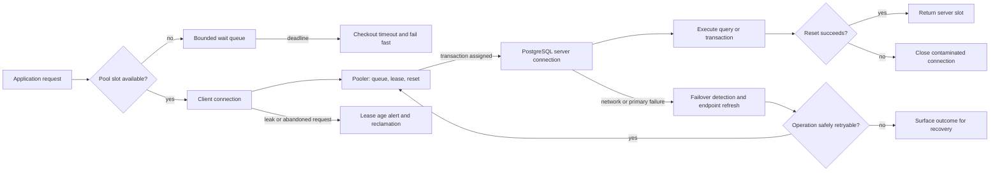

# Connection Pooling

**Level:** L4-L5
**Status:** Reviewed (Terra PASS)
**Audience:** Backend engineers sizing database clients, poolers, and PostgreSQL services for production workloads
**Prerequisites:** TCP connection lifecycle, transactions, Little's Law, PostgreSQL sessions, and basic service SLOs
**Sequence:** Batch 2A, 2/8
**Terra gate:** approved

## Learning objectives

- Model database concurrency from arrival rate, service time, queueing, and a finite connection budget.
- Choose a pooling boundary and explain session, transaction, and statement pooling semantics.
- Size per-instance and pooler limits using reserved connections, failover headroom, and measured distributions.
- Diagnose queue time, connection leaks, reset failures, timeouts, and failover without confusing them with query latency.
- Design a safe PgBouncer deployment that accounts for session state, prepared statements, and provider caveats.

## What it is

A connection is a client-visible protocol session backed by server-side state and resources.

A pool keeps reusable connections so requests do not repeat authentication, TLS setup, protocol startup, and session initialization for every operation.

An application pool controls how many database sessions one process may use.

A pooler can multiplex many client connections over fewer server connections.

Pooling limits concurrency; it does not create database CPU, I/O, or lock capacity.

The right boundary depends on protocol state, transaction duration, driver behavior, failure handling, and database topology.

Numbers in this guide are worked assumptions, not provider-independent recommendations.

## Why it matters

Opening a new connection for each request creates handshake bursts and makes connection count track traffic spikes rather than useful database work.

An unlimited pool moves overload into the database, where processes compete for memory, CPU, locks, and shared buffers.

A pool that is too small creates a client queue and increases tail latency even when the database is idle.

A pool that is too large can saturate the database and amplify a failover storm.

Pool metrics separate request time spent waiting for a slot from time executing SQL.

Pool sizing is therefore an end-to-end capacity decision, not a copyable formula.

## Mental model

An application request arrives at rate `λ` requests/second.

Each database checkout occupies a slot for average service time `W` seconds.

Little's Law gives average in-flight database work `L = λ × W` when the system is stable.

Concurrency is not the same as throughput: adding slots above the database's useful parallelism can increase queueing inside the server.

Reserve connections for migrations, health checks, replication administration, and incident access before allocating application pools.

Bound both clients accepted by a pooler and server connections opened to each database endpoint.

Treat a checkout as a lease with an owner, deadline, cancellation path, reset step, and return-to-pool event.

On return, rollback an open transaction and reset session state appropriate to the pooling mode.

Never return a connection whose transaction, role, search path, tenant setting, prepared state, or advisory lock is unknown.

## Topic-specific visual

### Client-to-server visual

The queue is part of user-visible latency; the reset edge is a correctness boundary, and failover retries must respect transaction ambiguity.

## Pooling modes

### Session pooling

One client session maps to one server connection until disconnect.

Session pooling preserves temporary tables, session variables, prepared statements, advisory locks, and transaction state.

It gives the least multiplexing and the highest server-connection footprint.

It is the safest default for applications that use session state intentionally.

### Transaction pooling

A server connection is assigned for the duration of a transaction and returned after commit or rollback.

It multiplexes idle client sessions efficiently when transactions are short and self-contained.

Session state set before the transaction or relied on after it may disappear or belong to another server session.

With PgBouncer transaction pooling, protocol-level prepared statements require supported PgBouncer and driver configuration; otherwise use unnamed statements or session mode.

Features such as `SET`, `LISTEN`, session advisory locks, temporary tables, and SQL-level prepared statements can be unsafe or surprising across transactions.

Test the exact driver, PgBouncer version, and feature set; provider-managed poolers may add different restrictions.

### Statement pooling

A server connection is returned after each statement, usually requiring autocommit and forbidding multi-statement transaction semantics.

It maximizes multiplexing but makes almost all session state assumptions invalid.

It is suitable only for narrowly defined stateless statements and a pooler that explicitly supports the mode.

It cannot preserve a transaction spanning statements.

### Meaningful comparison

| Mode | Server-slot ownership | Preserves | Main risk | Appropriate evidence |
| --- | --- | --- | --- | --- |
| Session | Client lifetime | Session variables, temp tables, prepared state, advisory locks | Many idle server connections | Server active/idle count and per-app connection distribution |
| Transaction | Transaction lifetime | State established and used within one transaction | Session state and prepared statements may not persist | Checkout time, transaction time, reset errors, feature tests |
| Statement | Statement lifetime | Little beyond one statement | Breaks transactions and session-dependent code | Statement semantics tests and error rate by driver |

The lowest server connection count is not automatically the best choice; correctness and transaction boundaries come first.

## Worked example

### Capacity model

Assume 12 application instances receive a peak of 1,800 requests/second.

Assume 70% of requests require one database checkout and 30% are cache hits.

The database arrival rate is `λ = 1,800 × 0.70 = 1,260 checkouts/s`.

Assume average database service time is 18 ms, p95 is 70 ms, and p99 is 180 ms.

Average database concurrency is `L_avg = 1,260/s × 0.018 s = 22.68` concurrent checkouts.

Sizing only from the average hides the tail, so load-test concurrency near the p95 and p99 service distribution.

Assume the primary has 180 usable connections from a provider limit of 200.

Reserve 20 for administrator access, migrations, monitoring, and replication-related work.

The application budget is therefore `180 - 20 = 160` server connections.

If a pooler has 40 server connections to the primary, it can accept more client sessions but cannot make more than 40 database operations concurrent through that endpoint.

Assume a 25% failover/rolling-deploy headroom target; a starting server-slot cap is `floor(160 × 0.75) = 120` for normal application use.

This is a planning bound, not a guarantee that 120 concurrent queries are useful.

If all 12 instances have equal limits, a naïve per-instance cap is `120 / 12 = 10`.

Use a total budget when instances autoscale; 20 instances each retaining 10 idle connections would exceed the same primary budget.

Set a per-instance pool limit no higher than the assigned budget and keep minimum idle connections low enough to avoid an idle-connection storm.

If each instance sees 105 checkouts/s and p95 service time is 70 ms, p95 occupancy is approximately `105 × 0.070 = 7.35` slots before safety margin.

A pool of 10 may be reasonable for this workload, while a pool of 50 would mostly create competition.

Measure checkout wait, service time, active slots, queue depth, database CPU, lock waits, and error rate during the test.

The model must be recalculated for read replicas, background workers, migrations, and failover targets.

## Advantages and limitations

Pooling amortizes connection setup and bounds database concurrency, but it adds queueing, reset, leak, and failover state.

An application pool is simple and preserves session state; an external pooler multiplexes more clients but narrows protocol compatibility.

The meaningful table below compares ownership modes; measured queue time and correctness evidence decide the mode.

### Queueing interpretation

When demand exceeds available slots, requests wait in the client queue until a deadline.

Fail-fast at a bounded checkout timeout rather than allowing an unbounded queue to consume request threads.

Choose the timeout from the request's remaining deadline and retry budget, not an arbitrary copied number.

Retries can multiply arrival rate; three retries for one failing request can turn 1,260 checkouts/s into as many as 3,780 attempts/s.

Use jitter and a circuit breaker when the database endpoint is unavailable.

Separate connect timeout, checkout timeout, statement timeout, transaction timeout, and request timeout.

Each timeout needs an owner and a metric so operators can identify which boundary fired.

## Implementation boundaries

### Application pool

Driver pools are local to a process, so process count is part of the connection budget.

An eight-worker deployment with a pool of 10 can open up to 80 server connections before health or admin connections.

Use context managers or `try/finally` to return connections and ensure rollback on error.

Tag leases with request ID and acquisition timestamp, but avoid logging credentials or full SQL parameters.

Use cancellation that reaches the database; merely abandoning a future can leave the server query running.

### External pooler

PgBouncer accepts client protocol connections and maintains a separate server pool.

Its transaction mode is not transparent for all PostgreSQL session features.

`DISCARD ALL` or a configured reset query has cost and may not clean provider-specific state; verify reset behavior.

Pooler health checks must test both client acceptance and a real server checkout.

Do not put a pooler in front of a failover endpoint without testing DNS, TLS identity, stale sockets, and transaction ambiguity.

### Read/write split

Separate pools for primary writes and replica reads make budgets visible.

Read replicas can lag, so a read-after-write request may need a primary route or session guarantee.

Do not use pool selection to hide a consistency requirement.

## Failure modes and operations

### Queue saturation

Symptoms are rising checkout latency, stable or falling database active work, and request timeouts before SQL starts.

Check pool active/idle counts, queue depth, lease age, request deadlines, and per-instance distribution.

Mitigate by reducing retries, shedding optional work, fixing slow transactions, or increasing a proven bottleneck capacity.

Increasing pool size is safe only if server capacity, memory, and lock behavior support it.

### Connection leaks

A leak is a checkout not returned after its owner finishes or is cancelled.

Track lease age and owner stack/request ID with sampling; alert on age beyond a bounded transaction deadline.

Reclaiming a lease by closing its socket may cancel work, but it cannot make an unknown transaction outcome safe to retry.

Fix lifecycle handling and test cancellation, exceptions, and client disconnects.

### Reset failure

If rollback or reset fails, discard the connection rather than returning contaminated state to another tenant.

Count reset failures separately from query failures and inspect protocol/network causes.

### Failover

A connection can be accepted before a primary changes role, so a healthy TCP handshake is not proof of write readiness.

After failover, refresh endpoint resolution and pool connections according to provider guidance.

Retry only idempotent operations or operations carrying an idempotency key with an authoritative outcome check.

An interrupted commit is ambiguous; do not blindly replay a payment or inventory mutation.

### Observability checklist

Record pool size, active slots, idle slots, queue depth, checkout wait p50/p95/p99, lease age, reset failures, connect failures, and timeout class.

Correlate them with server active sessions, transaction age, lock waits, CPU, I/O, and database error codes.

Break down by instance, pool, endpoint, operation class, and pooling mode.

Inspect deployment events and autoscaling because a new instance multiplies minimum idle connections.

## Practical exercises

### Exercise 1: Size a bounded pool

Ten instances each receive 120 database requests/s, average service time is 25 ms, the database budget is 90 application connections, and 15 connections are reserved. Propose a starting per-instance cap.

**Expected approach:** Average occupancy is `10 × 120 × 0.025 = 30` slots. The stated application cap is 90, so the equal-share maximum is 9 per instance, not an unbounded hardware formula. Load-test p95 occupancy and keep reserve/headroom; adjust only from queue, server saturation, and latency evidence.

### Exercise 2: Diagnose a leak and timeout

Checkout p99 rises from 5 ms to 4 s, the database has idle CPU, and lease-age samples show requests cancelled while holding a connection. Write the recovery plan.

**Solution:** Add `finally`-path return/rollback, propagate cancellation, bound checkout by request deadline, close and quarantine over-age leases, and alert on queue depth and lease age. Verify no transaction remains active, then load-test cancellation and client disconnects before changing pool size.

### Exercise 3: Evaluate transaction pooling

An application uses `SET search_path`, temporary tables, session advisory locks, and prepared statements. Decide whether PgBouncer transaction mode is safe.

**Expected approach:** Treat it as unsafe without redesign or an exact compatibility test. Move state inside each transaction where possible, use a supported prepared-statement configuration or session pooling, and test reset behavior on the deployed PgBouncer/provider version. Document any feature removed by the migration.

## Interview Q&A

### Q1. Why not set the pool to the database max connections?

**Answer:** The database limit includes multiple applications and reserved operational access. Too many active sessions can exhaust memory and increase CPU, lock, and context-switch contention.

**Follow-up:** What budget do you subtract before allocating application pools?

### Q2. How does Little's Law help pool sizing?

**Answer:** For a stable workload, average in-flight work is arrival rate times average service time. It estimates a lower-bound occupancy, while tail latency, retries, and capacity headroom require measurement and additional budget.

**Follow-up:** Why is p99 service time not simply a universal pool formula?

### Q3. What is transaction pooling?

**Answer:** A server connection is assigned for one transaction and returned after commit or rollback. It multiplexes clients but does not preserve arbitrary session state between transactions.

**Follow-up:** Which PostgreSQL features must be tested?

### Q4. What is a connection leak?

**Answer:** A checkout remains owned after its request completes or is cancelled. It gradually shrinks available capacity and creates queue time even if the database has idle CPU.

**Follow-up:** Which metrics identify it before total exhaustion?

### Q5. Should a failed transaction be retried automatically?

**Answer:** Only when the operation is safely idempotent or has an idempotency key and the outcome can be checked. A lost connection during commit can leave the outcome ambiguous.

**Follow-up:** Give an example of an unsafe blind retry.

### Q6. What is the difference between checkout and query timeout?

**Answer:** Checkout timeout is waiting for a pool slot; query timeout is execution or server cancellation after a connection is acquired. They need separate metrics and response policies.

**Follow-up:** How should each interact with a request deadline?

### Q7. Why can PgBouncer transaction mode break an application?

**Answer:** Session state, temporary objects, advisory locks, and some prepared-statement protocols assume the same server session across statements. Transaction multiplexing intentionally removes that assumption.

**Follow-up:** What compatibility evidence would you require before rollout?

### Q8. How do you handle failover with pooled connections?

**Answer:** Detect server-role or connection errors, refresh endpoint resolution, drain stale sockets, and retry only operations with safe semantics. An accepted socket does not prove a write committed.

**Follow-up:** What must be recorded for an ambiguous commit?

## Related and next reading

- [Database monitoring](24-database-monitoring.md) for queue, wait, and SLO telemetry.
- [Database replication](15-database-replication.md) for failover and replica-lag implications.
- [Eventual consistency](21-eventual-consistency.md) for read-after-write choices across replicas.
- [Database security](28-database-security.md) for tenant identity and session-state boundaries.
