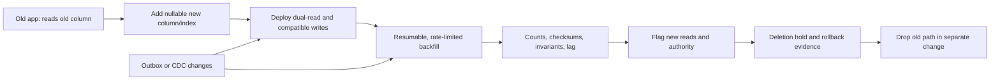

# Database Migration Strategies

**Level:** L4-L5
**Status:** Reviewed (Terra PASS)
**Audience:** Engineers planning high-write schema, data, and database-platform migrations with explicit rollback boundaries
**Prerequisites:** transactions, DDL locking, replication/CDC, feature flags, idempotency, and operational monitoring
**Sequence:** Batch 2A, 7/8
**Terra gate:** approved

## Learning objectives

- Design an expand-contract migration that remains compatible across application versions during high write volume.
- Calculate backfill work, rate limits, validation coverage, and operational headroom from stated assumptions.
- Use compatibility matrices, resumable checkpoints, dual-write or CDC evidence, and a state machine to control risk.
- Identify DDL lock behavior, rollback boundaries, deletion holds, and the point after which rollback becomes a forward fix.
- Explain why “zero downtime” and “full rollback” are goals requiring evidence, not universal promises.

## What it is

A database migration changes schema, data representation, ownership, engine, topology, or operational control while clients continue to use the system.

Schema migration changes tables, columns, constraints, indexes, or types.

Data migration transforms existing rows or moves them between stores.

Platform migration changes engine, region, shard, provider, or replication path.

An online migration decomposes risk into compatible states and makes progress observable.

Expand-contract is a pattern: add compatible structures, deploy readers/writers that tolerate both forms, backfill, validate, switch reads, then contract only after a deletion hold.

Provider DDL, lock, replication, and CDC semantics differ by engine and version.

## Why it matters

A high-write table cannot usually be stopped for a full rewrite without affecting the user SLO.

A migration is a distributed protocol between old application code, new application code, database nodes, workers, replicas, and downstream consumers.

Compatibility failures can happen during rolling deploys, rollback, replica lag, replay, or a partially completed backfill.

Operational safety comes from reversible state transitions, not from a label such as “online.”

Every migration needs a forward recovery plan after old data is deleted or a new authority is committed.

## Mental model

Treat a migration as a state machine with durable state and ownership.

Each state has entry conditions, work, validation, pause conditions, and a permitted next state.

The application and migration worker must tolerate retries and duplicate messages.

A checkpoint identifies a deterministic batch boundary, source version, or CDC position.

Validation compares source and destination values using counts, checksums, constraints, business invariants, and sampled records.

Rollback means returning traffic or writes to an earlier compatible state; it does not necessarily undo already applied transformations.

After contract or destructive deletion, use a forward migration or restore rather than claiming full rollback.

## Topic-specific visual

### Migration state-machine visual

```mermaid
stateDiagram-v2
    [*] --> Planned
    Planned --> Expanded: compatible schema and flags ready
    Expanded --> Backfilling: workers and checkpoints initialized
    Backfilling --> Backfilling: batch succeeds; checkpoint advances
    Backfilling --> Paused: error, lag, lock, or budget breach
    Paused --> Backfilling: operator resumes after diagnosis
    Backfilling --> Validating: source/destination catch up
    Validating --> Backfilling: mismatch or missing change
    Validating --> Switched: validation evidence accepted
    Switched --> Hold: new reads/writes are authoritative
    Hold --> Contracted: deletion hold and rollback window expire
    Expanded --> RolledBack: compatibility or deploy failure
    Backfilling --> RolledBack: before authority switch
    Validating --> RolledBack: before authority switch
    Switched --> ForwardFix: old representation no longer safely restorable
    Contracted --> ForwardFix: contract is irreversible
```

The important boundary is `Switched`/`Contracted`: before authority changes, traffic can often return to the old path; after deletion, recovery requires a forward fix or restore.

### Expand-contract flow visual

The diagram separates schema availability from data completeness and separates cutover from deletion.

## Worked example

### High-write expand-contract

Assume an `orders` table with 600 million rows, 8 TB including indexes, 12,000 writes/s peak, and 55,000 reads/s.

The current `customer_email` column is case-sensitive text; the target is a normalized `customer_email_norm` column used for lookup.

Assume 80% of writes include an email and the application has old and new versions during a 45-minute rolling deploy.

Assume a backfill worker can safely process 6,000 rows/s when storage and replica lag remain within budget.

At that rate, a full pass takes `600,000,000 / 6,000 = 100,000 seconds`, or about 27.8 hours before retries and throttling.

If the worker fleet has 4 workers, do not assume 24,000 rows/s; shared I/O, locks, cache churn, and replication can make the measured aggregate lower.

Assume 15% of rows require a normalization change and each changed row generates 1.5 KB of WAL on average.

Changed-row count is `600,000,000 × 0.15 = 90,000,000` rows.

Approximate extra WAL is `90,000,000 × 1.5 KB = 135,000,000 KB`, or about 135 GB before compression and engine-specific overhead.

That WAL can affect replicas and backup retention; monitor it during each batch.

A resumable checkpoint stores the last primary key or partition boundary plus a source version.

A worker reads a bounded batch, computes the normalized value, updates only rows still at the expected source version, records a checkpoint, and commits.

The expected-version condition prevents an old snapshot from overwriting a newer user edit.

The write path during `Compat` writes old and new representations in one local transaction, or writes the old row plus an outbox event that an idempotent projector applies.

Dual writes are not automatically atomic across separate systems; an outbox narrows the state-to-event gap but consumers can still lag or duplicate.

### Compatibility matrix

| App version | Reads old | Reads new | Writes old | Writes new | Safe during |
| --- | --- | --- | --- | --- | --- |
| V1 | Yes | No | Yes | No | Before expand only |
| V2 compatible | Yes/fallback | Yes | Yes | Yes | Expand, backfill, rolling deploy |
| V3 new authority | Optional fallback | Yes | Optional legacy | Yes | After validated cutover |
| V4 contracted | No | Yes | No | Yes | After deletion hold and contract |

The matrix is a contract for every deployed version, worker, replica consumer, and rollback artifact.

### Backfill guardrails

Use a token-bucket rate limit in rows/s or bytes/s and a concurrency cap per partition.

Pause when replica replay lag, lock wait, storage latency, WAL rate, or foreground p95 exceeds a stated budget.

Make retries deterministic and idempotent; a batch may be committed before its acknowledgement reaches the worker.

Store progress durably and make resumption safe after worker crash, duplicate scheduling, or deployment rollback.

Do not use `OFFSET` pagination on a mutating table; use a stable key range or partition checkpoint.

For large values, a byte-based limit may protect storage better than a row-based limit.

If rows can be deleted, define how the worker treats missing keys and how tombstones are validated.

### Validation

Compare total eligible row count, populated new-column count, null/malformed count, per-partition counts, and sampled normalized values.

Use checksums that include primary key and normalized value; state the collision and sampling limitations.

Compare lookup results and read latency for old and new paths across hot tenants and rare values.

Validate replicas and CDC consumers at their own positions.

Do not declare complete because the worker reached the final key: late writes and missed events must be reconciled.

## Advantages and limitations

Expand-contract reduces coordinated downtime and preserves a compatibility path, but it temporarily doubles representations, code paths, storage, and validation work.

CDC or an outbox can make change publication durable, yet they do not provide automatic exactly-once effects or remove reconciliation.

A stop-the-world migration is easier to reason about for small data sets, while high-write systems trade that simplicity for staged operational risk.

### Cutover and rollback boundary

Enable new reads behind a flag for a small traffic slice and compare results before changing the authority.

Keep dual writes and old data through the deletion hold.

If mismatches appear before contract, disable the flag, stop the backfill, and repair from evidence.

After dropping the old column, old binaries may no longer start; rollback is then a forward-compatible deployment or restore, not a full reversal.

Schedule contract only after the oldest rollback-capable application version is retired and the hold has expired.

## DDL locking caveats

DDL behavior depends on engine, version, table size, index method, and provider implementation.

Some metadata changes are fast but still need a brief lock; concurrent DDL can queue behind long transactions.

An index build can consume I/O, CPU, WAL, and replica bandwidth even when it avoids a long exclusive table lock.

Adding a default or rewriting a type may rewrite a table in some versions and be metadata-only in others.

Foreign-key validation and constraint creation can scan and lock data.

Set an intentional lock timeout, observe blockers, and plan a retry rather than waiting indefinitely.

Test on a copy with production-like row width, indexes, transactions, and replica load.

Provider failover or proxy behavior can change which sessions see a DDL operation first.

## Dual write, outbox, and CDC

Dual write means one logical operation updates two representations or systems.

If the writes are separate, the first can commit and the second fail.

An outbox writes the source state and an event in one local transaction; a relay publishes events with at-least-once delivery.

The consumer must be idempotent, order-aware where required, and observable by source position and apply lag.

CDC from a database log can reduce application code changes but inherits log retention, schema, ordering, and connector failure semantics.

A CDC snapshot plus change stream needs a clear handoff position to avoid gaps or duplicates.

Use a reconciliation job to find missed records and a dead-letter path for unprocessable events.

Do not claim exactly-once end-to-end delivery unless every boundary and side effect provides that semantics.

## Comparison: migration patterns

| Pattern | Strength | Limitation and rollback boundary |
| --- | --- | --- |
| Expand-contract | Compatible rolling deploy and staged validation | More states, storage, dual-read/write logic, and contract is destructive |
| Dual-write with outbox | Narrows local commit/event gap and supports new store | At-least-once relay, reconciliation, and consumer lag remain |
| CDC replication | Captures existing writes with less app coupling | Connector/log/schema failure modes and cutover consistency require proof |
| Stop-the-world dump | Simple consistency story for small systems | Downtime scales with data and restore; rollback is operationally disruptive |
| Blue-green database | Clear traffic switch and isolation | Double capacity, sync lag, side effects, and old environment retirement |

There is no universal zero-downtime or full-rollback guarantee.

## Comparison: validation and cutover

| Evidence | Finds | Blind spot |
| --- | --- | --- |
| Row counts | Missing or extra records | Equal counts can hide wrong values |
| Checksums | Value differences in sampled/keyed scopes | Hash design and coverage limitations |
| Shadow reads | User-visible result differences | Adds load and may miss rare paths |
| Invariants | Business correctness such as unique active order | Requires domain ownership and complete rules |
| CDC/checkpoint lag | Incomplete change application | A caught-up stream can still contain a bad transform |

Use layered evidence before changing authority.

## Failure modes and operations

### Preflight and rehearsal

Before production, rehearse the migration on a size- and write-rate-representative copy with the same major engine version.

Verify permissions, extension versions, connection-pool behavior, replica capacity, observability, and abort controls.

Record a baseline for foreground latency, error rate, WAL, storage, lock waits, and consumer lag.

The rehearsal should include a worker crash, duplicate batch, deployment rollback, CDC reconnect, and validation mismatch.

An untested abort command is not a rollback plan.

### Schema compatibility details

Adding a nullable column is often compatible, but defaults, generated expressions, constraints, indexes, and ORM migrations can have different lock or rewrite behavior.

Deploy code that ignores unknown columns and does not require the new column before it is populated.

For enum, type, and constraint changes, prove both old and new clients can parse the transitional state.

Keep compatibility views or adapters when a downstream consumer cannot upgrade in the same release.

### Migration ownership

Name one controller as the owner of state transitions and make workers report progress rather than advancing state independently.

Use a lease or fencing token so a paused controller cannot resume after another controller takes ownership.

Persist the migration version, schema version, source/target authority, last checkpoint, and validation evidence.

### Backfill correctness

Use a stable ordering key and a source-version predicate when concurrent foreground updates can race with the worker.

If the transformation is not deterministic, record the input version and transformation version with the output.

Make a retry of a committed batch produce the same result or a no-op.

When a row is deleted between scan and update, count it as a known outcome and reconcile the source range.

### Read-path comparison

Shadow or dual-read only a bounded percentage of traffic and compare normalized results without returning the shadow result to users.

Redact PII from mismatch logs and group differences by transformation version, tenant, and key range.

A zero mismatch sample is evidence for the sample only; add keyed counts and invariants for broader coverage.

### Operational windows

Coordinate migration rate with backups, vacuum, index builds, deployment waves, and planned failovers.

An operation that is individually online can still overload a shared storage or replication budget when combined with another operation.

Set a stop condition before starting and name the person allowed to resume after a pause.

### Dependency and consumer readiness

Inventory API binaries, background workers, analytics jobs, CDC consumers, ORM mappings, reports, and rollback artifacts.

A schema is not compatible if a forgotten consumer fails after the main service deploys.

Test consumer replay from an old event and a new event before contract.

### Roll-forward recovery

After a destructive contract failure, identify whether a restore, additive column, compatibility view, or forward transform is safest.

Do not promise full rollback after dropping data; retain a recovery point and a rehearsed forward-fix procedure instead.

### Migration record

Record owner, ticket, assumptions, code version, schema version, source/target, rate, checkpoints, lag, validation, cutover time, hold expiry, and final disposition.

### Backfill overload

Detect increased foreground latency, lock waits, I/O, WAL, replica lag, and pool queue.

Pause or reduce rate using a durable control value; do not kill arbitrary workers without checking transaction outcomes.

Resume from a checkpoint and reconcile the interrupted batch.

### Dual-write mismatch

Compare old/new values and outbox/CDC positions; keep old reads as a fallback before contract.

Fix code or replay events idempotently, then repeat validation.

### DDL blocked

Inspect lock holders and transaction age, use lock timeout, and reschedule rather than queueing production indefinitely.

### Deploy rollback

Consult the compatibility matrix; an old binary can roll back only while the expanded schema and read/write compatibility remain.

### Missed CDC window

Stop cutover, identify snapshot/change handoff, restore from a known position, and reconcile by key.

### Contract error

Freeze further deletion, use an approved restore or forward schema change, and communicate that full rollback may no longer exist.

### Operational checklist

1. Write states, owners, assumptions, metrics, and rollback/forward boundaries.
2. Add compatible schema and deploy readers/writers according to the matrix.
3. Backfill with durable checkpoints, rate limits, retries, and pause thresholds.
4. Reconcile dual writes/CDC and validate counts, values, invariants, and lag.
5. Canary new reads, then switch authority while preserving the old path.
6. Hold deletion, retire old binaries, and contract in a separately reviewed change.

## Practical exercises

### Exercise 1: Backfill arithmetic

A 600-million-row table is processed at 6,000 rows/s. Estimate one pass and list three signals that should pause the worker.

**Expected approach:** `600,000,000 / 6,000 = 100,000 s ≈ 27.8 h` before retries. Pause on foreground p95/SLO breach, replica lag, storage/WAL budget, lock waits, or error rate; state that worker parallelism is measured, not multiplied blindly.

### Exercise 2: Compatibility matrix

An old binary reads/writes only `email`, a new binary reads `email_norm` with fallback, and a deploy may roll back for 30 minutes. Define the safe phases.

**Solution:** Add nullable `email_norm`, deploy fallback/dual-write code, backfill and validate, canary new reads, and keep old column for the 30-minute rollback window plus a deletion hold. Do not drop `email` while the old binary may return.

### Exercise 3: Outbox mismatch

The old row committed but the new-store projector failed after writing the outbox event. Describe recovery.

**Expected approach:** Keep the source authoritative, retry the event idempotently from the durable outbox, monitor apply lag and dead letters, and reconcile by key. Do not issue an independent second application write and claim atomicity across stores.

### Exercise 4: DDL lock incident

A migration waits on a metadata lock while a five-hour idle-in-transaction session exists. Write the safe response and rollback boundary.

**Solution:** Capture blocker, owner, transaction age, and impact; use the configured lock timeout, cancel/reschedule under the incident policy, and do not kill without approval. The schema remains expanded/unchanged as appropriate, so the migration can retry before contract; preserve evidence.

## Interview Q&A

### Q1. What is expand-contract?

**Answer:** Add compatible structures, deploy code that tolerates both, backfill and validate, switch reads/writes, hold the old path, then contract separately.

**Follow-up:** Why separate contract from cutover?

### Q2. Is zero downtime guaranteed?

**Answer:** No. DDL locks, capacity, replication lag, bugs, retries, failover, and dependency behavior can still affect availability; “online” is a tested objective.

**Follow-up:** What evidence supports the claim for one migration?

### Q3. How do you make a backfill resumable?

**Answer:** Use stable key/range checkpoints, idempotent updates, source-version conditions, durable progress, bounded batches, and reconciliation after interruption.

**Follow-up:** Why avoid offset pagination?

### Q4. What is dual-write's consistency problem?

**Answer:** Separate writes can commit independently, leaving one representation ahead or behind. An outbox or CDC can make publication durable, but consumers remain at-least-once and need reconciliation.

**Follow-up:** Does an outbox provide atomicity across databases?

### Q5. What is a rollback boundary?

**Answer:** The state after which traffic cannot safely return to the old representation, often because data was deleted, a new authority committed, or old binaries are incompatible.

**Follow-up:** What replaces rollback after contract?

### Q6. Why can DDL block writes?

**Answer:** DDL requires metadata or table locks that can wait behind long transactions; some operations scan or rewrite data and consume system capacity. Version and provider semantics matter.

**Follow-up:** Which timeout and evidence do you use?

### Q7. How do you validate a migration?

**Answer:** Layer counts, keyed checksums, sampled/shadow reads, business invariants, constraints, CDC position, replica lag, and representative latency.

**Follow-up:** Why are equal row counts insufficient?

### Q8. How do you handle CDC snapshot handoff?

**Answer:** Record a precise log position, take a consistent snapshot, apply changes after that position, and deduplicate or reconcile the overlap so no gap exists.

**Follow-up:** What if the connector loses its position?

### Q9. When is blue-green useful?

**Answer:** When a second database can be provisioned and synchronized, and a controlled switch is worth the duplicate capacity and lag/side-effect complexity.

**Follow-up:** What must be fenced at cutover?

### Q10. What should happen when validation fails?

**Answer:** Pause, preserve the old authority, identify mismatch scope, repair or replay idempotently, and repeat validation. Do not contract to hide the failure.

**Follow-up:** Which evidence makes a retry safe?

## Related and next reading

- [Query planning](17-query-planning.md) for index builds, plan validation, and lock evidence.
- [Change data capture](20-change-data-capture.md) for offsets, snapshots, duplicates, and schema evolution.
- [Backup and recovery](16-backup-recovery.md) for restore-based recovery after destructive contract steps.
- [Sharding advanced](19-sharding-advanced.md) for live data movement and fencing.
