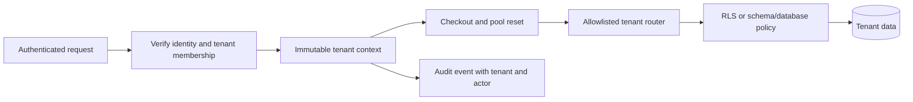
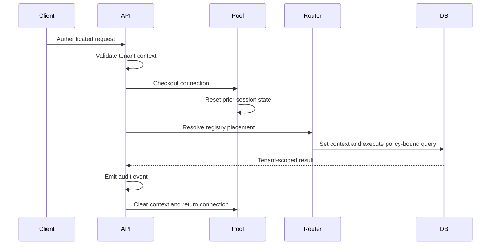
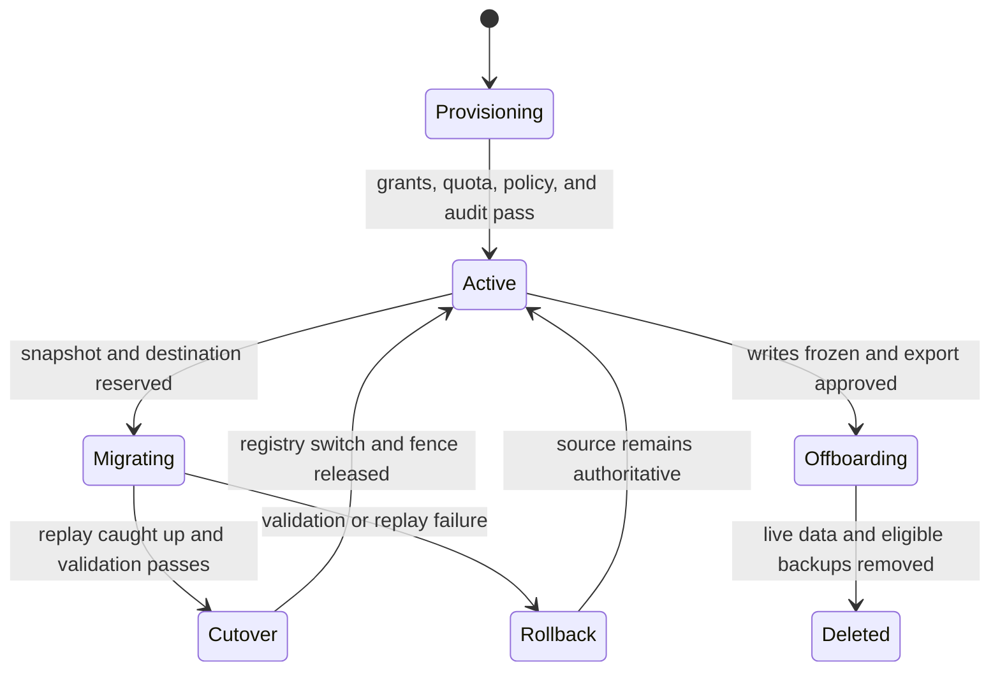

# Multi-Tenancy: Isolation, Placement, and Fairness

**Level:** L4–L5
**Status:** reviewed
**Audience:** Engineers designing secure SaaS data planes and preparing for system-design interviews.
**Prerequisites:** SQL authorization, connection pooling, migrations, backups, and threat modeling.
**Sequence:** Batch 2B, 8/8
**Terra gate:** approved

## Learning objectives

- Compare shared schema with RLS, schema-per-tenant, database-per-tenant, and silo placement using stated risks.
- Trace authenticated request, tenant context, pool reset, RLS/router authorization, and audit evidence end to end.
- Design tenant classes, placement, quotas, routing, onboarding, offboarding, and migration workflows.
- Test `BYPASSRLS`, owner, pool leakage, identifier injection, noisy neighbor, backup, deletion, and drift failures.
- Calculate a tenant quota and migration capacity using explicit units and recovery assumptions.

## What it is

Multi-tenancy serves independent customers from shared or partially shared
infrastructure while preserving an end-to-end isolation contract. The contract
covers identity, request context, application queries, database policies,
connection pools, caches, logs, backups, exports, deletion, and operations.
A `tenant_id` column alone is not isolation; every path that can disclose or
mutate data must carry an authorization boundary.

The main storage patterns are shared schema with Row-Level Security (RLS),
schema-per-tenant in one database, database-per-tenant, and a dedicated silo.
Placement is a routing and capacity decision; authorization still applies inside
the selected database. A tenant registry maps an authenticated tenant identity
to class, placement, schema/database identifier, quota, version, and lifecycle
state.

## Why it matters

Shared infrastructure lowers idle cost and simplifies fleet operations, but it
turns a missed predicate, pool reset failure, or privileged role into a potential
cross-tenant incident. Dedicated placement raises isolation and blast-radius
boundaries while multiplying migrations, backups, connections, and upgrades.

| Pattern | Isolation boundary | Operational cost | Failure to test |
| --- | --- | --- | --- |
| Shared schema + RLS | Database policy and role | Lowest fleet cost | Missing policy, `BYPASSRLS`, owner, pool leakage |
| Schema per tenant | Schema grants and routing | Migration/catalog fan-out | Identifier injection, drift, wrong schema |
| Database per tenant | Database credentials | Provisioning, pools, backups | Routing drift and fleet recovery |
| Silo per tenant | Instance/network boundary | Highest idle and upgrade cost | Underutilization and inconsistent policy |

Choose the pattern from threat model, tenant count, workload skew, compliance,
recovery objectives, and migration ownership. “Physical” is not a synonym for
safe if credentials or backups are shared.

## Mental model

An authenticated request obtains a tenant context from a verified token or
server-side mapping. The context is immutable for the request and is passed to
repositories, cache keys, queues, storage paths, and audit events. A connection
pool checkout must reset prior session state before setting the current tenant.
The router selects an allowlisted placement, and database RLS or schema grants
enforce the final storage boundary.



The invariant is that the tenant context is established before data access and
cannot be replaced by a user-supplied row filter. Pool reset prevents a prior
tenant's session setting from crossing requests; the audit stream records what
happened but does not authorize it.

### Authorization layers

Middleware verifies token claims and membership. The application rejects a
missing or mismatched context and uses tenant-aware repositories. The database
uses RLS, schema grants, views, or stored procedures. Storage and caches include
tenant scope. Operators use separate roles and audited break-glass procedures.

In PostgreSQL, inspect policy roles, table owners, security-definer functions,
superuser behavior, and `BYPASSRLS`. An owner may be exempt from RLS depending on
the deployed configuration. A migration role that can bypass policy must not be
used by an untrusted request path.

### Tenant registry and lifecycle

The registry is authoritative for routing state, class, schema version, quota,
and lifecycle status. Onboarding allocates an ID, placement, grants, quotas,
encryption policy, audit stream, and migration version before accepting traffic.
Offboarding freezes writes, exports if required, deletes live data, handles
backups/legal holds, invalidates caches, and records a deletion receipt.

Migrations use a state machine rather than a best-effort flag. Copy a consistent
snapshot, replay changes, validate, fence writes, switch routing atomically, and
retain rollback data for a stated window. A retry must not create two placements
or route half of a tenant's tables to different versions.

### Quotas and noisy neighbors

A quota can cover requests/second, concurrent queries, storage bytes, scan bytes,
queue depth, export bandwidth, or background-job CPU. Keep hard safety limits
separate from soft plan limits. A noisy neighbor detector attributes resource
usage to tenant context and can rate-limit, shed optional work, or move a tenant
to dedicated placement.

## Worked example

Assume 10,000 standard tenants share a database, 40 enterprise tenants use
dedicated schemas, and 5 regulated tenants use separate databases. A standard
tenant has a quota of 600 queries/minute and 4 concurrent queries. Its sustained
request budget is `600 / 60 = 10 queries/second`; its concurrency budget is
independent of rate and bounds long-running work.

Suppose the shared database has 200 connection slots, of which 40 are reserved
for migrations, operators, and replication. The application fleet has 20
instances. A fair shared-pool budget is at most `(200 - 40) / 20 = 8` active
connections per instance, subject to measured query service time. A pool size
of 50 on every instance would advertise 1,000 possible sessions and defeat the
database limit. Use a pooler or admission queue with tenant-aware quotas.

For a migration, an enterprise tenant has 240 GB decimal of data and a measured
copy rate of 80 MB/s. The lower-bound copy duration is
`240,000 MB / 80 MB/s = 3,000 seconds`, or 50 minutes, before CDC replay,
validation, throttling, and retries. Reserve a 2-hour maintenance envelope and
measure source write rate because replay can extend the window.

If a shared-schema `orders` table has 1,000,000 rows and tenant A owns 80,000,
the index `(tenant_id, created_at)` supports the tenant predicate but does not
replace RLS. A query missing the tenant context must fail closed. A query that
uses an attacker-controlled schema name must resolve through the registry, not
concatenate an identifier into SQL.

## Advantages and limitations

| Design choice | Advantage | Limitation | Use when |
| --- | --- | --- | --- |
| Shared schema + RLS | One migration and compact fleet | Policy/role mistakes have broad blast radius | Many small similar tenants |
| Schema per tenant | Object/grant boundary and simpler export | Catalog, migration, and drift work | Moderate number of stronger boundaries |
| Database per tenant | Credentials, restore, and noisy-neighbor isolation | Fleet and connection multiplication | Enterprise or compliance class |
| Silo | Strongest network/compute boundary | Highest cost and upgrade count | Regulated or contractual isolation |

Isolation is not the only axis. Compare blast radius, noisy-neighbor control,
onboarding time, migration concurrency, backup deletion, observability, and
operator access. A dedicated database still needs correct identity and audit
controls; a shared schema can be appropriate when RLS is tested continuously.

### Tenant class policy

| Tenant class | Placement | Quota example | Backup/deletion policy |
| --- | --- | --- | --- |
| Standard | Shared schema + RLS | 10 QPS, 4 concurrent queries, 50 GB | Shared encrypted backup; scoped restore workflow |
| Enterprise | Dedicated schema | 50 QPS, 16 concurrent queries, 240 GB | Tenant-scoped export and retention contract |
| Regulated | Separate database or silo | Reserved capacity and operator allowlist | Separate keys, restore project, legal-hold process |

The values are planning assumptions for this example, not universal limits or
provider pricing. Quotas should be calibrated from measured service time,
storage growth, and recovery capacity.

## Topic-specific visual



The sequence shows the pool reset and cleanup boundaries. A request that skips
either can leak context across tenants; a router choice without database policy
is only placement, not authorization.



The lifecycle makes onboarding, migration, and offboarding explicit. The source
remains authoritative until cutover validation passes; deletion is a state with
evidence, not an untracked `DROP` command.

## Failure modes and operations

### RLS, owner, and `BYPASSRLS` failures

Test every table, view, function, and write path with ordinary tenant roles.
Review owner and privileged roles, security-definer code, default privileges,
and migrations. A role with `BYPASSRLS` is a powerful operational identity and
must be unavailable to request traffic. Alert on policy changes and unexpected
role grants.

### Pool leakage

Use transaction-local context where possible, reset session variables on every
checkout/return, discard connections after reset failure, and assert context in
repository calls. Test cancellation, timeout, retry, and connection reuse. A
pool reset is defense in depth; database authorization must still reject a
cross-tenant query.

### Identifier injection and routing drift

Tenant slugs must map to server-side registry IDs. Do not interpolate a tenant
slug as a schema, table, database, or connection string. Parameters generally
bind values, not identifiers. During migration, version the registry and use an
epoch/fence so an old router cannot send writes to the previous placement.

### Noisy neighbors and quota errors

Attribute CPU, I/O, connections, scan bytes, queue depth, and storage to tenant.
Use bounded concurrency and fair queues; do not assume rate limiting alone stops
a tenant with expensive queries. A move to dedicated placement is a migration
with snapshot, replay, cutover, and rollback evidence.

### Backups, deletion, and legal holds

Shared backups can contain all tenants. Restore tooling must authorize tenant
scoped exports and scrub temporary copies. Offboarding freezes writes, records a
request and approval, removes live rows/objects/indexes, invalidates caches,
expires eligible backups, and produces a receipt. Legal holds and retention law
can delay physical deletion; retain only the minimum audit evidence.

### Drift and partial lifecycle

Detect tenants whose schema version, quota, grants, encryption key, backup policy,
or registry placement differs from the declared class. Onboarding must be
idempotent. A partial provision is quarantined and cannot accept traffic. A
failed migration leaves the old placement active until validation and cutover.

### Observability and runbook

- Log tenant ID, actor, placement version, policy decision, and audit ID without sensitive payloads.
- Track denied requests, RLS policy changes, pool reset failures, quota rejects, and route epochs.
- Track per-tenant p95/p99 service time, CPU, storage, connections, scan bytes, and noisy-neighbor events.
- Test owner/`BYPASSRLS`, missing context, pool reuse, identifier injection, backup restore, deletion, and drift.
- Reconcile registry, database grants, schema versions, backups, caches, and audit records after lifecycle changes.
- Document provider/version behavior for RLS, roles, poolers, snapshots, encryption, and restore.

### Tenant placement and routing algorithm

Routing begins with an authenticated tenant ID, not with a user-controlled
database name. The registry lookup returns class, placement ID, schema/database
mapping, epoch, and lifecycle state. Reject an unknown, suspended, migrating,
or deleted tenant before opening a connection. Cache registry entries only with
a short, versioned TTL and invalidate them on cutover.

```text
route(request):
  identity = verify_token(request.token)
  tenant = registry.lookup(identity.tenant_id)
  require tenant.status == ACTIVE
  require tenant.epoch == request.registry_epoch or refresh registry
  require placement_allowlist.contains(tenant.placement_id)
  return pool_for(tenant.placement_id), tenant.schema_id, tenant.epoch
```

The router must not concatenate `schema_id` into SQL without a server-side
allowlist and identifier-quoting API. The query layer still sets tenant context
and relies on RLS or schema grants. During migration, the epoch fences an old
router: a write carrying epoch 11 is rejected after the registry advances to
epoch 12. Reads can use a documented old snapshot only when their consistency
contract allows it.

### Onboarding, migration, and offboarding runbook

Onboarding is a saga with compensating cleanup. Allocate a globally unique
tenant ID, classify the tenant, reserve placement, create schema/database and
grants, install policy/version, set quotas, configure backup and encryption,
write an audit event, and run a cross-tenant isolation test. Mark `ACTIVE` only
after every step is idempotently complete. A failed step leaves `PROVISIONING`
and blocks traffic; a retry resumes by recorded step, not by guessing.

Migration starts by reserving a destination and recording source/destination
epochs. Copy a consistent snapshot, stream CDC changes, validate row counts and
checksums, compare representative queries, and wait until replay lag is within
the cutover budget. Fence writes at the source, perform a final replay, switch
the registry atomically, and monitor the new route. Keep the source read-only
for the rollback window; delete it only after reconciliation.

Offboarding freezes writes and verifies the requester's authority. Produce a
tenant-scoped export if policy requires one, delete live rows/objects/indexes,
invalidate cache namespaces, remove credentials and routes, and process backups
according to retention and legal hold. Record counts, object prefixes, backup
identifiers, key state, and a deletion receipt. A receipt proves the workflow's
scope and evidence; it does not prove impossible deletion from an active legal
hold.

### RLS and pool-reset security walkthrough

At checkout, discard a connection whose reset fails. Begin a transaction, set
the tenant context locally, execute the query, commit or roll back, clear
session state, and return the connection. The repository should assert that a
context exists and that the requested tenant matches the verified identity.
The database policy is the final check, not an optional optimization.

Test a normal tenant role, an owner role, a migration role, and a role with
`BYPASSRLS`. The last two must be inaccessible to request traffic. Review
security-definer functions, views, foreign keys, triggers, and background jobs;
one unprotected path can bypass the intended RLS boundary. Log policy changes,
role grants, reset failures, denied queries, and the audit ID without logging
tenant-sensitive values.

### Backup and deletion verification

For a shared backup, restore into an isolated project with a restricted operator
role. Verify that the export contains only the requested tenant, that foreign
keys and object prefixes do not pull another tenant's records, and that the
restored service cannot reach production. Compare expected row counts, checksums,
deletion markers, and key/retention metadata. Destroy the temporary restore
after the evidence is recorded.

Deletion verification covers primary rows, replicas, search indexes, object
storage, caches, derived Gold tables, audit references, and backups. Map each
system to a retention owner and proof method. For a legal hold, record the held
table and review date instead of claiming it was deleted. A backup policy that
cannot support tenant-scoped erasure should influence the placement decision.

### Noisy-neighbor incident timeline

At 09:00, tenant A consumes 70% of shared database CPU. At 09:02, per-tenant
query and connection metrics identify A; the service applies a soft quota and
slows optional reports. At 09:05, the operator captures plans and active-query
samples rather than killing unrelated work. At 09:10, the platform caps A's
concurrency, preserves reserved capacity, and communicates degradation.

At 09:20, a canary moves A to an enterprise placement. The team snapshots,
replays changes, validates counts, and switches the registry epoch. At 09:45,
the team compares CPU, latency, error, and quota metrics and keeps the old
placement read-only until the rollback window closes. The incident review asks
whether the quota, placement class, index, query plan, or product policy failed;
rate limiting alone is not a capacity diagnosis.

## Practical exercises

### Exercise 1: Test shared-schema isolation

Design tests for tenants A and B reading and writing a shared `orders` table.
Include an application bug that omits `tenant_id`, an owner connection, and a
`BYPASSRLS` role.

**Expected approach:** Assert that ordinary roles can access only their rows,
missing context fails closed, owner/privileged behavior is explicitly blocked
from request traffic, and audit events identify tenant and actor. Add policy,
view, function, and migration tests on the deployed database version.

### Exercise 2: Size tenant quotas

The shared database allows 160 application connections after reservations. There
are 20 service instances and 100 standard tenants. Propose a per-instance pool
and tenant concurrency policy.

**Solution:** Keep average active connections at or below `160/20 = 8` per
instance, with a bounded queue and reserved operational capacity. A standard
tenant's 4-query concurrency quota must be admitted fairly; measure service time
and tenant usage rather than giving every tenant an unbounded pool.

### Exercise 3: Migrate an enterprise tenant

Move a 240 GB tenant from shared schema to a dedicated database while writes
continue.

**Expected approach:** Reserve destination and policy, copy a consistent
snapshot, replay CDC, validate counts/checksums and tenant-scoped queries, fence
writes, switch the registry epoch atomically, observe, and retain rollback data.
Make retries idempotent and reconcile quotas, audit, backups, and caches.

### Exercise 4: Offboard with backups

A tenant requests erasure but a shared encrypted backup has a 30-day retention
period and a legal hold covers one invoice table.

**Expected approach:** Authenticate and freeze writes, export if required, delete
eligible live data and cache copies, mark held data, expire or rewrite backups
according to policy, and issue an auditable receipt. Do not claim deletion of
held records; record the scope, owner, and next review date.

## Interview trade-off analysis

An interview answer should name tenant population, data size distribution,
compliance classes, request rate, recovery objectives, and migration ownership
before selecting a pattern. For 100,000 small tenants, shared schema/RLS may
minimize fleet overhead, but the design needs strict policy testing, composite
indexes, fair queues, and a plan for high-value tenants. For 100 enterprise
tenants, schema-per-tenant can make export and grants clearer, but catalog and
migration fan-out become first-class operations. For five regulated tenants,
database-per-tenant or a silo may be justified by backup, key, or network
boundaries despite higher cost.

| Decision axis | Shared schema/RLS | Schema/database per tenant | Silo |
| --- | --- | --- | --- |
| Isolation blast radius | Policy/database failure can affect many | Placement failure is narrower | Instance/network boundary |
| Migration | One schema migration | Fan-out or tenant scheduler | Fleet-sized rollout |
| Noisy neighbor | Fair queue and quotas required | Easier resource reservation | Strongest reservation |
| Backup deletion | Scoped restore/scrub is complex | Tenant selection is simpler | Separate retention control |
| Cost | Efficient for small tenants | More idle resources | Highest idle and operator cost |

Do not claim one pattern is always safer. RLS can be robust when ordinary roles,
owner behavior, `BYPASSRLS`, pool reset, and all access paths are tested. A
dedicated database can still leak through an incorrect router or shared backup.
The strongest answer states the invariant, gives a failure test, and explains
how a tenant changes class without losing writes or audit evidence.

## Interview Q&A

### Q1. What is end-to-end tenant isolation?

**Answer:** It binds verified identity to context and carries authorization
through application, pool, database, cache, storage, backups, exports, and audit.
It is stronger than adding a tenant column to one table.

**Follow-up:** Which boundary fails if a pooled session retains the prior tenant?

### Q2. Shared schema/RLS or schema per tenant?

**Answer:** Shared schema/RLS is efficient for many similar tenants but has policy
blast radius. Schema per tenant gives a stronger object boundary but adds
catalog, migration, routing, and drift operations.

**Follow-up:** What tenant class would you move out first?

### Q3. Does RLS always protect rows?

**Answer:** No. Review table owners, `BYPASSRLS`, superuser/privileged roles,
security-definer functions, views, and policy coverage in the deployed version.

**Follow-up:** How do you test a policy with the real request role?

### Q4. How do you prevent pool leakage?

**Answer:** Set context transaction-locally, reset on checkout/return, discard a
connection after reset failure, and retain database-side authorization. Test
timeouts, cancellation, and reuse.

**Follow-up:** Which session state besides tenant ID must be cleared?

### Q5. What is identifier injection?

**Answer:** An untrusted slug is interpolated as a schema, table, database, or
connection identifier and selects unintended data. Map input through an
allowlisted registry; value parameters do not generally bind identifiers.

**Follow-up:** Who may change a registry placement?

### Q6. How do quotas handle noisy neighbors?

**Answer:** Attribute concurrency, request rate, storage, scan, and background
work to tenants, then use fair queues, rate limits, reserved capacity, or a
placement move. Measure expensive queries rather than only request count.

**Follow-up:** What is the degradation response when the quota is exhausted?

### Q7. How do backups affect deletion?

**Answer:** A shared backup can contain every tenant. Scope restore/export access,
expire or rewrite eligible copies, honor legal holds, invalidate live copies,
and retain only a minimal deletion receipt.

**Follow-up:** How do you prove a tenant-scoped restore is safe?

### Q8. How do you migrate a tenant safely?

**Answer:** Snapshot, replay changes, validate, fence writes, switch an epoch-
versioned registry, observe, and retain rollback. Reconcile grants, quotas,
backups, caches, and audit records.

**Follow-up:** What prevents an old router from writing after cutover?

### Q9. What is tenant drift?

**Answer:** Declared class, placement, schema version, grants, quota, key, or
backup policy differs from reality. Reconcile registry with provider state and
quarantine partial lifecycle resources.

**Follow-up:** Which drift must block traffic immediately?

## Related and next reading

- [Connection pooling](25-connection-pooling.md)
- [Database security](28-database-security.md)
- [Advanced sharding](19-sharding-advanced.md)
