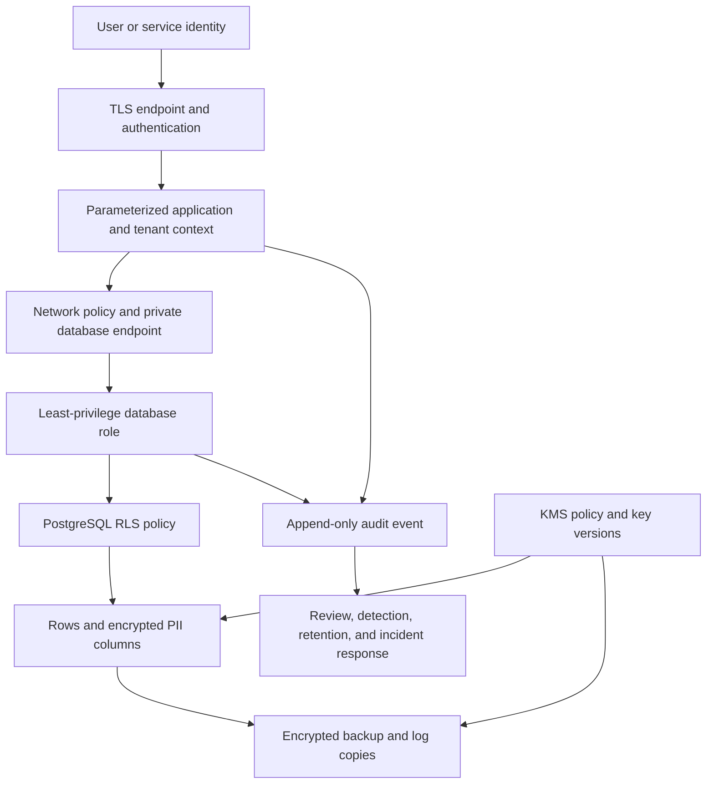
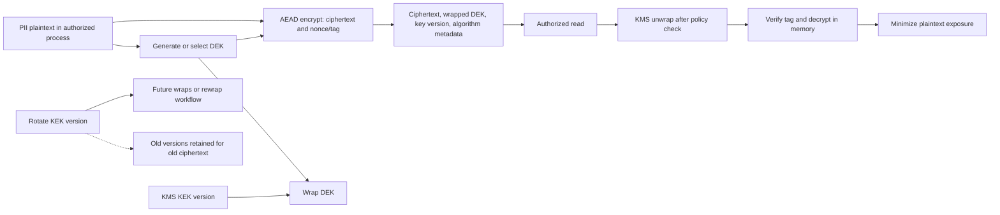

# Database Security

**Level:** L4-L5
**Status:** Reviewed (Terra PASS)
**Audience:** Engineers designing tenant-isolated PII data paths, database access controls, encryption, and audit operations
**Prerequisites:** SQL privileges, PostgreSQL roles and RLS, TLS, KMS concepts, threat modeling, and incident response
**Sequence:** Batch 2A, 8/8
**Terra gate:** approved

## Learning objectives

- Trace tenant PII from request identity through authorization, query execution, encryption, logging, backup, and deletion.
- Apply defense in depth with least privilege, network controls, parameterized SQL, RLS, encryption, auditing, and tested recovery.
- Explain envelope encryption and KMS key rotation without claiming that rotation re-encrypts all historical data automatically.
- State PostgreSQL RLS owner, superuser, `BYPASSRLS`, security-definer, and role-setting caveats precisely.
- Build a threat-model-dependent control plan and verify TLS, provider, audit, key, and incident assumptions.

## What it is

Database security protects confidentiality, integrity, availability, and accountability for stored and processed data.

Controls operate at identity, network, transport, application, database, row, column, key, backup, and operational layers.

No single control proves tenant isolation or prevents every insider, credential, provider, or application failure.

Encryption at rest protects storage media and service-managed copies under its threat model; it does not stop an authorized query from reading plaintext.

TLS protects data in transit between authenticated endpoints; it does not authorize a SQL operation.

PostgreSQL examples target current supported releases, but default roles, RLS behavior, TLS configuration, audit extensions, and managed-provider restrictions must be checked for the deployed version.

Security claims are threat-model dependent: identify attacker capability, assets, trust boundaries, and recovery assumptions before selecting controls.

## Why it matters

Tenant PII may be exposed by a missing predicate, a compromised service role, a debug log, a backup bucket, a stolen key, or a privileged operator.

Layered controls reduce the chance that one defect becomes a cross-tenant breach.

Authorization must be evaluated close to the data, but database controls cannot repair a compromised superuser or a malicious application that can bypass the intended boundary.

Audit evidence supports detection and accountability only when it is complete enough, time-synchronized, protected from tampering, and reviewed.

Encryption changes the blast radius and recovery obligations; it does not eliminate key access or plaintext exposure at the application endpoint.

## Mental model

Trace a request through five questions: who is calling, which tenant is in scope, which rows may be read, which keys may decrypt them, and what evidence is retained.

The application authenticates a principal and obtains a tenant context from trusted identity, not an arbitrary client string.

The database role has only required privileges and receives tenant context through a controlled transaction/session boundary.

RLS converts a row-policy predicate into a database-enforced filter for roles to which RLS applies.

Application-level encryption protects selected fields from database readers who lack the decryption path, but searchable equality/range operations may require keyed tokens or a different design.

Envelope encryption uses a data-encryption key (DEK) for data and a key-encryption key (KEK) in a KMS to wrap the DEK.

The audit path records principal, tenant, operation, object, outcome, request correlation, and key/version metadata without copying unnecessary PII.

## Advantages and limitations

Least privilege and RLS place useful controls near the data, while encryption and independent audit reduce storage and investigation blast radius.

RLS does not constrain superusers or `BYPASSRLS` roles, and encryption does not hide plaintext from an authorized application or KMS-authorized process.

Layered controls improve defense in depth but add key lifecycle, performance, provider, privacy, and recovery operations that must be tested.

## Topic-specific visual

### Defense-in-depth visual



Each layer assumes the adjacent layer can fail; the diagram is a defense boundary map, not a guarantee that a request is safe.

### Envelope-encryption visual



KMS rotation changes which key version wraps future or rewrapped DEKs according to provider behavior; it does not imply every ciphertext was rewritten.

## Worked example

### Tenant PII data path

Assume a SaaS profile service stores a tenant's contact name, email, phone, and support notes.

Assume `tenant_id` is present on every PII row and the API authenticates a service identity plus a tenant membership claim.

The threat model includes a buggy application predicate, a stolen read-only application credential, accidental log export, an operator with database access, and a compromised backup credential.

It excludes a fully compromised KMS root account and a malicious host kernel; those require separate controls and provider assumptions.

The request enters over TLS with certificate validation and an authenticated service identity.

The application resolves tenant membership from trusted authorization data and never trusts a client-supplied tenant ID alone.

It uses a parameterized query and sets a transaction-local tenant context through a controlled mechanism.

The database role can access the schema but cannot create roles, alter policies, read KMS credentials, or bypass RLS.

```sql
CREATE TABLE customer_profile (
    tenant_id bigint NOT NULL,
    profile_id bigint NOT NULL,
    email_ciphertext bytea NOT NULL,
    email_token bytea NOT NULL,
    phone_ciphertext bytea,
    wrapped_dek bytea NOT NULL,
    key_version text NOT NULL,
    updated_at timestamptz NOT NULL,
    PRIMARY KEY (tenant_id, profile_id)
);

ALTER TABLE customer_profile ENABLE ROW LEVEL SECURITY;
ALTER TABLE customer_profile FORCE ROW LEVEL SECURITY;

CREATE POLICY tenant_profile_policy ON customer_profile
    USING (tenant_id = current_setting('app.tenant_id', true)::bigint)
    WITH CHECK (tenant_id = current_setting('app.tenant_id', true)::bigint);
```

`FORCE ROW LEVEL SECURITY` makes the table owner subject to policies for normal access, but it does not remove superuser or `BYPASSRLS` authority.

The service sets `app.tenant_id` only after membership authorization and resets/discards session state before a pooled connection is reused.

A transaction-pooling setup must treat session settings as unsafe unless the setting is established inside each transaction and the pooler preserves the needed semantics.

The application encrypts email with an AEAD mode, stores the ciphertext, nonce/tag, wrapped DEK, algorithm metadata, and KMS key version.

It stores a separately protected keyed token only if exact lookup is required; the token leaks equality and needs rotation/version handling.

The read path authorizes the tenant, queries under RLS, unwraps the DEK only after the policy check, verifies the authentication tag, and limits plaintext lifetime.

Logs record tenant, profile ID, principal, operation, outcome, policy version, and key version, but not email or phone plaintext.

The audit sink is separate from the application database account and has restricted append/read access.

Backups contain ciphertext and wrapped keys; recovery also needs retained KMS key versions and an authorized decrypt path.

### Threat assumptions and controls

| Threat | Control in this example | Residual limitation |
| --- | --- | --- |
| Buggy tenant predicate | RLS `USING` and `WITH CHECK`, forced for owner | Superuser/BYPASSRLS and unsafe definer code remain privileged |
| Stolen read-only credential | Least privilege, RLS, network/TLS, short-lived identity | Credential may still read allowed tenant data |
| Log export | Redaction, structured fields, access-controlled audit sink | Metadata and token equality can still be sensitive |
| Storage theft | At-rest encryption and envelope-encrypted columns | Authorized process can see plaintext; key access is critical |
| Backup compromise | Independent credentials, encryption, retention lock, restore tests | Ciphertext is unusable only if key versions are unavailable; clean point still matters |

The controls are chosen for the stated threat model and are not a certification.

### Data-path checks

1. Authentication verifies the caller and service identity.
2. Authorization verifies tenant membership and operation scope.
3. Parameterized SQL prevents input from becoming SQL syntax.
4. RLS constrains rows for roles subject to policy.
5. Column encryption limits plaintext at rest and in database copies.
6. KMS policy limits unwrap operations and records key use.
7. Audit records the decision without retaining unnecessary PII.
8. Monitoring detects policy, privilege, key, and access anomalies.

Test each check independently and in combination.

## PostgreSQL RLS details

When RLS is enabled, a table policy adds permitted-row expressions to applicable commands.

`USING` controls which existing rows may be read or targeted; `WITH CHECK` controls which new or changed rows may be stored.

An `UPDATE` commonly needs both: a row must be visible and the new row must remain in the tenant scope.

RLS is default-deny when enabled and no applicable policy permits the operation, subject to role and ownership exceptions.

Table owners traditionally bypass RLS unless `FORCE ROW LEVEL SECURITY` is set; verify exact behavior on the deployed release.

Superusers and roles with the `BYPASSRLS` attribute bypass RLS.

Granting `BYPASSRLS` to an application role defeats the intended row boundary.

Security-definer functions execute with the function owner's privileges and can accidentally bypass or widen access.

Pin `search_path`, restrict `EXECUTE`, validate arguments, and keep security-definer functions small.

`SET ROLE` changes privileges only where the caller is allowed to assume the role; it is not a substitute for an authorization design.

Connection pools make session settings hazardous when a tenant context can leak between requests.

RLS policies can be bypassed through other paths such as a privileged reporting role, a view/function with broader authority, or a replica/export job.

Audit the complete data path, not only the table definition.

### RLS verification queries

```sql
SELECT rolname, rolsuper, rolbypassrls
FROM pg_roles
WHERE rolname IN ('app_runtime', 'app_migration', 'support_reader');

SELECT relname, relrowsecurity, relforcerowsecurity
FROM pg_class
WHERE relname = 'customer_profile';

SELECT schemaname, tablename, policyname, roles, cmd, qual, with_check
FROM pg_policies
WHERE tablename = 'customer_profile';
```

Provider permissions may hide role attributes or policy definitions from a monitoring account.

Test as the exact runtime role, not as an owner or administrator.

## Encryption and KMS semantics

Encryption at rest usually protects provider-managed storage with a service-level key, but the threat model and provider administration boundary matter.

Column encryption protects selected fields with application or service cryptography and changes query/index behavior.

AEAD provides confidentiality and integrity when nonce uniqueness, key separation, associated data, and tag verification are correct.

Never reuse a nonce with the same key in a mode that requires uniqueness.

Include tenant ID, profile ID, schema version, and purpose as authenticated associated data where appropriate.

Envelope encryption separates high-volume data encryption from centralized key policy.

A DEK encrypts data; a KEK wraps the DEK; ciphertext stores the wrapped DEK and key-version metadata.

KMS rotation may create a new KEK version for future `GenerateDataKey` calls or rewrap operations.

Existing ciphertext generally remains encrypted under its data key and requires the old KEK version to unwrap that DEK.

Some providers offer automatic re-encryption or key rotation workflows; verify exact semantics, scope, timing, and failure behavior.

Retain decrypt-capable old key versions for as long as retained backups, WAL/log archives, snapshots, and legal holds may require recovery.

Key deletion is a data-availability event; test a restore before scheduling destruction.

Rotation is not revocation: disabling a key can make historical data unreadable and may be an emergency containment action.

Use separate key policies for production, backups, environments, and optional searchable tokens when the threat model supports it.

### Comparison: control layers

| Layer | Protects against | Does not prove |
| --- | --- | --- |
| TLS | Network eavesdropping and endpoint impersonation when validated | Correct authorization or safe plaintext handling |
| Database privileges/RLS | Many accidental or role-scoped cross-tenant accesses | Superuser/BYPASSRLS, vulnerable definer path, or exfiltration by allowed role |
| Column encryption | Storage/database-copy readers without decrypt access | Compromised application process or KMS-authorized caller |
| KMS policy | Uncontrolled unwrap/key administration | Correct application authorization or provider root threat |
| Audit and detection | Investigation and response visibility | Prevention, completeness if logging is bypassed, or instant detection |
| Backup isolation | Deletion/ransomware blast-radius reduction | Corruption already captured or missing key versions |

Select layers from the threat model and verify their boundaries.

## TLS, auditing, and providers

Require TLS according to the database and provider's supported configuration, including certificate validation and hostname identity.

“Encrypted connection” without certificate verification can still permit endpoint impersonation in some threat models.

Use mTLS only when the provider, pooler, driver, and rotation process support it operationally.

Poolers can terminate TLS on one hop and establish another connection; document and validate both hops.

Audit logging may capture statements, roles, connection events, policy decisions, or object access depending on engine and extension.

Statement logging can expose PII and secrets; use parameter redaction, sampling, access controls, and retention appropriate to the threat model.

PostgreSQL extensions such as `pgaudit` have installation, version, performance, and provider-support caveats.

Database audit logs can be disabled by privileged roles or lost with the database, so export them to a protected independent sink.

Time synchronization is required for useful event ordering; retain server and collector timestamps.

Managed providers may restrict superuser, `pg_hba.conf`, extensions, network inspection, KMS access, RLS inspection, or audit configuration.

Do not claim a provider is “secure by default” without naming the service, region, version, defaults, and shared-responsibility boundary.

## Access and secret operations

Use separate roles for runtime, migrations, reporting, backups, monitoring, and incident response.

Grant schema/table/function privileges explicitly and review them from catalog evidence.

Keep migration privileges out of the runtime role.

Use short-lived credentials or a managed identity where supported, and rotate static credentials with an overlap and revocation plan.

Poolers and connection strings can retain secrets in configuration, logs, or process memory; protect them accordingly.

Use parameterized statements and allow-list dynamic identifiers because parameters cannot replace every identifier safely.

Validate input length, encoding, and domain constraints, but do not call validation a substitute for authorization.

Use database constraints for integrity that must survive application bugs.

Review extension, language, function, and search-path privileges as code execution boundaries.

## Failure modes and operations

### Threat-model review

List assets such as PII, credentials, keys, audit evidence, backups, and availability before selecting controls.

For each attacker, state network position, credential level, database role, KMS authority, time, and ability to alter logs.

Separate preventive, detective, corrective, and recovery controls.

An application bug and a fully compromised superuser are different threats with different residual risks.

### Tenant-context lifecycle

Create tenant context only from authenticated membership, establish it inside the transaction, and clear it before releasing a pooled connection.

Test connection reuse after exceptions, cancellation, timeout, and transaction abort.

Never use a user-controlled tenant ID as the sole predicate or session setting.

Record policy/version evidence without recording the context's sensitive source claims.

### Cryptographic metadata

Store algorithm, nonce, authentication tag, schema version, DEK wrapping version, and key identifier needed for future decrypt.

Reject unknown algorithms, versions, malformed tags, and unauthenticated associated data.

Separate tokenization keys from encryption keys when exact search is required.

Plan re-encryption or rewrap as a resumable migration with rate limits, audit, and old-key retention.

### Privileged paths

Review migrations, support tooling, exports, reports, backups, logical replication, foreign data wrappers, extensions, and security-definer functions.

A policy tested through the API can still be bypassed by a privileged reporting path.

Require approval and dual control for role, policy, KMS, and retention changes that expand access.

### Detection quality

Alert on unusual tenant breadth, role changes, KMS unwrap spikes, audit gaps, failed RLS tests, certificate errors, and export volume.

Use a baseline by principal and operation, while recognizing that a compromised valid credential may look normal.

Preserve raw evidence in an independent sink with access logging and retention.

### Data lifecycle

Define collection, access, retention, backup, legal hold, deletion, key destruction, and restore behavior for each PII class.

Deleting a row while an immutable backup still contains it is a lifecycle distinction that policy must address.

Coordinate data deletion with CDC, replicas, caches, search indexes, and audit-retention obligations.

### RLS bypass

Detect runtime roles with `rolsuper` or `rolbypassrls`, table owners without forced RLS, broad grants, unsafe views, and security-definer paths.

Test positive and negative tenant cases as the deployed role and through every read/report/export path.

Revoke bypass attributes and privileges through an approved change; avoid emergency edits that make recovery untraceable.

### Key unavailable

Detect unwrap failures, disabled/deleted key versions, permission changes, KMS throttling, and regional key-service outage.

Cache only data keys according to a reviewed security policy; do not log plaintext or raw keys while debugging.

Keep old versions and an independently tested recovery identity.

### Cross-tenant exposure

Contain by disabling the affected endpoint or credential, preserve audit evidence, identify query scope, and rotate credentials/keys only with an impact plan.

Do not delete logs or data before legal and incident response review.

### Audit loss

Alert on collector gaps, sink permissions, clock drift, dropped records, and retention failures.

Treat missing audit as a security incident for paths whose accountability depends on it.

### TLS or certificate failure

Fail closed for certificate validation errors; do not make insecure mode a permanent workaround.

Check pooler hops, provider endpoints, certificate chain, hostname, rotation timing, and client trust stores.

### Backup exposure

Use separate access, immutable retention, encryption, key retention, object versioning, and restore tests.

Remember that encrypted backups still expose metadata and may be readable by a key-authorized restore identity.

### Incident checklist

1. Define attacker, asset, tenant, time window, and affected operations.
2. Freeze unsafe access changes and preserve independent audit evidence.
3. Identify roles, RLS policies, key versions, TLS paths, backups, and provider boundaries.
4. Contain with least privilege, endpoint isolation, credential/key actions, and approved traffic controls.
5. Validate data scope and restoration/decryption before destructive cleanup.
6. Rotate or revoke with an overlap/recovery plan and monitor failures.
7. Document residual risk, customer impact, and follow-up tests.

## Practical exercises

### Exercise 1: RLS policy review

Review a policy using `USING (tenant_id = current_setting('app.tenant_id')::bigint)` with a runtime role that has `BYPASSRLS`. Identify the defect and test plan.

**Expected approach:** The role bypasses RLS, so the policy is not an effective boundary. Remove `BYPASSRLS`, test as the exact runtime role, verify owner/definer/report paths, add positive/negative tenant cases, and inspect catalog evidence before rollout.

### Exercise 2: Envelope-encryption rotation

A KEK rotates from version 3 to version 4 while backups still contain wrapped DEKs under version 3. Explain the required actions.

**Solution:** Retain version 3 and its decrypt policy for the backup/log retention window, use version 4 for future wraps or a tested rewrap workflow, record key version metadata, and perform a restore/decrypt test. Rotation alone does not re-encrypt every historical ciphertext.

### Exercise 3: Tenant PII path

Design controls for an endpoint that searches email exactly and returns a profile. Include what is logged and what is never logged.

**Expected approach:** Authenticate and authorize tenant membership, use parameterized SQL plus RLS, use a versioned keyed token for exact lookup only if equality leakage is acceptable, decrypt ciphertext after authorization, validate TLS/KMS policy, and log principal/tenant/object/outcome/key version without email, phone, plaintext, or raw keys.

### Exercise 4: Security incident

A provider audit stream has a 20-minute gap and a support role was granted broad read access during the same window. Write the response.

**Solution:** Treat missing audit as an incident, preserve provider/application logs and role-grant evidence, revoke or scope the role under approval, determine affected tenants and queries from independent evidence, assess key/backup exposure, and document uncertainty. Do not claim no access occurred because the audit stream is incomplete.

## Interview Q&A

### Q1. Does encryption at rest prevent a database breach?

**Answer:** It protects storage copies under its threat model, but an authorized or compromised application process can read plaintext and a KMS-authorized identity may decrypt it.

**Follow-up:** Which additional layers protect tenant boundaries?

### Q2. What is envelope encryption?

**Answer:** A DEK encrypts data and a KMS-managed KEK wraps the DEK. Stored metadata identifies the wrapped key and version needed for authorized decryption.

**Follow-up:** Where must old key versions be retained?

### Q3. Does KMS rotation re-encrypt all data?

**Answer:** Not necessarily. Rotation commonly changes future key versions or requires an explicit rewrap/re-encryption workflow; provider semantics decide what happens to historical ciphertext.

**Follow-up:** What breaks if an old version is deleted?

### Q4. Can a PostgreSQL table owner bypass RLS?

**Answer:** Owners traditionally bypass RLS unless `FORCE ROW LEVEL SECURITY` applies, and superusers or roles with `BYPASSRLS` bypass it. Exact behavior must be verified for the deployed version.

**Follow-up:** Which role should tests use?

### Q5. What is the difference between `USING` and `WITH CHECK`?

**Answer:** `USING` limits rows visible or targetable by an operation; `WITH CHECK` limits the resulting rows allowed on insert/update. Both are needed for tenant-preserving updates.

**Follow-up:** What other path can bypass a table policy?

### Q6. Is TLS enough for database security?

**Answer:** No. TLS protects transport when endpoint identity is validated; it does not provide authorization, RLS, least privilege, encryption at rest, audit, or safe plaintext handling.

**Follow-up:** What must be checked through a pooler?

### Q7. What should database audit logs contain?

**Answer:** Principal, tenant scope, operation, object, outcome, request correlation, timestamps, and relevant policy/key versions, with redaction and controlled retention.

**Follow-up:** Where should audit logs be stored?

### Q8. Why is a service role dangerous for multi-tenancy?

**Answer:** A broad role can read across tenants if a predicate, session setting, view, or policy fails. Use least privilege, RLS, forced policies where suitable, and exact-role tests.

**Follow-up:** Why is session state risky in a pool?

### Q9. What is a security-definer risk?

**Answer:** The function runs with its owner's privileges and can widen access through unsafe arguments, `search_path`, dynamic SQL, or broad execute grants.

**Follow-up:** How do you harden one?

### Q10. What does a threat model add?

**Answer:** It identifies assets, attackers, trust boundaries, assumptions, and impact so a control's claim is scoped; “secure” is not meaningful without those conditions.

**Follow-up:** Which provider assumptions need verification?

## Related and next reading

- [Connection pooling](25-connection-pooling.md) for session-state leakage, TLS hops, and reset behavior.
- [Backup and recovery](16-backup-recovery.md) for encrypted copies, key retention, and restore testing.
- [Eventual consistency](21-eventual-consistency.md) for tenant/session guarantees across regions.
- [Migration strategies](26-migration-strategies.md) for privilege, DDL, and rollout boundaries.
