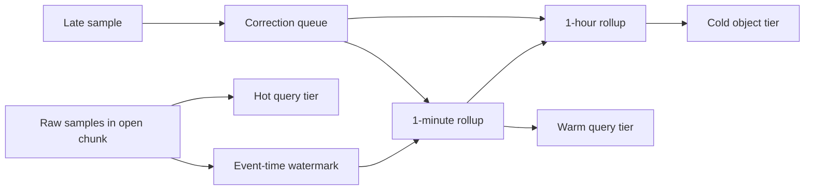
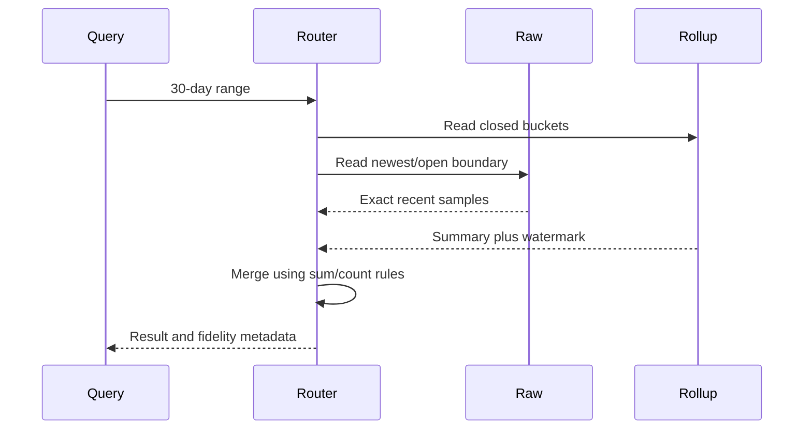

# Time-Series Optimization: Compression, Rollups, and Tiered Retention

**Level:** L4–L5 focused companion
**Status:** reviewed
**Audience:** Engineers optimizing a metrics or sensor TSDB after understanding its ingestion model.
**Prerequisites:** [Time-series databases](05-timeseries-databases.md), WAL/head/blocks, SQL aggregation, and SLOs.
**Sequence:** Batch 2B, 4/8
**Terra gate:** approved

## Learning objectives

- Choose chunk duration, compression, rollup, and tier boundaries from query and retention assumptions.
- Quantify raw, rollup, and replica storage in decimal and binary units.
- Preserve raw-to-rollup fidelity while defining late-data correction behavior.
- Balance storage cost, query latency, ingest SLO, and recovery work across hot, warm, and cold tiers.
- Diagnose downsampling, compaction, out-of-order, and DST boundary failures.

## What it is

Time-series optimization is the design of physical and derived representations
after the basic sample/label model is known. The levers are chunking, encoding,
compaction, rollups, tiering, query routing, and retention. Optimization changes
which information remains available; it is not a free speed switch.

An optimization policy must name the source of truth for each time interval.
Raw samples preserve exact values and timestamps. A rollup stores summaries such
as count, sum, min, max, average, and quantiles. A tier moves or copies a
representation to storage with a different access/cost profile. A query router
may combine raw and rollup data at a boundary.

Provider caveat: Prometheus TSDB, TimescaleDB, InfluxDB, VictoriaMetrics, and
cloud time-series services use different chunk, compaction, compression,
continuous-aggregate, out-of-order, and retention semantics. Check the deployed
version. TimescaleDB policy names and Prometheus remote-write behavior are not
portable configuration APIs.

## Why it matters

Raw retention grows with sample rate, not with the number of dashboard users.
Suppose 1,000,000 samples/second each have 16 logical bytes. Daily logical
volume is `1,000,000 × 86,400 × 16 = 1,382,400,000,000 bytes`, or 1.3824 TB
decimal. Seven days is 9.6768 TB before indexes, WAL, replicas, and allocator
overhead. Compression changes physical size, but it does not change the
recovery and query semantics of a raw sample.

Rollups reduce scan work for long windows, while tiering can reduce storage cost.
Both can make a dashboard faster and a forensic query less precise. A good
design states what is retained, how corrections work, and which SLO is allowed
to degrade during compaction or tier movement.

| Representation | Fidelity | Typical query use | Main cost |
| --- | --- | --- | --- |
| Raw sample | Exact value/time | Incident forensics and short windows | Highest bytes and index state |
| 1-minute rollup | Summary per minute | Weeks of dashboards | Loses intra-minute shape |
| 1-hour rollup | Coarse summary | Months of trends | Hides spikes and timing |
| Quantile sketch | Approximate distribution | Latency percentiles | Merge/error-bound complexity |

## Mental model

### Chunks and compression

A chunk groups samples by time and series. Small chunks close quickly and bound
late-write work, but create more headers, indexes, and compactions. Large chunks
compress well and reduce file count, but make reads and rewrites heavier. Choose
duration from bytes per series, query windows, lateness, and recovery time.

Timestamp delta-of-delta encoding stores the first timestamp, a first delta, and
small changes to the delta. Regular scrape intervals produce small corrections.
Values can use XOR and leading/trailing-zero compression. These are mechanisms,
not guaranteed ratios: noisy floating values and irregular timestamps compress
less well.

### Rollup semantics

For a bucket, count, sum, min, and max can be merged exactly. An average needs
`sum/count`; averaging averages without weights is wrong. A percentile cannot be
merged exactly from two percentiles; use raw values or an explicitly approximate
sketch with an error contract. Preserve a rollup version, source window,
watermark, and correction sequence.

| Operation | Merge rule | Fidelity caveat |
| --- | --- | --- |
| Count | Add counts | Missing samples must be distinguished from zero |
| Sum | Add sums | Numeric overflow and unit conversion need policy |
| Average | Add sums and counts, divide once | Average-of-averages may be biased |
| Min/max | Take min/max | A late sample can change either value |
| p95 | Sketch-specific merge or recompute | Approximation error must be measured |

### Hot, warm, and cold tiers

Hot data supports frequent writes and recent queries, usually on local SSD or
memory-indexed storage. Warm data is compressed and less frequently queried.
Cold data may be Parquet/object storage with higher retrieval delay. A tier
transition is a data-movement job with checksum, retry, and deletion ordering;
it is not simply changing a label.

## Worked example

Assume 100,000 series, one sample every 15 seconds, and a 30-day history with
7-day raw retention and 23 days represented by rollups. Samples/day are
`100,000 × 86,400/15 = 576,000,000 samples/day`.
At an observed compressed raw rate of 2.4 bytes/sample, the 7-day raw figure is
`576,000,000 samples/day × 7 days × 2.4 bytes/sample = 9,676,800,000 bytes`,
or `9.6768 GB decimal per replica` before indexes, WAL, and temporary space.

For the 23-day rollup portion of that history, a one-minute rollup has
`100,000 series × 1,440 buckets/day = 144,000,000 rows/day`. If a summary
stores count, sum, min, and max at 32 logical bytes/row before compression, the
23-day rollup figure is `144,000,000 rows/day × 23 days × 32 bytes/row =
105,984,000,000 bytes`, or `105.984 GB decimal per replica` before rollup
encoding and indexes. Do not compare this logical rollup figure directly with
the observed compressed raw figure; benchmark both representations.

Now define an ingest SLO of 99.9% of accepted samples queryable in 60 seconds,
and a dashboard SLO of p95 query time under 2 seconds for 30 days. A rollup job
that runs every 5 minutes with a 15-minute watermark can satisfy a trend query,
but a query touching the newest 15 minutes must use raw data. A compaction job
may consume no more than 20% of measured write CPU; otherwise the ingest SLO
gets priority and compaction debt is reported.

For 30-day cost reasoning, use `storage_cost = bytes × provider_rate` and
`query_cost = scanned_bytes × scan_rate` only when the provider bills those
units. A cold tier may lower storage cost while increasing retrieval time and
egress. State the rates and billing currency/date; no universal cost claim is
valid across providers.

### SLO trade-off table

| Policy | Storage effect | Query effect | Correctness/operations |
| --- | --- | --- | --- |
| Keep raw 30 days | Highest | Exact, more scanned data | Simple forensic path |
| Raw 7 days, 1-minute 30 days | Lower after rollup | Fast trends, no sub-minute history | Late corrections and rollup validation |
| Raw 24 hours, hourly 1 year | Lowest hot storage | Long queries are cheap but coarse | Spikes and incident evidence disappear |
| Keep raw plus cold archive | More total bytes | Exact restore is slower | Tier checksums, restore drills, legal hold |

## Advantages and limitations

Compression and rollups reduce bytes and CPU for the intended query family, but
they add background work and policy state. A raw-only system is easier to reason
about but may exceed storage or long-window query budgets. A rollup-only system
is cheap for dashboards but cannot answer questions about spikes, order, or
individual late samples.

Do not downsample an alert input unless its detection window and error bound are
explicit. A one-minute average can hide a five-second outage. Keep raw or a
max/availability signal when a maximum or absence matters.

## Topic-specific visual

The raw-to-rollup path closes only after the watermark. A late sample enters a
correction path and may revise multiple rollups; deleting raw data before the
correction window closes makes accurate repair impossible.

The query router must not silently mix incompatible rollup versions. It reports
the raw boundary and watermark so callers can distinguish exact recent data from
summary history.

## Failure modes and operations

### Downsampling errors

A bucket alignment bug, missing sample policy, or average-of-averages mistake
creates plausible but wrong dashboards. Validate rollups against raw samples on
a sampled window using count, sum, min, max, and quantile error. Keep a rollup
version and rebuild from raw when code changes.

### Late and out-of-order data

Choose a lateness window, buffer, correction queue, or reject policy. Late data
can reopen a sealed chunk and trigger compaction. Monitor late age histogram,
correction backlog, revised bucket count, and raw-retention safety margin.

### Compaction and tier movement

Compaction can compete with ingest, create temporary double storage, or fail
after writing a partial output. Publish a manifest only after checksum and row
count validation; retain source chunks until the new snapshot is durable. Tier
movement needs resumable copy, checksum, retry, and an explicit delete hold.

### DST and calendar boundaries

Use UTC epoch windows for fixed-duration metrics. If a report is civil-time
aligned, specify the timezone and DST policy: a local day can be 23 or 25 hours.
Never assume every “day” contains 86,400 seconds in a named timezone. Store the
timezone/database version used to render a report when reproducibility matters.

### Operational checklist

- Track raw/rollup row counts, correction lag, chunk count, compression ratio, compaction debt, and tier-copy failures.
- Track query bytes and p95 by resolution; expose fidelity and watermark in query metadata.
- Test rollup rebuild, late correction, duplicate correction, clock rollback, DST transition, and restore.
- Keep raw data through the maximum correction/legal-hold window.
- Compare binary `GiB = 2^30` bytes with decimal `GB = 10^9` bytes in capacity reviews.
- Confirm provider/version behavior for chunks, rollups, retention, out-of-order writes, and remote storage.

## Practical exercises

### Exercise 1: Choose a rollup policy

For 50,000 series at 10-second resolution, choose raw, 1-minute, and 1-hour
retention for a dashboard and an incident-forensics user.

**Expected approach:** Compute samples/day, preserve raw through the incident
correction window, select count/sum/min/max with explicit missing-data semantics,
and explain the fidelity lost at each tier. Include a watermark and rebuild path.

### Exercise 2: Correct a late sample

A sample timestamped 12:00:20 arrives at 12:08:00 after a 1-minute bucket was
rolled up at 12:05. Show the correction.

**Solution:** Identify the source series/version, reopen or append a correction
record for bucket 12:00, recompute its aggregates from raw, then recompute any
hour bucket containing it. Publish a new rollup snapshot after count/checksum
validation; do not add the sample twice on retry.

### Exercise 3: Diagnose an SLO conflict

Compaction lowers storage by 30% but increases ingest p99 from 20 seconds to 90
seconds. Decide what to change.

**Expected approach:** The 60-second ingest SLO is violated, so throttle or
reschedule compaction, increase bounded capacity only after measurement, and
report debt. Preserve raw writes, define an abort threshold, and compare the
query/storage benefit against the SLO cost.

## Interview Q&A

### Q1. Why use chunks?

**Answer:** Chunks bound indexing and compression work by time/series and enable
time pruning. Smaller chunks improve late-write and recovery bounds but increase
metadata and compaction overhead.

**Follow-up:** What measurement guides chunk duration?

### Q2. Can you average averages?

**Answer:** Only with weights: merge sums and counts, then divide. An unweighted
average of bucket averages is wrong when bucket counts differ.

**Follow-up:** How do you merge p95 values?

### Q3. What raw data must be retained?

**Answer:** Retain enough raw history for the maximum late-data correction,
forensics, alert fidelity, and legal policy. Rollups cannot reconstruct spikes
or exact sample order.

**Follow-up:** What is the deletion boundary after a correction?

### Q4. How do hot/warm/cold tiers affect SLOs?

**Answer:** Hot supports recent ingest and low-latency reads; warm/cold reduce
cost but add movement, retrieval, and restore latency. Route by time and report
which fidelity/tier served the result.

**Follow-up:** What checksum proves a tier copy is complete?

### Q5. What is a late correction?

**Answer:** A versioned update to a previously computed bucket caused by a sample
arriving after its watermark. It must be idempotent and may revise rollups at
several resolutions.

**Follow-up:** When would you reject rather than correct?

### Q6. How can DST break a rollup?

**Answer:** A civil day in a named timezone is not always 86,400 seconds. Use UTC
for fixed windows or explicitly model 23/25-hour local days and timezone rules.

**Follow-up:** Which timezone database version produced the report?

### Q7. What is the storage/query trade-off?

**Answer:** More raw retention preserves fidelity but costs storage and long-window
scan work; more rollup/tiering lowers those costs while adding correction and
approximation policy. Choose from an SLO and error budget, not a ratio slogan.

**Follow-up:** What query class must remain exact?

## Optimization decision worksheet

Start with the query inventory rather than a compression target. Record the
fraction of queries that cover 5 minutes, 24 hours, 7 days, and 30 days. Record
whether each query needs exact samples, extrema, averages, rates, or quantiles.
The representation plan should answer each class without silently changing its
meaning.

For each series family, record samples per second, value width, label/index
overhead, expected lateness, and the number of replicas. Estimate logical bytes
first, then apply measured compression from a representative 24-hour slice.
Keep a separate factor for WAL, temporary compaction output, and recovery
headroom; compressing the data stream does not compress all operational state.

Choose chunk duration by a bounded experiment. A 2-hour chunk may reduce file
count compared with a 15-minute chunk, but a correction to one timestamp can
reopen more data. Compare write CPU, late-write amplification, query bytes,
number of chunks touched, and restore time. Promote the setting only after the
measurements meet the ingest SLO and a rollback setting is available.

The rollup job should persist a watermark per series or partition. A bucket is
closed only when the watermark passes its end plus the lateness allowance. If a
producer clock is wrong, the watermark must not advance merely because wall
clock time advanced. Detect clock skew at ingestion and route suspect samples to
quarantine or correction.

A correction record should include source series, timestamp, old rollup version,
new rollup version, reason, and operator or job identity. Replaying the same
correction must produce the same result. A correction queue without a durable
identity can double-count a sum while leaving min/max apparently plausible.

For quantiles, publish the sketch type and configured error bound with the
result. Do not merge p95 values as if they were sums. If the alert requires an
exact maximum, retain max or raw evidence even when the average is rollup-only.

Tier transitions should be monotonic in durability: copy and validate, publish
the destination manifest, update the query catalog, and only then delete the
source when its correction and legal-hold windows permit deletion. A failed
copy must leave the source queryable. Test a partially copied object and an
out-of-date catalog entry.

Use a storage budget and a query budget together. If a cold read saves 40% of
monthly storage but adds 800 ms p95 to a 2-second SLO, the decision depends on
the query class and its error budget. A background report may accept the delay;
an alert evaluation may not. Record the decision by class instead of averaging
all traffic into one latency number.

A safe rollout sequence is: shadow the new rollup, compare sampled raw results,
run a backfill for a bounded interval, canary queries, publish a versioned
router rule, and retain the previous representation. Roll back the router when
counts, error bounds, or p95 query time exceed the declared threshold. Keep
the raw source until the new representation has passed a restore drill.

The most useful dashboards show ingest accepted/rejected samples, raw-to-rollup
lag, correction age, chunk count, compaction CPU, temporary bytes, tier copy
failures, query bytes by resolution, and result version. An overall “compression
ratio” is not enough to explain a query or recovery regression.

### A concrete review checklist

| Review question | Evidence to bring | Abort condition |
| --- | --- | --- |
| Does pruning work? | Chunks touched and bytes read by window | Every query scans every tier |
| Are rollups correct? | Raw-versus-rollup sampled aggregates | Count or sum mismatch |
| Can late data repair? | Watermark and correction replay test | Raw deleted before repair window |
| Is ingest protected? | p99 ingest, compaction CPU, WAL age | Ingest SLO breach |
| Is tiering recoverable? | Manifest, checksum, restore drill | Partial copy is queryable as complete |

This checklist keeps storage optimization attached to correctness and operations.
It also makes a provider/version review concrete: each feature needs observed
behavior from the deployed release rather than a remembered product slogan.

When comparing alternatives, preserve the same workload: identical series,
sample interval, retention, late-data distribution, replica count, and query
windows. Report warm-cache and cold-cache results separately. A benchmark that
changes the data distribution while changing compression is not an apples-to-
apples result. Keep the input slice and query generator versioned so a later
compaction or timezone-library upgrade can be compared with the prior result.

The implementation is a curriculum draft, not a production capacity guarantee.
The next review should check every formula, provider-specific setting, and
rollback boundary against the chosen deployment.
State the metric unit beside every value and rate.
State whether timestamps are event time or ingestion time.
State the replica and backup assumptions in capacity tables.
Record which raw window remains available for correction.
Record which rollup version served each aggregate.
Make an operator able to replay one bounded interval safely.

## Related and next reading

- [Time-series databases](05-timeseries-databases.md)
- [Columnar databases](04-columnar-databases.md)
- [Database monitoring](24-database-monitoring.md)
