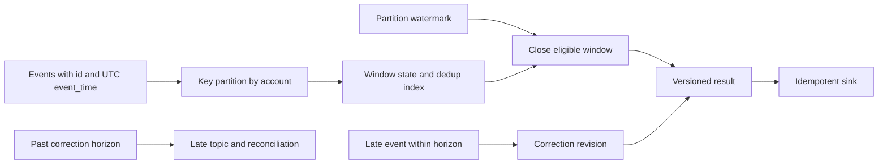
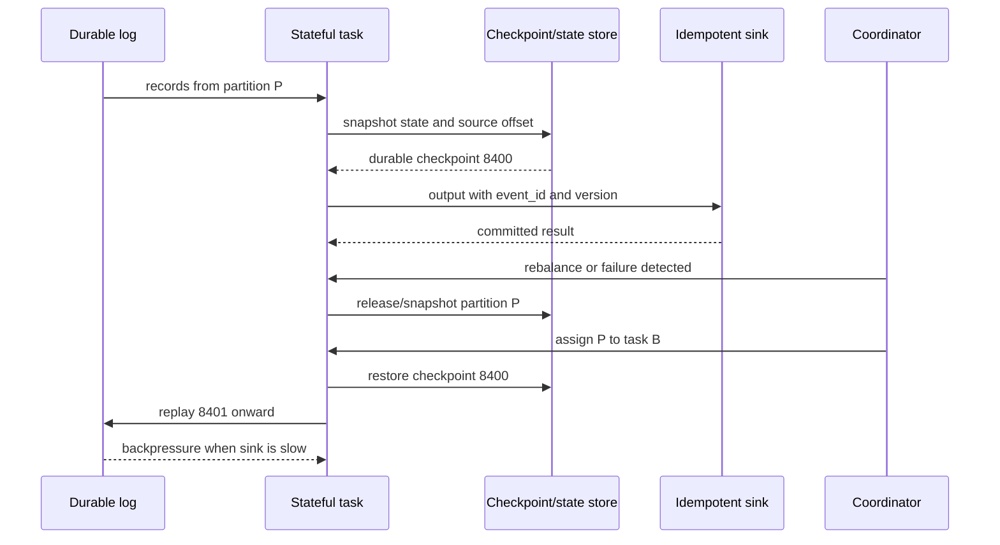

# Stream Processing: Event Time, State, and Recovery

**Level:** L4–L5
**Status:** reviewed
**Audience:** Engineers designing real-time aggregation, fraud, and event-driven database pipelines
**Prerequisites:** durable logs, partitioning, state machines, SQL windows, and UTC timestamps
**Sequence:** Batch 2C, 3/3
**Terra gate:** approved

Stream processing evaluates an unbounded sequence of events while the input is
still arriving. A useful design names the event identity, ordering boundary,
time semantics, state ownership, checkpoint, replay policy, and side-effect
contract. “Real time” is not a guarantee by itself: a pipeline can be fast but
wrong if it closes a window before late events arrive, or correct but delayed
while it recovers from a checkpoint.

## Learning objectives

- Distinguish processing time from event time and calculate a watermark and lateness policy.
- Design partitioned keyed state with checkpoints, recovery, TTL, replay, and rebalancing behavior.
- Explain backpressure, hot-key skew, out-of-order corrections, and daylight-saving/UTC hazards.
- Choose delivery and side-effect semantics for a fraud or ledger pipeline with durable identity and idempotent sinks.
- Evaluate a stream design with explicit latency, throughput, state-size, and reconciliation assumptions.

## What it is

An event is a fact emitted by a producer, normally with a stable event ID,
business key, event timestamp, schema version, and payload. A stream processor
reads events from a durable log, partitions them among tasks, updates keyed or
operator state, and emits results to another durable topic or an external sink.
The log offset identifies a position in a partition; it is not necessarily a
globally ordered event ID.

The maintained example model is conceptual rather than a claim about one
vendor. Kafka Streams, Flink, Beam, Spark Structured Streaming, and ksqlDB
expose different APIs, checkpoint formats, watermark behavior, and exactly-once
boundaries. Provider and version documentation is authoritative for settings.

### Processing time and event time

**Processing time** is when the task observes the record. It is easy to use and
works for operational counters, but retries, network delay, batching, and
backlogs change the observed order. A one-minute processing-time window can
move an event between buckets when the consumer catches up.

**Event time** is when the producer says the business event occurred. It is the
right basis for a sale-by-hour, fraud window, or ledger sequence when producer
timestamps are trustworthy. Event time still needs validation, a bounded clock
skew assumption, and a policy for events that arrive after a result was emitted.

### Windows and triggers

A tumbling window is non-overlapping, a sliding window overlaps by a configured
slide, and a session window closes after an inactivity gap. A trigger decides
when to emit a result; a firing is not necessarily final. An update stream may
emit an early estimate, an on-time result, and a correction for the same window.

Window keys should be explicit. A global count creates one hot state partition;
keying by account, merchant, or device spreads state but changes the meaning of
the result. A join also needs a time bound or state can grow without limit.

### Watermarks, lateness, and corrections

A partition reports progress from the event timestamps it has observed. Define
that per-partition progress and watermark first: for active partition `p`, a
common watermark is `W_p = max_observed_event_time(p) - allowed_out_of_orderness`.
It is an estimate, not a proof that no earlier event exists. A downstream
operator that combines active partitions uses the minimum of their watermarks,
`W_operator = min(W_p)`, so the slowest active partition controls safe progress.
An idle-partition policy must explicitly remove a partition from the active set
only when its absence is safe; otherwise it can hold the minimum indefinitely.

For a window ending at `10:05` and allowed lateness of 2 minutes, an operator
watermark at `10:07` can close the window. Keep state until
`window_end + allowed_lateness` (or the explicitly longer correction horizon),
then clean it up. An event with timestamp `10:04:30` arriving before cleanup may
revise the result; an event after the correction horizon goes to a late-data
topic or reconciliation job. The choice must be visible to downstream
consumers: an update should carry window identity, revision, and whether it is
final.

| Time choice | Ordering source | Strength | Failure or trade-off | Suitable use |
| --- | --- | --- | --- | --- |
| Processing time | Task arrival clock | Simple, low state | Backlog and retry change buckets | Operational throughput counters |
| Event time | Producer timestamp | Business-correct windows | Late data, clock quality, correction | Sales, fraud, ledger analytics |
| Ingestion time | Broker/edge timestamp | Stable service boundary | Delay before ingestion is invisible | Platform-level intake metrics |
| Hybrid | Event time plus bounded fallback | Handles missing timestamps | More policy and reconciliation paths | Heterogeneous producers |

### UTC and daylight saving time

Store instants as UTC, preferably an unambiguous epoch or offset-aware timestamp.
Use an IANA time-zone database only when presenting a business-local calendar.
The local day that appears to have 23 or 25 hours during daylight saving time
must not be represented by assuming every day has 86,400 local seconds.

Define whether “daily” means a fixed 24-hour UTC interval or a calendar day in
a named zone such as `America/Phoenix`. A fall-back hour may contain two local
times with different offsets; include the UTC instant and zone/offset in the
window key or presentation layer. Do not silently convert a naive timestamp in
the consumer's machine timezone.

## Why it matters

Stream output often drives irreversible or user-visible actions: block a card,
settle a ledger, notify a customer, or update a risk score. A duplicate alert
may be tolerable; a duplicate debit is not. Correctness therefore crosses the
processor boundary into identity, sink transactions, deduplication, and
reconciliation.

### Latency is a distribution

Report event-to-output latency, processing latency, watermark lag, consumer lag,
checkpoint duration, and recovery time separately. A p95 processing latency of
100 ms can coexist with a p99 event-time freshness of 10 minutes if one
partition is idle or a producer sends old timestamps.

Assume 50,000 events/second, 1.5 KiB encoded input, and three retained copies.
Ingress is `50,000 × 1.5 KiB = 75,000 KiB/s`, about 73.24 MiB/s; replicated log
write is approximately 219.73 MiB/s before headers and compaction. This is a
capacity estimate, not a framework benchmark. Partition count, network, disk,
serialization, state writes, and sink throughput must be tested.

### Correctness belongs in the contract

Document whether an output is an estimate, an update, or final; how consumers
identify revisions; what happens on replay; and which side effects are
idempotent. “Exactly once” at a framework's checkpoint boundary does not make a
non-transactional email, payment, or HTTP call execute exactly once.

## Mental model

### Partitions and keyed state

A partition is an ordered log slice. A key is mapped to one partition at a time,
so all events for a key can update one state owner. This provides per-partition
ordering, not total ordering across a topic. Changing the partitioning function
can move a key and require state migration.

State may be a window buffer, aggregate, join table, deduplication index, timer
wheel, or fraud history. Keep the state schema versioned and bound its size by
window, TTL, or explicit compaction. A keyed operator can scale across keys; a
global operator needs a deliberate merge or two-stage aggregation.

### Checkpoints and recovery

A checkpoint records enough source positions and operator state to resume a
consistent cut. A task should not advertise an output as durable before the
checkpoint or sink transaction that protects it. Recovery restores state,
resets source offsets to the checkpoint, and replays the interval afterward.

If a checkpoint takes 20 seconds while events arrive at 10,000/second, the
processor must either buffer or continue with a snapshot protocol. Incremental
checkpoints reduce copied state but add metadata and dependency complexity. Keep
multiple checkpoints and verify restore, not only checkpoint creation.

### Delivery semantics

At-most-once advances the offset before processing; it minimizes duplicates but
can lose records. At-least-once processes before committing the offset; it can
replay records and requires idempotent state updates or sink writes. Exactly-once
processing usually means the framework atomically coordinates state/output and
source progress for its supported boundaries; external effects still need a
transaction, idempotency key, or reconciliation.

| Semantic boundary | What it can guarantee | Duplicate/loss behavior | External side-effect requirement |
| --- | --- | --- | --- |
| At-most-once offset first | No retry of acknowledged offset | Loss is possible; duplicates are minimized | Not safe for financial facts without another source |
| At-least-once offset after work | No acknowledged record is intentionally skipped | Replay is expected | Idempotent sink or deduplication by event ID |
| Transactional exactly-once | One committed result per supported transaction boundary | Replayed work is hidden by atomic commit | Sink must participate or consume a durable output log |
| Effectively-once | Repeated attempts converge to one business result | Duplicate requests may occur | Idempotency key plus reconciliation |

### Rebalance and backpressure

When workers join or leave, partitions rebalance. A task must flush or snapshot
state, stop consuming the moved partition, and resume from a safe position on
the new owner. Cooperative rebalancing can reduce stop-the-world movement, but
does not remove the need for state transfer and duplicate handling.

Backpressure occurs when downstream service time exceeds input rate. Observe
queue depth, consumer lag, watermark lag, state-store flush latency, checkpoint
age, and sink response time. Bound buffers; slow or pause upstream consumption;
scale the bottleneck; shed low-priority work; or route poison records to a DLQ.
An unbounded queue merely converts overload into an eventual outage.

### Skew and hot keys

Hash partitioning distributes keys, not events uniformly. A celebrity account,
merchant, or bot can make one partition hot while others are idle. Measure
events/second and state bytes per partition, not only cluster averages. Options
include key salting with a second aggregation stage, dedicated partitions,
sharded state, or a bounded approximate algorithm. Salting changes ordering and
must preserve a deterministic merge.

### TTL, replay, and schema

TTL limits deduplication and join state, but a replay older than TTL can produce
duplicates or an incomplete join. Retention, state TTL, and reconciliation
horizon must align. A schema registry or equivalent compatibility policy should
define how a new producer and old consumer coexist. Store event ID, event time,
producer, schema version, and source offset for diagnosis.

## Worked example

### Out-of-order card fraud

For this example, use a fixed, non-overlapping tumbling event-time window
`[12:00, 12:10)`, not a sliding window. The fraud rule is “flag an account when
three purchases over $1,000 occur in that 12:00–12:10 window.” Events are keyed
by `account_id` and partitioned by that key. The producer includes a globally
unique `event_id`, UTC `event_time`, account, amount, and source version.

Events arrive in this order:

1. `p1`, account A, 12:00:10, $1,200
2. `p3`, account A, 12:08:20, $1,100
3. `p2`, account A, 12:04:00, $1,300 (late by 4 minutes)

If the allowed lateness is 5 minutes and the operator watermark has not passed
the window end plus that policy, `p2` joins the `[12:00, 12:10)` window. The
processor emits an alert revision containing the stable interval `window_id`,
`revision=2`, and the three event IDs. The materialized alert has a stable
business/window identity, such as `(rule_id, account_id, window_id)`, and the sink upserts that identity
while accepting only revisions greater than the stored revision. Do not use
`(rule_id, account_id, window_id, revision)` as the materialized-alert identity:
that creates a new row for every correction. Identity plus revision is reserved
for an append-only revision stream. The sink must not blindly insert a second
business alert.

If `p2` arrives after the correction horizon, send it to a late-events topic and
run a reconciliation job. That job can produce a compensating alert or clear a
false positive. Dropping it silently makes the rule's stated accuracy false.

### Ledger side effect boundary

A ledger event has `transaction_id` as the business identity and a sequence or
version from the source of truth. The processor may compute a risk decision,
but the ledger sink must enforce `transaction_id` uniqueness and an idempotency
key. A retry after a checkpoint failure repeats the decision request; the sink
returns the prior result for the same identity instead of posting a second
debit.

The sink records event ID, decision version, processor attempt, and source
offset. A reconciliation query compares the source ledger, processed output,
and sink acknowledgements. Differences are categorized as missing, duplicate,
late correction, or schema rejection. Reconciliation is a correctness control,
not just an operations dashboard.

### Recovery timeline

Suppose a task checkpointed partition 4 at offset 8,400, then processed through
8,470 before crashing. Recovery restores state at 8,400 and replays 8,401–8,470.
At-least-once delivery therefore repeats those updates. A commutative aggregate
may recalculate safely; a sink write needs the event identity. If a checkpoint
was acknowledged before state was durable, restoring it can lose or double-count
events, so checkpoint acknowledgement must have a defined durability boundary.

### Time-zone example

For reporting a merchant's local day, store `event_time=2026-11-01T08:30:00Z`
and render it in the merchant's IANA zone. The consumer should not assume a
local day has 24 hours during a DST transition. For fraud's “10 minutes,” use a
duration over UTC instants; for a tax report's “local calendar day,” use the
zone-aware calendar interval and retain the offset used for presentation.

## Advantages and limitations

Stream processors provide low-latency derived views without repeatedly scanning
all history. Stateful operators can express windows, joins, timers, and complex
event processing. Durable logs and checkpoints make replay and recovery possible.
The costs are operational: state growth, rebalances, watermarks, late updates,
partition skew, schema evolution, and side effects outside the framework.

| Architecture | Latency and state | Strength | Limitation | Good fit |
| --- | --- | --- | --- | --- |
| Kafka Streams-style library | Low to moderate; local state stores | Deploys with an application and uses log partitions | JVM/process lifecycle and rebalance coupling | Service-local aggregations |
| Flink-style distributed engine | Low; rich managed state and event time | Timers, watermarks, checkpoints, CEP | Larger operational surface and state upgrades | Complex fraud and joins |
| Spark Structured Streaming | Moderate; micro-batch or continuous behavior varies | Batch/stream APIs and lake integration | Higher latency for some workloads; checkpoint semantics matter | Unified analytics pipelines |
| SQL stream layer | Depends on engine | Fast iteration and accessible transformations | Advanced state/correction behavior may be hidden | Governed aggregates and routing |

The choice should use measured event-to-output latency, state size, recovery
time, connector behavior, staffing, and sink semantics. Framework marketing
labels do not replace a failure and replay test.

### State-size budget and schema evolution

Suppose 2 million active accounts retain 40 recent events of 600 bytes plus a
32-byte event ID and 20% index overhead. The rough state floor is
`2,000,000 × 40 × (600 + 32) × 1.2 = 60.672 GB` decimal, before replication,
serialization metadata, checkpoint copies, and compaction slack. This number
belongs in capacity planning beside input throughput. A TTL that reduces the
event horizon changes both fraud recall and recovery volume, so it needs a
business review rather than only a storage optimization.

State and event schemas evolve independently. Additive fields are usually
easier for old consumers than changing the meaning of an existing field. Keep a
schema version in each event and test a rolling upgrade with old and new tasks,
restored checkpoints, and replayed historical records. If a state serializer is
incompatible, migrate it through a versioned snapshot or rebuild from the
durable log; do not assume a process restart will convert arbitrary bytes.

For a bounded deduplication index, retain the event ID through the maximum
replay and late-correction horizon. If retention is seven days but a disaster
recovery replay can start from a 30-day archive, either retain deduplication
evidence longer or make the sink's business identity enforce convergence.
Capacity, correctness, and retention are one design decision.

## Topic-specific visual

### Event-time window and correction pipeline

The watermark closes only what the policy considers sufficiently complete. A
late event can revise an output, so the result needs a stable window identity
and revision. Events beyond the horizon are not magically correct; they enter a
reconciliation path. Partition watermarks must account for the slowest active
partition when a result depends on multiple inputs.

### Checkpoint, rebalance, and backpressure path

The checkpoint must cover state and source progress as one recoverable cut. A
new owner replays after that cut, so duplicate attempts are normal under
at-least-once delivery. The sink's event identity makes replay converge. The
last edge shows that a slow sink should feed back to consumption rather than
allowing unbounded memory growth.

## Failure modes and operations

### Watermark stalls

An idle or broken partition can hold a minimum watermark and prevent windows
from closing. Configure an idle-partition policy only when it is safe to stop
waiting for that input, and make the policy visible in freshness metrics. Alert
on watermark age, not just processing CPU.

### Late data and false finality

If the consumer emits “final” before allowed lateness expires, late corrections
may be lost. If it waits forever, latency is unbounded. State the lateness
budget, output revision protocol, late topic, and reconciliation owner. Test a
late event that arrives before, at, and after the correction boundary.

### Duplicate or lost side effects

Crash after a sink commits but before the source offset commits causes replay.
Use a sink transaction, a unique idempotency key, or an outbox/inbox table.
Check the key's scope: `event_id` may deduplicate an event, while
`transaction_id` may deduplicate a business operation with multiple attempts.

### Checkpoint corruption and recovery lag

Validate checkpoint checksums, schema version, state size, source positions,
and restore duration. Keep a previous known-good checkpoint. Alert when recovery
replay grows beyond the freshness SLO. A checkpoint that cannot be restored is
not a recovery mechanism.

### Backpressure and poison records

Use bounded queues, rate limits, retry budgets, and a DLQ for records that fail
deterministically. Separate transient sink failures from schema or business
rejections. A poison record that blocks a partition can create a misleading
cluster-wide lag alert; expose per-partition progress.

### Rebalance and state movement

Track assignment changes, state restore bytes, pause time, and duplicate output
rate. Ensure only one active owner is allowed to commit a partition result, and
fence an old owner if the runtime supports ownership epochs. Validate state
schema compatibility during rolling upgrades.

### Clock, UTC, and DST defects

Reject impossible future timestamps or quarantine them for review. Monitor
producer clock offset and event-time/ingestion-time skew. Include timezone and
offset in local-calendar reports. Use UTC durations for elapsed-time rules and
zone-aware intervals for calendar rules.

### Skew and state explosion

Partition averages hide a hot key. Alert on the max/median load ratio, state
bytes, checkpoint time, and per-key event rate. Apply TTL only after verifying
the replay and reconciliation horizon; an aggressive TTL can make a correct
replay impossible. Consider salting and a second-stage merge for hot keys.

### Operational checklist

- Record event ID, source offset, producer, schema version, UTC event time, and business key.
- Define window, watermark, allowed lateness, correction horizon, and finality semantics.
- Measure event-to-output latency, watermark/consumer lag, checkpoint age, restore time, and sink latency.
- Bound state, buffers, retries, and TTL; test a hot key and a poison record.
- Test crash after state update, after sink commit, and before offset commit.
- Reconcile source facts, processor outputs, and side-effect acknowledgements after replay.

## Practical exercises

### Exercise 1: Watermark worksheet

Three partitions report observed event-time progress of 10:04, 10:07, and
10:06. Allowed out-of-orderness is 2 minutes. What is the conservative
watermark, and can a window ending at 10:05 close?

**Solution / expected approach:** Use the minimum observed progress, 10:04,
minus 2 minutes, giving watermark 10:02. The 10:05 window cannot close under
this conservative rule. Explain that an idle-partition policy could change the
answer only if the operator can safely mark the first partition idle.

### Exercise 2: Fraud correction

An account has purchases at 12:00:10, 12:04:00, and 12:08:20. The third is
processed first and the second arrives after an early result. Design the output
identity and late-data behavior for the aligned tumbling `[12:00, 12:10)` window
with five minutes of allowed lateness.

**Solution / expected approach:** Key by account, deduplicate by event ID, use
UTC event time, and emit a stable ID for the 12:00–12:10 interval with revision
numbers. Accept the late event before the watermark/correction boundary and
emit an update listing the three IDs. After the horizon, write to a late topic
and reconcile rather than silently dropping it.

### Exercise 3: Replay and idempotent ledger sink

A task checkpoints offset 8,400, posts a ledger decision for event E at 8,450,
then crashes before committing the source offset. Explain the recovery and sink
contract.

**Solution / expected approach:** Restore the checkpoint, replay 8,401–8,450,
and issue E again. The sink must enforce a unique `transaction_id` or idempotency
key and return the existing result. Record attempt and offset for reconciliation.
Do not claim framework exactly-once makes an external ledger call exactly once.

### Exercise 4: Hot partition and backpressure

One merchant produces 30,000 events/second while 31 other keys produce 1,000
events/second together. The sink handles 10,000/second. Propose a safe scaling
and correctness plan.

**Solution / expected approach:** Measure per-partition load and state, apply
bounded backpressure, and do not add an unbounded queue. Salt the hot merchant
key into deterministic subkeys and merge partial aggregates in a second stage,
or allocate dedicated capacity if ordering requires one key. Preserve event IDs,
define merge ordering, scale or rate-limit the sink, and monitor lag and
checkpoint recovery.

## Interview Q&A

### Q1. Processing time or event time?

**Answer:** Processing time is arrival at the task and is simple but sensitive to
backlog. Event time represents when the fact occurred and is better for business
windows, provided timestamps, watermarks, lateness, and corrections are defined.

**Follow-up:** What metric shows that event-time freshness is worse than processing latency?

### Q2. What is a watermark?

**Answer:** A watermark is a progress estimate that events earlier than a time
are unlikely to arrive. It permits window closure but is not a proof that no
late event exists; the policy needs allowed lateness and a correction path.

**Follow-up:** Which partition can hold back a conservative multi-input watermark?

### Q3. How should late events be handled?

**Answer:** Accept them while the correction horizon is open and emit a versioned
update; after the horizon send them to a late-data topic and reconciliation.
Expose finality and window identity to downstream consumers.

**Follow-up:** What makes a correction idempotent?

### Q4. What does a checkpoint contain?

**Answer:** A consistent cut of operator state and source positions, with a
durability and schema boundary that recovery can restore. The processor replays
after that position; checkpoint creation must be tested by restoration.

**Follow-up:** What happens if a sink commit occurs just before a crash?

### Q5. At-least-once or exactly-once?

**Answer:** At-least-once may replay but avoids intentional loss when offsets are
committed after work. Transactional exactly-once can make state/output/source
progress atomic within its supported boundary, but external side effects still
need transactions, idempotency, or reconciliation.

**Follow-up:** Which identity would you put on a ledger write?

### Q6. How do rebalances affect state?

**Answer:** Ownership moves between tasks, so state must be flushed or
checkpointed, restored by the new owner, and replayed from a safe offset. Old
owners need fencing or an epoch rule so two owners cannot commit concurrently.

**Follow-up:** What restore metric determines whether a rebalance meets the SLO?

### Q7. How do you handle a hot key?

**Answer:** Measure max versus median partition load and state. Salt the key and
merge partial aggregates when the operation is mergeable, or dedicate capacity
when per-key ordering is essential. Preserve deterministic identity and bounded
state; adding workers alone does not split one key.

**Follow-up:** Which operations are unsafe to merge without ordering?

### Q8. How do DST and UTC affect stream windows?

**Answer:** Store instants in UTC. Use UTC durations for elapsed-time rules and
zone-aware calendar intervals for local reports because DST days can have 23 or
25 local hours. Retain offset/zone for presentation.

**Follow-up:** How would you test a fall-back hour with two equal local times?

### Q9. Why is reconciliation required for a ledger pipeline?

**Answer:** Crashes, retries, late corrections, schema rejects, and external
side-effect boundaries can leave source, processor, and sink states temporarily
different. Comparing durable event/transaction IDs and versions classifies and
repairs gaps or duplicates.

**Follow-up:** What evidence would prove a duplicate debit was prevented?

## Related and next reading

- [Message queues and streams](11-message-queues-streams.md) — partitions, consumer groups, offsets, retries, and replay.
- [Time-series databases](05-timeseries-databases.md) — retention, out-of-order samples, and event-time-style query concerns.
- [Event-time window lab README](../03-system-design/04-distributed-systems/README.md) — the maintained distributed-systems lab index.
- [Event-time window implementation](../../python/distributed_systems/event_time_windows.py) and its [focused tests](../../tests/distributed_systems/test_event_time_windows.py) — a small in-memory model with explicit watermark behavior.

The lab is educational and single-process. Validate connector, checkpoint,
watermark, schema, and exactly-once behavior against the selected framework and
version before using this guide as a production design.
