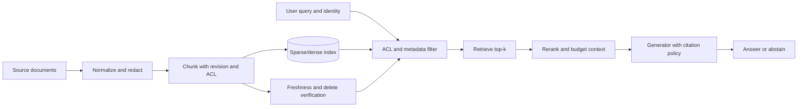

# RAG Systems — Retrieval-Augmented Generation

**Level:** L4-L5
**Status:** draft
**Audience:** Engineer preparing for an L4–L5 ML-systems or system-design interview.
**Prerequisites:** Basic probability, HTTP/service design, tokenization, and familiarity with embeddings and language-model prompts.
**Sequence:** Batch 3A, 1/5
**Terra gate:** open
**Time to read:** ~20 min

Combining LLMs with knowledge bases for better answers.

## Learning objectives

By the end of this guide, you should be able to:

1. Trace a document from ingestion through chunking, indexing, retrieval, and grounded generation.
2. Choose between sparse, dense, hybrid, and reranked retrieval for a stated workload.
3. Calculate a context-token budget and explain why retrieval relevance does not guarantee answer correctness.
4. Design freshness, authorization, citation, and abstention controls for a multi-tenant RAG service.
5. Define retrieval and answer-quality measurements that separate indexing failures from generation failures.

## What it is

Retrieval-augmented generation (RAG) is a request-time composition of retrieval
and generation. A retriever selects bounded evidence from an external corpus;
the generator receives that evidence as context and produces an answer. RAG
changes the model's available evidence, but it does not make the model a
database: retrieved text can be stale, incomplete, unauthorized, contradictory,
or maliciously written.

The boundary matters. The index owns discoverability and provenance; the
application owns access control and policy; the generator owns wording. A
citation proves what was supplied to the model, not that the final statement is
true.

## Why it matters

Model parameters are a poor place for fast-changing or private facts. RAG can
update an indexed document without retraining, expose source passages for
review, and support an answer policy such as “abstain when evidence is missing.”
It also introduces a second quality surface: a correct generator cannot answer
from a document that retrieval missed, and a strong retriever cannot prevent a
generator from over-interpreting ambiguous evidence.

For an interview design, state the freshness and authorization contract first.
“Search the company wiki” is incomplete until the design says how quickly an
edit becomes searchable, whether a deleted document can still be retrieved,
and how a user's tenant and permissions reach the retrieval filter.

## Mental model

Treat every retrieved chunk as a typed evidence record:

```text
chunk_id, document_id, revision, text, source_uri, ACL, observed_at, score
```

The `document_id` is not enough for citations: a document can be edited between
two answers. Keep a revision or content hash, and retain the exact chunk text
used for the response. Apply authorization before the model sees text, not
after generation. A post-generation filter cannot reliably remove secrets that
have already influenced the answer.

A useful quality decomposition is:

```text
answer quality ≈ retrieval coverage × evidence quality × generation discipline
```

This is a diagnostic model, not a literal probability equation. If the gold
passage is absent from the top-k set, improving the prompt will not repair the
retrieval miss. If the passage is present but stale or unauthorized, high
similarity is actively misleading.

---

## Problem framing

LLMs have knowledge cutoff and can't access proprietary/real-time data.

```
User: "What is the current weather in San Francisco?"
LLM: "I don't know, my knowledge cuts off at April 2024."

Better: Retrieve current weather data, include in prompt.
```

---

## Worked example

Assume a support assistant has 100,000 documents, an average 800-token chunk,
top-20 first-stage retrieval, top-5 reranking, a 4,096-token model context, a
600-token system prompt, a 40-token question, and a 1,200-token response
reserve. The context budget is:

```text
4,096 - 600 - 40 - 1,200 = 2,256 tokens for evidence
```

Five full chunks would require 4,000 tokens, so the service must either select
fewer chunks, use shorter chunks, or compress evidence. If it admits whole
chunks and uses a 450-token target, at most `floor(2,256 / 450) = 5` chunks
fit, with 6 tokens left. In production, reserve room for formatting and tool
messages; do not operate exactly at the model's advertised context limit.

For evaluation, create questions with one or more labeled supporting chunks.
If 80 of 100 questions contain a relevant chunk in the top five, recall@5 is
0.80. If those top-five results contain 260 relevant results among 500 returned
results, precision@5 is 0.52. Then separately score whether answers are
supported, complete, and appropriately abstaining. A high recall score with
low groundedness usually points to prompt assembly, chunk boundaries, or model
behavior rather than the first-stage index.

## Topic-specific visual



Read the diagram from left to right for ingestion and from the query downward
for serving. The important invariant is that identity filtering and revision
checks happen before context assembly. The generator is the last step, not the
security boundary.

## RAG Architecture

### Simple RAG Pipeline

```
1. User Query: "How do I reset my password?"

2. Retrieval:
   - Search knowledge base (docs, FAQs, etc.)
   - Find: "Password reset guide.pdf", "FAQ #42"
   - Return top K relevant documents

3. Augmentation:
   - Combine: query + retrieved documents

4. Generation:
   - LLM reads augmented prompt
   - Generate answer based on documents
```

### Core Components

**1. Knowledge Base/Corpus**
- Documents, PDFs, web pages, databases
- Could be: 1000 documents to 1B documents

**2. Indexing**
- Extract text from documents
- Create searchable index
- Example: Vector database (Pinecone, Weaviate)

**3. Retrieval**
- Search index for relevant documents
- Return top K most similar to query

**4. Augmentation**
- Combine query + retrieved docs into prompt

**5. Generation**
- LLM generates answer using augmented context

---

## Advantages and limitations

| Approach | Strength | Limitation | Operational trade-off |
|---|---|---|---|
| Prompt-only | No index or ingestion pipeline | Context is bounded and knowledge is not durable | Low operations cost; poor freshness and repeatability |
| Fine-tuning | Teaches style or repeated behavior | Facts can become stale and updates require training | Training/evaluation pipeline; difficult fact deletion |
| Sparse retrieval | Exact terms, IDs, and explainable matches | Misses synonyms and paraphrases | Cheap and inspectable; needs analyzers and vocabulary care |
| Dense retrieval | Semantic matching across wording | Similarity can hide exact constraints or unsupported matches | Embedding/version migration and vector-index cost |
| Hybrid + rerank | Combines lexical recall with semantic precision | More latency and components | Stronger quality potential; more failure modes and spend |

No option dominates. Use sparse signals for identifiers, policy names, and
version numbers; use dense signals for paraphrase-heavy questions; combine
them when both types appear. Fine-tuning and RAG are often complementary:
fine-tune behavior or format, retrieve changing facts.

## Failure modes and operations

| Failure | Detection | Mitigation and recovery |
|---|---|---|
| Stale or deleted evidence | Revision age, delete tombstone checks, freshness SLO | Re-index incrementally, invalidate deleted revisions, expose `observed_at` |
| Retrieval miss | Recall@k on a labeled set, zero-result rate | Improve chunking/query rewriting, hybrid retrieval, or source coverage |
| Wrong-tenant passage | ACL-filter audit and canary access tests | Filter before retrieval/context; fail closed on missing identity |
| Prompt injection in a document | Content scanning and adversarial fixtures | Treat retrieved text as data, delimit it, and keep tools/policy outside it |
| Context overflow | Token-budget rejection and truncation metric | Rank before assembly, reserve output tokens, summarize with provenance |
| Duplicate or conflicting passages | Duplicate rate and contradiction tests | Deduplicate by revision/content hash and state conflict/abstention policy |
| Slow or unavailable index | p95/p99 retrieval latency, timeout rate | Bounded timeout, cached safe results, degraded “cannot verify” answer |

Operate RAG with separate dashboards for ingestion lag, index freshness,
retrieval latency, top-k recall, citation coverage, groundedness, refusal rate,
and user feedback. A single “answer accuracy” number hides whether the corpus,
retriever, prompt, or generator is responsible. Sample traces should contain
query ID, model and embedding versions, filter summary, chunk IDs, scores,
token counts, and policy decisions while avoiding raw sensitive text by
default.

For rollout, build a new index beside the old one, dual-run a fixed evaluation
set, compare retrieval and answer metrics, then switch a versioned pointer.
Keep the prior index long enough to roll back. Embedding-model changes alter
the vector space; mixing old and new vectors without an explicit compatibility
plan produces misleading scores.

## Retrieval methods

### Dense Retrieval (Vector Search)

```
1. Embed query: "password reset"
   → vector: [0.2, 0.8, -0.1, ...]  (768-dim)

2. Embed documents:
   "How to reset password" → [0.15, 0.82, -0.05, ...]
   "Account settings guide" → [0.1, 0.3, 0.5, ...]
   
3. Similarity: Cosine similarity of vectors
   Query vs Doc1: 0.99 (very similar)
   Query vs Doc2: 0.45 (less similar)

4. Return: Top-K documents (e.g., K=3)
```

**Advantages:**
- Semantic matching (understands meaning)
- Works across languages
- Single vector database handles billions

**Disadvantages:**
- Requires embedding model
- Vector similarity ≠ exact matching
- "Not in docs" harder to detect

### Sparse Retrieval (Keyword Search)

```
1. Index: BM25 or TF-IDF
   
2. Query: "password reset"
   → Search for documents containing keywords

3. Rank by: TF-IDF score or BM25

4. Return: Top-K documents
```

**Advantages:**
- Simple, interpretable
- Good for exact/keyword matches
- No embedding model needed

**Disadvantages:**
- No semantic understanding
- Misses synonyms ("password reset" vs "PIN change")

### Hybrid Approach

Combine dense + sparse:

```
Results = 0.7 × dense_results + 0.3 × sparse_results

Benefits: Semantic + keyword matching, more robust
```

---

## 🎯 Practical Considerations

### Chunking Documents

Documents too long to fit in context. Split into chunks:

```
Document: "A 10,000 word policy document"

Chunking strategy:
- Size: 256-1024 tokens
- Overlap: 50-100 tokens (preserve context)

Naive: Split at fixed boundaries
  ❌ Breaks mid-sentence

Better: Semantic chunking
  ✅ Split at paragraph/section boundaries
  ✅ Keeps related information together
```

### Reranking

Initial retrieval might return 100 results. Rerank to keep best K:

```
1. Dense retrieval: Get top 100 documents
2. Reranker model: More expensive but accurate
3. Keep top K: Return top 5-10

Why: Balances speed and accuracy
```

### Context Window Management

```
Query + Documents must fit in context:

Available tokens = 4096 (assume)
- System prompt: 500 tokens
- User query: 50 tokens
- Documents: 2000 tokens
- Response: 1500 tokens
- Safety margin: ~46 tokens

Fit documents to context window
```

---

## 🔧 Building a RAG System

### Step 1: Prepare Documents

```python
documents = load_documents("docs/")
# Returns: List[Document] with id, text, metadata

# Split into chunks
chunks = []
for doc in documents:
    doc_chunks = chunk_document(doc, chunk_size=512)
    chunks.extend(doc_chunks)
# Returns: 10,000 chunks from 100 documents
```

### Step 2: Create Index

```python
from pinecone import Pinecone

pc = Pinecone(api_key="...")
index = pc.Index("rag-index")

# Embed and index chunks
embeddings = embed_model.encode(chunks)  # (10k, 768)
index.upsert(vectors=[
    (chunk_id, embedding, {"text": chunk_text})
    for chunk_id, embedding, chunk_text in zip(range(10k), embeddings, chunks)
])
```

### Step 3: Query

```python
query = "How do I reset my password?"
query_embedding = embed_model.encode(query)

# Retrieve
results = index.query(
    vector=query_embedding,
    top_k=5,
    include_metadata=True
)

# Results: List of (score, doc_id, metadata)
# score: Similarity (0-1), higher is better
```

### Step 4: Augment Prompt

```python
# Combine retrieved docs with query
retrieved_docs = "\n".join([
    result['metadata']['text'] 
    for result in results
])

augmented_prompt = f"""
Based on the following documents:

{retrieved_docs}

Answer this question: {query}
"""

# Generate
response = llm.generate(augmented_prompt)
```

---

## ⚡ Optimization Strategies

### Compression

```
Context: documents + query may be 3000+ tokens

Solution: Compress documents
- LLMCompress: Use LLM to summarize
- Tokens compressed: 3000 → 500 tokens
- Trade-off: May lose details
```

### Metadata Filtering

```
# Index includes metadata
{
  "id": "doc_123",
  "text": "password reset guide",
  "source": "help.pdf",
  "date": "2024-03-15",
  "category": "account-management"
}

# Query with filters
results = index.query(
    vector=query_embedding,
    top_k=5,
    filter={"category": "account-management"}  # Only relevant docs
)
```

### Caching

```python
# Cache retrieved documents for same query
cache = {}

def retrieve(query):
    if query in cache:
        return cache[query]
    
    results = index.query(query_embedding, top_k=5)
    cache[query] = results
    return results
```

---

## 📊 Evaluation

### Retrieval Quality

```
Metric: Precision@K
- Did we retrieve relevant documents?
- P@5: % of top-5 that are relevant

Metric: Recall@K  
- Did we retrieve most relevant documents?
- R@5: Of all relevant docs, did top-5 capture them?
```

### Generation Quality

```
Compare LLM response to ground truth:

BLEU: Overlap of tokens/n-grams
ROUGE: Recall of overlapping units
Human evaluation: Most reliable for open-ended tasks
```

### End-to-End

```
Did RAG system give correct answer to user query?

Examples:
✅ Retrieves: "Password reset: Click Settings > Security > Reset"
✅ Generates: "Click Settings, go to Security tab, click Reset"
```

---

## Practical exercises

### Exercise 1: Build a measurable retrieval baseline

Use the repository's standard-library lab, [`RAGPipeline`](../../python/ml_systems/rag_pipeline.py),
with the focused tests in [`test_rag_pipeline.py`](../../tests/ml_systems/test_rag_pipeline.py).
Index at least six chunks from three documents, then write five questions with
gold document IDs. Report recall@1, recall@3, and the zero-result rate. The
expected approach is to preserve the returned chunk's document ID and metadata;
do not score only the generated text.

### Exercise 2: Calculate and enforce a context budget

Given a 8,192-token context, 900 tokens of instructions, a 75-token question,
and a 1,500-token output reserve, admit 700-token chunks with a 10% safety
margin. Show the integer number of chunks that fit. A checkable solution is:
`usable = (8,192 - 900 - 75 - 1,500) × 0.90 = 5,145.3`, so
`floor(5,145.3 / 700) = 7` chunks. The implementation should reject or trim
context before the generator call and record the reason.

### Exercise 3: Design authorization and deletion behavior

A user loses access to a document while an index refresh is in progress. Draw
the request path and specify where the ACL is checked, how deletion tombstones
are propagated, and what happens if the authorization service times out. The
expected answer fails closed, filters using the current identity before context
assembly, and prevents an old cached retrieval result from bypassing the check.

### Exercise 4: Diagnose a quality regression

After changing the chunk size, answer groundedness falls from 0.86 to 0.71 but
retrieval recall@5 rises from 0.78 to 0.85. Propose three slices to inspect and
one rollback criterion. A strong answer compares chunk-boundary completeness,
duplicate/conflicting evidence, token truncation, question type, and source
freshness; it does not conclude that the larger index is better from recall alone.

Run the lab tests with:

```bash
pytest tests/ml_systems/test_rag_pipeline.py -q
```

## Interview Q&A

**Q: Why use RAG instead of fine-tuning?**

**Answer:** RAG is usually a better boundary for changing or private facts:
documents can be indexed, cited, filtered, and deleted without retraining.
Fine-tuning remains useful for behavior, style, or a repeated task format.

**Follow-up:** Ask how the design handles a fact that must be forgotten. The
answer should include source deletion, index invalidation, cache expiry, and a
test that the old revision is no longer retrievable.

**Q: What is the difference between dense and sparse retrieval?**

**Answer:** Sparse methods reward token-level evidence and are strong for exact
terms, identifiers, and interpretable ranking. Dense methods compare learned
representations and are stronger for paraphrases, but can return semantically
similar yet constraint-incorrect text. Hybrid retrieval combines signals.

**Follow-up:** Ask how they would tune the blend. Expect a labeled evaluation
set sliced by exact-match versus paraphrase questions, not an arbitrary 70/30
constant.

**Q: How do you prevent a RAG system from leaking another tenant's data?**

**Answer:** Carry authenticated identity and tenant scope into retrieval, apply
the filter before context assembly, fail closed when identity is unavailable,
and test cross-tenant access with adversarial IDs and cached results.

**Follow-up:** Ask whether a citation or generated answer can be used as the
security check. It cannot; once text reaches the model, post-hoc redaction is
not a reliable containment boundary.

**Q: What does recall@k tell you, and what does it not tell you?**

**Answer:** Recall@k measures whether labeled relevant evidence appears in the
top k results. It does not measure answer correctness, evidence freshness,
authorization, contradiction handling, or whether the generator used the
evidence faithfully.

**Follow-up:** Ask for the next metrics. A good set includes precision@k,
groundedness, answer completeness, abstention quality, freshness, and latency,
sliced by query type.

**Q: How should chunk size and overlap be selected?**

**Answer:** Start with document structure and an evaluation set. Chunks must be
large enough to contain a complete fact but small enough to rank and fit the
context budget. Overlap can preserve boundary context, while increasing index
size and duplicate evidence.

**Follow-up:** Ask how they detect a bad choice. Look for boundary-level recall,
duplicate rate, token truncation, and a rollback comparison—not a universal
“512 tokens is correct” claim.

**Q: When is reranking worth its cost?**

**Answer:** Reranking is useful when a cheap broad retriever has adequate recall
but poor ordering and the additional latency/cost fits the request SLO. Retrieve
a larger candidate set, rerank it, and pass only a small budgeted set onward.

**Follow-up:** Ask what happens during a reranker outage. Expect a bounded
fallback to first-stage results with a quality signal, timeout, and alert rather
than an unbounded request or silent guarantee change.

**Q: What should happen when the answer is not in the corpus?**

**Answer:** The system should have an explicit abstention policy based on
evidence coverage and task rules. Prompt instructions help, but confidence
scores alone are not proof; evaluate unanswerable questions and distinguish
“no evidence” from “retrieval failed.”

**Follow-up:** Ask whether the model may use its parametric knowledge. Require a
clear product decision: either answer only from cited evidence or label outside
knowledge and apply the corresponding risk controls.

**Q: How do you roll out a new embedding model?**

**Answer:** Build a versioned parallel index, re-embed a representative corpus,
compare retrieval and end-to-end slices, then switch a pointer gradually. Keep
the old index for rollback and never compare scores across incompatible vector
spaces as if they were equivalent.

**Follow-up:** Ask about documents updated during re-indexing. Expect revision
watermarks or change capture, an atomic cutover rule, and a reconciliation scan.

## Related and next reading

- [RAG retrieval, provenance, and context budgets](21-rag-grounding-and-evaluation.md) — the tested lab contract and evaluation boundary.
- [Prompt engineering](05-prompt-engineering.md) — instructions, delimiters, and refusal behavior.
- [Model rollouts and serving](22-model-rollouts-and-serving.md) — canary and rollback controls for model changes.
- [RAG pipeline implementation](../../python/ml_systems/rag_pipeline.py) and [focused tests](../../tests/ml_systems/test_rag_pipeline.py).

---

## ✅ Checklist

- [ ] Understand RAG architecture and why it matters
- [ ] Know dense vs. sparse retrieval trade-offs
- [ ] Understand document chunking strategies
- [ ] Know how to build a RAG system (index → query → augment)
- [ ] Understand reranking and context management
- [ ] Know evaluation metrics (retrieval, generation)
- [ ] Understand caching and optimization
- [ ] Know when to use RAG vs. fine-tuning vs. prompt engineering

---

**Last updated:** 2026-05-22
