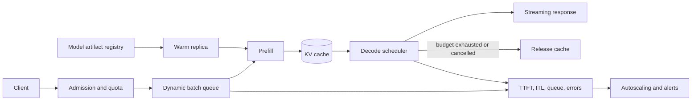

# Model Serving & Inference Optimization — Getting Models to Production

**Level:** L4-L5
**Status:** draft
**Audience:** Engineer preparing for an L4–L5 ML-systems interview or designing an inference service.
**Prerequisites:** GPU memory arithmetic, HTTP queues, basic transformer inference, and SLO terminology.
**Sequence:** Batch 3A, 2/5
**Terra gate:** open
**Time to read:** ~20 min

How to deploy models efficiently at scale.

## Learning objectives

- Estimate model-weight and KV-cache memory from explicit parameter, precision, sequence, and concurrency assumptions.
- Explain the latency/throughput effects of batching, quantization, caching, and parallelism.
- Design queue, timeout, admission-control, and autoscaling behavior for interactive and batch traffic.
- Define inference SLOs and capacity metrics that distinguish prefill, decode, queue, and downstream time.
- Describe a safe model artifact rollout and rollback boundary.

## What it is

Model serving turns a versioned model artifact plus runtime configuration into a
request-handling service. The service usually performs admission control,
tokenization or feature preparation, prefill, iterative decode, post-processing,
and telemetry. “Inference latency” is not one number: interactive users see
time to first token (TTFT), inter-token latency (ITL), and time to last token,
while batch consumers often care about total tokens per second and cost.

## Why it matters

GPU memory and compute are shared by model weights, activations, KV cache,
runtime buffers, and other requests. A configuration that fits one short prompt
may fail with long context or concurrent generation. Queueing can also dominate
tail latency before the GPU is saturated. State the workload first: arrival
rate, prompt/output token distributions, concurrency, latency SLO, availability,
and whether requests are preemptible.

## Mental model

```text
request -> admission -> queue -> prefill -> decode loop -> post-process -> response
                         |          |             |
                       timeout    KV cache      token budget
```

Prefill processes the prompt and is often compute-heavy; decode repeatedly
generates output and is often memory-bandwidth or KV-cache constrained. Continuous
batching can admit or finish sequences between decode steps, improving utilization
but complicating fairness, cancellation, and accounting. A timeout must cancel
work and release its cache allocation, or timed-out requests become a memory leak.

## Worked example

Assume a 7-billion-parameter model, 16-bit weights, 20% runtime overhead, a
4,096-token prompt, a 512-token output cap, and an illustrative 0.5 MiB KV-cache
cost per active request. Weight memory is approximately `7e9 × 2 bytes = 14 GB`;
with overhead it is `16.8 GB`. Ten concurrent requests add about `5 MiB` of KV
cache under this stated teaching assumption, so weights—not KV cache—dominate
this small example. A production estimate must use the model architecture's
layers, heads, head dimension, tensor-parallel layout, cache precision, and
allocator fragmentation; the 0.5 MiB figure is not universal.

If a replica sustains 180 output tokens/s and the workload needs 900 output
tokens/s at peak, the arithmetic lower bound is `ceil(900 / 180) = 5` replicas.
Provision more than five when an availability target, warmup time, uneven
lengths, or a 70% utilization ceiling requires headroom. Measure achieved
tokens/s under the actual prompt/output distribution before turning this into
a capacity commitment.

## Advantages and limitations

| Choice | Benefit | Cost or risk | Best fit |
|---|---|---|---|
| FP16/BF16 | Higher quality and simple kernels | More memory and lower packing density | Quality-sensitive models with sufficient GPU memory |
| INT8/INT4 quantization | Smaller weights and often lower cost | Calibration/model-dependent quality loss | Memory-constrained or high-volume serving after eval |
| Static batching | Predictable implementation | Waits for batch formation; poor with varied lengths | Offline jobs and uniform requests |
| Continuous batching | Better utilization and responsiveness | Scheduler, fairness, and cancellation complexity | Mixed interactive generation |
| Tensor parallelism | Fits a large model across GPUs | Communication latency and placement constraints | Model cannot fit on one device |
| Pipeline parallelism | More stages can increase capacity | Bubbles, routing, and microbatch complexity | Large models or throughput-oriented jobs |

Benchmark alternatives on the same quality set. A reported “2× faster” must
name whether it means TTFT, ITL, total request latency, or aggregate token
throughput, and under what batch size and sequence lengths.

## Topic-specific visual



The control loop is the key idea: queue and decode metrics feed capacity
decisions, while cancellation and token limits release state. Autoscaling from
GPU utilization alone misses queue growth and long-output tail latency.

---

## 🎯 Inference Challenges

LLM inference is different from training:

```
Training: Limited runs, ample time
- Run once per day, takes 24 hours, fine

Inference: Continuous requests, tight latency
- 1000 concurrent users
- <100ms latency required  
- Cost-sensitive

This is the hard problem!
```

---

## ⚡ Optimization Techniques

### Quantization

Reduce precision to use less memory/compute:

```
Full Precision (fp32): 1 float = 4 bytes
- 7B model = 28GB memory

Half Precision (fp16): 1 float = 2 bytes
- 7B model = 14GB memory
- 2x faster, barely any quality loss

8-bit Quantization: ~1 byte per parameter
- 7B model = 7GB memory
- 4x memory savings
- Small quality loss (usually acceptable)

4-bit Quantization: 0.5 byte per parameter
- 7B model = 3.5GB memory
- Reasonable quality with tiny GPU
```

### Batching

Process multiple requests together:

```
Single request: Process immediately
- Latency: 100ms
- Throughput: 10 req/sec

Batch of 8: Wait, then process together
- Latency: 150ms (30ms + batch overhead)
- Throughput: 80 req/sec (8x improvement!)

Trade-off: Add 50ms latency, get 8x throughput
Good for backend batch jobs, less good for interactive.
```

### KV Cache

Reuse computation during generation:

```
Generate token 1: Attend to position 1 (compute K,V)
Generate token 2: Attend to positions 1,2 (reuse K,V from 1)
Generate token 3: Attend to positions 1,2,3 (reuse K,V from 1,2)

Without KV cache: Recompute everything
With KV cache: Reuse previous attention values
Result: 2-3x speedup
Memory tradeoff: Store K,V for all positions
```

### Flash Attention

Optimized attention implementation:

```
Standard attention:
- O(n²) memory for attention matrix
- Slow GPU memory access patterns

Flash Attention:
- Cache-aware algorithm
- 3-4x faster
- Same quality
- Standard in production

Just use modern libraries (transformers, vLLM)
```

### Speculative Decoding

Generate multiple tokens speculatively:

```
1. Small model (fast): Generate 3 tokens speculatively
2. Large model (slow): Verify tokens are correct
3. Accept all or some: Keep if large model agrees

Trade-off: Some wasted small model compute,
but large model is bottleneck so overall faster
```

---

## 🏗️ Serving Architecture

### Single GPU Approach

```
Request → GPU Queue → Model → Generate → Response

Pros: Simple, low cost
Cons: Limited concurrency (process 1 at a time)
Use when: <100 QPS with higher latency acceptable
```

### Batched Serving

```
Request 1 ──┐
Request 2 ──┼→ Queue → Batch → GPU → Unbatch → Response 1,2,3,4
Request 3 ──┤
Request 4 ──┘

Pros: Higher throughput
Cons: Increased latency due to batching
Use when: 100-1000 QPS, some latency acceptable
```

### Distributed Tensor Parallelism

```
Model too large for single GPU:

GPU 1: attention_head_0,1,2,3
GPU 2: attention_head_4,5,6,7

Requires: Fast interconnect (NVLink, InfiniBand)
Use when: Model > single GPU memory
```

### Pipeline Parallelism

```
Split model across devices:

GPU 1: Layers 1-10   → GPU 2: Layers 11-20 → GPU 3: Layers 21-32

Trade-off: GPU idle time when pipelining (GPU 1 waits for GPU 2)
```

---

## 📊 Production Patterns

### Load Balancing

```
Request → Load Balancer → [Server 1: 100/100 loaded]
                         → [Server 2: 80/100 loaded] ← route here
                         → [Server 3: 50/100 loaded]

Strategies:
- Round robin: Alternate servers
- Least loaded: Send to least busy
- Latency-aware: Consider latency history
```

### Caching

```
Cache generations to avoid recomputation:

User 1: "Summarize document X"
  → Generate summary, cache result

User 2: "Summarize document X"
  → Return cached result immediately
  → No generation needed, instant response

Cache invalidation: Depends on use case
```

### Model Serving Frameworks

```
vLLM: Popular, optimized for LLM inference
- Auto batching
- Efficient memory management
- Easy distributed setup

TensorRT-LLM: NVIDIA, compiled optimization
- Better than vLLM for some models
- More complex to set up

Ray Serve: General framework
- More flexible
- Less optimized for LLMs

Ollama: Easy local deployment
- Simple CLI
- Good for prototyping
```

---

## 💰 Cost Optimization

### Latency vs. Throughput Trade-off

```
Target: Process 1000 users/day

Option 1: High latency, high throughput
- 2 GPUs, batch size 32
- Latency: 200ms
- Throughput: 1000 QPS
- Cost: 2 GPUs × $0.50/h = $12/day

Option 2: Low latency, low throughput  
- 10 GPUs, batch size 1
- Latency: 50ms
- Throughput: 1000 QPS
- Cost: 10 GPUs × $0.50/h = $60/day

Choose based on user tolerance!
```

### Model Size Selection

```
7B model (good quality, fast):
- Inference: 20ms
- Cost per 1M tokens: $0.05

70B model (better quality, slow):
- Inference: 200ms
- Cost per 1M tokens: $0.50

Question: Does 3.5x better quality justify 10x higher cost?
Answer: Depends on your users!
```

---

## 🔍 Monitoring & Observability

### Key Metrics

```
Latency (p50, p99): How fast are responses?
- p50: Median response time
- p99: 99th percentile (tail latencies)
- Aim: p50 < 100ms, p99 < 500ms

Throughput: Requests per second
- Aim: Full GPU utilization

Token throughput: Tokens generated per second
- More meaningful than request throughput
- Aim: 100-300 tokens/sec per GPU

Cost per request: $/request
- Important business metric
```

### Alerting

```
Alert if:
- Latency p99 > 500ms (user experience)
- GPU memory error (memory leak)
- Generation timeout (stuck model)
- Error rate > 0.1% (production issue)
```

---

## Failure modes and operations

| Failure mode | Signal | Response |
|---|---|---|
| Queue overload | Queue age, rejection rate, p99 TTFT | Apply admission control, shed low-priority work, scale on queue growth |
| OOM from long requests | Allocator failures, active-token histogram | Enforce prompt/output limits, reserve memory, cancel and release KV state |
| Replica or GPU failure | Health checks, CUDA/runtime errors | Stop routing, drain if possible, reload the exact artifact on a spare |
| Slow downstream/tool call | Dependency latency and timeout count | Bound tool budgets, cancel generation, return a partial/error contract |
| Bad model artifact | Offline quality or schema gate failure | Keep candidate dark, block promotion, retain prior artifact and config |
| Cache contamination | Version/tenant mismatch tests | Key by model, prompt policy, tenant scope, and relevant data revision |

Use separate SLOs for availability, TTFT, ITL, completed-request latency, and
error rate. Track prompt tokens, generated tokens, queue wait, batch size,
active sequences, KV-cache occupancy, GPU memory, and tokens/sec. Percentiles
must be reported with the request population: a p99 over only successful short
requests can hide timeouts and long-context pain.

Autoscaling should combine queue age or pending tokens with replica capacity;
GPU utilization is a useful diagnostic but not a sufficient policy. Scale-up
must include model load time and warm capacity. During overload, reject before
expensive tokenization or use a bounded queue. Backpressure is part of the API
contract: callers need retry guidance and a way to distinguish overload from a
model error.

For a model change, validate artifact hash, tokenizer/config compatibility,
offline quality, safety checks, and representative latency. Shadow traffic can
measure behavior without exposing candidate output. Canary by stable cohort,
watch guardrails for a minimum sample, then promote by changing a versioned
route. Rollback means restoring the prior artifact, tokenizer, prompt policy,
and routing configuration—not merely changing a model name.

## Practical exercises

### Exercise 1: Size a replica

Estimate whether a 24-GB GPU can host the worked-example model. Include weights,
runtime overhead, KV cache for 32 concurrent requests, and a 10% safety margin.
The expected approach states the KV-cache formula or measured benchmark instead
of silently reusing a universal number; if the result is uncertain, propose a
load test and an admission limit.

### Exercise 2: Choose a batching policy

Design a scheduler for interactive requests with a 250 ms TTFT SLO and offline
jobs with no interactive deadline. Explain queue classes, maximum batching wait,
fairness, cancellation, and what happens when an offline batch fills the GPU.
The checkable answer gives interactive traffic priority or reserved capacity,
bounded waits, and metrics for each class.

### Exercise 3: Diagnose a p99 regression

After enabling 4-bit quantization, p50 latency improves but p99 doubles and
quality falls on long prompts. Produce an investigation sequence. A strong
answer slices by prompt length, output length, batch size, GPU memory pressure,
and model quality set; it also compares rollback versus lower concurrency and
does not infer causality from aggregate p50 alone.

### Exercise 4: Define a rollout gate

Specify minimum sample size, latency/error thresholds, quality threshold, and
rollback action for a candidate model. Link the design to the tested
[`ModelRollout`](../../python/ml_systems/model_rollout.py) teaching model and
its [focused tests](../../tests/ml_systems/test_model_rollout.py). Note that
the lab records an average latency, not production-grade percentile windows.

## Interview Q&A

**Q: How would you optimize inference for low latency?**

**Answer:** Measure TTFT and ITL separately, then consider prompt processing,
KV caching, appropriate precision, optimized kernels, bounded batching, and
shorter prompts. The best choice depends on sequence lengths, hardware, and
quality tolerance.

**Follow-up:** Ask how they prevent optimization from hiding tail regressions.
Expect workload slices, p95/p99 metrics, and a quality regression gate.

**Q: What is the trade-off between latency and throughput?**

**Answer:** Larger or continuous batches amortize work and raise aggregate
throughput, but add queueing, memory pressure, and sometimes ITL. Interactive
traffic needs bounded wait; offline traffic can trade wait for utilization.

**Follow-up:** Ask for an admission policy when the queue grows. A good answer
includes priority, rejection, deadlines, and retry behavior.

**Q: How does the KV cache help, and what does it cost?**

**Answer:** It avoids recomputing prior keys and values during autoregressive
decode, reducing repeated compute. It consumes memory proportional to layers,
sequence tokens, heads, head dimension, precision, and active sequences.

**Follow-up:** Ask what happens on cancellation or an excessive context. The
answer should release cache blocks and enforce token limits before OOM.

**Q: How can a 70B model fit on limited GPUs?**

**Answer:** Quantization may reduce weight memory, while tensor parallelism
splits computation across devices. Confirm that the weights, KV cache, runtime
buffers, and headroom fit; interconnect bandwidth and quality must be measured.

**Follow-up:** Ask whether “4-bit means four times faster.” It does not: memory
fit, kernel support, dequantization, and workload shape determine the outcome.

**Q: When is continuous batching preferable to static batching?**

**Answer:** It is useful when requests have varied arrival times and output
lengths, because finished sequences can leave while new work joins. The cost is
scheduler complexity, fairness work, and harder accounting.

**Follow-up:** Ask how a long request affects short ones. Expect token budgets,
fair scheduling or class isolation, and a measured tail-latency policy.

**Q: What metrics belong on an inference dashboard?**

**Answer:** Track TTFT, ITL, total latency, queue wait, error/timeout rate,
prompt and output tokens, active sequences, batch size, tokens/sec, GPU memory,
KV occupancy, and cost per completed token.

**Follow-up:** Ask why GPU utilization alone is insufficient. A saturated queue
or memory-bound decode can cause poor user latency at moderate utilization.

**Q: How do you roll out a new model safely?**

**Answer:** Validate the immutable artifact and tokenizer, run offline quality
and safety tests, shadow or canary with stable assignment, enforce sample-size
and online guardrails, then switch a versioned route. Keep the complete prior
configuration for rollback.

**Follow-up:** Ask how to handle a candidate that is faster but less accurate.
Expect an explicit product threshold or traffic segmentation, not an automatic
promotion based on latency.

**Q: What determines the cost of one million generated tokens?**

**Answer:** Hardware price and utilization, model size/precision, parallelism,
power or platform overhead, input-token work, output length, and idle/warm
capacity all matter. Compute it from measured tokens/sec and replica-hours;
provider prices and model versions must be checked at decision time.

**Follow-up:** Ask how batching changes the estimate. It may lower cost per
token by improving utilization while increasing queue latency, so report both.

## Related and next reading

- [RAG systems](06-rag-systems.md) — context budgets and retrieval latency feed inference workload shape.
- [Model rollouts and serving guardrails](22-model-rollouts-and-serving.md) — stable canaries and promotion gates.
- [Cost optimization for ML](16-cost-optimization.md) — routing, caching, and unit economics.
- [Model rollout implementation](../../python/ml_systems/model_rollout.py) and [focused tests](../../tests/ml_systems/test_model_rollout.py).

---

## ✅ Checklist

- [ ] Understand quantization trade-offs
- [ ] Know batching strategies and trade-offs
- [ ] Understand KV caching and its benefits
- [ ] Know different serving architectures
- [ ] Understand tensor and pipeline parallelism
- [ ] Know production patterns (load balancing, caching)
- [ ] Understand cost vs. latency trade-offs
- [ ] Know key metrics to monitor

---

**Last updated:** 2026-05-22
