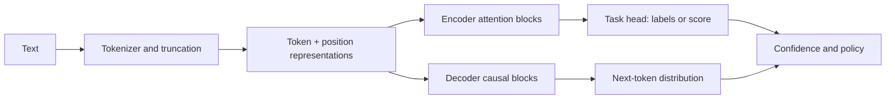

# NLP Advanced — Transformers, BERT, GPT, and Modern Architectures

**Level:** L5
**Status:** draft
**Audience:** Engineer preparing for an L5 NLP/ML-systems interview or selecting a language model for a production task.
**Prerequisites:** probability, linear algebra, tokenization, gradient descent, and basic neural-network training.
**Sequence:** Batch 3A, 3/5
**Terra gate:** open
**Time to read:** ~20 min

Beyond bag-of-words: transformer-based NLP covering architecture deep-dives, fine-tuning strategies, and production deployment trade-offs.

## Learning objectives

- Map classification, generation, translation, and token-labeling tasks to encoder, decoder, or encoder-decoder architectures.
- Explain tokenization, attention, positional information, pretraining objectives, and fine-tuning failure modes.
- Estimate sequence-length and vocabulary effects on memory, latency, and evaluation coverage.
- Design an evaluation and deployment plan that includes data lineage, privacy, drift, and abstention behavior.

## What it is

Modern NLP systems transform text into token IDs, contextual representations,
and task outputs. Encoder-only models read both sides of a token for tasks such
as classification and NER; decoder-only models predict the next token; encoder-
decoder models condition generation on an input sequence. The architecture is a
workload choice, not a quality ranking.

## Why it matters

Tokenization changes sequence length, cost, and truncation behavior. A model can
score well overall while failing on rare names, languages, code-switching,
negation, or long documents. Production quality therefore needs slice-aware
evaluation and a deployment contract for max length, model version, confidence,
and fallback behavior.

## Mental model

```text
text -> tokenizer -> token IDs -> embeddings + positions -> attention blocks
     -> task head or autoregressive decoder -> scores/tokens -> policy
```

Attention provides content-dependent mixing, while positional information keeps
order observable. Training objective and masking determine what information is
available at prediction time. This explains why a bidirectional encoder is not a
drop-in replacement for a causal decoder, even when both use attention.

## Worked example

Suppose a NER service receives 10,000 documents/day, averages 300 words, and its
tokenizer produces 1.3 tokens/word. The daily input volume is about 3.9 million
tokens. If the model max length is 512 tokens, a 390-token input plus special
tokens fits; a 900-token input must be chunked or truncated. Measure entity
boundary loss on the chosen strategy rather than assuming truncation is safe.

Report precision, recall, and F1 by entity type and language. For rare entities,
micro-F1 can conceal poor recall; include macro or per-class results and a
reviewed error sample. These are evaluation assumptions, not universal model
performance claims.

## Advantages and limitations

| Architecture | Strength | Limitation | Typical use |
|---|---|---|---|
| Encoder-only | Efficient contextual representations | Does not naturally generate long text | Classification, NER, extractive QA |
| Decoder-only | Flexible generation and instruction following | Serial decode and causal context | Completion, agents, generation |
| Encoder-decoder | Strong input-to-output conditioning | Two-sided compute and more serving complexity | Translation, summarization |

| Adaptation | Data/compute cost | Main risk | Operational control |
|---|---|---|---|
| Prompting | Low | Instruction sensitivity | Version prompts and test slices |
| Fine-tuning | Medium/high | Overfit, leakage, catastrophic forgetting | Dataset lineage and rollback |
| Retrieval | Index/runtime cost | Missing or stale evidence | Freshness, ACL, citation policy |

## Topic-specific visual



The fork shows why task choice matters: encoders produce representations for a
head, while decoders repeatedly emit tokens. Tokenization and truncation occur
before either path and can be the dominant source of an apparent model failure.

## Failure modes and operations

Monitor tokenizer version, truncation rate, unknown/subword patterns, per-slice
quality, confidence calibration, latency by sequence length, and training-data
provenance. Redact or hash sensitive text in telemetry. Treat a model, tokenizer,
label map, prompt, and preprocessing code as one versioned artifact. Roll out
with shadow/canary traffic and retain the prior bundle for rollback.

---

## ⚖️ NLP Model Trade-offs

| Model | Params | Inference | Best Task | Context | Pretraining |
|-------|--------|-----------|-----------|---------|-------------|
| **BERT-base** | 110M | Fast | Classification, NER, QA | 512 tokens | MLM + NSP |
| **RoBERTa** | 125M | Fast | Same as BERT but better | 512 tokens | MLM only |
| **T5-base** | 250M | Medium | Seq2seq (translation, summarization) | 512 tokens | Span denoising |
| **GPT-2** | 117M–1.5B | Fast | Generation | 1024 tokens | CLM |
| **GPT-4** | Unknown | Slow (API) | All tasks | 128K tokens | CLM + RLHF |
| **BERT-large** | 340M | Slow | Best accuracy on BERT tasks | 512 tokens | MLM + NSP |
| **DeBERTa** | 900M | Slow | SOTA classification/NLU | 512 tokens | MLM + DAS |

### Task → Architecture Mapping

```
Classification/NER/QA       → Encoder-only (BERT, RoBERTa, DeBERTa)
  - Read whole sequence → single representation
  - Bidirectional attention: sees left AND right context

Translation/Summarization   → Encoder-Decoder (T5, BART, mT5)
  - Encoder: understand input
  - Decoder: generate output

Text Generation              → Decoder-only (GPT, LLaMA, Mistral)
  - Causal attention: sees only past tokens
  - Left-to-right generation
```

---

## 🏗️ Architecture Patterns

### Pattern 1: BERT Pretraining Objectives

```
MLM (Masked Language Modeling):
  Input:  "The cat [MASK] on the mat"
  Target: Predict "sat" at [MASK] position
  
  Why it works: Bidirectional context forces deep understanding.
  Masking rate: 15% of tokens (12% masked, 1.5% random, 1.5% unchanged)

NSP (Next Sentence Prediction):
  Input:  [CLS] Sentence A [SEP] Sentence B [SEP]
  Target: Binary: is B actually the next sentence?
  
  Note: RoBERTa showed NSP hurts rather than helps → removed it.
```

### Pattern 2: Tokenization Strategies

```
Word tokenization:    "playing" → ["playing"]      (OOV problem)
Character:            "playing" → ["p","l","a","y","i","n","g"]  (long sequences)
BPE (Byte Pair Enc):  "playing" → ["play", "##ing"]  (BERT, GPT-2)
SentencePiece:        "playing" → ["▁play", "ing"]   (T5, LLaMA)

BPE Algorithm:
  1. Start with character vocab
  2. Count most frequent adjacent pair
  3. Merge into new token
  4. Repeat until vocab_size reached (30K–100K typical)

Trade-off: Larger vocab → shorter sequences → faster attention
           Smaller vocab → longer sequences → slower, more OOV robust
```

### Pattern 3: Attention Mechanism

```
Self-attention for token "cat" in "The cat sat":

Q (query) = cat vector × W_Q    # "What am I looking for?"
K (key)   = all tokens × W_K    # "What information do I have?"
V (value) = all tokens × W_V    # "What do I output if matched?"

Score = Q × Kᵀ / √d_k           # Scaled dot product
Attention = softmax(Score) × V  # Weighted sum of values

Multi-head: Run H independent attention heads in parallel
  head_i = Attention(Q W_Qi, K W_Ki, V W_Vi)
  Output = Concat(head_1, ..., head_H) W_O
  
  H=12 heads × d_k=64 = 768 total dim (BERT-base)
```

---

## 📊 Fine-Tuning Pipeline

```python
from typing import List, Dict, Optional
import time
import math
import random

# Simulate tokenization
class BPETokenizer:
    """Simplified BPE tokenizer (vocabulary simulation)."""

    def __init__(self, vocab_size: int = 30000):
        self.vocab_size = vocab_size
        # Simplified: treat each word as a token
        self._vocab: dict = {"[PAD]": 0, "[CLS]": 1, "[SEP]": 2, "[MASK]": 3, "[UNK]": 4}
        self._next_id = 5

    def _get_or_add(self, token: str) -> int:
        if token not in self._vocab:
            if len(self._vocab) >= self.vocab_size:
                return self._vocab["[UNK]"]
            self._vocab[token] = self._next_id
            self._next_id += 1
        return self._vocab[token]

    def encode(self, text: str, max_length: int = 512) -> dict:
        tokens = text.lower().split()
        ids = [self._vocab["[CLS]"]] + [self._get_or_add(t) for t in tokens] + [self._vocab["[SEP]"]]
        ids = ids[:max_length]  # Truncate
        attention_mask = [1] * len(ids)

        # Pad to max_length
        pad_len = max_length - len(ids)
        ids += [self._vocab["[PAD]"]] * pad_len
        attention_mask += [0] * pad_len

        return {
            "input_ids": ids,
            "attention_mask": attention_mask,
            "token_count": max_length - pad_len,
        }


class TextClassificationHead:
    """Simulated BERT + classification head."""

    def __init__(self, num_classes: int, hidden_size: int = 768):
        self.num_classes = num_classes
        self.hidden_size = hidden_size
        # Weights (simulated as random floats)
        random.seed(42)
        self.weights = [[random.gauss(0, 0.02) for _ in range(num_classes)]
                       for _ in range(hidden_size)]

    def forward(self, cls_embedding: List[float]) -> List[float]:
        """Simple linear layer: embedding → logits."""
        logits = [0.0] * self.num_classes
        for j in range(self.num_classes):
            logits[j] = sum(cls_embedding[i] * self.weights[i][j] for i in range(min(len(cls_embedding), self.hidden_size)))
        return logits

    def softmax(self, logits: List[float]) -> List[float]:
        max_logit = max(logits)
        exp_logits = [math.exp(l - max_logit) for l in logits]
        total = sum(exp_logits)
        return [e / total for e in exp_logits]


class FineTuningTrainer:
    """Simulates BERT fine-tuning strategy."""

    STRATEGY_DESCRIPTIONS = {
        "linear_probe":   "Freeze all BERT layers, train classifier head only",
        "fine_tune_top2": "Freeze bottom 10 layers, train top 2 + head",
        "full_fine_tune": "Train all layers with small LR",
        "domain_adapt":   "Pre-train on domain corpus first, then fine-tune",
    }

    def choose_strategy(self, dataset_size: int, domain_shift: bool) -> str:
        if dataset_size < 200:
            return "linear_probe"
        elif dataset_size < 2000 and not domain_shift:
            return "fine_tune_top2"
        elif domain_shift:
            return "domain_adapt"
        else:
            return "full_fine_tune"

    def hyperparameters(self, strategy: str) -> dict:
        configs = {
            "linear_probe":   {"lr": 3e-3, "epochs": 10, "warmup_steps": 0},
            "fine_tune_top2": {"lr": 2e-4, "epochs": 15, "warmup_steps": 200},
            "full_fine_tune": {"lr": 2e-5, "epochs": 10, "warmup_steps": 500},
            "domain_adapt":   {"lr": 1e-5, "epochs": 20, "warmup_steps": 1000},
        }
        return configs.get(strategy, configs["full_fine_tune"])


# Demo
tokenizer = BPETokenizer()
trainer = FineTuningTrainer()

texts = ["I love this product", "Terrible customer service", "Average experience nothing special"]
labels = [2, 0, 1]  # Positive=2, Negative=0, Neutral=1

for text, label in zip(texts, labels):
    encoded = tokenizer.encode(text, max_length=32)
    print(f"Text: '{text}' → {encoded['token_count']} tokens")

dataset_sizes = [150, 1500, 50000]
for size in dataset_sizes:
    strategy = trainer.choose_strategy(size, domain_shift=(size < 500))
    params = trainer.hyperparameters(strategy)
    print(f"\nDataset: {size:,} samples")
    print(f"  Strategy: {strategy}")
    print(f"  LR: {params['lr']}, Epochs: {params['epochs']}")
```

---

## ❓ Interview Q&A

**Q1: Why is BERT better than an LSTM for NER?**

A: Three key advantages:
1. **Bidirectional context from first layer**: BERT's attention sees all tokens simultaneously; LSTM processes left-to-right only (or needs two passes with bidirectional LSTM)
2. **Pre-trained representations**: BERT's embeddings encode linguistic knowledge from billions of text tokens; LSTM starts from scratch
3. **No vanishing gradients over long sequences**: Attention computes direct connections between all token pairs; LSTM gradients degrade over long sequences despite LSTM gating

Practical: BERT-based NER achieves 90+ F1 on CoNLL-2003 vs. ~85 F1 for bidirectional LSTM with no pretraining.

**Q2: How do you fine-tune BERT on a small dataset (100 examples)?**

A: With only 100 examples, catastrophic forgetting is the main risk:
1. **Linear probe first**: train only the classification head for 5-10 epochs (fast, no forgetting)
2. **Gradual unfreezing**: unfreeze one BERT layer at a time, train each for a few epochs
3. **Low learning rate**: 1e-5 to 3e-5 (vs. 3e-4 for training from scratch)
4. **Data augmentation**: back-translation, synonym replacement, EDA (easy data augmentation)
5. **Adapter layers**: add small trainable modules inside frozen BERT; 3-5× fewer params than full fine-tune

**Q3: BERT vs. GPT: when do you use each?**

A: 
- **BERT (encoder-only)**: classification, NER, extractive QA, regression — tasks where you read the full text and produce a fixed output
- **GPT (decoder-only)**: generation, completion, chatbots, instruction following — tasks requiring generating new text token by token

For extraction: BERT wins (bidirectional context, compute-efficient for inference). For generation: GPT wins (autoregressive by design, scales better with instruction fine-tuning).

**Q4: What is the subword tokenization problem and how does BPE solve it?**

A: Word tokenization creates OOV (out-of-vocabulary) for rare words: "antidisestablishmentarianism" → [UNK]. Character tokenization is OOV-free but creates very long sequences.

BPE (Byte Pair Encoding): starts with characters, merges the most frequent adjacent pair iteratively. "playing" → ["play", "##ing"]. Common words are single tokens; rare words decompose gracefully into known subwords. Typical vocab: 30K-50K tokens. Result: 95%+ OOV coverage with reasonable sequence lengths (1.2-1.5× word tokenization length).

**Q5: How do you handle texts longer than 512 tokens in BERT?**

A: Four strategies:
1. **Truncate**: keep first 512 tokens (works if important info is at start)
2. **Sliding window**: split into overlapping 512-token windows, aggregate predictions (max/mean pooling)
3. **Hierarchical**: encode each paragraph separately, pool representations, then classify
4. **Use Longformer/BigBird**: sparse attention enables 4K-16K tokens at O(n) complexity

Strategy choice: truncate for short-tailed distributions; sliding window for document classification; Longformer for very long documents (legal, medical).

---

## 🧪 Practical Exercises

### Exercise 1: TF-IDF vs. BERT Embeddings (Easy)

```python
import math
from collections import Counter

def compute_tfidf(corpus: List[str], query: str) -> List[float]:
    """TF-IDF scores for query against corpus."""
    tokenized = [doc.lower().split() for doc in corpus]
    query_tokens = query.lower().split()
    N = len(corpus)

    scores = []
    for doc_tokens in tokenized:
        doc_counter = Counter(doc_tokens)
        score = 0.0
        for token in query_tokens:
            tf = doc_counter.get(token, 0) / len(doc_tokens) if doc_tokens else 0
            df = sum(1 for d in tokenized if token in d)
            idf = math.log((N + 1) / (df + 1))  # Smoothed IDF
            score += tf * idf
        scores.append(score)
    return scores


corpus = [
    "Machine learning is transforming natural language processing",
    "Deep learning models require large amounts of training data",
    "The weather is sunny today with clear skies",
    "Natural language processing uses machine learning techniques",
]

query = "machine learning natural language"
tfidf_scores = compute_tfidf(corpus, query)

print("TF-IDF Relevance Scores:")
for doc, score in zip(corpus, tfidf_scores):
    print(f"  {score:.3f}  {doc[:50]}")

print("\nObservation: TF-IDF finds exact keyword matches.")
print("BERT embeddings would also find 'NLP' as related to 'language processing'.")
```

---

### Exercise 2: Attention Visualization (Medium)

```python
import math

def scaled_dot_product_attention(
    query: List[float],
    keys: List[List[float]],
    values: List[List[float]],
) -> tuple:
    """
    Compute attention weights and output.
    query: [d_k]
    keys: [seq_len, d_k]
    values: [seq_len, d_v]
    """
    d_k = len(query)
    
    # Scores: Q·Kᵀ / √d_k
    scores = [
        sum(q * k for q, k in zip(query, key)) / math.sqrt(d_k)
        for key in keys
    ]
    
    # Softmax
    max_score = max(scores)
    exp_scores = [math.exp(s - max_score) for s in scores]
    total = sum(exp_scores)
    weights = [e / total for e in exp_scores]
    
    # Weighted sum of values
    d_v = len(values[0])
    output = [0.0] * d_v
    for i, (w, v) in enumerate(zip(weights, values)):
        for j in range(d_v):
            output[j] += w * v[j]
    
    return weights, output


# Example: "cat sat mat" — query = "cat"
# Embeddings: simplified 4-dim
query = [1.0, 0.5, 0.0, 0.2]        # "cat"
keys = [
    [1.0, 0.5, 0.0, 0.2],            # "cat" (self)
    [0.3, 0.8, 0.1, 0.5],            # "sat"
    [0.6, 0.4, 0.2, 0.1],            # "mat"
]
values = keys  # Often same in self-attention

weights, output = scaled_dot_product_attention(query, keys, values)
tokens = ["cat", "sat", "mat"]

print("Attention weights for query 'cat':")
for token, w in zip(tokens, weights):
    bar = "█" * int(w * 20)
    print(f"  {token}: {w:.3f} {bar}")
```

---

**Last updated:** 2026-05-22
