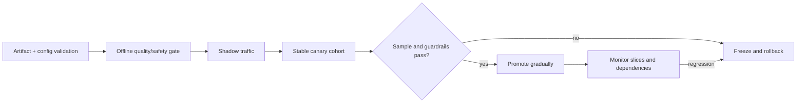

# Model Rollouts and Serving Guardrails

**Level:** L4–L5
**Status:** draft
**Audience:** L4–L5 ML-systems candidates. **Practice time:** 25 minutes.
**Prerequisites:** model serving, metrics, canary deployment, hashing, and SLOs.
**Sequence:** Batch 3A, 5/5
**Terra gate:** open

## Learning objectives

- Design stable cohort assignment and explain its fairness and regional trade-offs.
- Define offline quality, sample-size, latency, and error gates for promotion.
- Specify rollback boundaries for artifacts, configuration, traffic, and data dependencies.

## What it is

A model rollout changes the model, preprocessing, prompt, or serving runtime for
some traffic while preserving a reversible baseline. A canary is an experiment
and a safety boundary; it is not proof that the candidate is globally better.

## Why it matters

Offline quality can miss production inputs, while online metrics can be noisy or
confounded by cohort mix. Stable assignment makes comparisons interpretable, but
traffic percentage alone does not guarantee statistical power, regional capacity,
or fairness across protected slices.

## Mental model

Design a canary rollout with stable user assignment, offline quality gates,
online latency/error guardrails, and rollback.

```text
user id -> stable hash bucket -> baseline or candidate -> observations
                                              quality + guardrails -> promote
                                                                    \-> rollback
```

[`ModelRollout`](../../python/ml_systems/model_rollout.py) uses a salted
SHA-256 bucket, explicit baseline/candidate versions, a candidate percentage,
and recorded observations. Promotion requires the configured offline quality,
average latency, and error-rate gates. `serve` invokes a selected model
callback and deliberately propagates its errors; rollback removes candidate
traffic.

This is not a serving stack. Production rollouts need model/package integrity,
feature compatibility, shadow traffic, cohort and fairness analysis, regional
capacity, autoscaling, timeout budgets, privacy controls, audit logs, alerting,
and a rollback that restores the exact prior artifact and configuration.

## Worked example

Assume a 5% canary receives 20,000 daily requests. A 24-hour observation gives
about 1,000 canary requests, but only a fraction may belong to a rare language
or high-risk workflow. Promotion therefore needs both an overall minimum sample
and slice minimums, plus confidence or practical-effect criteria chosen by the
product risk. A 0.2 percentage-point error difference is not actionable merely
because the aggregate count is large.

## Advantages and limitations

| Strategy | Strength | Limitation |
|---|---|---|
| Offline gate | Cheap, repeatable, broad test set | Cannot model live traffic or dependencies |
| Shadow traffic | Exercises serving path without user-visible output | Extra capacity; no user behavior signal |
| Canary | Measures live quality and latency with limited blast radius | Needs stable cohorts and enough samples |
| Global rollout | Simple after evidence is strong | Largest blast radius and hardest rollback |

## Topic-specific visual



The rollback edge remains available after promotion. Gates should be evaluated
by model version and cohort, with enough samples to avoid reacting to noise.

## Failure modes and operations

Monitor candidate traffic share, sample counts, quality by slice, p50/p95/p99
latency, errors/timeouts, resource saturation, feature or prompt mismatch, and
rollback time. Alert on missing telemetry as well as bad telemetry. Assignment
must be stable across retries, but a user should not be pinned to a candidate
after authorization or region rules make that unsafe. Record artifact hashes,
configuration, evaluator version, and decision evidence for auditability.

## Practical exercises

### Exercise 1: Minimum sample gate

Extend the lab to require a minimum number of candidate observations before
promotion. The expected approach rejects early promotion and tests both overall
and per-slice counts.

### Exercise 2: Region-aware assignment

Compare a global salted hash with a hash including region. Explain capacity,
fairness, and experiment contamination trade-offs, then choose a rollback rule.

### Exercise 3: Rollback drill

Simulate a candidate error-rate breach after promotion. Restore the prior model,
route, tokenizer/config, and alert context; verify that new traffic reaches the
baseline and that the previous artifact remains available.

## Interview Q&A

**Q: Why use stable assignment?**

**Answer:** Stable assignment makes repeated requests from the same cohort use
the same version, reducing comparison noise and making user-level effects visible.

**Follow-up:** Ask what happens when users switch region or tenant. Expect an
explicit identity and routing policy rather than an assumption that hashes are
always fair.

**Q: What belongs in a promotion gate?**

**Answer:** Offline quality/safety, minimum sample size, online latency/error
guardrails, capacity, and slice-specific checks appropriate to risk.

**Follow-up:** Ask whether an average latency gate is enough. It is not; tail
latency and workload slices can regress while the average remains healthy.

**Q: What exactly does rollback restore?**

**Answer:** The prior artifact, tokenizer/preprocessing, prompt/configuration,
traffic route, and any dependent feature or schema contract needed for behavior.

**Follow-up:** Ask how to handle already-written candidate outputs. Expect a
data reconciliation or quarantine policy, not a claim that routing alone undoes
side effects.

## Related and next reading

- [Model serving and inference](08-model-serving-inference.md) — queueing and latency metrics.
- [RAG systems](06-rag-systems.md) — retrieval/model version compatibility.
- [Model rollout implementation](../../python/ml_systems/model_rollout.py) and [tests](../../tests/ml_systems/test_model_rollout.py).

**Exercise:** add a minimum sample-size gate and compare global bucketing with
region-aware assignment.
